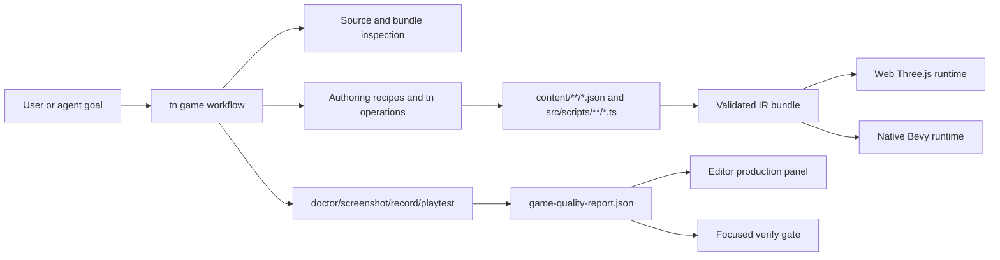
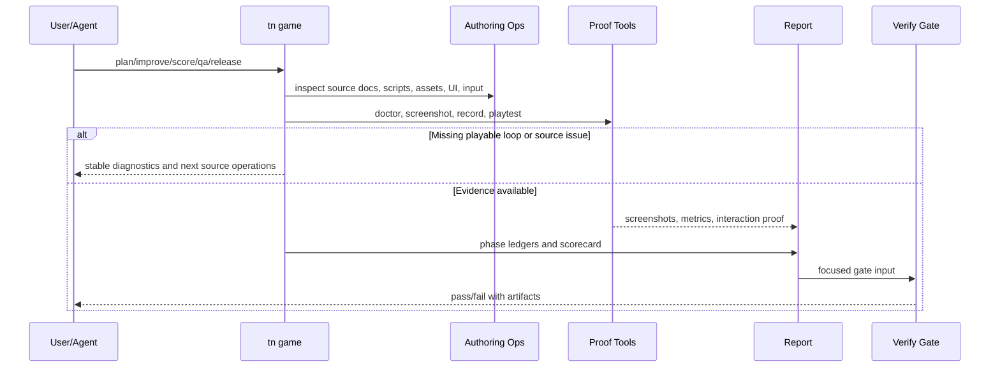

# PRD: Agentic Game Production Workflow

Complexity: 12 -> HIGH mode

Score basis: +3 touches 10+ future implementation/test/docs files, +2 adds a
new multi-phase production workflow, +2 spans CLI/editor/templates/verify/docs,
+2 introduces asset/audio sourcing and quality-gate orchestration, +2 affects
playability/visual/UI/performance release evidence, +1 requires stable
diagnostics and docs alignment.

## 1. Context

**Problem:** ThreeNative has strong structured authoring and proof primitives,
but it does not yet expose a cohesive "make this a playable, polished game"
workflow that guides agents through gameplay, visuals, UI, debugging,
asset/audio sourcing, and release verification.

**Goal:** Absorb the useful production-system ideas from
`jonit-dev/threejs-game-skills` into ThreeNative as first-class engine tooling:
structured recipes, quality checklists, asset/audio ledgers, scorecards,
templates, and verification gates that operate on ThreeNative source and IR
instead of raw Three.js project code.

**Outcome Target:** Reach the same user-visible result as the external skill
system: an agent or author can start with a broad game request, produce a
playable loop first, improve game feel, visuals, UI, assets/audio, performance,
and release readiness, then receive concrete evidence instead of a hand-wavy
"done" claim. The internal route must be different: source-backed structured
authoring, script modules, recipes, validated IR, web/Bevy runtime adapters,
and ThreeNative proof commands.

**External Source Reviewed:**

- `https://github.com/jonit-dev/threejs-game-skills`
- `README.md`: director entry point, specialist skill map, packaged scaffold,
  optional Tripo/Gemini/ElevenLabs provider boundaries, QA evidence list, and
  release expectations.
- `skills/threejs-game-director/SKILL.md`: phase routing, skill/reference
  ledgers, external asset sourcing gate, premium completion rule, and required
  verification.
- `skills/threejs-gameplay-systems/SKILL.md`: playable-loop definition,
  architecture boundaries, input/camera/collision/scoring/feel workflow, and
  scaffold ownership.
- `skills/threejs-aaa-graphics-builder/SKILL.md`: visual scorecard, asset
  sourcing ledger, model/material/render/VFX workflow, and premium-quality
  failure modes.
- `skills/threejs-game-ui-designer/SKILL.md`: HUD/menu/touch-state workflow,
  responsive fit, safe areas, and UI state coverage.
- `skills/threejs-debug-profiler/SKILL.md`: browser/runtime/render/input/audio
  debugging checklist and measured performance workflow.
- `skills/threejs-qa-release/SKILL.md`: build, browser, screenshot, nonblank
  canvas, mobile, playtest, release, and artifact workflow.
- `skills/threejs-3d-generator/SKILL.md`, `skills/threejs-image-generator`, and
  `skills/threejs-audio-generator/SKILL.md`: optional external generation as
  local tooling, never browser/runtime API keys.

**Files Analyzed:**

- `AGENTS.md`
- `docs/PRDs/README.md`
- `docs/PRDs/other/script-stdlib-common-gameplay-helpers.md`
- `docs/PRDs/proof-first-engine-loop-2026-07-05/PRD-015-advanced-animation-physics-depth.md`
- `docs/STATUS.md`
- `docs/bevy-feature-parity.md`
- `/home/joao/.claude/skills/prd-creator/SKILL.md`

**Current Behavior:**

- `tn scene proof`, `tn doctor`, `tn screenshot`, `tn record`, and
  `tn playtest` provide useful proof primitives, but agents must compose them
  manually.
- Authoring recipes exist for specific mechanics such as third-person
  controllers, collectibles, trigger zones, kinematic characters, and health
  bars.
- The editor and CLI can mutate structured source documents, inspect source,
  validate projects, build bundles, and capture web/native proof.
- Existing templates and examples prove slices of game capability, but there is
  no production workflow that scores a game's playable loop, visual quality,
  UI coverage, asset sourcing, performance, and release readiness together.
- External asset generation and game-polish workflow guidance are not part of
  the engine contract and must not become raw Three.js source generation.

## Pre-Planning Findings

The external repository is an MIT-licensed skill package for building Three.js
browser games. It should not be vendored wholesale into ThreeNative because its
primary scaffold and guidance target imperative Three.js/Vite projects, while
ThreeNative's source of truth is structured source, SDK declarations, script
modules, and validated IR bundles. The transferable value is the production
workflow model: phase routing, evidence ledgers, quality scorecards, asset
sourcing decisions, debugging checklists, and release verification.

The success criterion is outcome parity, not implementation parity. A game made
through this workflow should feel as complete to a player and as inspectable to
an agent as one produced by the external director flow, but all durable changes
must land in ThreeNative-owned source documents and scripts. Any external
Three.js pattern that assumes direct scene mutation, renderer ownership,
browser DOM control, or provider calls from client code must be translated into
an engine recipe, authoring operation, runtime capability, or explicit
unsupported diagnostic.

No `.env` or secret configuration is required for the core workflow. Optional
provider keys such as `TRIPO_API_KEY`, `GEMINI_API_KEY`, and
`ELEVENLABS_API_KEY` must remain local tooling inputs and must never be emitted
into browser code, IR bundles, generated `dist/**`, or committed source
documents.

**How will this feature be reached?**

- [x] Entry point identified: `tn game plan`, `tn game improve`,
  `tn game score`, `tn game qa`, `tn game release`, editor "Production" panel,
  and optional agent/MCP wrappers over the same commands.
- [x] Caller file identified: CLI command routing, shared authoring operation
  registry, verify-tool gates, editor adapter, template metadata, and optional
  MCP server wrappers.
- [x] Registration/wiring needed: new command group, shared workflow schemas,
  quality report artifacts, template metadata, editor panel rows, focused
  verification gates, docs index entries, and capability/status evidence after
  implementation.

**Is this user-facing?**

- [x] YES. Game authors and agents use the workflow to create, inspect,
  improve, verify, and release playable games.
- [ ] NO.

**Full user flow:**

1. User runs `tn game plan --project . --goal "premium hover racing game"
   --json` or asks the editor/agent to improve a game.
2. ThreeNative inspects structured source, scripts, assets, input maps, UI,
   runtime diagnostics, and proof artifacts.
3. The workflow emits a phase plan for playable loop, visuals, UI, debug,
   asset/audio sourcing, QA, and release.
4. User or agent applies source-backed operations and recipes through existing
   `tn scene`, `tn ui`, `tn material`, `tn asset`, `tn audio`, `tn system`, and
   `tn recipe` commands.
5. `tn game score` and `tn game qa` generate machine-readable ledgers,
   screenshots, playtest reports, mobile evidence, UI-fit checks, performance
   snapshots, and release risks.
6. The editor displays the same phase status and artifacts without editing
   generated bundles or raw Three.js runtime code.

## 2. Product Model

### Outcome-Parity Targets

The following results should be achievable in ThreeNative, with different
internals from the external Three.js skill package:

- **Director workflow:** A single orchestrator that routes broad game work into
  gameplay, visuals, UI, debug/profile, asset/audio, QA, and release phases.
- **Specialist checklists:** Structured, versioned checklists for each phase
  instead of prose-only agent instructions.
- **Ledgers:** Required skill/reference, asset sourcing, phase execution, and
  evidence ledgers converted into JSON reports.
- **Playable-loop first:** Every broad workflow starts with a concrete verb,
  objective, feedback loop, fail/retry path, and proof that real input triggers
  the mechanic.
- **Visual scorecard:** A stable rubric for art direction, hero/player,
  obstacles/enemies, rewards/interactables, world/environment,
  materials/textures, lighting/render, VFX/motion, UI/HUD, and performance
  evidence.
- **UI quality checks:** Inventory gameplay, pause, settings, loading,
  fail/retry, win/milestone, and touch-control states with text-fit and
  safe-area proof.
- **Debug/profile workflow:** Reproduce, inspect console/page/network/runtime
  diagnostics, identify root cause, fix owning source, and re-measure.
- **QA/release gate:** Build, browser run, screenshot, nonblank canvas, mobile
  viewport, interaction path, performance, bundle/assets, and risk report.
- **Optional generation providers:** Tripo/Gemini/ElevenLabs-style generation
  may be supported as local source-asset tooling with credential probes,
  provenance, budgets, and fallback plans.
- **Packaged starter expectations:** New projects should include enough source
  structure, UI states, controls, and verification scripts to prove a playable
  slice quickly.

### Authoring Translation Rules

Every workflow feature must pass through these rules before implementation:

- Agent plans may describe intent, but source mutation must use bounded
  `tn ... --json` operations, recipes, or explicit `src/scripts/**/*.ts` script
  edits.
- Scene, material, UI, input, asset, audio, prefab, environment, system, runtime,
  and target data belong in `content/**/*.json` source documents.
- Gameplay behavior belongs in `src/scripts/**/*.ts` modules referenced from
  structured source.
- Web Three.js and Bevy adapters consume emitted IR; they do not become sources
  of truth for generated game code.
- Unsupported external patterns must fail with stable diagnostics and suggested
  ThreeNative alternatives.
- Imported/generated asset files are allowed only as source assets with
  provenance and budgets; provider credentials and task state are tooling
  metadata, not runtime data.

### ThreeNative Translation

The workflow must translate those ideas into engine-owned concepts:

| External skill concept | ThreeNative contract |
| --- | --- |
| `threejs-game-director` | `tn game ...` workflow orchestrator plus editor production panel |
| Specialist `SKILL.md` files | Versioned checklist/recipe definitions in repo docs and verify tooling |
| Raw Three.js scaffold | Structured-source starter and genre/domain kit templates |
| Direct Three.js code edits | Source-backed `content/**/*.json` operations plus `src/scripts/**/*.ts` |
| Canvas inspector script | Existing `tn doctor`, `tn screenshot`, `tn record`, `tn playtest`, and verify gates |
| Visual scorecard | `game-quality-report.json` and markdown evidence artifacts |
| Asset sourcing ledger | Structured asset/audio provenance source docs and proof reports |
| Provider scripts | Optional local tooling adapters that emit source assets, never runtime keys |
| Premium completion claim | Release-gated score thresholds plus explicit blockers |

### Explicit Non-Goals

- No wholesale import of the external skill package into product docs or runtime
  code.
- No raw Three.js scene authoring path, R3F path, DOM API gameplay, renderer
  handle access, Bevy handle access, or runtime plugin escape hatch.
- No browser-side provider API calls or persisted secrets.
- No requirement that external AI generation is available. The workflow must
  support procedural/local assets and explicit blockers.
- No visual tuning that changes authored IR values to match screenshots.
  Improvements must be authored data, shared runtime mapping fixes, or
  documented quality contracts.
- No "premium" or "release-ready" claim without evidence artifacts.
- No generated `dist/**`, bundle JSON, or `scripts.bundle.js` edits as source.

## 3. Solution

**Approach:**

- Add a shared game-production workflow model that stores phase definitions,
  checklist items, scorecard categories, evidence requirements, and diagnostics
  as structured data.
- Implement `tn game` commands as thin orchestration over existing authoring,
  proof, doctor, screenshot, record, playtest, and verify surfaces.
- Extend templates and recipes so agents can move from an empty project to a
  playable loop with source-backed UI, input, assets, audio hooks, and scripts.
- Emit durable reports under project-local artifacts and aggregate verify
  artifacts using the repo's existing evidence layout.
- Add editor and optional MCP wrappers only after the CLI/core workflow is
  deterministic and tested.

**Key Decisions:**

- [x] Library/framework choices: reuse existing TypeScript CLI, authoring
  registry, verify-tool implementation, Playwright proof path, and Bevy proof
  path.
- [x] Error-handling strategy: every blocked phase emits stable diagnostics
  with code, severity, path/phase, message, and suggested fix.
- [x] Reused utilities: `tn scene proof`, `tn doctor`, `tn screenshot`,
  `tn record`, `tn playtest`, authoring recipes, source-document
  classification, template metadata, and focused verify gates.

**Data Changes:** Add structured workflow/checklist/report schemas. No database
migrations. IR schema changes are not required for the first workflow slice;
later asset/audio provenance may add source-document fields before bundle
metadata is promoted.

## 4. Sequence Flow

## 5. Execution Phases

#### Phase 1: Workflow Schema and Reports - Game quality becomes machine-readable.

**Files (max 5):**

- `packages/authoring/src/*` - shared workflow/checklist/report types
- `packages/cli/src/*` - initial `tn game score --json`
- `tools/verify/src/*` - report validation helper
- `docs/contracts/*` - workflow report contract
- `docs/STATUS.md` - status entry after evidence lands

**Implementation:**

- [x] Define phase ids: `gameplay`, `assets`, `visuals`, `ui`, `debug`,
  `qa`, and `release`.
- [x] Define a stable `game-quality-report.json` schema with phase ledgers,
  scorecard categories, evidence artifacts, blockers, and diagnostics.
- [x] Implement `tn game score --project . --json` as read-only inspection that
  can score existing proof artifacts and report missing evidence.
- [x] Add diagnostics for missing playable loop, missing screenshot evidence,
  missing UI states, missing asset provenance, missing mobile proof, and
  missing release build proof.

**Tests Required:**

| Test File | Test Name | Assertion |
| --- | --- | --- |
| `packages/authoring/src/gameWorkflow.test.ts` | `validates game quality reports` | Accepted reports preserve phase ids and artifacts. |
| `packages/cli/src/gameScore.test.ts` | `reports missing evidence without mutating source` | Command exits with JSON diagnostics and no writes. |
| `tools/verify/src/gameQualityReport.test.ts` | `rejects malformed scorecard categories` | Gate reports the invalid category path. |

**Verification Plan:**

1. Unit tests for report schema acceptance/rejection.
2. CLI JSON snapshot tests for a minimal structured-source project.
3. `pnpm --filter @threenative/authoring test`
4. `pnpm --filter @threenative/cli test`

**User Verification:**

- Action: run `tn game score --project examples/<game> --json`.
- Expected: report lists phase scores, missing evidence, artifact paths, and
  stable next-step diagnostics.

#### Phase 2: Playable Loop Planner - Broad game work starts from real input and feedback.

**Files (max 5):**

- `packages/cli/src/*` - `tn game plan` and `tn game improve`
- `packages/authoring/src/*` - composed gameplay recipe metadata
- `templates/structured-source-starter/*` - starter production metadata
- `examples/*` - one focused playable-loop fixture
- `tools/verify/src/*` - playability gate wiring

**Implementation:**

- [x] Add `tn game plan --goal <text> --json` that emits a deterministic phase
  plan and recommended authoring recipes without mutating by default.
- [x] Add `tn game improve --apply-plan <file> --json` for bounded application
  of existing recipes and operations.
- [x] Extend starter metadata with a one-sentence playable loop, controls,
  objective, fail/retry policy, and required proof commands.
- [x] Reuse `tn playtest` to prove the main input path changes game state.
- [x] Keep generated plan text advisory; only structured operation payloads may
  mutate source.

**Tests Required:**

| Test File | Test Name | Assertion |
| --- | --- | --- |
| `packages/cli/src/gamePlan.test.ts` | `plans a playable loop without writing files` | Dry-run plan includes recipes and proof commands. |
| `packages/authoring/src/gameRecipes.test.ts` | `rejects unsupported recipe operations` | Diagnostic points to recipe operation id. |
| `tools/verify/src/playableLoopGate.test.ts` | `fails when the main input path has no movement or state change` | Gate reports playtest metric path. |

**Verification Plan:**

1. CLI dry-run tests.
2. One fixture project with a passing playtest.
3. One fixture project with an explicit no-input failure.
4. `pnpm verify:smoke` after wiring stabilizes.

**User Verification:**

- Action: run `tn game plan --goal "arcade collector" --json`, apply a plan,
  then run `tn playtest`.
- Expected: project has a source-backed playable loop and proof artifacts show
  input-driven state change.

#### Phase 3: Visual, UI, and Asset Ledgers - Polish claims are evidence-backed.

**Files (max 5):**

- `packages/cli/src/*` - scorecard and asset/audio ledger commands
- `packages/authoring/src/*` - asset/audio provenance source helpers
- `packages/editor/src/*` - production panel read model
- `docs/workflows/*` - asset/audio sourcing workflow
- `tools/verify/src/*` - visual/UI report validation

**Implementation:**

- [x] Add the 10-category visual scorecard with stable category ids and
  threshold policy.
- [x] Add UI state inventory checks for gameplay, pause, settings, loading,
  fail/retry, win/milestone, and touch controls.
- [x] Add asset/audio sourcing ledgers that record procedural, local file,
  generated, hybrid, or blocked status per high-value surface.
- [x] Add optional provider adapter hooks behind local tooling commands; require
  credential probes and never persist secret values.
- [x] Surface report rows in the editor production panel as read-only status
  before adding source mutation shortcuts.

**Tests Required:**

| Test File | Test Name | Assertion |
| --- | --- | --- |
| `packages/cli/src/gameVisualScore.test.ts` | `requires exact visual scorecard categories` | Missing or renamed categories fail validation. |
| `packages/authoring/src/assetProvenance.test.ts` | `redacts provider credentials from provenance` | Report contains provider status but no secret value. |
| `packages/editor/src/productionPanel.test.ts` | `renders blocked phase rows from report data` | Panel displays diagnostic code and artifact link. |

**Verification Plan:**

1. Unit tests for visual/UI/asset report schemas.
2. Browser/editor test for production panel rendering.
3. Screenshot proof for a fixture with populated report artifacts.
4. `pnpm check:docs`

**User Verification:**

- Action: run `tn game score --project . --json` after screenshots and UI
  proof exist.
- Expected: report includes visual score, UI state coverage, asset/audio ledger,
  and explicit blockers for missing premium evidence.

#### Phase 4: Debug, Performance, QA, and Release Gate - Production readiness has one front door.

**Files (max 5):**

- `packages/cli/src/*` - `tn game qa` and `tn game release`
- `tools/verify/src/*` - `verify:game-production` gate
- `package.json` - focused script aliases
- `docs/STATUS.md` - promoted evidence and command docs
- `docs/bevy-feature-parity.md` - parity/evidence rows after promotion

**Implementation:**

- [x] Compose `tn doctor`, `tn screenshot`, `tn record`, `tn playtest`, build,
  preview, mobile viewport, UI fit, and performance snapshots into
  `tn game qa --json`.
- [x] Add `tn game release --json` for production-build proof, bundle/assets
  budget checks, debug helper gating, static-hosting notes, and release risk
  report.
- [x] Add `pnpm verify:game-production` once the report is deterministic.
- [x] Keep web and Bevy evidence explicit: web-only proof must not imply native
  parity.
- [x] Update status and parity docs only after the gate is passing.

**Tests Required:**

| Test File | Test Name | Assertion |
| --- | --- | --- |
| `packages/cli/src/gameQa.test.ts` | `aggregates proof tool failures into one report` | Diagnostics preserve original tool code and phase. |
| `tools/verify/src/gameProductionGate.test.ts` | `fails release when required artifacts are missing` | Gate lists missing screenshot/playtest/build paths. |
| `packages/cli/src/gameRelease.test.ts` | `reports debug helper and asset budget risks` | Release report includes severity and suggested fix. |

**Verification Plan:**

1. CLI tests with mocked proof outputs.
2. Focused verify gate using a small fixture project.
3. Browser screenshot and mobile viewport proof.
4. Optional Bevy proof where the template claims native support.
5. `pnpm verify:conformance` if shared runtime contracts change.

**User Verification:**

- Action: run `tn game qa --project . --json` and
  `tn game release --project . --json`.
- Expected: reports provide pass/fail, artifact paths, residual risks, and
  exact commands needed to reproduce the evidence.

## 6. Acceptance Criteria

- [x] A broad game-quality workflow is available through `tn game ... --json`
  without requiring agents to know every lower-level command.
- [x] All workflow phases operate on structured source, script modules, and
  generated proof artifacts; they do not edit generated bundles.
- [x] Playable-loop, visual, UI, debug, QA, asset/audio, and release reports
  are structured and validated.
- [x] Optional external provider use is local-tooling only, credential-safe, and
  recorded with provenance or blocker evidence.
- [x] The editor can display game-production status from the same reports.
- [x] `pnpm verify:game-production` exists before any release-ready capability
  claim is added to status/parity docs.
- [x] Unsupported or incomplete claims produce stable diagnostics and suggested
  fixes.

## 7. Open Questions

- Should the first implementation ship as one `tn game score` read-only gate
  before `tn game plan/improve` can mutate source?
- Should optional provider adapters live in core CLI, a separate tooling
  package, or external recipes that only write source assets and provenance?
- What threshold should block "premium" claims: every category >= 2/3, average
  >= 2.4, no automatic failures, or a stricter release profile?
- Which template should become the canonical production-proof fixture:
  structured-source starter, racing kit, or a smaller neutral arcade example?

## 8. Verification Summary

Use the narrowest relevant checks during implementation:

- `pnpm --filter @threenative/authoring test`
- `pnpm --filter @threenative/cli test`
- `pnpm --filter @threenative/editor test`
- `pnpm check:docs`
- `pnpm verify:smoke`
- `pnpm verify:game-production`
- `pnpm verify:conformance` only when shared runtime contracts change

Capability/release-gate promotion must update `docs/STATUS.md` and
`docs/bevy-feature-parity.md` with exact evidence commands and artifact paths.
