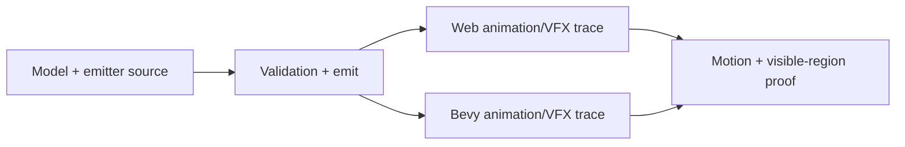
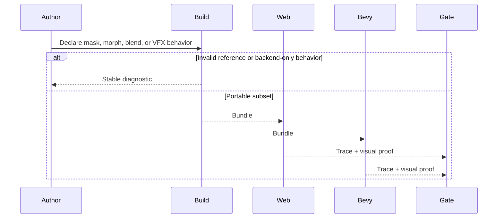

# PRD: Animation, Morph, Mask, and Lightweight VFX Polish

Complexity: 8 -> HIGH mode

Score basis: +2 touches 6-10 future files, +2 spans animation, asset, particle,
and runtime contracts, +2 requires visual/runtime proof, +1 affects script
service ergonomics, +1 updates docs and gates.

## 1. Context

**Problem:** Active characters and effects need more authored feel through
animation masks, morph targets, bounded blend semantics, and lightweight VFX
without exposing backend animation graphs or particle handles.

**Files Analyzed:**

- `docs/bevy-feature-parity.md`
- `docs/PRDs/proof-first-engine-loop-2026-07-05/PRD-015-advanced-animation-physics-depth.md`
- `docs/PRDs/proof-first-engine-loop-2026-07-05/PRD-012-portable-scripting-particle-commands.md`

**Current Behavior:**

- Skeletal clip playback, animation service calls, constrained graph metadata,
  event markers, stateful query/stop behavior, and bounded particle metadata are
  promoted.
- Latest parity notes identify masks, morph target animation, arbitrary blend
  trees, and rendered particle systems as the polish surfaces needing tighter
  evidence.
- Raw Bevy `AnimationGraph`, arbitrary topology, IK, retargeting, backend
  handles, and unbounded emitters remain outside the portable source contract.

**How will this feature be reached?**

- [x] Entry point identified: model asset metadata, animation declarations,
  particle emitter declarations, script service calls, and focused gates.
- [x] Caller file identified: IR validators, compiler animation emitters, web
  animation/particle runtime, Bevy animation/particle runtime, and verify tools.
- [x] Registration/wiring needed: morph/mask schema, emitter service payloads,
  visual proof fixtures, runtime reports, docs/status updates.

**Is this user-facing?**

- [x] YES. Authors use animation and VFX declarations directly in playable
  scenes.
- [ ] NO.

**Full user flow:**

1. User imports a rigged or morph-capable GLB and declares animation behavior.
2. Build validates clip, skeleton, mask, morph, and emitter references.
3. Scripts may start/stop/query bounded effects through declared services.
4. Web and Bevy proof shows matching traces and visible motion/effects.

## 2. Solution

**Approach:**

- Promote animation masks only with skeleton target addressing validated against
  loaded glTF nodes.
- Promote morph targets only with extracted names, validated weight tracks, and
  visible silhouette proof.
- Keep arbitrary blend trees as diagnostics unless finite states, weights, and
  event ordering are deterministic.
- Treat particles as a ThreeNative-owned bounded VFX contract, not Bevy-native
  particle parity.

**Key Decisions:**

- [x] Library/framework choices: reuse existing animation graph metadata,
  particle emitter metadata, and runtime service logs.
- [x] Error-handling strategy: reject unknown bones/morphs, unbounded emitters,
  backend graph assets, and raw handles with stable diagnostics.
- [x] Reused utilities: animation/physics residual gates, script service
  validation, visual proof capture, and conformance fixtures.

**Data Changes:** Extend animation/morph/mask and particle service schemas. No
database migrations.

## 3. Sequence Flow

## 4. Execution Phases

#### Phase 1: Morph and Mask Contract - Partial-body and shape animation are validated against imported assets.

**Files (max 5):**

- `packages/ir/src/*` - morph/mask validation
- `packages/compiler/src/*` - animation metadata emit
- `packages/runtime-web-three/src/*` - web animation mapping
- `runtime-bevy/crates/threenative_runtime/src/*` - native animation mapping
- `tools/verify/src/*` - animation proof gate

**Implementation:**

- [x] Extract and preserve glTF morph target names in imported model metadata.
- [x] Validate authored morph weight targets and deterministic weight tracks.
- [x] Validate skeleton mask targets against loaded glTF node names.
- [x] Prove visible silhouette or partial-body change through the shared
  animation/physics residual gate.

**Tests Required:**

| Test File | Test Name | Assertion |
| --- | --- | --- |
| `packages/ir/src/systems.test.ts` | `should accept v7 physics, picking, character, particles, and animation control services` | Declared services include promoted animation/VFX service names. |
| `packages/runtime-web-three/src/animation-residuals.test.ts` | `should report animation physics residual observations` | Residual report includes morph/mask and bounded VFX observations. |
| `runtime-bevy/crates/threenative_runtime/tests/animation_physics_residuals.rs` | `should_report_morph_target_weight_at_sampled_frame` | Native residual report matches the promoted morph/VFX fixture. |

**Verification Plan:**

1. IR validation tests.
2. Compiler metadata tests.
3. Web/native runtime trace tests.
4. Visual proof gate.

**User Verification:**

- Action: run a fixture with a morphing or masked animation.
- Expected: trace and screenshot/video show the intended animated region.

#### Phase 2: Bounded VFX Commands - Scripts can trigger declared lightweight effects.

**Files (max 5):**

- `packages/ir/src/*` - particle command payload validation
- `packages/compiler/src/*` - service declaration emit
- `packages/runtime-web-three/src/*` - web particle service
- `runtime-bevy/crates/threenative_runtime/src/*` - native particle service
- `tools/verify/src/*` - VFX proof gate

**Implementation:**

- [x] Define `particles.start`, `particles.stop`, `particles.burst`, and
  `particles.reset` over declared emitters.
- [x] Enforce deterministic seed, max count/rate/lifetime caps, and material
  constraints.
- [x] Compare web/Bevy count observations and visible-region proof through
  service logs and the residual contact sheet.

**Tests Required:**

| Test File | Test Name | Assertion |
| --- | --- | --- |
| `packages/ir/src/systems.test.ts` | `should accept v7 physics, picking, character, particles, and animation control services` | Particle command service names are accepted by the IR contract. |
| `packages/runtime-web-three/src/systems/context.test.ts` | `should execute bounded particle command services` | Web service log contains deterministic command results without backend handles. |
| `runtime-bevy/crates/threenative_runtime/tests/systems_host.rs` | `systems_host_should_expose_bounded_particle_command_services` | Native service log matches the bounded particle command fixture. |

**Verification Plan:**

1. Service payload unit tests.
2. Web/native runtime service tests.
3. Focused visible-region proof.
4. `pnpm verify:conformance`.

**User Verification:**

- Action: trigger a declared VFX burst in a fixture.
- Expected: effect appears in screenshots and logs match deterministic counts.

## 5. Acceptance Criteria

- [x] Morph targets and masks are validated against imported model metadata.
- [x] Visible proof exists for every promoted visual animation/VFX behavior.
- [x] Bounded particle commands never expose backend handles or unbounded
  emitters.
- [x] Arbitrary blend trees, IK, retargeting, and backend animation graph assets
  remain diagnostic-only unless separately promoted.

## 6. Completion Evidence

- Implemented bounded script services:
  `particles.start`, `particles.stop`, `particles.burst`, and
  `particles.reset`.
- Web and native runtimes report deterministic accepted/count/seed/status
  payloads for declared emitters and reject missing emitters without exposing
  backend handles.
- `node scripts/verify-animation-physics-residuals.mjs` records matching
  web/Bevy residual reports and a contact sheet with VFX command evidence under
  `tools/verify/artifacts/animation-physics-residuals/`.
- Final commit gate: `pnpm test`, `pnpm verify:conformance`,
  `node scripts/verify-animation-physics-residuals.mjs`, `pnpm verify:smoke`,
  `pnpm verify:parity:smoke`, and `pnpm check:docs`.
