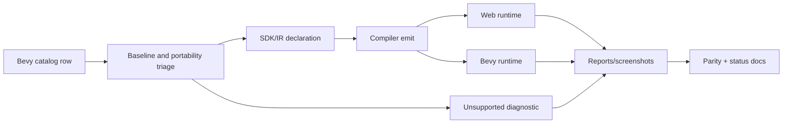
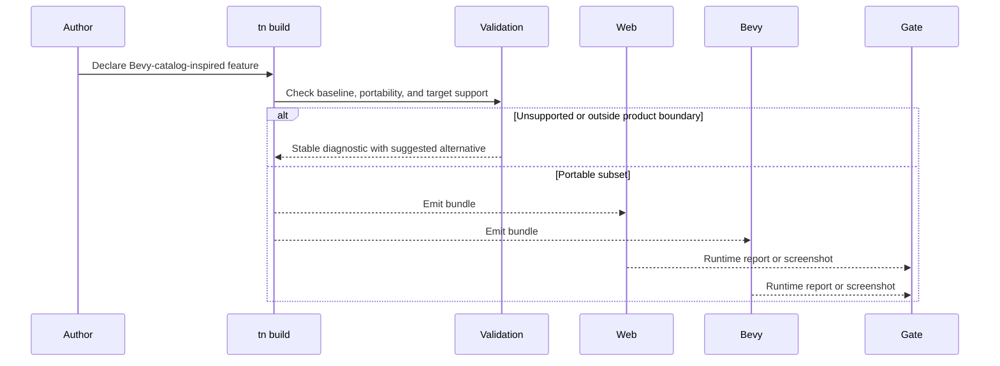

# PRD: Bevy Catalog Watchlist Residuals

Complexity: 11 -> HIGH mode

Score basis: +3 touches 10+ future files, +2 adds multiple contract surfaces,
+2 spans SDK/IR/compiler/web/Bevy/verify/docs, +2 includes runtime state and
platform behavior, +1 requires visual/manual evidence, +1 affects parity and
status documentation.

## 1. Context

**Problem:** A scan of the upstream Bevy examples catalog found feature families
that were not explicitly tracked in the parity backlog, leaving future
contributors without clear promotion or diagnostic targets.

**Files Analyzed:**

- `docs/bevy-feature-parity.md`
- `docs/STATUS.md`
- `docs/PRDs/README.md`
- `docs/PRDs/done/other/ui-platform-desktop-residuals.md`
- `docs/PRDs/other/advanced-visual-effects-lighting-material-depth.md`
- `docs/PRDs/other/external-services-media-boundaries.md`
- `/home/joao/.claude/skills/prd-creator/SKILL.md`
- Bevy examples catalog: https://bevy.org/examples/
- Bevy 0.14 release notes: https://bevy.org/news/bevy-0-14/

**Current Behavior:**

- Core gameplay host semantics, schedules, resources/events, observers, hooks,
  bounded timers/channels, UI, assets, runtime settings, and diagnostics are
  already represented in the tracker.
- The tracker now has explicit unchecked rows for ECS callback components,
  delayed commands, query combinations, entity disabling, editable text/IME, UI
  viewport nodes, UI drag/drop, custom UI materials, window/cursor/power policy,
  runtime asset saving/export, generated asset persistence, and glTF extension
  processing.
- These rows are watchlist entries, not implementation claims; some may be
  beyond the pinned Bevy `=0.14.2` baseline and require baseline verification
  before promotion.

## Pre-Planning Findings

No `.env` or secret configuration is required. Any implementation must preserve
the product boundary: TypeScript authoring emits portable IR; raw Bevy APIs,
renderer internals, arbitrary filesystem access, and backend-only behavior stay
behind diagnostics.

**How will this feature be reached?**

- [x] Entry point identified: SDK declarations, `tn build`, runtime previews,
  conformance fixtures, focused verification gates, and docs/status updates.
- [x] Caller file identified: SDK helpers, IR validators, compiler emit paths,
  web runtime adapters, Bevy runtime adapters, verify tooling, and docs gates.
- [x] Registration/wiring needed: new capability metadata, diagnostics,
  conformance fixtures, visual/runtime reports, package scripts only when a
  focused gate is promoted, and parity/status docs.

**Is this user-facing?**

- [x] YES. Authors interact with these features through SDK declarations,
  runtime behavior, and diagnostics.
- [ ] NO.

**Full user flow:**

1. User authors a catalog-inspired feature such as editable text, delayed
   command scheduling, generated asset export, custom cursor policy, or glTF
   extension processing.
2. `tn build` validates whether the declaration is portable, target-supported,
   and inside the pinned baseline.
3. Web and Bevy runtimes either execute promoted behavior with matching reports
   or emit stable unsupported-feature diagnostics.
4. Focused gates compare reports, screenshots where relevant, and negative
   fixtures before parity rows move from unchecked to checked.

## 2. Solution

**Approach:**

- Treat this PRD as a triage and implementation map for newly tracked Bevy
  catalog rows, not a blanket promise to match every upstream example.
- Verify whether each row belongs to the pinned `=0.14.2` baseline before
  promotion; keep newer upstream-only rows as watchlist or diagnostic-only.
- Promote only bounded, portable contracts that can be represented in SDK/IR and
  proven across web and Bevy.
- Add stable diagnostics for rows that require raw Bevy handles, executable
  asset processors, arbitrary filesystem writes, custom shaders, or platform
  APIs outside the portable runtime.

**Key Decisions:**

- [x] Library/framework choices: reuse existing SDK/IR/compiler/runtime
  adapters, conformance fixtures, diagnostic catalogs, and verify-tool patterns.
- [x] Error-handling strategy: unsupported or baseline-mismatched rows fail
  with code, severity, path, target profile, and suggested portable alternative.
- [x] Reused utilities: runtime report normalization, capability diagnostics,
  asset manifest validation, UI interaction fixtures, and docs drift checks.

**Data Changes:** Extend capability/report/diagnostic schemas as needed. No
database migrations.

## 3. Sequence Flow

## 4. Execution Phases

#### Phase 1: ECS Runtime Ergonomics - Catalog ECS helpers have portable semantics or diagnostics.

**Files (max 5):**

- `packages/sdk/src/ecs/*` - callback, delayed command, query helper authoring
- `packages/ir/src/*` - ECS schema and validation
- `packages/compiler/src/*` - ECS declaration emit and diagnostics
- `packages/runtime-web-three/src/*` - web runtime reports
- `runtime-bevy/src/*` - native runtime reports

**Implementation:**

- [x] Verify baseline relevance for delayed commands and query combinations.
- [x] Verify baseline relevance for callback components.
- [x] Verify baseline relevance for entity disabling.
- [x] Keep bounded callback component declarations diagnostic-only unless callbacks can be named,
  declared, permissioned, and scheduled deterministically.
- [x] Promote delayed commands only as bounded timer/channel-backed scheduling,
  or reject arbitrary deferred closures with diagnostics.
- [x] Add query combination helpers with deterministic entity-id ordering and
  pairwise iteration limits.
- [x] Define entity disabling as a portable ECS participation state distinct
  from renderer visibility, or reject it with a diagnostic that suggests tags or
  scene activation.

**Tests Required:**

| Test File | Test Name | Assertion |
| --- | --- | --- |
| `packages/ir/src/ecs-catalog-residuals.test.ts` | `should reject callback components without declared permissions` | Diagnostic includes component path and missing permission. |
| `packages/runtime-web-three/src/ecs-catalog-residuals.test.ts` | `should iterate query combinations in deterministic entity order` | Web report matches fixture order. |
| `runtime-bevy/tests/ecs_catalog_residuals.rs` | `should report disabled entity query participation` | Native report matches web fixture. |

**Verification Plan:**

1. Unit tests for accepted and rejected ECS declarations.
2. Web/Bevy conformance fixture comparing reports.
3. Negative fixture for arbitrary callback closures.
4. `pnpm verify:conformance`.

**User Verification:**

- Action: build and run the ECS catalog fixture.
- Expected: promoted helpers produce matching reports; unsupported callbacks
  fail with stable diagnostics.

#### Phase 2: UI Text, Viewports, and Window Policy - Platform-facing catalog behavior is explicit.

**Files (max 5):**

- `packages/sdk/src/ui.ts` - text input, viewport, drag, cursor declarations
- `packages/ir/src/*` - UI/window schemas and diagnostics
- `packages/runtime-web-three/src/*` - web UI/window mapping
- `runtime-bevy/src/*` - native UI/window mapping
- `tools/verify/src/*` - focused report and artifact checks

**Implementation:**

- [x] Add editable text input widgets with deterministic value/action events.
- [x] Add IME composition diagnostics for unsupported targets.
- [x] Keep UI viewport nodes and UI drag-and-drop node interactions
  diagnostic-only until input routing is deterministic across web and Bevy.
- [x] Add custom UI material declarations as diagnostic-only unless bounded
  presets can render in both runtimes.
- [x] Add window resize and scale-factor bounded reports for web and Bevy.
- [x] Add custom cursor, low-power/present-mode, clear-color, and multi-window
  diagnostics or bounded reports.

**Tests Required:**

| Test File | Test Name | Assertion |
| --- | --- | --- |
| `packages/ir/src/ui.test.ts` | `ui should accept text input widgets with deterministic value actions` | IR accepts focusable text input widgets with actions. |
| `packages/runtime-web-three/src/ui/domOverlay.test.ts` | `ui dom overlay should dispatch text input values in order` | DOM overlay preserves input value/action order. |
| `runtime-bevy/crates/threenative_runtime/tests/ui.rs` | `ui_should_preserve_text_input_value_events` | Native queue preserves text input value/action order. |
| `packages/ir/src/ui-window-catalog.test.ts` | `should reject IME behavior when target lacks text composition support` | Diagnostic includes target profile. |
| `runtime-bevy/tests/ui_window_catalog.rs` | `should report window resize and scale factor changes` | Native report includes size and scale factor. |

**Verification Plan:**

1. UI/window validation tests.
2. Web/Bevy text input and window report tests.
3. Screenshot or manual artifact for UI viewport and cursor behavior if
   promoted.
4. `pnpm check:docs` before checking parity rows.

**User Verification:**

- Action: run the UI/window catalog fixture in web and native preview.
- Expected: text input, resize, and cursor/window capability reports are
  visible; unsupported host behavior is diagnostic, not silent.

#### Phase 3: Asset Authoring and glTF Import Policy - Generated and imported content has a safe path.

**Files (max 5):**

- `packages/sdk/src/assets.ts` - asset authoring/export declarations
- `packages/ir/src/*` - asset and glTF extension schemas
- `packages/compiler/src/*` - asset emit/reject paths
- `packages/runtime-web-three/src/*` - web asset policy reports
- `runtime-bevy/src/*` - native asset policy reports

**Implementation:**

- [x] Verify baseline relevance for asset saving with subassets and glTF
  extension processing.
- [x] Verify baseline relevance for generated runtime assets.
- [x] Keep runtime asset saving/export diagnostic-only until it can be a
  manifest-governed, bundle-local artifact policy; reject arbitrary filesystem
  writes.
- [x] Add generated runtime asset persistence only for bounded asset types with
  schema-backed payload validation.
- [x] Add glTF extension processing policy that rejects executable/custom
  processors with stable diagnostics.
- [x] Add known metadata-transform import policy, such as AnimationGraph import,
  if a bounded cross-runtime promotion slice is defined.
- [x] Preserve target-profile diagnostics for offline, web, native, and package
  outputs.

**Tests Required:**

| Test File | Test Name | Assertion |
| --- | --- | --- |
| `packages/ir/src/asset-catalog-residuals.test.ts` | `should reject asset export outside declared artifact roots` | Diagnostic includes rejected path. |
| `packages/ir/src/asset-catalog-residuals.test.ts` | `should allow known glTF metadata transform imports` | AnimationGraph metadata transforms are accepted. |
| `packages/ir/src/asset-catalog-residuals.test.ts` | `should reject unknown glTF metadata transform imports` | Unknown metadata transforms produce a stable diagnostic. |
| `packages/ir/src/asset-catalog-residuals.test.ts` | `should preserve target profile diagnostics for output targets` | Web/package output mismatches preserve path, target, and value. |
| `packages/compiler/src/asset-catalog-residuals.test.ts` | `should emit generated asset manifest entry when payload is bounded` | Manifest includes generated asset id and schema. |
| `packages/runtime-web-three/src/ecs-catalog-residuals.test.ts` | `should report known glTF metadata transform policy` | Web report records the promoted metadata transform policy. |
| `packages/runtime-web-three/src/ecs-catalog-residuals.test.ts` | `should report target profile output diagnostics` | Web report preserves output target diagnostics. |
| `packages/cli/src/commands/package.test.ts` | `package should reject bundle target profile without desktop target` | Package command emits stable target-profile diagnostic code. |
| `runtime-bevy/tests/asset_catalog_residuals.rs` | `should report unsupported glTF executable extension processor` | Native diagnostic code is stable. |
| `runtime-bevy/crates/threenative_runtime/tests/ecs_catalog_residuals.rs` | `should_report_known_gltf_metadata_transform_policy` | Native report records the promoted metadata transform policy. |
| `runtime-bevy/crates/threenative_runtime/tests/ecs_catalog_residuals.rs` | `should_report_target_profile_output_diagnostics` | Native report preserves output target diagnostics. |

**Verification Plan:**

1. IR/compiler tests for asset policy and diagnostics.
2. Web/Bevy runtime reports for accepted generated assets.
3. Negative fixtures for arbitrary filesystem writes and executable glTF
   processors.
4. `pnpm verify:bundle-safety-hardening` and `pnpm verify:conformance`.

**User Verification:**

- Action: build asset catalog fixtures for accepted generated assets and
  rejected glTF processor declarations.
- Expected: accepted assets appear in manifest/report artifacts; unsafe imports
  fail with actionable diagnostics.

## 5. Acceptance Criteria

- [x] Every newly added Bevy catalog watchlist row has baseline triage,
  portable promotion criteria, or stable diagnostics.
- [x] No row is marked complete without SDK/IR/compiler/web/Bevy evidence where
  runtime support is claimed.
- [x] Unsupported behavior is rejected with stable diagnostic codes and
  suggested portable alternatives.
- [x] `docs/STATUS.md` and `docs/bevy-feature-parity.md` are updated in the same
  implementation change that promotes or diagnoses a row.
- [x] Focused gates or conformance fixtures protect every promoted behavior.
