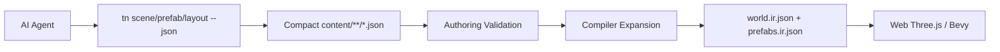
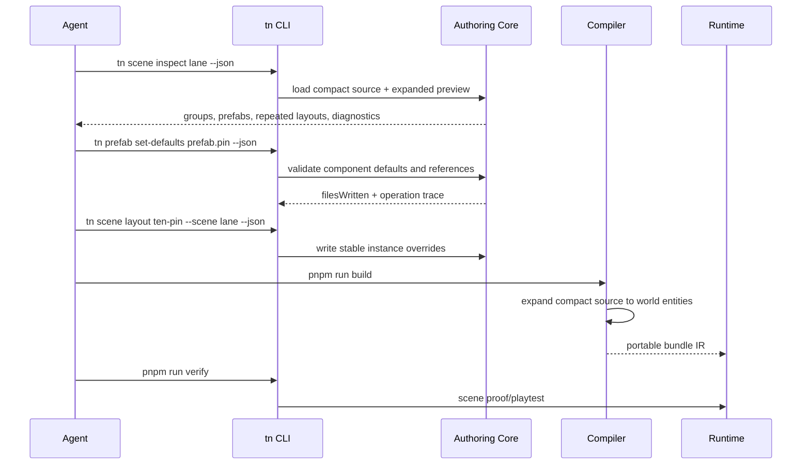

# PRD: Bowling Lane Agent-Friendly Scene Source Refactor

Complexity: 8 -> HIGH mode

Score basis: +3 touches 10+ future files, +2 spans authoring/compiler/CLI/docs/example
surfaces, +1 changes structured source contracts, +1 adds validation/generator
behavior, +1 updates a playable example and verification evidence.

## 1. Context

**Problem:** The `examples/bowling-lane` scene is already 1,342 lines, with the
most repeated authored data kept in `content/scenes/lane.scene.json`; this makes
future game edits expensive and error-prone for AI agents.

**Goal:** Make bowling-lane source compact, inspectable, and operation-friendly
without weakening the durable source boundary or changing emitted web/Bevy
runtime semantics.

**Non-goals:**

- Do not edit generated `dist/**` or emitted bundle JSON.
- Do not move gameplay source into raw Three.js, Bevy, DOM, timer, filesystem,
  or runtime-handle APIs.
- Do not hide authored physics. Bowling must continue to declare portable
  `RigidBody` and `Collider` source data for the ball, pins, lane, rails, and
  collision surfaces.
- Do not rely on comments or prose as the only compression mechanism. The
  source must stay machine-validated and deterministic.

**Files Analyzed:**

- `examples/AGENTS.md`
- `examples/bowling-lane/AGENTS.md`
- `examples/bowling-lane/content/scenes/lane.scene.json`
- `examples/bowling-lane/content/prefabs/bowling.prefab.json`
- `examples/bowling-lane/content/materials/lane.materials.json`
- `examples/bowling-lane/content/meshes/lane.meshes.json`
- `examples/bowling-lane/content/assets/lane.assets.json`
- `examples/bowling-lane/content/assets/asset.room-*.assets.json`
- `examples/bowling-lane/content/systems/lane.systems.json`
- `examples/bowling-lane/src/scripts/bowling.ts`
- `examples/bowling-lane/package.json`
- `packages/compiler/src/scene-document.ts`
- `packages/compiler/src/examples.test.ts`
- `docs/contracts/authoring-source-documents.md`
- `docs/PRDs/done/other/editor-ready-modular-authoring-and-scripting-architecture.md`
- `docs/PRDs/other/agent-friendly-project-and-visual-debugging-workflows.md`

**Current Behavior:**

- `content/scenes/lane.scene.json` contains 30 entities, 11 scene-local prefab
  shorthands, UI, resources, lights, camera, runtime visuals, physics
  components, and most placement data in one file.
- The ten pin entities repeat identical `Collider`, `RigidBody`, `Pin`, prefab,
  and scale payloads; only ID and position differ.
- `src/scripts/bowling.ts` repeats the pin home positions already present in
  scene JSON, so AI agents must keep source data and script constants in sync.
- `content/prefabs/bowling.prefab.json` exists but contains no reusable pin,
  ball, lane, or scenery defaults.
- `content/assets/asset.room-*.assets.json` declares room assets that are not
  reflected in the scene composition, increasing discovery noise.
- `packages/compiler/src/scene-document.ts` lowers only `scene.entities` into
  scene world entities. It emits `content/prefabs/*.prefab.json` into
  `prefabs.ir.json`, but scene authoring does not yet reference prefab-document
  defaults for compact scene instances.

## Pre-Planning Findings

**How will this feature be reached?**

- [x] Entry point identified:
  - `tn scene validate lane --json`
  - `tn scene inspect lane --json`
  - proposed `tn scene instantiate ... --json`
  - proposed `tn scene layout ... --json`
  - proposed `tn prefab set-defaults ... --json`
  - normal `pnpm run validate:authoring`, `pnpm run build`, `pnpm run verify`
- [x] Caller file identified:
  - authoring operations in `packages/authoring/src/*`
  - CLI command registration in `packages/cli/src/index.ts`
  - CLI source document commands in `packages/cli/src/commands/sourceDocuments.ts`
  - compiler scene lowering in `packages/compiler/src/scene-document.ts`
  - example source under `examples/bowling-lane/content/**`
  - gameplay source in `examples/bowling-lane/src/scripts/bowling.ts`
- [x] Registration/wiring needed:
  - Add operation metadata and CLI commands for prefab-backed instance defaults
    and repeated layouts.
  - Update compiler lowering so compact source expands deterministically before
    emitted world/prefab IR.
  - Update docs and example proof artifacts.

**Is this user-facing?**

- [x] YES. This affects developers and AI agents editing structured game
  source.
- [ ] NO.

**Full user flow:**

1. User asks an agent to change the bowling lane setup, pin layout, physics
   defaults, or lane dressing.
2. Agent runs `tn scene inspect lane --json` and sees compact groups, prefab
   defaults, layout source, and expanded entity preview.
3. Agent applies a bounded operation such as changing `prefab.pin` physics
   defaults or regenerating the ten-pin layout.
4. CLI validates references, stable IDs, generated expansion, and schema
   compatibility before writing source.
5. Build emits the same portable IR entity/component semantics that web Three.js
   and Bevy consume.
6. Agent verifies with authoring validation, build, scene proof, and game score.

## 2. Solution

**Approach:**

- Introduce compact authoring support for prefab defaults plus repeated scene
  instance layouts, then migrate bowling-lane to use it as the proving example.
- Keep source durable and JSON-structured. Compactness must come from validated
  source shapes and CLI operations, not from minified JSON or hidden generator
  side effects.
- Move repeated component defaults for pin, ball, static lane blockers, and
  common visuals into `content/prefabs/*.prefab.json` or a scene-local defaults
  block that the compiler can expand with provenance.
- Represent the ten bowling pins as one layout source with explicit stable ID
  generation and authored positions, or as a prefab instance array where each
  entry carries only ID and transform overrides.
- Remove duplicated pin home constants from script source by reading authored
  home data from components/tags/resource data, or by generating both scene
  placement and script-readable metadata from one structured source definition.
- Split scene concerns by source family: scene membership and transforms in
  `content/scenes`, prefab defaults in `content/prefabs`, materials in
  `content/materials`, meshes in `content/meshes`, assets in `content/assets`,
  UI in `content/ui`, systems in `content/systems`, and behavior in
  `src/scripts`.



**Key Decisions:**

- [x] Library/framework choices: reuse `@threenative/authoring` operations,
  structured source validators, compiler scene lowering, provenance reporting,
  and existing CLI JSON output conventions.
- [x] Error-handling strategy: reject missing prefab IDs, duplicate expanded
  entity IDs, invalid transform vectors, unsupported layout generators, and
  component override type mismatches with stable diagnostics.
- [x] Reused utilities: existing scene validation, source document discovery,
  prefab document emission, authoring provenance, and example verification
  scripts.

**Data Changes:**

- Add compact scene-source shape for repeated prefab instances or layouts.
- Add prefab-default support for reusable components and transform defaults.
- Add optional source metadata for generated/expanded entities so inspectors can
  show both compact source and expanded runtime shape.

## 3. Sequence Flow



## 4. Execution Phases

#### Phase 1: Inspection And Contract - Developers can see why the current bowling source is bloated.

**Files (max 5):**

- `docs/contracts/authoring-source-documents.md` - document compact prefab
  instances/layout source shape.
- `packages/authoring/src/schemas.ts` - add schema types for compact instances
  or layouts.
- `packages/authoring/src/operations.ts` - add validation helpers for expansion.
- `packages/cli/src/commands/sourceDocuments.ts` - expose inspect output for
  compact and expanded scene views.
- `packages/cli/src/commands/source-documents-command.test.ts` - cover inspect
  diagnostics and output shape.

**Implementation:**

- [ ] Define the minimal source shape for reusable prefab defaults and repeated
  instance layouts.
- [ ] Add validation for duplicate expanded IDs, invalid transform vectors, and
  missing prefab references.
- [ ] Extend scene inspection output with `sourceLineCount`,
  `expandedEntityCount`, `repeatedBlocks`, and `suggestedRefactors`.
- [ ] Keep raw `scene.entities` support unchanged for compatibility.

**Tests Required:**

| Test File | Test Name | Assertion |
|-----------|-----------|-----------|
| `packages/cli/src/commands/source-documents-command.test.ts` | `should report repeated bowling pin source candidates when inspecting a scene` | Inspect JSON includes repeated component/default evidence and does not mutate files. |
| `packages/authoring/src/schemas.test.ts` | `should reject compact instances with duplicate expanded ids` | Validation returns stable diagnostic with source path. |

**User Verification:**

- Action: Run `tn scene inspect lane --json` in `examples/bowling-lane`.
- Expected: Output identifies the ten pin instances as a compact-layout
  candidate and reports current/expanded line-count evidence.

#### Phase 2: Prefab Defaults And Expansion - Authors can keep repeated components out of the scene file.

**Files (max 5):**

- `packages/compiler/src/scene-document.ts` - expand prefab defaults and compact
  instance overrides before world lowering.
- `packages/compiler/src/examples.test.ts` - prove emitted world shape and
  provenance.
- `packages/compiler/src/authoring/provenance.ts` - preserve ownership for
  expanded defaults and overrides.
- `packages/ir/src/prefabValidation.ts` - validate new prefab-default payloads
  if needed at IR boundary.
- `docs/contracts/authoring-source-documents.md` - document provenance and
  override rules.

**Implementation:**

- [ ] Merge prefab default components with per-instance overrides using a
  deterministic deep object merge that preserves explicit override ownership.
- [ ] Expand compact instances before generic component schema inference.
- [ ] Preserve scene IDs exactly, including `pin.01` through `pin.10`.
- [ ] Ensure emitted `world.ir.json` remains semantically equivalent to the
  existing bowling lane entities.

**Tests Required:**

| Test File | Test Name | Assertion |
|-----------|-----------|-----------|
| `packages/compiler/src/examples.test.ts` | `should expand compact prefab instances into deterministic world entities` | Expanded world contains expected pin transforms, `RigidBody`, `Collider`, and `Pin` components. |
| `packages/compiler/src/examples.test.ts` | `should preserve provenance for prefab defaults and instance overrides` | Provenance maps emitted component fields back to prefab/default or scene override source pointers. |

**User Verification:**

- Action: Build a fixture that uses compact pin instances.
- Expected: `world.ir.json` has the same entity IDs/components as the verbose
  source, while source line count is materially lower.

#### Phase 3: Agent-Friendly CLI Mutations - Agents can safely modify layouts without hand-editing large JSON.

**Files (max 5):**

- `packages/authoring/src/operationRegistry.ts` - register prefab/default and
  layout operations.
- `packages/cli/src/index.ts` - wire commands.
- `packages/cli/src/commands/sourceDocuments.ts` - implement commands or route
  to focused command modules.
- `packages/cli/src/index.test.ts` - verify help/registration.
- `packages/cli/src/commands/source-documents-command.test.ts` - verify command
  behavior and diagnostics.

**Implementation:**

- [ ] Add `prefab.set_defaults`, `scene.add_prefab_instance`, and
  `scene.layout.ten_pin` or a generic `scene.layout.grid/rows` operation.
- [ ] Require `--json` output with files written, stable diagnostics, and an
  operation trace.
- [ ] Prefer declarative layout parameters over arbitrary code generation.
- [ ] Reject ambiguous IDs, unsupported prefab references, and destructive
  overwrite attempts unless an explicit replace flag is provided.

**Tests Required:**

| Test File | Test Name | Assertion |
|-----------|-----------|-----------|
| `packages/cli/src/index.test.ts` | `should list compact scene layout commands in help` | Help includes command names and JSON support. |
| `packages/cli/src/commands/source-documents-command.test.ts` | `should create ten stable prefab instances for a bowling rack` | Source JSON contains stable IDs and transform overrides only. |
| `packages/cli/src/commands/source-documents-command.test.ts` | `should reject replacing an existing compact layout without replace flag` | Command exits non-zero and leaves source unchanged. |

**User Verification:**

- Action: Run the layout command in a copy of `examples/bowling-lane`.
- Expected: The pin rack is regenerated deterministically and validation passes.

#### Phase 4: Bowling Lane Migration - The example becomes a compact, agent-friendly reference.

**Files (max 5):**

- `examples/bowling-lane/content/scenes/lane.scene.json` - keep only scene
  membership, unique transforms, resources, and references.
- `examples/bowling-lane/content/prefabs/bowling.prefab.json` - move reusable
  pin, ball, lane, rail, blocker, and visual defaults here.
- `examples/bowling-lane/src/scripts/bowling.ts` - remove duplicated pin home
  constants or read them from authored state.
- `examples/bowling-lane/README.md` - document compact source layout and agent
  edit commands.
- `examples/bowling-lane/docs/production-plan.md` - update source architecture
  and verification notes.

**Implementation:**

- [ ] Move repeated pin physics and state defaults out of scene instances.
- [ ] Move reusable static lane collider defaults into prefab/default source.
- [ ] Collapse the ten pin entities into compact instance overrides.
- [ ] Remove unused or disconnected asset source documents, or wire them into
  the scene if they are intentional.
- [ ] Keep authored material, mesh, asset, UI, input, and system documents
  separated by source family.

**Tests Required:**

| Test File | Test Name | Assertion |
|-----------|-----------|-----------|
| `packages/compiler/src/examples.test.ts` | `should build compact bowling lane source with equivalent pin physics` | Built bundle validates and includes all expected pin entities/components. |
| `examples/bowling-lane` command proof | `validate authoring, build, verify, game score` | Example scripts pass and produce proof artifacts. |

**User Verification:**

- Action: In `examples/bowling-lane`, run `pnpm run validate:authoring`,
  `pnpm run build`, `tn scene proof lane --project . --json`,
  `pnpm run verify`, and `pnpm run game:score`.
- Expected: Bowling lane remains playable, physics-backed, visually equivalent
  or better, and the scene source is substantially smaller than 1,342 lines.

#### Phase 5: Documentation And Guardrails - Future examples avoid regressing into giant scene JSON.

**Files (max 5):**

- `docs/workflows/` new or existing authoring workflow doc - explain compact
  source patterns for AI agents.
- `docs/STATUS.md` - update capability status if compact source is promoted.
- `docs/bevy-feature-parity.md` - update release/parity notes if emitted IR or
  runtime capability gates change.
- `docs/PRDs/README.md` - move/link this PRD when complete.
- `examples/AGENTS.md` - add example-level guidance only if it is broadly
  applicable.

**Implementation:**

- [ ] Document when to use prefab defaults, compact instances, layouts,
  generators, and raw scene entities.
- [ ] Add a scene-source density warning or lint check for repeated large
  component blocks when practical.
- [ ] State the preferred agent workflow: inspect, plan bounded source
  operation, validate, build, proof.
- [ ] Update status/parity docs only if the feature changes release-gated
  capabilities.

**Tests Required:**

| Test File | Test Name | Assertion |
|-----------|-----------|-----------|
| docs gate | `pnpm check:docs` | New docs links are valid and status/parity updates are consistent. |
| source density gate | `should warn on repeated component blocks above threshold` | Dense repeated scene source reports a warning with suggested operation. |

**User Verification:**

- Action: Read the bowling-lane README and workflow doc, then perform one small
  CLI edit to a prefab default.
- Expected: The edit is discoverable, validated, reversible through source
  control, and does not require hand-editing hundreds of JSON lines.

## 5. Checkpoint Protocol

After each implementation phase, run the automated PRD checkpoint review:

```txt
Use Task tool with:
- subagent_type: "prd-work-reviewer"
- prompt: "Review checkpoint for phase N of PRD at docs/PRDs/other/bowling-lane-agent-friendly-scene-source.md"
```

For Phase 4, add manual visual verification because the example is a playable
game and visual/physics evidence matters.

## 6. Verification Strategy

**Unit and schema tests:**

- Validate compact instance shape, prefab defaults, duplicate expanded IDs,
  invalid component override values, and missing prefab references.

**Compiler tests:**

- Prove compact source expands into deterministic `world.ir.json`.
- Prove emitted provenance maps generated entities/components back to compact
  source pointers.

**CLI tests:**

- Prove `--json` output shape, exit codes, files written, dry-run behavior, and
  diagnostics for malformed requests.

**Example proof:**

- `pnpm run validate:authoring`
- `pnpm run build`
- `tn scene validate lane --json`
- `tn scene inspect lane --json`
- `tn scene proof lane --project . --json`
- `pnpm run verify`
- `pnpm run game:score`

**Regression metric:**

- `examples/bowling-lane/content/scenes/lane.scene.json` should drop from 1,342
  lines to a compact target budget set during implementation, with no loss of
  emitted pin, ball, lane, light, camera, UI, or physics semantics.

## 7. Acceptance Criteria

- [ ] Bowling-lane repeated pin component data is authored once, not ten times.
- [ ] Pin home positions have one source of truth for both placement and reset
  behavior.
- [ ] The scene source stays readable to agents through `tn scene inspect
  lane --json`, including expanded previews and source pointers.
- [ ] Compact source emits deterministic, stable entity IDs and world component
  data.
- [ ] Web and Bevy semantics remain portable; no runtime adapter-private source
  concepts are introduced.
- [ ] CLI operations can create and mutate compact layouts without raw JSON
  editing for the common bowling use case.
- [ ] Validation rejects ambiguous or lossy compact source before build.
- [ ] Bowling-lane authoring validation, build, scene proof, verify, and game
  score pass after migration.
- [ ] Documentation explains the agent workflow and prevents future examples
  from accumulating avoidable thousand-line scene files.
