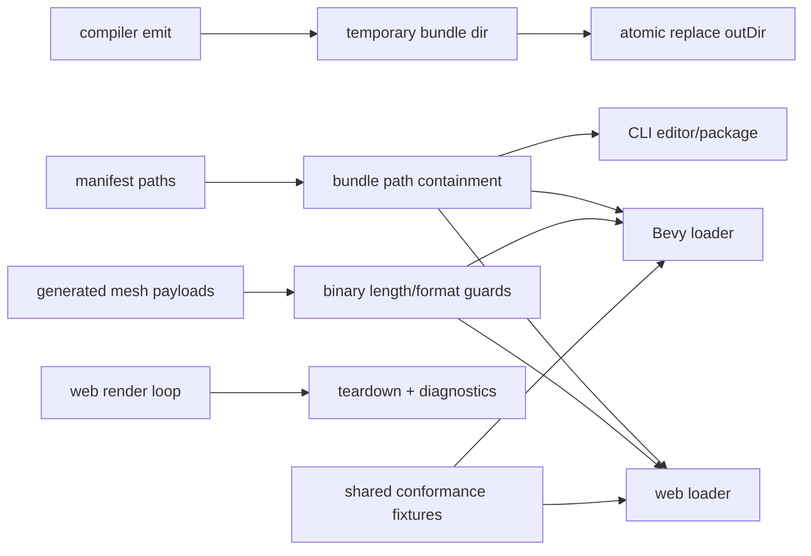
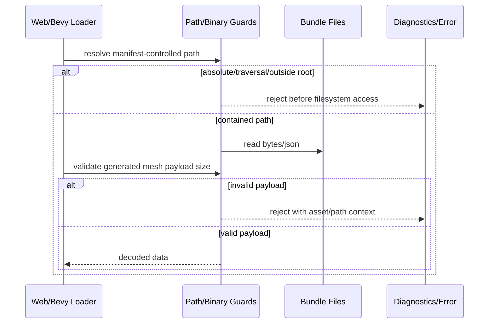

# PRD: Bundle Safety and Runtime Robustness Hardening

Complexity: 12 -> HIGH mode

Score basis: +3 touches 10+ files during future execution, +2 spans multiple
packages and the native runtime, +2 hardens trust-boundary and runtime lifecycle
state, +2 requires cross-runtime conformance evidence, +1 affects compiler emit
behavior, +1 affects CLI/editor behavior, +1 adds build/runtime guardrails.

## 1. Context

**Problem:** The 2026-06-18 quality audit found bundle trust-boundary,
destructive emit, malformed payload, runtime lifecycle, scatter-generation, and
web/native semantic parity risks that are not fully covered by existing pending
PRDs.

**Source Audit:**

- `docs/audits/CODEBASE_QUALITY_REPORT_2026-06-18.md`

**Pending PRDs Reviewed For Overlap:**

- `docs/PRDs/done/other/ir-contract-drift-hardening.md`
- `docs/PRDs/done/other/scene-lifecycle-and-flow-contract.md`
- `docs/PRDs/done/other/verification-gates-and-package-scripts-reorg.md`
- `docs/PRDs/other/ai-consumable-distribution-contract.md`

**Files Analyzed:**

- `packages/runtime-web-three/src/loadBundle.ts`
- `packages/runtime-web-three/src/render.ts`
- `packages/runtime-web-three/src/mapWorld.ts`
- `packages/runtime-web-three/src/systems/effects.ts`
- `packages/compiler/src/emit/bundle.ts`
- `packages/compiler/src/emit/asset-copy.ts`
- `packages/compiler/src/emit/environment.ts`
- `packages/compiler/src/capture.ts`
- `packages/cli/src/commands/editor.ts`
- `runtime-bevy/crates/threenative_loader/src/lib.rs`
- `runtime-bevy/crates/threenative_runtime/src/map_world.rs`
- `runtime-bevy/crates/threenative_runtime/src/systems_effects.rs`
- `docs/PRDs/done/other/ir-contract-drift-hardening.md`
- `docs/PRDs/done/other/scene-lifecycle-and-flow-contract.md`
- `docs/PRDs/done/other/verification-gates-and-package-scripts-reorg.md`

**Current Behavior:**

- Web bundle loading joins manifest-controlled paths with the bundle source
  without rejecting absolute paths or `../` traversal for filesystem loads.
- Bevy loader and CLI editor paths have similar manifest/document path
  containment risk.
- Compiler emit removes the previous output directory before all new bundle
  writes and asset copies have succeeded.
- Generated mesh binary payloads are decoded differently in web and Bevy when
  buffers are short, long, or have unsupported index formats.
- Web rendering starts RAF/input work without an explicit teardown handle and
  without structured frame-failure diagnostics.
- Environment scatter generation can expand unbounded output from large
  bounds/density values.
- Some shared IR semantics are still implemented independently in web and Bevy
  without conformance observations that pin the expected behavior.

## Overlap Analysis

This PRD must not duplicate the existing pending PRDs:

| Audit Finding | Covered Elsewhere? | This PRD Scope |
| --- | --- | --- |
| IR schema/type/validator/Rust contract drift | Yes: `ir-contract-drift-hardening.md` | Excluded except where safety fixes need validation fixtures. |
| Malformed document structural diagnostics | Mostly yes: `ir-contract-drift-hardening.md` | Excluded unless a safety phase needs a narrow loader test. |
| Entry capture only transpiles one file | Yes: `scene-lifecycle-and-flow-contract.md` Phase 1 | Excluded. |
| Scene lifecycle, transitions, loading screens | Yes: `scene-lifecycle-and-flow-contract.md` | Excluded. |
| CI/script/gate/package script reorg | Yes: `verification-gates-and-package-scripts-reorg.md` | Excluded. |
| AI/package distribution metadata | Yes: `ai-consumable-distribution-contract.md` | Excluded. |
| Bundle path containment | No dedicated PRD | Included. |
| Atomic compiler emit | No dedicated PRD | Included. |
| Generated mesh binary length validation | No dedicated PRD | Included. |
| Web render teardown/failure diagnostics | No dedicated PRD | Included. |
| Environment scatter output budget | No dedicated PRD | Included. |
| Web/Bevy semantic parity for command constraints, ambient lights, active cameras, primitive/material defaults | Not fully covered | Included as conformance-first runtime hardening. |
| Large-module SRP cleanup | Only partially adjacent | Included only as final, test-backed extraction after behavior is pinned. |

## Pre-Planning Findings

No `.env` or secret runtime configuration is needed for this PRD.

**How will this feature be reached?**

- [x] Entry point identified:
  - `tn build` / compiler `emitBundle`;
  - `tn validate`, `tn editor inspect`, `tn editor apply`, and package flows
    that read/write bundle documents;
  - `loadBundle(source)` in `@threenative/runtime-web-three`;
  - Bevy loader and runtime bundle ingestion;
  - runtime web `renderBundle` / preview render loop;
  - environment emit from SDK environment declarations.
- [x] Caller files identified:
  - `packages/compiler/src/emit/bundle.ts`
  - `packages/compiler/src/emit/asset-copy.ts`
  - `packages/compiler/src/emit/environment.ts`
  - `packages/runtime-web-three/src/loadBundle.ts`
  - `packages/runtime-web-three/src/render.ts`
  - `packages/runtime-web-three/src/mapWorld.ts`
  - `packages/runtime-web-three/src/systems/effects.ts`
  - `packages/cli/src/commands/editor.ts`
  - `runtime-bevy/crates/threenative_loader/src/lib.rs`
  - `runtime-bevy/crates/threenative_runtime/src/map_world.rs`
  - `runtime-bevy/crates/threenative_runtime/src/systems_effects.rs`
- [x] Registration/wiring needed:
  - add one shared TypeScript bundle path helper and equivalent Rust loader
    helper;
  - replace manifest-controlled path reads/writes in compiler/CLI/web/native;
  - change compiler emit staging to use a temporary output and atomic replace;
  - add generated mesh binary payload guards in both runtimes;
  - return a render teardown handle from web runtime APIs without breaking
    existing callers;
  - add conformance fixtures and runtime observations for selected semantic
    parity rules.

**Is this user-facing?**

- [x] YES. Users see safer builds, clearer invalid-bundle errors, stable dev
  previews, and better web/native parity.
- [ ] NO.

**Full user flow:**

1. User runs `tn build` on a project that already has a valid bundle.
2. A later asset copy or generated file write fails.
3. Compiler leaves the previous bundle intact and reports the failed write.
4. User runs `tn validate`, web preview, editor inspect/apply, or native run on
   a malformed bundle.
5. Unsafe manifest/document paths and malformed generated mesh payloads fail
   before filesystem escape or runtime corruption.
6. Web preview sessions can be torn down cleanly and frame failures surface as
   diagnostics instead of silent freezes.
7. Shared conformance fixtures prove web and Bevy agree on selected runtime
   semantics.

## 2. Solution

**Approach:**

- Treat every bundle-relative path read from manifest, bundle documents, editor
  commands, or generated asset metadata as untrusted until containment-checked.
- Make compiler emit transactional: complete all writes in a sibling temporary
  directory, then replace the canonical output only after success.
- Validate binary generated mesh payload lengths and formats before decoding in
  both runtimes.
- Add explicit web render lifecycle ownership through teardown/dispose handles
  and structured frame-error diagnostics.
- Bound environment scatter generation before expansion and report actionable
  diagnostics for excessive density/count.
- Add conformance observations for runtime semantics that currently drift
  between web and Bevy before changing behavior.
- Defer large-file SRP extraction until regression tests pin the behavior being
  moved.



**Key Decisions:**

- [x] Bundle paths are relative POSIX-style artifact paths, not absolute paths,
  URLs, or filesystem traversal requests.
- [x] Filesystem containment is a load/write boundary concern, not just a JSON
  schema concern.
- [x] Successful compiler output should be replaceable as one completed bundle
  unit. Failed builds must not destroy the last good bundle.
- [x] Web and Bevy should reject the same malformed generated mesh payloads.
- [x] Runtime render loops should have explicit ownership and error reporting.
- [x] Scatter guardrails are compiler diagnostics because authors can fix the
  declared density/count before runtime.
- [x] Runtime parity fixes must start with shared observations and fixtures.

**Data Changes:** No database changes. Bundle schema changes should be avoided
unless a phase proves that a new diagnostic field or manifest capability is
required. If any bundle metadata changes, update `docs/STATUS.md` and
`docs/bevy-feature-parity.md` in the implementation PR.

## 3. Sequence Flow

```mermaid
sequenceDiagram
    participant Build as emitBundle
    participant Tmp as Temp Bundle Dir
    participant FS as Filesystem
    participant User as User/dev server

    User->>Build: tn build
    Build->>Tmp: write all JSON/assets/payloads
    alt write or copy fails
        Build->>Tmp: cleanup temp dir
        Build-->>User: error; previous outDir preserved
    else all writes succeed
        Build->>FS: atomically replace outDir
        Build-->>User: new bundle path
    end
```



## 4. Execution Phases

Each phase is a vertical slice. Future implementation must run the automated
PRD checkpoint reviewer after each phase and continue only after PASS.

#### Phase 1: Bundle Path Trust Boundary - Unsafe bundle paths are rejected before filesystem access.

**Files (max 5):**

- `packages/ir/src/bundlePaths.ts` - shared TypeScript bundle-relative path
  containment helper.
- `packages/ir/src/bundlePaths.test.ts` - helper tests for absolute paths,
  parent traversal, URL-shaped values, and valid relative paths.
- `packages/runtime-web-three/src/loadBundle.ts` - use the helper for local
  filesystem reads and generated payload reads.
- `packages/runtime-web-three/src/loadBundle.test.ts` - malicious manifest/path
  regression tests.
- `runtime-bevy/crates/threenative_loader/src/lib.rs` - add equivalent Rust
  containment checks and tests.

**Implementation:**

- [ ] Define allowed bundle paths: relative, non-empty, no parent traversal, no
  absolute roots, no URL schemes for local bundle document paths.
- [ ] Resolve against a canonical bundle root and verify the result remains
  inside that root.
- [ ] Apply the rule to web local bundle JSON and byte reads.
- [ ] Apply the equivalent rule to Bevy loader document and generated asset
  reads.
- [ ] Keep fetch/http loading behavior constrained to URL path joining only for
  explicitly fetchable sources.

**Tests Required:**

| Test File | Test Name | Assertion |
| --- | --- | --- |
| `packages/ir/src/bundlePaths.test.ts` | `should reject absolute bundle paths` | helper rejects `/tmp/escape.json`. |
| `packages/ir/src/bundlePaths.test.ts` | `should reject parent traversal bundle paths` | helper rejects `../manifest.json` and `assets/../escape`. |
| `packages/runtime-web-three/src/loadBundle.test.ts` | `should reject malicious manifest document path` | loader fails before reading outside root. |
| Bevy loader test | `should reject malicious manifest document path` | loader returns structured error. |

**User Verification:**

- Action: run web/native load against a fixture whose manifest points outside
  the bundle.
- Expected: load fails with a path-containment diagnostic/error and no external
  file is read.

#### Phase 2: CLI Editor and Package Path Safety - Editor document operations cannot escape artifact roots.

**Files (max 5):**

- `packages/cli/src/commands/editor.ts` - apply safe bundle/document path
  resolution to inspect/apply/set flows.
- `packages/cli/src/commands/editor.test.ts` - malicious editor path tests.
- `packages/cli/src/commands/package.ts` - use safe path checks for
  manifest-controlled package reads if applicable.
- `packages/cli/src/commands/package.test.ts` - package path containment tests.
- `packages/compiler/src/emit/asset-copy.ts` - align existing asset path helper
  with shared path rules where practical.

**Implementation:**

- [ ] Audit editor reads/writes of bundle documents, snapshots, and applied
  paths.
- [ ] Reject absolute paths, parent traversal, and paths resolving outside the
  intended bundle/editor artifact root.
- [ ] Return stable CLI diagnostics that include the offending path.
- [ ] Reuse the same helper/rules used by runtime loaders where package
  boundaries allow.

**Tests Required:**

| Test File | Test Name | Assertion |
| --- | --- | --- |
| `packages/cli/src/commands/editor.test.ts` | `should reject editor apply path outside bundle` | no write occurs outside root. |
| `packages/cli/src/commands/editor.test.ts` | `should reject inspect path traversal` | command exits with diagnostic. |
| `packages/cli/src/commands/package.test.ts` | `should reject package manifest traversal path` | package command fails safely. |

**User Verification:**

- Action: run `tn editor inspect` or `tn editor apply` against a malicious
  bundle fixture.
- Expected: command fails with a stable diagnostic and does not read/write
  outside the bundle.

#### Phase 3: Atomic Compiler Emit - Failed builds preserve the previous valid bundle.

**Files (max 5):**

- `packages/compiler/src/emit/bundle.ts` - stage output in a temporary sibling
  directory and replace `outDir` only after success.
- `packages/compiler/src/emit/bundle.test.ts` - failed emit preservation and
  successful deterministic emit tests.
- `packages/compiler/src/emit/asset-copy.test.ts` - copy failure fixture if the
  failure is easiest to trigger there.
- `packages/compiler/src/emit/asset-copy.ts` - expose or adapt failure behavior
  only if needed for deterministic tests.
- `packages/compiler/src/errors.ts` - add a typed emit error only if current
  errors cannot report the failure clearly.

**Implementation:**

- [ ] Build into a temporary sibling directory under the same parent as
  `outDir`.
- [ ] Complete JSON writes, generated mesh payload writes, asset copies, and
  extra file copies before replacing `outDir`.
- [ ] Replace `outDir` atomically where the platform allows; otherwise use a
  safe rename sequence that preserves old output on failure before replace.
- [ ] Clean temporary output after success and after failure.
- [ ] Avoid embedding temp directory names into deterministic bundle files.

**Tests Required:**

| Test File | Test Name | Assertion |
| --- | --- | --- |
| `packages/compiler/src/emit/bundle.test.ts` | `should preserve previous bundle when asset copy fails` | old `manifest.json` remains after failure. |
| `packages/compiler/src/emit/bundle.test.ts` | `should clean temporary emit directory after failure` | temp path is absent or isolated. |
| `packages/compiler/src/emit/bundle.test.ts` | `should emit deterministic bundle through staging` | repeated successful emits match. |

**User Verification:**

- Action: build once successfully, then build with a missing asset.
- Expected: build reports the missing asset and the previous bundle remains
  runnable.

#### Phase 4: Generated Mesh Payload Validation - Web and Bevy reject malformed binary payloads consistently.

**Files (max 5):**

- `packages/runtime-web-three/src/loadBundle.ts` - validate binary attribute and
  index payload byte lengths/formats before decoding.
- `packages/runtime-web-three/src/loadBundle.test.ts` - short/long/bad format
  generated mesh payload tests.
- `runtime-bevy/crates/threenative_loader/src/lib.rs` - validate exact payload
  byte length and supported formats.
- `runtime-bevy/crates/threenative_loader/tests/load_bundle.rs` - matching
  native malformed payload tests.
- `packages/ir/fixtures/rejected/generated-mesh-payloads/*` - shared fixtures
  if a fixture directory already exists; otherwise keep local test fixtures.

**Implementation:**

- [ ] For float attributes, require bytes exactly equal
  `count * itemSize * 4`.
- [ ] For indices, require bytes exactly equal `count * 2` for `uint16` and
  `count * 4` for `uint32`.
- [ ] Reject unsupported index formats with asset ID and payload path context.
- [ ] Ensure web and Bevy return equivalent diagnostics/load errors.
- [ ] Confirm valid generated mesh/procedural mesh fixtures still load.

**Tests Required:**

| Test File | Test Name | Assertion |
| --- | --- | --- |
| `packages/runtime-web-three/src/loadBundle.test.ts` | `should reject short generated mesh attribute payload` | load fails with asset/path context. |
| `packages/runtime-web-three/src/loadBundle.test.ts` | `should reject long generated mesh index payload` | load fails before decode. |
| Bevy loader test | `should reject malformed generated mesh payloads` | native loader errors match policy. |

**User Verification:**

- Action: load a bundle with a truncated generated mesh payload in web and
  native.
- Expected: both runtimes reject it clearly instead of throwing raw
  `DataView` errors or silently truncating.

#### Phase 5: Web Render Lifecycle Robustness - Preview sessions can stop cleanly and frame failures surface.

**Files (max 5):**

- `packages/runtime-web-three/src/render.ts` - return a teardown handle that
  cancels RAF, detaches input listeners, and disposes renderer resources.
- `packages/runtime-web-three/src/index.ts` - export/propagate the handle
  without breaking existing callers.
- `packages/runtime-web-three/src/render.test.ts` - fake RAF/listener teardown
  tests.
- `packages/runtime-web-three/src/gameLoop.ts` - route async frame failures to
  structured diagnostics if frame work lives there.
- `packages/runtime-web-three/src/gameLoop.test.ts` - frame failure diagnostic
  tests.

**Implementation:**

- [ ] Return `{ dispose(): void }` or a compatible runtime handle from render
  startup.
- [ ] Cancel scheduled RAF on dispose.
- [ ] Detach keyboard/pointer/gamepad/input listeners installed by the runtime.
- [ ] Dispose Three.js renderer/scene resources where owned by the runtime.
- [ ] Wrap async frame execution so errors are reported and the runtime does
  not silently freeze.

**Tests Required:**

| Test File | Test Name | Assertion |
| --- | --- | --- |
| `packages/runtime-web-three/src/render.test.ts` | `should cancel animation frame on dispose` | fake RAF cancel is called. |
| `packages/runtime-web-three/src/render.test.ts` | `should detach input listeners on dispose` | listener removal count matches additions. |
| `packages/runtime-web-three/src/gameLoop.test.ts` | `should report frame failure diagnostic` | rejected frame work emits diagnostic. |

**User Verification:**

- Action: start and stop web preview repeatedly in a test harness.
- Expected: no duplicate listeners/RAF loops remain and frame errors are
  visible in diagnostics.

#### Phase 6: Environment Scatter Guardrails - Excessive scatter declarations fail before expansion.

**Files (max 5):**

- `packages/compiler/src/emit/environment.ts` - validate scatter count and
  attempt budgets before generating instances.
- `packages/compiler/src/emit/environment.test.ts` - explicit count and
  density-derived limit tests.
- `packages/sdk/src/environment.ts` - add authoring options/types for limits
  only if the compiler needs SDK-visible fields.
- `packages/sdk/src/environment.test.ts` - SDK validation tests if options are
  added.
- `docs/environment-scene-ir.md` - document scatter budget behavior.

**Implementation:**

- [ ] Define a conservative default maximum scatter count and attempt budget.
- [ ] Validate explicit `count` before instance generation.
- [ ] Validate density-derived count from bounds/area before instance
  generation.
- [ ] Emit actionable diagnostics that suggest lowering density/count or
  splitting scatter groups.
- [ ] Preserve existing valid environment examples.

**Tests Required:**

| Test File | Test Name | Assertion |
| --- | --- | --- |
| `packages/compiler/src/emit/environment.test.ts` | `should reject scatter count above compiler limit` | stable diagnostic/error before expansion. |
| `packages/compiler/src/emit/environment.test.ts` | `should reject density-derived scatter count above compiler limit` | no huge instance array is allocated. |
| `packages/compiler/src/emit/environment.test.ts` | `should emit valid scatter below limit` | existing deterministic output preserved. |

**User Verification:**

- Action: build an environment with accidentally huge scatter density.
- Expected: build fails quickly with a diagnostic instead of hanging or
  exhausting memory.

#### Phase 7: Conformance-First Runtime Semantic Parity - Shared runtime concepts behave the same in web and Bevy.

**Files (max 5):**

- `packages/ir/fixtures/conformance/runtime-semantics/game.bundle/*` - shared
  fixture for command constraints, ambient lights, active cameras, and defaults.
- `packages/runtime-web-three/src/conformance.test.ts` - web observation tests.
- `packages/runtime-web-three/src/mapWorld.ts` or `systems/effects.ts` - adjust
  behavior only after observations are pinned.
- `runtime-bevy/crates/threenative_runtime/tests/conformance.rs` - native
  observation tests.
- `runtime-bevy/crates/threenative_runtime/src/map_world.rs` or
  `systems_effects.rs` - native behavior alignment.

**Implementation:**

- [ ] Define expected semantics for command entity constraints.
- [ ] Define expected semantics for multiple ambient lights.
- [ ] Define expected `ActiveCamera` / `ActiveCameras` fallback and ordering.
- [ ] Define expected primitive/material defaults where current runtimes differ.
- [ ] Add observations before behavior changes, then align both runtimes.

**Tests Required:**

| Test File | Test Name | Assertion |
| --- | --- | --- |
| Web conformance test | `should report runtime semantics observations` | observations match fixture expectation. |
| Bevy conformance test | `should report runtime semantics observations` | observations match web expectation. |
| shared conformance gate | `runtime-semantics` | web/native diff is empty. |

**User Verification:**

- Action: run conformance for the runtime semantics fixture.
- Expected: web and Bevy report the same behavior for the pinned semantics.

#### Phase 8: SRP Extraction After Characterization - Large hot files become safer to change.

**Files (max 5 per extraction slice):**

- `packages/runtime-web-three/src/loadBundle.ts` - split path resolution,
  JSON loading, and binary decode helpers.
- `runtime-bevy/crates/threenative_loader/src/lib.rs` - split loader modules by
  path safety, JSON decode, binary payloads, and schema/version checks.
- `packages/runtime-web-three/src/mapWorld.ts` - extract camera/light/material
  mapping slices after conformance tests.
- `runtime-bevy/crates/threenative_runtime/src/map_world.rs` - mirror native
  mapping extraction.
- `scripts/verify-conformance.mjs` or typed replacement module - split report
  comparison from command orchestration only if not already handled by the gate
  reorg PRD.

**Implementation:**

- [ ] Extract one module boundary at a time.
- [ ] Keep public exports stable unless a separate PRD approves an API change.
- [ ] Use characterization tests from earlier phases to prove behavior was
  moved, not changed.
- [ ] Avoid combining extraction with semantic fixes.

**Tests Required:**

| Test File | Test Name | Assertion |
| --- | --- | --- |
| existing loader tests | existing names | pass unchanged after extraction. |
| existing conformance tests | existing names | pass unchanged after extraction. |
| targeted new module tests | `should preserve path/binary/mapping behavior` | helper behavior matches previous tests. |

**User Verification:**

- Action: run the same loader/runtime/conformance tests before and after each
  extraction slice.
- Expected: no behavior change; only module ownership improves.

## 5. Checkpoint Protocol

After each phase:

- Run the phase's narrow tests first.
- Run `pnpm verify:conformance` when bundle loading, emitted bundle shape, or
  web/native runtime behavior changes.
- Run `cargo test --manifest-path runtime-bevy/Cargo.toml` when Bevy loader or
  runtime behavior changes.
- Run `pnpm check:docs` when docs/status/parity files change.
- Use the automated PRD checkpoint reviewer before proceeding to the next
  phase.

Manual verification is required for Phase 5 if web preview teardown or visible
diagnostics cannot be fully asserted in unit tests.

## 6. Verification Strategy

Use multiple proof layers:

- Unit tests for path helpers, scatter budget math, binary length checks, and
  atomic emit behavior.
- CLI tests for editor/package containment.
- Web runtime tests for local bundle loading, generated payload decoding,
  render teardown, and frame failure diagnostics.
- Rust tests for Bevy loader containment and generated payload validation.
- Shared conformance fixtures for runtime semantic parity.
- Representative example builds for normal valid bundles after each hardening
  phase.

Recommended command sequence by affected area:

```bash
pnpm --filter @threenative/ir test
pnpm --filter @threenative/compiler test
pnpm --filter @threenative/cli test
pnpm --filter @threenative/runtime-web-three test
cargo test --manifest-path runtime-bevy/Cargo.toml
pnpm verify:conformance
pnpm check:docs
```

Run the full sequence only when the phase touches all corresponding areas. For
single-package slices, start with the narrow package command.

## 7. Acceptance Criteria

- [ ] Manifest-controlled and editor-controlled paths cannot escape bundle or
  artifact roots in CLI, web runtime, or Bevy loader.
- [ ] Failed compiler emits preserve the previous valid bundle and clean temp
  output.
- [ ] Web and Bevy reject malformed generated mesh binary payloads with clear
  asset/path context.
- [ ] Web render sessions expose a teardown handle and report async frame
  failures through diagnostics.
- [ ] Excessive scatter declarations fail quickly before instance expansion.
- [ ] Runtime semantic parity for command constraints, ambient lights, active
  cameras, and selected primitive/material defaults is pinned by conformance.
- [ ] Large loader/runtime files are split only after characterization coverage
  exists.
- [ ] Existing valid examples and conformance fixtures still pass.
- [ ] `docs/STATUS.md` and `docs/bevy-feature-parity.md` are updated if any
  implemented behavior changes a claimed support boundary.

## Non-Goals

- Do not implement the broader IR contract drift strategy; that belongs to
  `ir-contract-drift-hardening.md`.
- Do not implement scene lifecycle or module capture; that belongs to
  `scene-lifecycle-and-flow-contract.md`.
- Do not reorganize verification scripts or package scripts; that belongs to
  `verification-gates-and-package-scripts-reorg.md`.
- Do not add new public rendering features, shader transitions, or streaming
  world support.
- Do not refactor large files before tests pin the behavior being moved.

## Risk Controls

| Risk | Impact | Mitigation |
| --- | --- | --- |
| Path hardening breaks valid historical bundles | Medium | Define allowed path policy clearly and add valid relative path fixtures. |
| Atomic emit behaves differently across platforms | High | Prefer same-parent temp dirs and test success/failure on supported CI platforms. |
| Bevy and web errors differ too much | Medium | Compare normalized diagnostic/error fields in conformance where possible. |
| Scatter limits reject legitimate dense scenes | Medium | Start with conservative but documented defaults and allow explicit future budget controls. |
| SRP extraction hides behavior changes | High | Keep extraction separate from fixes and run characterization tests before/after. |

## Implementation Notes

- Prefer structured diagnostics with code, path, severity, and suggestion where
  the local diagnostic model supports them.
- Keep bundle path helpers small and deterministic. Do not add a broad virtual
  filesystem abstraction.
- For web fetch sources, containment means URL-path normalization within the
  bundle base, not filesystem canonicalization.
- For local filesystem sources, canonicalize the root before resolving child
  paths.
- Treat generated payload byte-length mismatches as load failures, not warnings.
- Do not update docs claiming improved capability support until runtime tests
  and conformance evidence exist.

