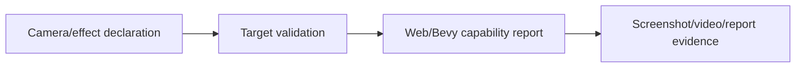
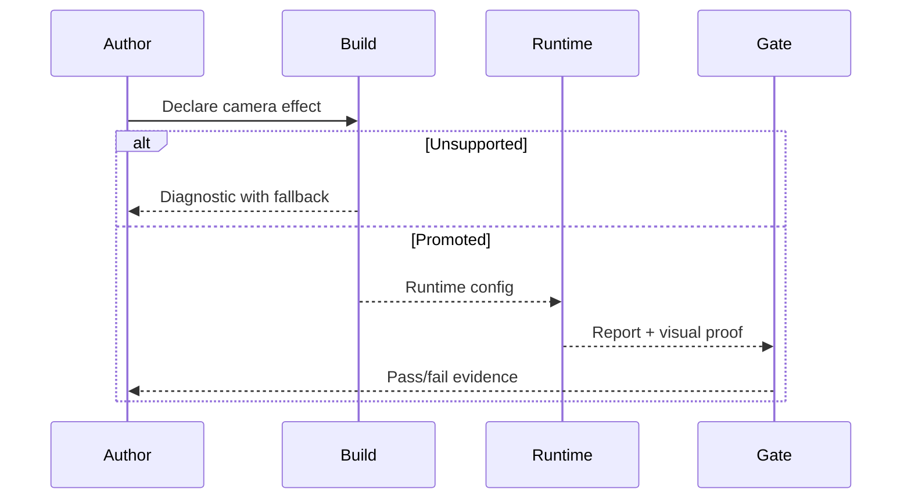

# PRD: Camera and Post-Processing Boundaries

Complexity: 7 -> HIGH mode

Score basis: +2 touches 6-10 future files, +2 adds renderer/camera capability
contracts, +2 requires visual evidence and fallback policy, +1 updates docs and
diagnostic catalog.

## 1. Context

**Problem:** Depth of field, auto exposure, motion blur, motion vectors, SSR,
mirrors, deferred rendering, volumetrics, and custom post-processing need clear
promotion bars or diagnostics before they can be represented as portable
features.

**Files Analyzed:**

- `docs/bevy-feature-parity.md`
- `docs/PRDs/done/advanced-visual-effects-lighting-material-depth.md`

**Completed Behavior:**

- Depth-of-field runtime config/report boundary exists, but visual blur
  calibration is deferred.
- Auto exposure, motion blur, SSR, mirrors, deferred rendering, volumetrics,
  and custom post passes are diagnostic boundaries with target/evidence
  metadata.
- The parity update defines the missing evidence: deterministic histogram
  policy, shutter/sample semantics, web fallbacks, performance budgets, and
  screenshot/video proof.

**How will this feature be reached?**

- [x] Entry point identified: camera/post-processing declarations, runtime
  config, target-profile validation, and visual verification.
- [x] Caller file identified: IR validators, compiler runtime config emit,
  web/Bevy renderer adapters, and focused verify tooling.
- [x] Registration/wiring needed: capability fields, diagnostic codes, fixture
  scenes, screenshot/video artifacts, and docs.

**Is this user-facing?**

- [x] YES. Authors see accepted camera effects or actionable unsupported-feature
  diagnostics.
- [ ] NO.

**Full user flow:**

1. User declares a camera or post-processing effect.
2. Build validates whether the effect is promoted for the target profile.
3. Runtime applies promoted effects or reports unsupported capability state.
4. Verification captures report, screenshot, or video evidence.

## 2. Solution

**Approach:**

- Keep effect declarations semantic rather than selecting Bevy render paths.
- Promote DOF visual blur only after deterministic calibration and mobile
  fallback policy exists.
- Keep SSR/mirrors/deferred rendering as material/reflection intent and
  diagnostic boundaries until forward/web fallbacks are proven.
- Keep custom post passes unsupported unless a finite portable effect catalog is
  introduced.

**Key Decisions:**

- [x] Library/framework choices: reuse existing runtime config/report plumbing.
- [x] Error-handling strategy: explicit target-profile diagnostics for missing
  prepass, fallback, or visual proof.
- [x] Reused utilities: visual calibration fixtures, screenshot capture, video
  proof, and diagnostic catalog checks.

**Data Changes:** Extend camera/post-processing capability reports. No database
migrations.

## 3. Sequence Flow

## 4. Execution Phases

#### Phase 1: Diagnostic Contract - Advanced effects fail clearly until portable semantics exist.

**Files (max 5):**

- `packages/ir/src/*` - post-processing validation
- `packages/compiler/src/*` - diagnostic surfacing
- `packages/runtime-web-three/src/*` - capability report
- `runtime-bevy/crates/threenative_runtime/src/*` - capability report
- `docs/bevy-feature-parity.md` - boundary row update

**Implementation:**

- [x] Add or tighten diagnostics for auto exposure, motion blur, SSR, mirrors,
  deferred rendering, volumetrics, and custom post passes.
- [x] Include required missing evidence in diagnostic metadata.
- [x] Avoid backend render-path names in public source contracts.

**Tests Required:**

| Test File | Test Name | Assertion |
| --- | --- | --- |
| `packages/ir/src/validate.test.ts` | `should reject unsupported advanced renderer requests with stable diagnostics` | Diagnostic includes effect id, target, fallback, and missing evidence. |
| `packages/compiler/src/emit/capabilities.test.ts` | `should not derive backend render path selections from runtime config` | Bundle capabilities omit Bevy/deferred/prepass render path fields. |

**Verification Plan:**

1. IR/compiler negative tests.
2. Runtime capability report tests.
3. `pnpm check:docs`.

**User Verification:**

- Action: build a fixture with unsupported effects.
- Expected: build fails or reports unsupported state with stable codes.

#### Phase 2: DOF Promotion Probe - Depth-of-field visual blur has calibrated proof or remains report-only.

**Files (max 5):**

- `packages/ir/src/*` - DOF validated fields
- `packages/runtime-web-three/src/*` - web DOF mapping/report
- `runtime-bevy/crates/threenative_runtime/src/*` - native DOF mapping/report
- `tools/verify/src/*` - visual blur gate
- `docs/STATUS.md` - status evidence

**Implementation:**

- [x] Define focal distance, aperture/intensity, fallback, and mobile budget
  semantics.
- [x] Do not capture or claim web/Bevy blur screenshots until a later visual
  calibration PRD defines comparable metrics.
- [x] Keep row report-only if visual thresholds are not stable.

**Tests Required:**

| Test File | Test Name | Assertion |
| --- | --- | --- |
| `packages/runtime-web-three/src/dof.test.ts` | `should report applied depth of field settings` | Web report matches runtime config. |
| `runtime-bevy/crates/threenative_runtime/tests/dof.rs` | `should report applied depth of field settings` | Native report matches runtime config. |
| `tools/verify/src/dof.test.ts` | `should fail when blur proof is missing` | Gate reports missing screenshot metric. |

**Verification Plan:**

1. Runtime report tests.
2. Focused DOF screenshot gate.
3. `pnpm verify:conformance`.

**User Verification:**

- Action: inspect the DOF contact sheet.
- Expected: hero-object focus is visible or the feature remains explicitly
  report-only.

## 5. Acceptance Criteria

- [x] Unsupported advanced effects have stable diagnostics and target-profile
  metadata.
- [x] DOF is promoted visually only with web/Bevy screenshot proof.
- [x] Public source expresses visual intent, not Bevy render-path controls.
