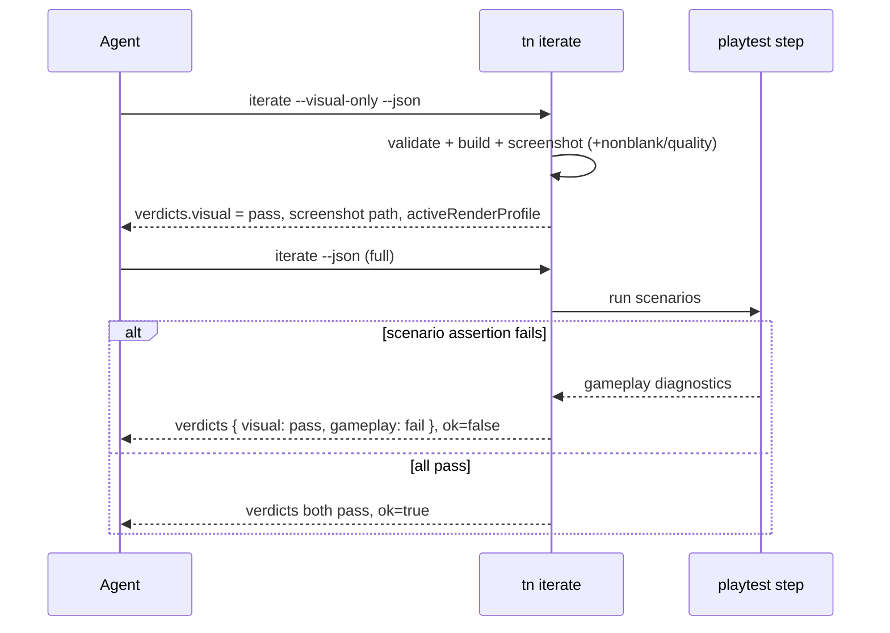

# PRD-002: Playtest Loop Trust And Visual Proof

`Planning Mode: Principal Architect`
`Complexity: 2 (6-10 files) + 2 (multi-stage pipeline state) + 1 (native
integration) = 5 -> MEDIUM mode`

Source evidence: `docs/PRDs/done/chess-trial-remediation-2026-07-12/AUTHORING-TRIAL-CHESS-CODEX-2026-07-12.md`
(finding C8 plus the playtest-adjacent smaller items). Companion to
`PRD-001-authoring-friction-fixes.md` in this bundle.

## 1. Context

**Problem:** The playtest/iterate loop is the engine's strongest agent
surface, but the chess trial showed agents learning to *distrust* it: every
visual-polish iterate was red for reasons unrelated to the task, artifacts
lied about a contact sheet, discovery scored a deleted entity, scenario
suggestions were template-generic, desktop proof was impossible headless,
and playtests passed while the board was visually broken.

**Files analyzed (exploration evidence):**

- `packages/cli/src/commands/iterate.ts` (run orchestration 72-108; status
  at 94; playtest loop 141-171; report code 185; flags; ~495 lines)
- `packages/cli/src/commands/playtest.ts` (web runner 519-528, native
  runner 530-648, pass at 1205/642, screenshots 1106/1139)
- `packages/cli/src/commands/playtestAssertions.ts` (assertion registry
  20-144; stagnation 504; HUD 206)
- `packages/cli/src/commands/playtestArtifacts.ts` (bundle 90-184; phantom
  `contactSheet` path declared at 103, never written)
- `packages/cli/src/commands/playtestDiscovery.ts` (entityScore 240-256;
  ranking 221-222; suggestPlaytestScenario 56-100)
- `packages/cli/src/native/bevy.ts` (runBevyRuntime 127-146; args 63-95; no
  headless support)
- `packages/cli/src/verify/imageAnalysis.ts` (analyzeNonblank 79-105;
  analyzeVisualQuality 107-162 — defined, unused by playtest)
- `packages/cli/src/verify/compareImages.ts` (IFrameComparison 24-31; frame
  hashing 72-77)
- Tests: `iterate.test.ts`, `playtest.test.ts`, `playtestAssertions.test.ts`,
  `playtestArtifacts.test.ts`

**Current behavior:**

- One verdict: any error-severity diagnostic anywhere flips
  `TN_ITERATE_FAILED` (iterate.ts:94/185). A stale scenario assertion makes
  every visual iteration red; agents read the screenshot and ignore `ok`.
- `playtestArtifacts.ts:103` declares `contactSheet:
  resolve(runDirectory, "contact-sheet.png")` in the summary, but nothing in
  the playtest path writes it (contact sheets belong to `verify/*` visual
  parity modules).
- Discovery reads `content/*.json` and scores by id keywords
  (+50 for `player`) without confirming the entity exists in the compiled
  bundle, so deleted starter entities still rank first.
- `suggestPlaytestScenario` fills one of three fixed templates with the
  top-ranked ids and hardcoded thresholds; it does not consult mechanics or
  prior passing scenarios.
- `--target desktop` spawns Bevy/winit with no headless option; on hosts
  without `DISPLAY`/`WAYLAND_DISPLAY` it is `TN_PLAYTEST_NATIVE_CRASH`, yet
  desktop reruns are a release-gate requirement.
- The only pixel-level check is `analyzeNonblank`; a scene where most board
  entities disappear still passes movement/resource/HUD assertions.

## 2. Solution

**Approach:**

- Split iterate's verdict so visual work has a trustworthy gate (build +
  screenshot health) that stale gameplay scenarios cannot poison, without
  weakening the full gate for release claims.
- Make artifact summaries honest (no advertised-but-absent paths).
- Ground discovery and suggestions in the compiled bundle instead of raw
  content files.
- Add the two cheapest high-value visual assertions (frame-diff and
  entity-visibility), reusing the existing `verify/` image infrastructure.
- Give desktop proof a headless path (or an explicit, machine-readable
  waiver) so the release gate is satisfiable in CI.

**Key decisions:**

- [ ] Split verdict is additive: `TN_ITERATE_OK/FAILED` semantics are
  unchanged by default; a new `verdicts: { visual, gameplay }` object plus a
  `--visual-only` flag serve the polish loop. No breaking change for
  existing gates or drift tests.
- [ ] Visibility assertions reuse `analyzeVisualQuality`/`compareImages`
  from `packages/cli/src/verify/` rather than new image code (DRY).
- [ ] Headless native lands behind an explicit `--headless` flag plumbed to
  the runtime binary; if the Bevy runtime cannot support offscreen render
  on a host, the command emits a structured
  `TN_PLAYTEST_NATIVE_HEADLESS_UNSUPPORTED` waiver diagnostic that release
  tooling can consume — replacing today's raw winit crash.
- [ ] No new hand-maintained lists: new diagnostics register in the existing
  diagnostics module; new flags register wherever iterate/playtest argv is
  descriptor-owned.

**Data changes:** additive fields on the iterate report and playtest
scenario schema (`assertions.visual`); no migrations.

**Integration points:** all changes extend `tn iterate` / `tn playtest`,
already the front door for agents (starter `pnpm run iterate` wiring).
Entry points: existing CLI dispatch. User flow: agent edits content -> runs
`tn iterate --visual-only --json` -> gets a green visual verdict plus
screenshot while a stale gameplay scenario stays quarantined in the
`gameplay` verdict.

### Sequence (split verdict)



## 3. Execution Phases

#### Phase 1: Split iterate verdict + `--visual-only` (C8) - polish loops get a gate they can trust

**Files (max 5):**

- `packages/cli/src/commands/iterate.ts` - classify step diagnostics into
  `visual` (validate, build, screenshot, browser page/network errors) and
  `gameplay` (playtest assertion) buckets at the status computation
  (line 94); emit `verdicts: { visual: "pass"|"fail", gameplay:
  "pass"|"fail"|"skipped" }` in the report; add `--visual-only` flag that
  skips the playtest loop (141-171) and marks `gameplay: "skipped"` with
  info diagnostic `TN_ITERATE_GAMEPLAY_SKIPPED_VISUAL_ONLY`; run the unused
  `analyzeVisualQuality` (imageAnalysis.ts:107-162) on the screenshot in
  addition to nonblank so "technically nonblank but flat/garbage" frames
  fail the visual verdict.
- `packages/authoring/src/iterateReport.ts` - add the `verdicts` field to
  `IIterateReport`.
- `packages/cli/src/commands/iterate.test.ts` - cases below.
- Iterate flag descriptor/registry (wherever `--skip-playtest` is owned) -
  register `--visual-only`.

**Implementation:**

- [ ] `ok`/`TN_ITERATE_FAILED` behavior unchanged in full mode.
- [ ] `--visual-only` never runs scenarios; wall time target < 15s.
- [ ] Human output prints both verdicts on one line.

**Tests Required:**
| Test File | Test Name | Assertion |
|-----------|-----------|-----------|
| `iterate.test.ts` | `should pass visual verdict while gameplay scenario fails` | `verdicts.visual === "pass"`, `verdicts.gameplay === "fail"`, `ok === false` |
| `iterate.test.ts` | `should skip scenarios under --visual-only` | playtest step not invoked, `gameplay === "skipped"` |
| `iterate.test.ts` | `should fail visual verdict on flat low-quality screenshot` | quality analysis flips visual to fail |
| `iterate.test.ts` | `should keep legacy ok semantics in full mode` | existing tests unchanged |

**Verification plan:** `pnpm --filter @threenative/cli test`; live proof in
`examples/chess` (its opening scenario currently has the stale stagnation
assertion — the exact trial condition): `node bin/tn iterate --project
examples/chess --visual-only --json` must return a green visual verdict.

Checkpoint: spawn `prd-work-reviewer` for phase 1.

#### Phase 2: Honest artifacts - no phantom contactSheet (trial "smaller item")

**Files (max 5):**

- `packages/cli/src/commands/playtestArtifacts.ts` - line 103: only include
  `contactSheet` in the bundle when the file exists at write time;
  additionally add a bundle-wide guard that drops any declared artifact
  path that does not exist on disk and records it under a
  `missingArtifacts` field instead of advertising it.
- `packages/cli/src/commands/playtestArtifacts.test.ts` - cases below.

**Tests Required:**
| Test File | Test Name | Assertion |
|-----------|-----------|-----------|
| `playtestArtifacts.test.ts` | `should omit contact sheet path when file absent` | summary has no `contactSheet` key |
| `playtestArtifacts.test.ts` | `should list dropped paths under missingArtifacts` | declared-but-absent path reported |
| `playtestArtifacts.test.ts` | `should keep contact sheet path when file exists` | present when written by verify flows |

**Verification plan:** package tests; run the chess opening playtest and
`test -f` every path the summary advertises (script the loop in the
checkpoint note).

Checkpoint: `prd-work-reviewer` phase 2.

#### Phase 3: Discovery grounded in the bundle (trial "smaller item") - deleted entities stop winning

**Files (max 5):**

- `packages/cli/src/commands/playtestDiscovery.ts` - after candidate
  collection (28-54), load the compiled bundle (build if
  `dist/` bundle is stale/absent, reusing the build command like iterate
  does) and drop candidates whose ids are not present; if the bundle cannot
  be produced, mark candidates `unverified: true` instead of silently
  keeping them; apply the same grounding to `inputs`, `cameras`,
  `resources`, and `hud` lists used by suggestions.
- `packages/cli/src/commands/playtestDiscovery.test.ts` (extend or create) -
  cases below.

**Tests Required:**
| Test File | Test Name | Assertion |
|-----------|-----------|-----------|
| `playtestDiscovery.test.ts` | `should drop candidates missing from compiled bundle` | deleted `player` absent from results |
| `playtestDiscovery.test.ts` | `should mark candidates unverified when bundle unavailable` | `unverified: true`, none dropped |
| `playtestDiscovery.test.ts` | `should keep live entities ranked by score` | ranking preserved for surviving candidates |

**Verification plan:** package tests; in `examples/chess` run `node bin/tn
playtest --project . --discover --json` — top candidate must be a real
chess entity, not `player`.

Checkpoint: `prd-work-reviewer` phase 3.

#### Phase 4: Game-aware scenario suggestions (trial C9-adjacent) - suggestions beat the generic template or say so

**Files (max 5):**

- `packages/cli/src/commands/playtestDiscovery.ts` -
  `suggestPlaytestScenario` (56-100): (a) skip presets whose required
  surfaces are missing (no camera -> no camera-follow; no changing
  resource -> no hud-resource) instead of emitting them with fallback ids;
  (b) mine committed `playtests/*.playtest.json` in the project for
  threshold/shape reuse (same subject or same input -> reuse its assertion
  thresholds); (c) when discovery yields no verified controllable entity,
  return a structured `TN_PLAYTEST_SUGGEST_INSUFFICIENT` diagnostic naming
  what is missing instead of a `player`/`KeyD` template.
- `packages/cli/src/commands/playtestDiscovery.test.ts` - cases below.

**Tests Required:**
| Test File | Test Name | Assertion |
|-----------|-----------|-----------|
| `playtestDiscovery.test.ts` | `should not suggest camera preset without a camera` | camera-follow absent |
| `playtestDiscovery.test.ts` | `should reuse thresholds from committed scenarios for same subject` | suggested minDistance matches committed value |
| `playtestDiscovery.test.ts` | `should return insufficient diagnostic instead of player template` | `TN_PLAYTEST_SUGGEST_INSUFFICIENT`, no `"player"` fallback |

**Verification plan:** package tests; `--suggest-scenario chess-opening` in
`examples/chess` must produce a scenario referencing real chess ids or the
insufficient diagnostic — never `player`/`KeyD`.

Checkpoint: `prd-work-reviewer` phase 4.

#### Phase 5: Visual assertions (trial C1-adjacent gap) - "the board disappeared" fails a playtest

**Files (max 5):**

- `packages/cli/src/commands/playtestAssertions.ts` - register assertion
  kind `visual` in the registry (20-144): `{ frameDiff?: {
  minChangedPixelRatio?, maxChangedPixelRatio? }, region?: { x, y, width,
  height, minNonblankPixelRatio? }, entityVisible?: { entity,
  minProjectedPixels, throughoutFrames? } }`. `frameDiff` compares
  before/after screenshots via `compareImages.ts`; `region` runs
  `analyzeNonblank` on a sub-frame; `entityVisible` extends the existing
  `visibility` sampling (kind at 104-111) to assert projected pixels do not
  drop below the floor mid-scenario (the disappearing-board class).
- `packages/cli/src/commands/playtest.ts` - capture the per-frame samples
  the new assertions need (before/after frames already exist at 1106/1139;
  visibility sampling already exists — extend to time series).
- `packages/cli/src/commands/playtestSchema.test.ts` +
  `playtestAssertions.test.ts` - cases below.
- Scenario schema/doc surface (wherever `.playtest.json` schema is owned) -
  add the `visual` assertion block.

**Implementation:**

- [ ] New diagnostics: `TN_PLAYTEST_FRAME_DIFF_FAILED`,
  `TN_PLAYTEST_REGION_BLANK`, `TN_PLAYTEST_ENTITY_VISIBILITY_DROPPED`.
- [ ] Web target first; native emits the standard unsupported diagnostic
  until the native screenshot series exists.

**Tests Required:**
| Test File | Test Name | Assertion |
|-----------|-----------|-----------|
| `playtestAssertions.test.ts` | `should fail frame diff when nothing changed` | `changedPixelRatio` below floor -> diagnostic |
| `playtestAssertions.test.ts` | `should fail when entity projected pixels drop mid-scenario` | visibility series dip -> `TN_PLAYTEST_ENTITY_VISIBILITY_DROPPED` |
| `playtestAssertions.test.ts` | `should pass region check on populated region` | board region nonblank passes |
| `playtestSchema.test.ts` | `should accept visual assertion block in scenario schema` | schema validation passes |

**Verification plan:** package tests + `pnpm verify:conformance`; then add
an `entityVisible` assertion for one board square to
`examples/chess/playtests/chess-opening.playtest.json` and confirm it
passes live (and fails when the square's renderer is hidden in a scratch
copy — negative control, per the evidence-ratchet precedent).

Checkpoint: `prd-work-reviewer` phase 5 (+ manual screenshot review).

#### Phase 6: Headless desktop proof (trial "smaller item") - the release gate is satisfiable in CI

**Files (max 5):**

- `packages/cli/src/native/bevy.ts` - add `headless` to
  `IBevyRuntimeInvocation`; in `bevyRuntimeArgs()` (63-95) pass
  `--headless` to the runtime binary; detect missing
  `DISPLAY`/`WAYLAND_DISPLAY` up front and either auto-enable headless (when
  the binary supports it) or fail fast with
  `TN_PLAYTEST_NATIVE_HEADLESS_UNSUPPORTED` (structured waiver) instead of
  surfacing the raw winit panic.
- `packages/cli/dist/runtime-bevy/crates/threenative_runtime/` (native
  runtime source) - accept `--headless` and run the proof harness with
  offscreen rendering (`bevy_render` headless path) writing the same
  screenshot/observation artifacts. If offscreen parity is not achievable in
  this slice, land the flag + waiver diagnostic only and record the gap in
  the native capability doc (freeze-gate rules apply).
- `packages/cli/src/commands/playtest.ts` - map the waiver diagnostic into
  the report as `severity: "warning"` with `gate: "waived-headless"` so
  release tooling distinguishes "cannot run here" from "failed".
- `packages/cli/src/native/bevy.test.ts` (or nearest) - cases below.
- `docs/status/capabilities/<native capability doc>.md` + `docs/STATUS.md`
  index line.

**Tests Required:**
| Test File | Test Name | Assertion |
|-----------|-----------|-----------|
| `bevy.test.ts` | `should pass headless flag to runtime argv` | argv contains `--headless` |
| `bevy.test.ts` | `should emit structured waiver instead of winit crash without display` | `TN_PLAYTEST_NATIVE_HEADLESS_UNSUPPORTED`, no raw panic in stdout |
| `playtest.test.ts` | `should report waived-headless gate as warning` | severity warning, gate field set |

**Verification plan:** package tests; on this (headless) host run the
chess desktop scenario — must produce either artifacts or the structured
waiver, never `TN_PLAYTEST_NATIVE_CRASH` with a winit backtrace. Manual
checkpoint: if offscreen render lands, eyeball the native screenshot.

Checkpoint: `prd-work-reviewer` phase 6 (+ manual if offscreen lands).

#### Phase 7 (optional, capacity-gated): Iterate latency

Parallelize the serial scenario loop (iterate.ts 141-171 / playtest queue
330-354) when scenarios target web and are independent; measure before
committing — only land if it cuts multi-scenario iterate wall time >= 30%
without flaking the preview server (the orb-reactor trial showed port-5173
contention is a real hazard). Files: `iterate.ts`, `playtest.ts`, tests.
Skip freely if contention risk dominates.

## 4. Verification Strategy (whole PRD)

```bash
pnpm --filter @threenative/cli test
pnpm typecheck
pnpm test
pnpm verify:conformance   # phases 1, 5
pnpm verify:smoke         # flag/schema surfaces
pnpm check:docs           # phase 6 capability doc
```

Live evidence to record after landing: the chess `--visual-only` run
(green visual verdict over the stale scenario), the artifact-path existence
sweep, the discover/suggest outputs from `examples/chess`, the
entity-visibility negative control, and the headless desktop run output.

## 5. Acceptance Criteria

- [ ] `tn iterate --visual-only` returns a trustworthy green on
  `examples/chess` while its stale gameplay scenario still fails the full
  gate — the exact trial condition, fixed.
- [ ] Every artifact path a playtest summary advertises exists on disk.
- [ ] `--discover` never surfaces entities absent from the compiled bundle;
  `--suggest-scenario` never emits `player`/`KeyD` fallbacks.
- [ ] A scenario can assert an entity stays visible; the negative control
  fails it.
- [ ] Headless hosts get artifacts or a structured waiver, never a winit
  panic; release tooling can distinguish the two.
- [ ] Legacy `TN_ITERATE_OK/FAILED` and existing scenario schemas remain
  backward-compatible; existing tests untouched or extended, not weakened.
- [ ] All `prd-work-reviewer` checkpoints reported PASS.
