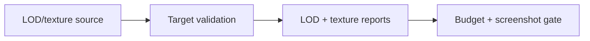
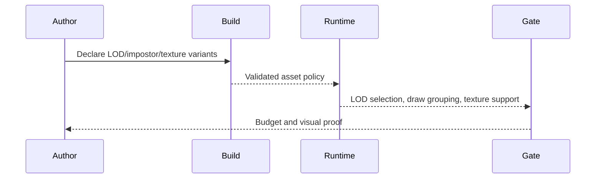

# PRD: Dense Scene LOD and Texture Delivery

Complexity: 8 -> HIGH mode

Score basis: +2 touches 6-10 future files, +2 spans assets/rendering/runtime
reports, +2 requires target-profile/device diagnostics, +1 affects CLI
inspection, +1 updates docs and release evidence.

## 1. Context

**Problem:** Dense scenes need better affordability through LOD, impostors,
instancing reports, and texture delivery diagnostics before large authored
worlds can be considered production-ready.

**Files Analyzed:**

- `docs/bevy-feature-parity.md`
- `docs/PRDs/done/advanced-visual-effects-lighting-material-depth.md`

**Completed Behavior:**

- Source asset LOD metadata, fixed LOD-selection traces, camera-facing quad
  impostor metadata, renderer-level native instancing, texture variant fallback
  reports, and compressed skybox/environment diagnostics exist.
- Arbitrary user-authored instance buffers and custom GPU attributes are
  diagnostic boundaries.
- The parity file now calls out billboard impostors and per-target compressed
  texture fallback policy as missing dense-scene polish.

**How will this feature be reached?**

- [x] Entry point identified: asset/source LOD metadata, target profiles,
  runtime render reports, `tn asset inspect`, and visual/performance gates.
- [x] Caller file identified: asset manifest emitters, renderer adapters,
  target-profile validators, and verify tooling.
- [x] Registration/wiring needed: impostor schema, texture fallback reports,
  draw-grouping metrics, fixtures, docs/status updates.

**Is this user-facing?**

- [x] YES. Authors see denser scenes stay readable and receive target-specific
  texture diagnostics.
- [ ] NO.

**Full user flow:**

1. User declares dense prop sets, LOD ranges, impostors, or texture variants.
2. Build validates target-profile compatibility and fallback choices.
3. Runtime reports selected LODs, draw groups, and texture support.
4. Verification checks screenshots and budget reports.

## 2. Solution

**Approach:**

- Promote camera-facing quad impostors with distance/fade thresholds and
  selection/facing proof.
- Promote repeated static model/material batching with bounded transform/color
  reports only.
- Separate accepted texture source formats from per-target runtime support.
- Require fallback texture selection and device diagnostics before enabling
  optional compressed formats.

**Key Decisions:**

- [x] Library/framework choices: reuse existing asset LOD, target-profile, and
  renderer report plumbing.
- [x] Error-handling strategy: unsupported texture formats and custom instance
  attributes emit target-profile diagnostics.
- [x] Reused utilities: asset inspection, visual quality sidecars, performance
  budgets, and conformance fixtures.

**Data Changes:** Extend LOD/impostor and texture fallback metadata. No database
migrations.

## 3. Sequence Flow

## 4. Execution Phases

#### Phase 1: Billboard Impostors - Distant content remains readable with bounded metadata.

**Files (max 5):**

- `packages/ir/src/*` - impostor schema and validation
- `packages/compiler/src/*` - asset LOD emit
- `packages/runtime-web-three/src/*` - web facing/fade report
- `runtime-bevy/crates/threenative_runtime/src/*` - native facing/fade report
- `tools/verify/src/*` - impostor proof gate

**Implementation:**

- [x] Add camera-facing quad impostor metadata with distance and fade ranges.
- [x] Validate material constraints and selection behavior.
- [x] Prove web/Bevy facing and selection reports.

**Tests Required:**

| Test File | Test Name | Assertion |
| --- | --- | --- |
| `packages/ir/src/environment.test.ts` | `environment should reject invalid LOD impostor metadata` | Diagnostic names impostor mode/material paths. |
| `packages/runtime-web-three/src/conformance.test.ts` / `runtime-bevy/crates/threenative_runtime/tests/conformance.rs` | `should report V9 environment lighting, light budgets, and renderer quality observations` | Reports matching selected impostor metadata. |

**Verification Plan:**

1. IR validation tests.
2. Runtime report tests.
3. Screenshot proof for a dense fixture.

**User Verification:**

- Action: inspect dense-scene screenshots at near and far camera distances.
- Expected: distant props switch to readable impostors without popping outside
  declared fade tolerances.

#### Phase 2: Texture Delivery - Target profiles choose supported texture variants.

**Files (max 5):**

- `packages/ir/src/*` - texture variant schema
- `packages/compiler/src/*` - asset manifest fallback selection
- `packages/cli/src/*` - asset inspection diagnostics
- `packages/runtime-web-three/src/*` - web texture support report
- `runtime-bevy/crates/threenative_runtime/src/*` - native texture support report

**Implementation:**

- [x] Treat WebP/JPEG baseline separately from optional KTX2/DDS/Basis/BC/ETC2
  and ASTC support.
- [x] Add fallback texture selection diagnostics per target profile.
- [x] Report environment-map/HDR texture support without silently dropping
  unsupported formats.

**Tests Required:**

| Test File | Test Name | Assertion |
| --- | --- | --- |
| `packages/ir/src/assets.test.ts` | `assets should reject unsupported target texture variants with fallback metadata` | Diagnostics include target support and fallback. |
| `packages/runtime-web-three/src/assets.test.ts` / `runtime-bevy/crates/threenative_runtime/tests/assets.rs` | `asset load trace should sort assets and model scene refs deterministically` | Trace reports selected fallback texture and optional variants. |

**Verification Plan:**

1. Compiler fallback tests.
2. CLI asset inspection tests.
3. Web/native texture support reports.
4. `pnpm verify:conformance`.

**User Verification:**

- Action: build a fixture with baseline and compressed texture variants.
- Expected: each target reports selected texture and unsupported variants.

## 5. Acceptance Criteria

- [x] Impostor LOD metadata has validation and runtime reports; screenshot
  proof remains a later visual calibration gate.
- [x] Texture variants are target-profile aware and have deterministic fallback
  selection.
- [x] Custom GPU instance attributes and arbitrary buffers remain diagnostic-only
  until separately promoted.
