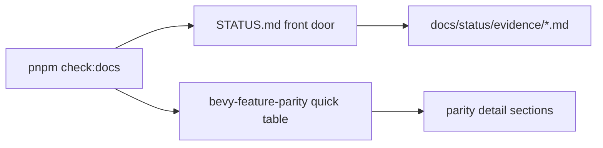
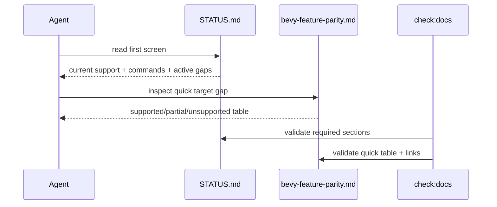

# PRD: Docs Front Door Compaction

Status: superseded and closed by
[Meta-Layer Compression](../agent-ergonomics-2026-07-05/PRD-005-meta-layer-compression.md).

Delivered by the superseding PRD:

- `docs/STATUS.md` is now a <=250-line capability index.
- Prior STATUS evidence prose is preserved under
  `docs/status/capabilities/full-status-archive.md`.
- Capability docs under `docs/status/capabilities/*.md` are linked from the
  STATUS index and enforced by `pnpm check:docs`.
- Active PRD links were updated to point at completed PRD-004 and this
  superseded PRD.

Not delivered here:

- `docs/bevy-feature-parity.md` was not restructured into a new quick table;
  PRD-005 scoped it to link-only updates because parity evidence is already
  separately structured.
- Roadmap/PRD sequencing was not expanded beyond the active PRD index updates.

`Planning Mode: Principal Architect`
`Complexity: 5 -> MEDIUM mode`

Score basis: +2 touches 6-10 docs/tooling files, +2 docs-status contract
reorganization with validation behavior, +1 user-facing contributor workflow.

## 1. Context

**Problem:** Roadmap continuous work calls out dense front doors as an
agent-DX bug: `docs/STATUS.md` and `docs/bevy-feature-parity.md` contain
valuable evidence, but their size makes it hard for agents to answer "what is
current and what do I run?" quickly.

**Files Analyzed:**

- `docs/status/ROADMAP.md`
- `docs/audits/FOUNDATIONAL_BOTTLENECK_AUDIT_2026-07-05.md`
- `docs/STATUS.md`
- `docs/bevy-feature-parity.md`
- `docs/PRDs/README.md`
- `docs/status/README.md`
- `tools/verify/src/cli/check-docs.ts`
- `package.json`

**Current Behavior:**

- `docs/STATUS.md` is nearly 3k lines and mixes current support, historical
  evidence, and proof command details.
- `docs/bevy-feature-parity.md` is over 1k lines with dense evidence anchors.
- `docs/PRDs/README.md` is the backlog index, but roadmap sequencing is not
  directly reflected in a compact first-screen view.
- `pnpm check:docs` validates consistency, but not front-door density or
  required current-command sections.

## Pre-Planning Findings

**How will this feature be reached?**

- [x] Entry point identified: contributors open `docs/STATUS.md`,
  `docs/bevy-feature-parity.md`, and `docs/PRDs/README.md`; CI runs
  `pnpm check:docs`.
- [x] Caller file identified: `tools/verify/src/cli/check-docs.ts`.
- [x] Registration/wiring needed: docs index links and docs check rules.

**Is this user-facing?**

- [x] YES. This affects contributor and agent navigation.
- [ ] NO.

**Full user flow:**

1. Agent opens `docs/STATUS.md`.
2. First screen states current supported capabilities and commands.
3. Historical evidence links out to appendices/audits instead of dominating
   the front door.
4. `pnpm check:docs` fails if required front-door sections are missing.

## 2. Solution

**Approach:**

- Split status docs into a compact front door plus appendices:
  current support matrix, current proof commands, known active gaps, and
  evidence archive links.
- Add a parity quick table above detailed parity notes.
- Add docs check assertions for required headings, maximum front-door density,
  and valid archive links.
- Keep existing historical evidence by moving it, not deleting it.

**Key Decisions:**

- [x] Historical evidence is preserved in appendices or audit files.
- [x] `STATUS.md` remains the front door for "what works today."
- [x] Roadmap remains strategic and does not duplicate current support rows.
- [x] Docs checks enforce structure, not editorial style.

**Data Changes:** Documentation-only. No runtime or IR data changes.

## 3. Sequence Flow

## 4. Execution Phases

#### Phase 1: Status Front Door Shape - Current support and commands fit first.

**Files (max 5):**

- `docs/STATUS.md` - compact current support front door.
- `docs/status/evidence/README.md` - evidence archive index.
- `docs/status/evidence/release-history.md` - moved historical evidence.
- `tools/verify/src/cli/check-docs.ts` - required heading checks.
- `tools/verify/src/cli/check-docs.test.ts` - docs shape tests.

**Implementation:**

- [ ] Keep first screen to current support, top commands, active gaps, and
      links.
- [ ] Move historical phase evidence into evidence appendix files.
- [ ] Preserve anchors or add redirect links for common references.

**Tests Required:**

| Test File | Test Name | Assertion |
|-----------|-----------|-----------|
| `tools/verify/src/cli/check-docs.test.ts` | `should require STATUS current commands section` | missing heading fails |
| docs check | `pnpm check:docs` | moved links resolve |

**User Verification:**

- Action: open `docs/STATUS.md`.
- Expected: current commands and active gaps are visible without scanning
  historical release notes.

#### Phase 2: Parity Quick Table - Runtime gaps are scannable before evidence details.

**Files (max 5):**

- `docs/bevy-feature-parity.md` - add/refresh quick table.
- `docs/status/evidence/bevy-parity-history.md` - archive dense evidence rows.
- `tools/verify/src/cli/check-docs.ts` - require table headings.
- `tools/verify/src/cli/check-docs.test.ts` - parity front-door tests.

**Implementation:**

- [ ] Add a compact Supported/Partial/Unsupported table for promoted
      capabilities.
- [ ] Move older evidence anchors into an archive section when they are not
      needed for first-screen decisions.
- [ ] Keep exact commands for current gaps.

**Tests Required:**

| Test File | Test Name | Assertion |
|-----------|-----------|-----------|
| check-docs tests | `should require parity quick table` | missing table fails |

**User Verification:**

- Action: search for a capability like `playtest`.
- Expected: first hit gives target status and current proof command.

#### Phase 3: Roadmap/PRD Backlog Alignment - Active backlog mirrors roadmap sequence.

**Files (max 5):**

- `docs/PRDs/README.md` - add roadmap sequence grouping.
- `docs/status/ROADMAP.md` - link active PRDs per phase.
- `tools/verify/src/cli/check-docs.ts` - verify active PRD links.
- `tools/verify/src/cli/check-docs.test.ts` - missing active PRD link fails.

**Implementation:**

- [ ] Add a compact "Roadmap phase -> active PRDs" map.
- [ ] Keep active PRDs under `docs/PRDs/other/` and completed PRDs under
      `done/`.
- [ ] Do not duplicate PRD summaries across roadmap and index.

**Tests Required:**

| Test File | Test Name | Assertion |
|-----------|-----------|-----------|
| check-docs tests | `should require roadmap active PRD links to resolve` | broken link fails |

**User Verification:**

- Action: read `docs/PRDs/README.md`.
- Expected: roadmap phases point to the correct active PRD set.

## 5. Verification Strategy

- `pnpm check:docs`
- `pnpm --filter @threenative/verify-tools test -- --run check-docs`
- `pnpm check:names`

## 6. Acceptance Criteria

- [ ] `docs/STATUS.md` first screen answers current support, proof commands,
      and active gaps.
- [ ] `docs/bevy-feature-parity.md` starts with a compact target-status table.
- [ ] Historical evidence remains linked from appendices.
- [ ] `docs/PRDs/README.md` maps roadmap phases to active PRDs.
- [ ] `pnpm check:docs` enforces required front-door headings and links.
