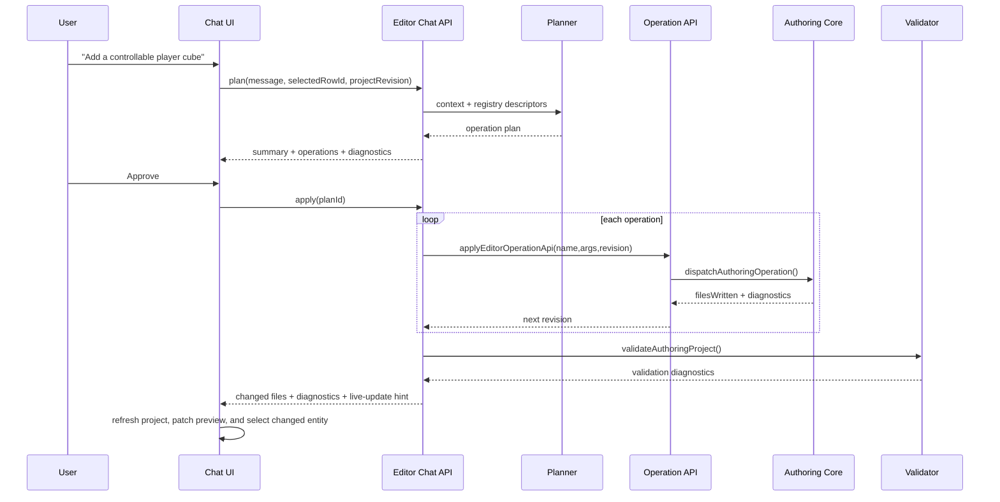

# PRD: Editor AI Chat ECS Control

Complexity: 12 -> HIGH mode

Score basis: +3 touches 10+ future files, +2 adds editor chat/orchestration
module, +2 complex state and permission workflow, +2 spans editor/authoring/
MCP/CLI/verify/docs, +1 user-facing UI, +1 local tool/security boundary, +1
verification gate and evidence.

## 1. Context

**Problem:** The editor has an AI chat rail, but the chat cannot currently plan
or execute source-backed ECS changes; users still need to use inspector controls
or CLI/MCP commands directly.

**Goal:** Make the in-editor AI chat a controlled authoring surface that can
inspect the current structured project, propose source-backed ECS operation
plans, request approval, apply approved operations through the existing
authoring registry, validate/rebuild, update the live editor scene while the
user edits, and report exact files/diagnostics/evidence.

**Non-goals:**

- Do not let the chat edit generated bundle files, runtime handles, or Bevy
  internals directly.
- Do not directly patch emitted ECS/IR JSON under any circumstance. This is a
  correctness and safety boundary, not an implementation preference.
- Do not make MCP the canonical mutation implementation.
- Do not expose broad shell, filesystem, network, or arbitrary CLI execution to
  the chat.
- Do not let an LLM write arbitrary JSON patches around
  `@threenative/authoring` operations.
- Do not implement script-body code generation here; use the separate Editor
  Script Body Code Mode PRD for `src/scripts/**/*.ts` source editing.
- Do not require cloud AI providers for the local editor to open or for manual
  editor workflows to keep working.
- Do not treat Vite HMR as the scene-authoring live-update contract. Vite may
  reload editor code and static modules, but source scene/component edits need
  an editor-owned preview patch/reload path with diagnostics.

**Files analyzed:**

- `AGENTS.md`
- `packages/AGENTS.md`
- `docs/PRDs/README.md`
- `docs/contracts/authoring-mcp.md`
- `docs/contracts/editor-snapshot-source-bridge.md`
- `docs/PRDs/done/other/authoring-mcp-wrapper.md`
- `docs/PRDs/done/other/editor-source-path-and-operation-bridge.md`
- `docs/PRDs/done/other/functional-editor-operations-modals-and-inspector-completion.md`
- `docs/PRDs/other/complete-structured-authoring-parity.md`
- `docs/PRDs/other/editor-script-body-code-mode.md`
- `packages/editor/src/EditorApp.tsx`
- `packages/editor/src/state/editorStore.ts`
- `packages/editor/src/server/operationApi.ts`
- `packages/authoring/src/operationRegistry.ts`
- `packages/mcp-server/src/index.ts`
- `packages/cli/src/commands/editor.ts`
- `tools/verify/src/editorRequiredOperations.ts`

**Current behavior:**

- The editor exposes a right-side AI chat channel and a read-only chat textarea
  placeholder.
- Editor persistence already goes through `/api/operation`, which calls
  `dispatchAuthoringOperation()` or narrow editor-only operation shims.
- `@threenative/authoring` exports a shared operation registry for promoted
  scene, component, material, prefab, UI, input, system, environment, asset, and
  resource source mutations.
- MCP exists as an optional thin wrapper over CLI JSON behavior, with project
  root guardrails and generated-path rejection.
- The editor store already knows how to refresh project state, select rows,
  apply modal/inspector operations, and surface diagnostics/status.
- The editor runs under Vite during local development, so UI/source-code HMR is
  available for editor implementation changes, but Vite does not understand
  ThreeNative structured source semantics or validate/apply ECS operations.
- There is no chat session model, no operation-plan preview, no approval step,
  no local chat tool API, no source-document watcher/preview invalidation
  contract, and no verification gate proving chat-authored ECS changes persist
  to structured source and emitted IR.

## 2. Product Decision

The editor chat should not control the CLI through a broad internal MCP server
as its primary path. The right architecture is:

```txt
Editor AI chat UI
  -> local editor chat service
  -> operation-plan builder/validator
  -> existing editor /api/operation endpoint
  -> @threenative/authoring operation registry
  -> structured source documents
  -> project validation, build, preview refresh, proof
```

MCP remains useful as an adapter for external AI clients and for parity tests.
The in-editor chat may expose the same tool catalog shape as MCP, but it should
call the local editor service directly instead of spawning `tn` or accepting
arbitrary MCP tool calls from the browser.

This keeps the source-of-truth rule intact: structured source documents and
script modules are durable source; generated IR/bundles and runtime state are
inspectable outputs.

### What Gets Edited

The editor must not edit the emitted IR ECS files directly. Files such as
`world.ir.json`, `systems.ir.json`, `materials.ir.json`, and
`assets.manifest.json` are compiler output under the bundle directory. They are
read for inspection and proof only.

The write target is structured authoring source:

```txt
content/scenes/*.scene.json
content/prefabs/*.prefab.json
content/materials/*.materials.json
content/meshes/*.meshes.json
content/assets/*.assets.json
content/ui/*.ui.json
content/input/*.input.json
content/systems/*.systems.json
content/audio/*.audio.json
threenative.authoring.json
```

For example, a chat request to "add a physics cube" should become an approved
operation plan such as:

```txt
scene.add_prefab
scene.add_entity
scene.set_transform
scene.set_rigid_body
scene.set_collider
```

Those operations mutate the source scene/prefab documents through one of the
approved operation adapters:

- editor local API -> `@threenative/authoring`;
- CLI command -> `tn ... --json` -> `@threenative/authoring`;
- MCP tool -> CLI/core authoring operation -> `@threenative/authoring`.

The editor then validates the source project and runs the compiler/build path
to regenerate `world.ir.json`. The IR is evidence that the source lowered
correctly, not the thing the editor patched.

### Operation API Definition

In this PRD, "operation API" means the editor-local endpoint already represented
by `packages/editor/src/server/operationApi.ts` and wired in Vite as
`POST /api/operation`. It is not a new source model and it is not an IR patch
API.

The operation API accepts:

```json
{
  "name": "scene.set_transform",
  "args": {
    "sceneId": "arena",
    "entityId": "player",
    "position": [0, 1, 0]
  },
  "projectRevision": "rev:..."
}
```

It returns the same kind of authoring result used by the CLI/core:

```json
{
  "ok": true,
  "changed": true,
  "filesWritten": ["content/scenes/arena.scene.json"],
  "diagnostics": [],
  "projectRevision": "rev:..."
}
```

The implementation should be based on the same shared operation registry/core
that the CLI uses. It should not invent editor-only mutation semantics. The
preferred in-editor call path is direct core dispatch:

```txt
Editor UI/chat -> /api/operation -> @threenative/authoring -> source docs
```

The CLI path is:

```txt
tn scene set-transform --json -> @threenative/authoring -> source docs
```

So the editor operation API is "based on the CLI" in the important contract
sense: same operation names, same argument validation, same diagnostics, same
source writes, same post-write validation, and CLI parity tests. It should not
normally shell out to `tn` for every in-editor edit, because the editor also
needs local project revision state, approval state, live preview patching, and
selection refresh. If a future implementation chooses CLI delegation for some
operation, it must still preserve the same result shape and must not bypass the
core operation registry.

The editor does not need to call the CLI for the normal in-process write path,
but using CLI or MCP as adapter surfaces is valid when the goal is external
agent compatibility or command-line parity. The non-negotiable rule is that all
paths must converge on the shared operation registry/core. No path may bypass
that core to hand-edit emitted ECS/IR files.

### MCP Role

MCP should remain supported, but as an adapter boundary rather than the editor's
internal implementation boundary.

Use MCP when the caller is outside the editor process:

- Codex, Claude Desktop, Night Watch, or another external AI client wants to
  inspect or mutate a ThreeNative project.
- A user wants the same operation catalog exposed as tools rather than typing
  `tn ... --json`.
- Tests need to prove CLI/MCP/editor operation parity for shared authoring
  workflows.

Do not make the browser editor route its own chat through MCP by default:

- MCP is a transport/protocol boundary, not the source mutation model.
- The editor already has trusted local server APIs with project boot config,
  project revision state, selection state, diagnostics, preview state, and
  source-document refresh semantics.
- Calling MCP from the editor would likely mean either shelling through the CLI
  or adding a second local server hop, while still needing the same
  `@threenative/authoring` operation validation underneath.
- The editor needs UI-specific behavior that MCP should not own: approval
  tokens, pending plan state, optimistic selection, live viewport patching,
  preview-stale status, and modal/inspector integration.

The intended layering is:

```txt
External agent -> MCP -> CLI/core authoring operations -> source docs
Editor chat    -> editor local API -> core authoring operations -> source docs
CLI user       -> tn commands -> core authoring operations -> source docs
```

All three paths must converge on the same operation registry, diagnostics, path
guardrails, validation, and generated-IR proof. MCP is how external agents work
with ThreeNative. It is appropriate to expose chat-compatible tools through MCP
for agents, but MCP should still dispatch structured operations rather than
editing IR or becoming a parallel authoring engine.

Vite HMR should be used for editor application development only. Scene live
editing must be handled by the editor runtime path:

- operations initiated by inspector, gizmo, modal, or AI chat update the editor
  store immediately after source validation;
- the editor preview host receives a structured scene patch when the affected
  data can be hot-applied safely;
- when a change affects bundle-only artifacts, asset catalogs, scripts, or
  unsupported preview patch kinds, the editor marks the preview stale and
  triggers or asks for a rebuild/reload;
- external edits to `content/**`, `src/scripts/**`, and
  `threenative.authoring.json` are detected by an editor-owned watcher, then
  validated and routed through the same refresh/rebuild policy.

## 3. Integration Points

**How will this feature be reached?**

- [x] Entry point identified:
  - User opens the AI rail or Chat modal in `EditorApp`.
  - Chat submits an instruction such as "add a dynamic physics cube in front of
    the camera" or "turn the selected object into a controllable player".
  - Editor server exposes a local `/api/chat` or `/api/ai/plan` and
    `/api/ai/apply` surface for chat requests.
  - Approved plans execute existing `/api/operation`-compatible operations.
- [x] Caller file identified:
  - `packages/editor/src/EditorApp.tsx`
  - `packages/editor/src/state/editorStore.ts`
  - new editor chat components/state modules under `packages/editor/src`
  - new server chat API modules under `packages/editor/src/server`
  - `packages/editor/vite.config.ts` route wiring
  - `packages/editor/src/server/operationApi.ts`
  - `packages/authoring/src/operationRegistry.ts`
  - optional parity coverage in `packages/mcp-server/src/index.test.ts`
- [x] Registration/wiring needed:
  - Replace read-only chat placeholder with a functional chat panel.
  - Register guarded editor server chat routes.
  - Add a plan/result type exported from the editor package or local server
    module.
  - Reuse operation registry descriptors to build the chat tool catalog.
  - Add focused editor/package verification that exercises chat-generated ECS
    operations end to end.

**Is this user-facing?**

- [x] YES. The chat is a direct editor workflow for creating and changing ECS
  entities/components.
- [ ] NO.

**Full user flow:**

1. User opens a project with `tn editor dev --project <path>`.
2. User opens AI chat and asks for an ECS change.
3. Chat service reads the current editor project snapshot, selected row,
   operation registry descriptors, and diagnostics.
4. Chat returns a proposed operation plan with human-readable summary,
   exact operation names/args, affected files, risks, and validation status.
5. User approves the plan.
6. Editor applies operations through the existing operation API with project
   revision checks.
7. Editor validates the project, refreshes source inventory/hierarchy/
   inspector, and updates the live preview with a structured patch or marks the
   preview stale when a rebuild is required.
8. Chat shows changed files, diagnostics, build/proof status, and any remaining
   manual follow-up.

## 4. Solution

**Approach:**

- Add a local editor chat orchestration layer that transforms a user request
  into a bounded operation plan. The plan language is the existing
  `AuthoringOperationName` registry, not JSON patches or shell commands.
- Make chat planning inspectable and approval-based. No durable source write
  occurs until the user approves an explicit plan or a trusted automated test
  calls the apply endpoint.
- Reuse editor project state and operation descriptors so the chat can reason
  about selected entity, active scene, available assets/materials, supported
  components, and read-only gaps.
- Keep the operation API as the write path. Chat applies operations one by one,
  carries forward `projectRevision`, stops on the first failed operation, then
  refreshes and validates.
- Add a live-scene update contract shared by manual editor operations and AI
  chat operations. The chat feature should not be the only path that updates
  the viewport in real time.
- Provide a provider boundary for LLM integration, but include a deterministic
  local planner for tests and supported simple commands so the feature can be
  verified without network or API keys.
- Add an optional MCP parity adapter only where it helps external agents reuse
  the same catalog. Do not route the browser through MCP as the primary
  implementation.

```mermaid
flowchart LR
    User[Editor User] --> Chat[AI Chat Panel]
    Chat --> Store[Editor Zustand Store]
    Chat --> Api[/api/ai/plan + /api/ai/apply]
    Api --> Planner[Chat Planner]
    Planner --> Catalog[Authoring Operation Registry]
    Planner --> Project[Editor Project Snapshot]
    Api --> Operation[/api/operation compatible executor]
    Operation --> Authoring[@threenative/authoring]
    Authoring --> Source[content/** source docs]
    Source --> Validate[validateAuthoringProject]
    Validate --> Refresh[/api/project refresh]
    Refresh --> Live[Preview patch or stale/rebuild]
    Refresh --> Chat
```

**Key decisions:**

- [x] Library/framework choices: existing React editor, Zustand store,
  editor server APIs, `@threenative/authoring` operation registry, optional MCP
  wrapper tests, and `verify:editor-package`.
- [x] Error-handling strategy: every plan/apply response returns stable
  diagnostics with operation index, operation name, source path/file, project
  revision, and suggested user action.
- [x] Reused utilities: `dispatchAuthoringOperation()`,
  `applyEditorOperationApi()`, `validateAuthoringProject()`,
  editor project snapshots, operation descriptors, and MCP guardrail concepts.
- [x] Approval policy: planning is read-only; application requires explicit
  user approval in the UI unless invoked by a test-only deterministic harness.
- [x] Source boundary: chat can mutate only promoted structured source
  operations and, later, script files through the separate script-code-mode
  guarded route.
- [x] IR boundary: emitted IR ECS files are never edited directly; successful
  source mutations are validated and rebuilt to regenerate IR.
- [x] Live-edit boundary: Vite HMR is not the contract for game scene changes;
  scene preview updates are driven by validated authoring operation results,
  project refresh, and an explicit patch/reload decision.

**Data changes:**

- Add transient editor chat session state. No new durable project document is
  required for Phase 1.
- Optional later phase may add local `.threenative/editor-chat-history.json`
  or an ignored artifact report, but source documents remain the durable game
  state.

## 5. Sequence Flow



## 6. Execution Phases

#### Phase 1: Chat Plan Contract - The editor can produce a read-only ECS operation plan.

**Files (max 5):**

- `packages/editor/src/server/chatPlan.ts` - plan/result types, deterministic
  planner, registry descriptor filtering.
- `packages/editor/src/server/chatPlan.test.ts` - plan contract tests.
- `packages/editor/src/server/projectApi.ts` - expose any missing selected/
  active-scene context needed by the planner.
- `packages/editor/src/index.ts` - export server types only if needed.
- `docs/contracts/authoring-mcp.md` - clarify local editor chat adapter
  relationship if wording is stale.

**Implementation:**

- [ ] Define `IEditorChatPlan`, `IEditorChatOperationStep`,
  `IEditorChatDiagnostic`, and `IEditorChatContext`.
- [ ] Build the allowed tool catalog from `listAuthoringOperationDescriptors()`
  or equivalent registry exports.
- [ ] Include active scene, selected row/entity, scene objects, assets,
  inspector rows, diagnostics, and project revision in the planning context.
- [ ] Implement a deterministic local planner for at least:
  - add primitive entity;
  - set transform on selected entity;
  - attach `RigidBody` and `Collider`;
  - set `Visibility`;
  - add a tag.
- [ ] Return unsupported-intent diagnostics rather than free-form mutation.

**Tests Required:**

| Test File | Test Name | Assertion |
|-----------|-----------|-----------|
| `packages/editor/src/server/chatPlan.test.ts` | `should plan an add-entity ECS change from chat context` | plan uses registered `scene.add_prefab`, `scene.add_entity`, and `scene.set_transform` operations |
| `packages/editor/src/server/chatPlan.test.ts` | `should reject unsupported chat intents without source writes` | response has diagnostics and no operation steps |
| `packages/editor/src/server/chatPlan.test.ts` | `should include selected entity context in transform plans` | selected row resolves to scene/entity operation args |

**User Verification:**

- Action: open chat and ask for a supported simple ECS change.
- Expected: chat shows a proposed plan with exact operations and no source file
  changes yet.

#### Phase 2: Server Chat API and Approval Apply - Approved plans mutate source through existing operations.

**Files (max 5):**

- `packages/editor/src/server/chatApi.ts` - `/api/ai/plan` and
  `/api/ai/apply` handlers.
- `packages/editor/src/server/chatApi.test.ts` - apply, validation, guardrail
  tests.
- `packages/editor/src/server/operationApi.ts` - share batch/revision helper
  if needed.
- `packages/editor/vite.config.ts` - route wiring.
- `packages/editor/src/server/projectApi.test.ts` - any project context
  regression coverage.

**Implementation:**

- [ ] Add read-only plan endpoint.
- [ ] Add apply endpoint that accepts a plan ID or full plan with an approval
  token generated by the plan endpoint.
- [ ] Apply operation steps sequentially through `applyEditorOperationApi()`.
- [ ] Carry forward `projectRevision` and stop on revision mismatch or failed
  operation.
- [ ] Validate after apply and include changed files, operation results,
  diagnostics, and next project revision.
- [ ] Return changed source-document paths separately from generated proof
  artifact paths so the UI never presents emitted IR as edited source.
- [ ] Reject operations not present in the registry or editor operation allow
  list.
- [ ] Reject generated paths and traversal paths using the same policy as MCP
  and editor source classification.

**Tests Required:**

| Test File | Test Name | Assertion |
|-----------|-----------|-----------|
| `packages/editor/src/server/chatApi.test.ts` | `should apply an approved chat plan through editor operations` | source JSON changes and validation runs |
| `packages/editor/src/server/chatApi.test.ts` | `should reject unapproved chat apply requests` | no files are written |
| `packages/editor/src/server/chatApi.test.ts` | `should stop batch application after first failed operation` | later steps are not written |
| `packages/editor/src/server/chatApi.test.ts` | `should reject generated path operations from chat` | diagnostic uses stable path rejection code |
| `packages/editor/src/server/chatApi.test.ts` | `should not edit emitted IR files during chat apply` | `world.ir.json` changes only after build/proof, not apply |

**User Verification:**

- Action: approve a supported chat plan.
- Expected: source documents change only after approval, diagnostics are shown,
  and the editor project can refresh to the new ECS state.

#### Phase 3: Chat UI and Store Integration - Users can plan, approve, apply, and inspect results.

**Files (max 5):**

- `packages/editor/src/components/panels/ChatPanel.tsx` - chat transcript,
  plan preview, approval controls, diagnostics.
- `packages/editor/src/state/editorStore.ts` - chat session state/actions.
- `packages/editor/src/EditorApp.tsx` - replace read-only placeholder with
  `ChatPanel`.
- `packages/editor/src/EditorApp.test.tsx` - modal/rail chat behavior tests.
- `packages/editor/src/state/editorStore.test.ts` - planning/apply/refresh
  state tests.

**Implementation:**

- [ ] Replace the read-only textarea with a chat panel containing input,
  transcript, plan preview, approve/apply button, reject button, and result
  summary.
- [ ] Show operation names, changed files, diagnostics, and whether build/
  preview refresh is recommended.
- [ ] Include selected row/active scene/project revision in plan requests.
- [ ] Refresh project state after successful apply and preserve or update
  selection to the changed entity when available.
- [ ] Disable apply when the plan has errors, the project revision changed, or
  the plan includes unsupported operations.
- [ ] Keep manual inspector/modal workflows unchanged.

**Tests Required:**

| Test File | Test Name | Assertion |
|-----------|-----------|-----------|
| `packages/editor/src/EditorApp.test.tsx` | `should render chat input and plan approval controls` | Chat modal is interactive, not read-only |
| `packages/editor/src/state/editorStore.test.ts` | `should request a chat plan with current selection context` | fetch payload includes selected row and revision |
| `packages/editor/src/state/editorStore.test.ts` | `should apply approved chat plan and refresh project` | `/api/ai/apply` then `/api/project` are called |
| `packages/editor/src/state/editorStore.test.ts` | `should keep apply disabled for diagnostic-only plans` | no apply request is sent |

**User Verification:**

- Action: ask chat to add a cube, approve the plan, then select the created
  entity in hierarchy.
- Expected: hierarchy/inspector update and status shows changed source files.

#### Phase 4: Optional LLM Provider Boundary - Network AI is configurable, deterministic tests remain local.

**Files (max 5):**

- `packages/editor/src/server/chatProvider.ts` - provider interface and local/
  external adapters.
- `packages/editor/src/server/chatProvider.test.ts` - provider selection and
  fallback tests.
- `packages/editor/src/server/bootConfig.ts` - optional local config for
  provider mode/model.
- `packages/editor/src/server/bootConfig.test.ts` - config validation tests.
- `docs/workflows/developer-workflow.md` - local setup notes if provider config
  is added.

**Implementation:**

- [ ] Define `IEditorChatProvider` that receives context and returns an
  operation plan, not arbitrary code.
- [ ] Keep the deterministic local planner as default and test baseline.
- [ ] Add optional provider configuration via editor boot config or environment
  with explicit disabled/missing-key diagnostics.
- [ ] Validate provider output against operation descriptors before it can be
  shown for approval.
- [ ] Redact absolute local paths and secrets from provider prompts unless
  explicitly allowed by local config.

**Tests Required:**

| Test File | Test Name | Assertion |
|-----------|-----------|-----------|
| `packages/editor/src/server/chatProvider.test.ts` | `should use local deterministic planner by default` | no network config is required |
| `packages/editor/src/server/chatProvider.test.ts` | `should validate provider operation output before approval` | invalid operation args become diagnostics |
| `packages/editor/src/server/bootConfig.test.ts` | `should reject malformed chat provider config` | stable diagnostic is returned |

**User Verification:**

- Action: run editor without AI provider configuration.
- Expected: local supported chat commands still work; unsupported requests
  explain that broader LLM planning is not configured.

#### Phase 5: Live Scene Update Contract - Scene changes appear while editing without relying on Vite HMR.

**Files (max 5):**

- `packages/editor/src/preview/liveSceneUpdates.ts` - classify source changes as
  hot-patchable, preview-stale, or rebuild-required.
- `packages/editor/src/preview/liveSceneUpdates.test.ts` - classification and
  patch payload tests.
- `packages/editor/src/state/editorStore.ts` - apply live update hints after
  manual and chat operations.
- `packages/editor/src/preview/EditorViewport3d.tsx` - consume patched scene
  model or reload key without remounting unrelated editor UI.
- `packages/editor/src/server/projectWatch.ts` - guarded watcher for external
  source edits if not already covered by Vite middleware.

**Implementation:**

- [ ] Define a live-update result on editor operation/chat apply responses:
  `hotPatch`, `previewStale`, `rebuildRequired`, or `unsupported`.
- [ ] Hot-apply safe ECS/source changes such as transform, visibility, simple
  material fields, hierarchy row additions, and component rows already modeled
  by the editor viewport.
- [ ] Mark preview stale and request/retrigger build for script changes, asset
  manifest changes, generated bundle changes, and unsupported component kinds.
- [ ] Add a server-side project watcher for external edits to supported source
  paths. The watcher must reject generated output paths and debounce validation
  before notifying the editor.
- [ ] Ensure manual inspector/gizmo/modal operations and AI chat operations use
  the same live-update path.
- [ ] Keep Vite HMR limited to editor app/module updates; do not depend on HMR
  accepting JSON source changes as authoritative scene state.

**Tests Required:**

| Test File | Test Name | Assertion |
|-----------|-----------|-----------|
| `packages/editor/src/preview/liveSceneUpdates.test.ts` | `should hot-patch transform and visibility source changes` | classification returns `hotPatch` with scene object updates |
| `packages/editor/src/preview/liveSceneUpdates.test.ts` | `should require rebuild for script and asset catalog changes` | classification returns `rebuildRequired` |
| `packages/editor/src/state/editorStore.test.ts` | `should update preview after chat apply without waiting for Vite HMR` | store applies live update hint after `/api/ai/apply` |
| `packages/editor/src/state/editorStore.test.ts` | `should share live update behavior between inspector and chat operations` | both paths call the same live-update action |
| `packages/editor/src/server/projectWatch.test.ts` | `should ignore generated bundle paths and notify on content source edits` | watcher emits only source-safe refresh events |

**User Verification:**

- Action: ask AI chat to move or add an entity, approve the plan, then observe
  the viewport without restarting the editor.
- Expected: the visible scene updates immediately for hot-patchable changes; if
  rebuild is required, the editor explicitly marks the preview stale and offers
  or runs Build Preview.

#### Phase 6: MCP/CLI Parity and Verification Gate - Chat-authored ECS changes have release evidence.

**Files (max 5):**

- `tools/verify/src/editorAiChat.ts` - focused chat operation proof.
- `tools/verify/src/editorAiChat.test.ts` - verifier unit tests.
- `tools/verify/src/cli/run.ts` - focused gate registration.
- `packages/mcp-server/src/index.test.ts` - parity coverage for overlapping
  operation catalog if needed.
- `docs/STATUS.md` and `docs/bevy-feature-parity.md` - evidence anchors when
  implementation lands.

**Implementation:**

- [ ] Add a focused verifier that launches/uses the editor project API, submits
  a deterministic chat request, approves it, validates source files, builds,
  checks emitted `world.ir.json`, and proves the editor preview reflected the
  hot-patchable scene change before any full Vite reload.
- [ ] Confirm the same operation plan can be represented by the authoring MCP
  tool catalog for external-agent parity, without making MCP the editor write
  path.
- [ ] Write aggregate evidence under
  `tools/verify/artifacts/editor-ai-chat/`.
- [ ] Register `pnpm verify:focused verify:editor-ai-chat` or the repo’s
  current focused gate naming convention.
- [ ] Update status/parity docs when the feature is implemented, not when this
  PRD is merely created.

**Tests Required:**

| Test File | Test Name | Assertion |
|-----------|-----------|-----------|
| `tools/verify/src/editorAiChat.test.ts` | `should report chat-authored ECS proof artifacts` | verifier writes report paths and changed source summary |
| `tools/verify/src/editorAiChat.test.ts` | `should prove live scene update without relying on Vite HMR` | verifier observes changed hierarchy/viewport state after apply |
| `packages/mcp-server/src/index.test.ts` | `should keep chat and MCP operation catalogs aligned for shared operations` | overlapping operation names and argument descriptors match |

**User Verification:**

- Action: run the focused editor AI chat gate.
- Expected: report shows chat request, approved operations, changed source,
  validation/build status, and emitted IR proof.

## 7. Verification Strategy

Focused verification during implementation:

```bash
pnpm --filter @threenative/editor test -- --run chat
pnpm --filter @threenative/editor test
pnpm --filter @threenative/mcp-server test
pnpm verify:focused verify:editor-ai-chat
pnpm check:docs
pnpm check:names
```

Broader verification before handoff if the implementation changes shared
authoring operation descriptors or source contracts:

```bash
pnpm --filter @threenative/authoring test
pnpm verify:conformance
pnpm verify:release
```

## 8. Acceptance Criteria

- [ ] The AI chat UI is interactive and no longer a read-only placeholder.
- [ ] Chat planning is read-only and returns explicit operation plans.
- [ ] Durable source changes require user approval.
- [ ] Approved plans execute through existing editor/authoring operations, not
  direct JSON patches or arbitrary CLI/shell calls.
- [ ] Normal in-editor writes call the shared authoring core through local
  editor APIs; they do not spawn the CLI or route through MCP as the primary
  edit path.
- [ ] Chat cannot write generated bundle artifacts, runtime handles, or paths
  outside the project root.
- [ ] Chat never edits emitted ECS/IR files directly; IR changes only through
  validate/build from structured source.
- [ ] Chat can perform at least one complete ECS vertical slice: add entity,
  set transform, attach component(s), validate, refresh editor state, update
  the live preview or report rebuild-required status, build, and prove emitted
  IR.
- [ ] Hot-patchable scene edits made through AI chat, inspector controls, and
  gizmos update the editor viewport without relying on Vite HMR.
- [ ] Changes that cannot be hot-applied are reported as preview-stale or
  rebuild-required with stable diagnostics.
- [ ] External edits to supported source files are detected by an editor-owned
  watcher and routed through validation plus the same patch/rebuild policy.
- [ ] MCP remains optional and aligned for external-agent parity, not the
  editor's primary write path.
- [ ] Unsupported chat requests produce stable diagnostics and leave source
  unchanged.
- [ ] Focused editor AI chat verification writes evidence under the canonical
  verifier artifact root.
- [ ] `docs/STATUS.md` and `docs/bevy-feature-parity.md` are updated when the
  implementation lands.
