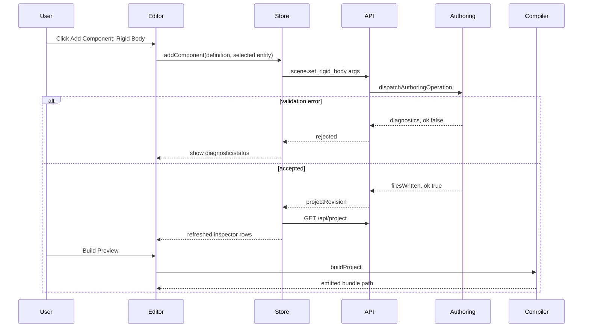

# PRD: Editor Functional Gap Closure

Complexity: 9 -> HIGH mode

Score basis: +3 touches 10+ files, +2 complex editor/session state and UI
flows, +2 multi-package source-operation and verification work, +2 new
source-backed operation coverage across currently placeholder editor features.

## 1. Context

**Problem:** The browser editor has several visible controls and panels that
look like engine/editor features but are either placeholders, view-only state,
or thin JSON controls without dedicated user flows or runtime proof.

**Files analyzed:**

- `packages/editor/src/EditorApp.tsx`
- `packages/editor/src/state/editorStore.ts`
- `packages/editor/src/adapters/editorModel.ts`
- `packages/editor/src/server/projectApi.ts`
- `packages/editor/src/server/operationApi.ts`
- `packages/editor/src/workbench/operations.ts`
- `packages/editor/src/components/panels/InspectorPanel.tsx`
- `packages/editor/src/components/panels/ProjectPanel.tsx`
- `packages/editor/src/components/panels/SystemPanel.tsx`
- `packages/editor/src/adapters/editorModel.test.ts`
- `packages/editor/src/state/editorStore.test.ts`
- `tools/verify/src/editorPackage.ts`
- `packages/cli/src/commands/scene.ts`
- `packages/cli/src/commands/physicsNav.ts`
- `packages/cli/src/commands/sourceDocuments.ts`
- `docs/status/threejs-bevy-editor-cli-feature-gap-report-2026-06-21.md`
- `docs/bevy-feature-parity.md`

**Current behavior:**

- Editor persistence correctly goes through `@threenative/authoring` operations
  and structured source documents, not generated IR.
- Add Object supports primitive sphere, empty entity, camera, light, and
  project-local model assets, but terrain remains disabled.
- Add Component lists more than it can persist: only Transform, Camera, and
  Light have first-class store handling; MeshRenderer, physics, visibility,
  render layers, character controller, and script reference UX are not complete.
- Delete and Settings open dialogs, but the dialogs explicitly say the features
  are not promoted yet.
- Drag/drop hierarchy nesting changes only editor view state; it does not write
  durable source.
- Physics source/runtime support exists through CLI/source operations for rigid
  bodies, colliders, and character controllers, but the editor lacks dedicated
  controls and an editor-originated runtime proof.

## 2. Integration Points

**How will this feature be reached?**

- [x] Entry point identified:
  - browser editor toolbar and modal actions in `EditorApp.tsx`;
  - inspector controls in `InspectorPanel.tsx`;
  - store actions in `editorStore.ts`;
  - local editor server `POST /api/operation`;
  - compiler build through `/api/build` and `tn build`.
- [x] Caller files identified:
  - `EditorModalView` invokes Add Object/Add Component/Delete/Settings actions;
  - `InspectorPanel` invokes `onEditProperty`;
  - `useEditorStore` dispatches source operations;
  - `tools/verify/src/editorPackage.ts` drives browser proof.
- [x] Registration/wiring needed:
  - extend `EDITOR_MODAL_ACTION_DEFINITIONS` and
    `EDITOR_ADD_COMPONENT_DEFINITIONS`;
  - map each enabled UI action to `applyEditorOperationApi`;
  - add any missing authoring operation descriptor before enabling a UI control;
  - extend focused editor verification artifacts.

**Is this user-facing?**

- [x] YES. This PRD changes visible editor behavior.
- [x] NO.

**Full user flow:**

1. User opens `tn editor dev --project <path>`.
2. User clicks an editor toolbar/modal/inspector control.
3. Editor store dispatches a promoted source operation.
4. Server validates and writes structured source under `content/**` or script
   source under `src/scripts/**` only.
5. Editor refreshes project state and surfaces diagnostics.
6. User builds preview; emitted bundle/IR and, where relevant, runtime proof
   show the change is real.

## 3. Solution

**Approach:**

- Make visible editor features honest: each visible action is either
  source-backed with tests/proof or disabled with a non-ambiguous reason.
- Promote missing editor flows by reusing existing authoring operations first.
  Add authoring operations only when no safe operation exists.
- Add dedicated controls for common components instead of relying on generic
  JSON fields when a user expects an engine editor workflow.
- Treat physics as two layers: source/component authoring in the editor and
  runtime proof through existing web/Bevy verification, not a fake editor-only
  simulation.
- Keep script body editing in the separate
  `editor-script-body-code-mode.md` PRD; this PRD may wire script reference
  attachment UX but must not embed script code in scene/system JSON.

```mermaid
flowchart LR
    UI[Editor toolbar, modal, inspector] --> Store[Zustand editor store]
    Store --> API[POST /api/operation]
    API --> Authoring[@threenative/authoring operation]
    Authoring --> Source[content/** and src/scripts/** source]
    Source --> Compiler[tn build / buildProject]
    Compiler --> Bundle[world.ir.json and runtime bundle]
    Bundle --> Proof[editor package and parity gates]
```

**Key Decisions:**

- [x] Library/framework choices: keep React/Vite/Zustand and the existing
  authoring operation registry.
- [x] Error-handling strategy: preserve `ok`, `changed`, `filesWritten`, and
  stable diagnostics from `@threenative/authoring`; do not stage success in UI
  when operation persistence failed.
- [x] Reused utilities: `applyEditorOperationApi`, `loadEditorProjectApi`,
  `EDITOR_OPERATION_COVERAGE_MATRIX`, `buildProject`, `validateBundle`, and
  focused `verify:editor-package`/`verify:editor-required-operations` proof.

**Data Changes:** Possible new structured source fields only if an existing IR
contract already supports them. Otherwise create explicit diagnostics and leave
the feature disabled.

## 4. Sequence Flow



## 5. Execution Phases

#### Phase 1: Feature Honesty Audit - Every visible editor action has a tested source-backed or disabled state.

**Files (max 5):**

- `packages/editor/src/adapters/editorModel.ts` - source of feature/action
  metadata.
- `packages/editor/src/adapters/editorModel.test.ts` - coverage matrix tests.
- `packages/editor/src/EditorApp.tsx` - visible toolbar/modal affordances.
- `packages/editor/src/EditorApp.test.tsx` - modal rendering tests.
- `docs/status/threejs-bevy-editor-cli-feature-gap-report-2026-06-21.md` -
  residual matrix update if findings change.

**Implementation:**

- [x] Add an explicit `featureStatus` or equivalent metadata for every modal
  action and Add Component definition: `enabled`, `disabled`, or
  `planned-prd`.
- [x] Fail tests if an enabled action has no operation/handler or if a disabled
  action lacks a reason.
- [x] Ensure toolbar buttons that open disabled workflows show the same reason
  as the modal.
- [x] Document current nonfunctional controls: terrain, delete, settings,
  hierarchy persistence, and script body editing.

**Tests Required:**

| Test File | Test Name | Assertion |
| --- | --- | --- |
| `packages/editor/src/adapters/editorModel.test.ts` | `should classify every visible editor action by functional status` | No visible action is unclassified. |
| `packages/editor/src/EditorApp.test.tsx` | `should render disabled modal actions with stable reasons` | Terrain/Delete/Settings show exact reasons until promoted. |

**User Verification:**

- Action: Open Add Object, Add Component, Delete, and Settings.
- Expected: Every unavailable feature clearly says why and points at a planned
  source-backed workflow.

#### Phase 2: Add Component Completion - Common engine components can be attached without raw JSON.

**Files (max 5):**

- `packages/editor/src/adapters/editorModel.ts` - component definitions/defaults.
- `packages/editor/src/state/editorStore.ts` - add component operation mapping.
- `packages/editor/src/server/projectApi.ts` - typed inspector rows for added
  components.
- `packages/editor/src/state/editorStore.test.ts` - store operation tests.
- `packages/editor/src/server/projectApi.test.ts` - inspector row tests.

**Implementation:**

- [x] Add first-class Add Component store handling for `MeshRenderer`,
  `RenderLayers`, `Visibility`, `RigidBody`, `Collider`, and
  `CharacterController`.
- [x] Use existing operations where available:
  `scene.set_mesh_renderer`, `scene.set_render_layers`,
  `scene.set_visibility`, `scene.set_rigid_body`, `scene.set_collider`, and
  `scene.set_character_controller`.
- [x] Keep component defaults conservative and valid for structured source.
- [x] Render typed inspector controls for physics and visibility fields after
  attachment.
- [x] Disable component choices only when required references are missing, such
  as MeshRenderer without a mesh/material.

**Tests Required:**

| Test File | Test Name | Assertion |
| --- | --- | --- |
| `packages/editor/src/state/editorStore.test.ts` | `should attach promoted engine components through source operations` | Store posts the expected operation and refreshed rows include the component. |
| `packages/editor/src/server/projectApi.test.ts` | `should expose typed physics component inspector rows` | RigidBody/Collider/CharacterController rows are editable and operation-backed. |

**User Verification:**

- Action: Select an entity, add Rigid Body and Collider, then build preview.
- Expected: Source JSON contains components and emitted `world.ir.json`
  includes the same component data.

#### Phase 3: Terrain and Asset Creation - Add Object terrain and import flows become source-backed.

**Files (max 5):**

- `packages/editor/src/adapters/editorModel.ts` - enable terrain action when
  source support is present.
- `packages/editor/src/state/editorStore.ts` - terrain/model operation plan.
- `packages/editor/src/server/projectApi.ts` - terrain/object summaries.
- `packages/editor/src/state/editorStore.test.ts` - Add Object operation tests.
- `tools/verify/src/editorPackage.ts` - browser proof for terrain/model flow.

**Implementation:**

- [x] Promote Add Terrain to create/update an environment terrain document and
  a visible scene terrain entity/prefab when the project has a scene.
- [x] Require project-local heightmap assets for heightmap terrain; otherwise
  default to flat terrain.
- [x] Keep custom GLB creation enabled only for assets already present in
  project source; route new file import to a separate asset-import workflow if
  needed.
- [x] Show diagnostics for remote model paths, missing files, unsupported
  heightmaps, and generated output paths.
- [x] Extend editor package artifacts to prove terrain source, environment
  scene output, and emitted bundle changes.

**Tests Required:**

| Test File | Test Name | Assertion |
| --- | --- | --- |
| `packages/editor/src/state/editorStore.test.ts` | `should add flat terrain through source-backed operations` | Terrain creates/updates source docs without touching `dist/**`. |
| `tools/verify/src/editorPackage.ts` | `editor-e2e terrain flow` | Browser adds terrain, builds, and evidence includes environment output. |

**User Verification:**

- Action: Add Object -> Terrain -> Build Preview.
- Expected: Terrain appears in hierarchy/viewport, source docs changed, and
  bundle validation passes.

#### Phase 4: Durable Delete and Hierarchy - Destructive and nesting edits persist or stay disabled.

**Files (max 5):**

- `packages/authoring/src/operations.ts` - add missing safe operations if no
  existing operation covers delete/parenting.
- `packages/authoring/src/operationRegistry.ts` - register operations.
- `packages/editor/src/state/editorStore.ts` - Delete and drag/drop dispatch.
- `packages/editor/src/state/editorStore.test.ts` - destructive/nesting tests.
- `packages/authoring/src/operationRegistry.test.ts` - operation validation.

**Implementation:**

- [x] Add or reuse source operations for deleting a scene entity and removing
  now-unused scene-local prefabs when explicitly requested.
- [x] Add or reuse a durable hierarchy/group operation. If the source contract
  cannot represent parent-child relationships yet, keep drag/drop as view-only
  and rename/status it clearly.
- [x] Require confirmation for deletes and show affected source files.
- [x] Reject deletes of stable generated/runtime rows and unsupported document
  groups.
- [x] Ensure delete and hierarchy edits rebuild into changed IR or remain
  disabled with a stable reason.

**Tests Required:**

| Test File | Test Name | Assertion |
| --- | --- | --- |
| `packages/authoring/src/operationRegistry.test.ts` | `should reject deleting missing entities` | Stable diagnostic and no write. |
| `packages/editor/src/state/editorStore.test.ts` | `should persist delete through source operation` | Selected source entity is removed from source and project refresh. |
| `packages/editor/src/state/editorStore.test.ts` | `should not imply durable nesting when only view state changes` | View-only nesting has explicit status, or source parent operation writes. |

**User Verification:**

- Action: Add an entity, delete it, rebuild.
- Expected: Entity disappears from source and emitted IR, or delete remains
  disabled with a precise reason.

#### Phase 5: Script Reference UX and Code-Mode Handoff - Script workflows are discoverable without pretending scripts are components.

**Files (max 5):**

- `packages/editor/src/components/panels/InspectorPanel.tsx` - script reference
  field affordances.
- `packages/editor/src/state/editorStore.ts` - attach-script behavior/status.
- `packages/editor/src/server/projectApi.ts` - script inventory/reference rows.
- `packages/editor/src/components/panels/InspectorPanel.test.tsx` - script field
  tests.
- `docs/PRDs/other/editor-script-body-code-mode.md` - linked dependency.

**Implementation:**

- [x] Make system script reference rows clearly editable as module/export
  references.
- [x] Add "create/open script" affordances only if backed by the script body code
  mode PRD; otherwise show a link/status explaining that bodies live under
  `src/scripts/**/*.ts`.
- [x] Remove the misleading impression that an entity-level Script component is
  the portable attach path.
- [x] Validate missing module/export diagnostics after attach.

**Tests Required:**

| Test File | Test Name | Assertion |
| --- | --- | --- |
| `packages/editor/src/components/panels/InspectorPanel.test.tsx` | `should edit script references as module and export fields` | Change emits `modulePath`/`exportName`, not inline script body. |
| `packages/editor/src/state/editorStore.test.ts` | `should attach system script reference through operation` | Store dispatches `system.attach_script` and refreshes diagnostics. |

**User Verification:**

- Action: Select a systems document, edit module/export, save/build.
- Expected: Systems source JSON stores the reference and build reports missing
  exports if the script body is invalid.

#### Phase 6: Settings, Play, and Runtime Proof - Editor status controls reflect real project/runtime state.

**Files (max 5):**

- `packages/editor/src/EditorApp.tsx` - Settings/Play/Pause/Stop affordances.
- `packages/editor/src/state/editorStore.ts` - settings/runtime state handling.
- `packages/editor/src/server/buildApi.ts` - build/runtime metadata if needed.
- `tools/verify/src/editorPackage.ts` - browser proof.
- `tools/verify/src/editorRequiredOperations.ts` - direct operation smoke proof.

**Implementation:**

- [x] Replace placeholder Settings with source-backed runtime/target/editor
  settings that map to existing `runtime.*` and `target.*` operations, or hide
  the button until scoped.
- [x] Make Play/Pause/Stop either drive a real preview runtime state or be
  explicitly disabled; no inert playback controls.
- [x] Add an editor-originated physics proof: create rigid body/collider through
  editor operations, build, verify `world.ir.json`, and run the narrowest
  available runtime proof that shows promoted physics behavior.
- [x] Extend `verify:editor-required-operations` to include physics component
  authoring once Phase 2 lands.

**Tests Required:**

| Test File | Test Name | Assertion |
| --- | --- | --- |
| `tools/verify/src/editorRequiredOperations.ts` | `editor required operations physics proof` | Editor-originated RigidBody/Collider lower into `world.ir.json`. |
| `tools/verify/src/editorPackage.ts` | `editor playback/settings honesty` | Settings/Play controls are functional or disabled with reasons. |

**User Verification:**

- Action: Add physics components in the editor, build preview, run focused
  verification.
- Expected: Source, IR, and runtime proof agree; unsupported physics breadth is
  reported as diagnostics, not implied by the UI.

## 6. Verification Strategy

1. Unit/store tests for every new operation mapping.
2. Server API tests for generated inspector rows and diagnostics.
3. Browser `verify:editor-package` proof for user-visible flows.
4. Direct operation smoke through `verify:editor-required-operations` for
   source/IR assertions.
5. Runtime parity/conformance gates for physics behavior where the editor claims
   runtime support.

Minimum commands before handoff:

```bash
pnpm --filter @threenative/editor test
pnpm --filter @threenative/verify-tools test
pnpm verify:editor-required-operations
pnpm verify:focused verify:editor-package
pnpm check:docs
pnpm check:names
```

Run `pnpm verify:conformance` when a phase changes shared IR/runtime contracts.

## 7. Acceptance Criteria

- [x] No visible editor action is unclassified.
- [x] No visible enabled editor action is a no-op.
- [x] Add Component supports all promoted common components or disables them
  with exact missing-prerequisite diagnostics.
- [x] Terrain, delete, hierarchy nesting, settings, and playback are either
  functional and source-backed or explicitly disabled with a tracked reason.
- [x] Physics authored from the editor has source, IR, and runtime evidence.
- [x] Script references are editable without introducing entity Script
  components or inline script bodies.
- [x] `verify:editor-package` and `verify:editor-required-operations` prove the
  completed workflows.
- [x] Docs/status/parity trackers are updated when phases land.

