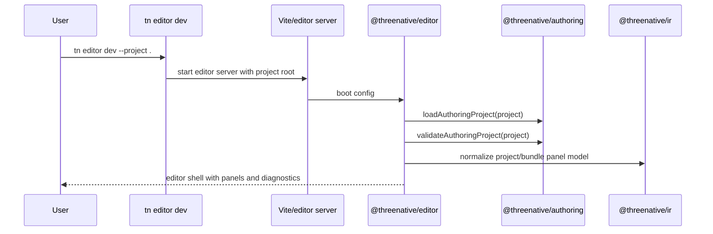

# PRD: Editor Package Shell and Adapter Contract

Complexity: 12 -> HIGH mode

Score basis: +3 touches 10+ future files, +2 new package/module from scratch,
+2 multi-package changes, +2 complex editor state and package/dev-server
integration, +1 user-facing UI, +1 external/reused UI integration from
`/home/joao/projects/vibe-coder-3d`, +1 verification and docs wiring.

## 1. Context

**Problem:** ThreeNative has structured editor/authoring contracts and CLI
inspection, but no installable editor UI package that users can launch against a
project.

**Files analyzed:**

- `AGENTS.md`
- `packages/AGENTS.md`
- `/home/joao/.claude/skills/prd-creator/SKILL.md`
- `docs/PRDs/README.md`
- `docs/PRDs/done/v8/V8-00-local-editor-scope-and-contract.md`
- `docs/PRDs/done/v8/V8-01-editor-project-snapshot-and-structured-diffs.md`
- `docs/PRDs/done/v8/V8-18-editor-debugging-diagnostics-packaging-performance-support.md`
- `docs/PRDs/other/editor-ready-modular-authoring-and-scripting-architecture.md`
- `docs/PRDs/other/complete-structured-authoring-parity.md`
- `docs/contracts/authoring-source-documents.md`
- `docs/contracts/authoring-mcp.md`
- `docs/STATUS.md`
- `docs/bevy-feature-parity.md`
- `package.json`
- `pnpm-workspace.yaml`
- `packages/authoring/package.json`
- `packages/authoring/src/index.ts`
- `packages/authoring/src/project.ts`
- `packages/authoring/src/operations.ts`
- `packages/authoring/src/documents.ts`
- `packages/authoring/src/importBundle.ts`
- `packages/authoring/src/schemas.ts`
- `packages/ir/src/editorProject.ts`
- `packages/runtime-web-three/src/editor/inspector.ts`
- `packages/cli/src/commands/editor.ts`
- `packages/cli/src/commands/authoring.ts`
- `packages/cli/src/commands/sourceDocuments.ts`
- `packages/mcp-server/src/index.ts`
- `/home/joao/projects/vibe-coder-3d/package.json`
- `/home/joao/projects/vibe-coder-3d/src/App.tsx`
- `/home/joao/projects/vibe-coder-3d/src/editor/Editor.tsx`
- `/home/joao/projects/vibe-coder-3d/src/editor/components/layout/TopBar.tsx`
- `/home/joao/projects/vibe-coder-3d/src/editor/components/layout/StackedLeftPanel.tsx`
- `/home/joao/projects/vibe-coder-3d/src/editor/components/panels/HierarchyPanel/HierarchyPanelContent.tsx`
- `/home/joao/projects/vibe-coder-3d/src/editor/components/panels/InspectorPanel/InspectorPanelContent/InspectorPanelContent.tsx`
- `/home/joao/projects/vibe-coder-3d/src/editor/components/panels/ViewportPanel/ViewportPanel.tsx`
- `/home/joao/projects/vibe-coder-3d/src/editor/store/editorStore.ts`
- `/home/joao/projects/vibe-coder-3d/src/editor/hooks/useEntitySynchronization.ts`
- `/home/joao/projects/vibe-coder-3d/src/editor/hooks/useTransform.ts`

**Current behavior:**

- `@threenative/ir` exposes `threenative.editor-project`,
  `threenative.editor-visual-panels`, and `threenative.editor-tools` snapshot
  models.
- `tn editor inspect --json` emits hierarchy, editable properties, visual
  panels, scene viewer, asset preview, and gamepad-viewer metadata from a
  generated bundle.
- Recent commits added `@threenative/authoring` source-document discovery,
  bundle import, typed mutation groups, provenance ownership, structured starter
  template, and an optional MCP wrapper.
- Vibe Coder has a mature React editor layout and controls, but its UI is wired
  to a different in-memory ECS (`EntityManager`, `ComponentRegistry`, numeric
  entity IDs, direct component mutation, R3F/Rapier play loop).
- ThreeNative must keep structured source documents and generated IR bundles as
  the editor boundary; raw Three.js/Bevy runtime objects must not become source.

## 2. Integration Points

**How will this feature be reached?**

- [x] Entry point identified:
  - `@threenative/editor` package exports embeddable React components.
  - `tn editor dev --project <path>` launches a local editor dev server.
  - `tn editor open --project <path> [--bundle <path>]` opens the package
    shell against source docs and/or an emitted bundle.
- [x] Caller file identified:
  - new `packages/editor/src/index.ts`
  - new `packages/editor/src/App.tsx`
  - new `packages/editor/src/adapters/*`
  - `packages/cli/src/commands/editor.ts`
  - `packages/cli/src/index.ts`
- [x] Registration/wiring needed:
  - add `packages/editor/package.json`, tsconfig, Vite config, styles, tests.
  - add workspace dependency wiring to CLI.
  - add docs index entry and status/parity notes when a slice lands.

**Is this user-facing?**

- [x] YES. It introduces the first launchable ThreeNative editor shell.
- [ ] NO.

**Full user flow:**

1. User creates or opens a structured-source project.
2. User runs `tn editor dev --project .`.
3. CLI starts the editor package dev server and passes the project path through
   a local adapter endpoint or static boot config.
4. Editor loads source-document inventory and, when available, bundle inspection
   data.
5. User sees a ThreeNative editor shell with hierarchy, inspector, assets,
   diagnostics, and preview placeholders backed by ThreeNative adapter models.

## 3. Solution

**Approach:**

- Create `@threenative/editor` as a first-class workspace package, not code
  hidden inside the web runtime.
- Reuse Vibe Coder only as visual reference or for small presentation
  primitives after dependency audit. Do not port whole containers such as
  `StackedLeftPanel`, `HierarchyPanelContent`, `InspectorPanelContent`, or
  `ViewportPanel`; they are coupled to Vibe Coder's ECS, store, component
  registry, and play/runtime loop.
- Replace Vibe Coder ECS coupling with a ThreeNative editor adapter layer whose
  inputs are `@threenative/authoring` project documents and `@threenative/ir`
  editor snapshots.
- Keep the first package slice read-only except for local UI state
  (selection/collapse/filter) so source-persistence semantics stay explicit in
  follow-up PRDs.
- Route launch and project discovery through the CLI so users do not hand-wire
  Vite commands.

```mermaid
flowchart LR
    CLI[tn editor dev/open] --> Server[Editor dev server]
    Server --> Package[@threenative/editor]
    Package --> Adapter[ThreeNative editor adapter]
    Adapter --> Authoring[@threenative/authoring]
    Adapter --> IR[@threenative/ir editor snapshots]
    Package --> UI[React shell inspired by Vibe Coder layout]
```

**Key Decisions:**

- [x] Library/framework choices: React 19, Vite, existing repo TypeScript
  `NodeNext`, `@threenative/authoring`, `@threenative/ir`, and optional
  `lucide-react` or existing minimal icon dependency for editor package only.
- [x] Error-handling strategy: editor package renders stable diagnostics from
  authoring/IR payloads and never swallows failed project loads.
- [x] Reused utilities: `loadAuthoringProject`, `validateAuthoringProject`,
  `buildEditorVisualPanelSnapshot`, `buildEditorToolSnapshot`, CLI editor JSON
  payloads, and Vibe Coder visual patterns after dependency cleanup.
- [x] Source boundary: the package never writes generated bundle JSON as source
  and never persists runtime handles.
- [x] Vibe Coder boundary: the package must not import Vibe Coder `core`,
  `game`, ECS, entity/component managers, editor stores, physics integration,
  R3F/Drei/Rapier viewport code, `EngineLoop`, input manager, scene persistence,
  AI/chat services, or play controls that start Vibe Coder's engine.

### Vibe Coder Reuse Rules

Allowed:

- Reimplement simple visual patterns from screenshots/source reading:
  top/menu/status bar layout, compact panel headers, toolbar icon button
  spacing, modal framing, field label/value layout, and status badge styling.
- Copy small stateless field primitives only after removing Tailwind-only
  assumptions or moving required CSS into `packages/editor/src/styles.css`.
- Use Vibe Coder text labels only when they match ThreeNative concepts.

Forbidden:

- Importing or adapting `src/core/**`, `src/game/**`,
  `src/editor/store/**`, `src/editor/hooks/useEntity*`,
  `src/editor/hooks/useComponent*`, `src/editor/hooks/usePhysics*`,
  `src/editor/hooks/useScenePersistence*`, `src/editor/hooks/useAgentActions*`,
  `src/editor/components/physics/**`,
  `src/editor/components/panels/ViewportPanel/**`,
  `src/editor/components/chat/**`, or `src/editor/services/agent/**`.
- Importing dependencies solely for Vibe Coder behavior: `bitecs`,
  `@react-three/fiber`, `@react-three/drei`, `@react-three/rapier`,
  `@dnd-kit/*`, `howler`, `@anthropic-ai/*`, or Vibe Coder's custom Vite
  plugins.
- Keeping Vibe Coder numeric entity IDs, live component mutation callbacks,
  play/pause semantics, physics state, scene persistence format, or runtime
  event bus.

Dependency policy:

- Phase 1 may add only React/Vite/test dependencies already used at repo root
  unless a new dependency is justified in the PRD implementation notes.
- Styling must be local CSS or an explicit package-local build setup. Do not
  depend on Vibe Coder global Tailwind/DaisyUI classes or `src/styles/index.css`.

**Data Changes:** None in Phase 1. Later PRDs may add editor session/config
documents if needed.

## 4. Sequence Flow



## 5. Execution Phases

#### Phase 1: Package Skeleton - Engineers can import and test a static editor shell.

**Files (max 5):**

- `packages/editor/package.json` - package scripts, exports, dependencies.
- `packages/editor/tsconfig.json` - package TypeScript config.
- `packages/editor/src/index.ts` - public exports.
- `packages/editor/src/EditorApp.tsx` - root shell component with injected
  adapter data.
- `packages/editor/src/EditorApp.test.tsx` - smoke rendering/model tests.

**Implementation:**

- [x] Add `@threenative/editor` workspace package.
- [x] Export `EditorApp`, `IEditorAppProps`, and read-only shell model types.
- [x] Render a minimal shell: top bar, left hierarchy/inspector column, main
  preview region, right diagnostics/assets column, status bar.
- [x] Accept adapter data through props first; do not add project filesystem
  access in the browser bundle.
- [x] Keep styling local to the package and avoid importing Vibe Coder globals.

**Tests Required:**

| Test File | Test Name | Assertion |
|-----------|-----------|-----------|
| `packages/editor/src/EditorApp.test.tsx` | `should render shell sections from adapter data` | hierarchy, inspector, assets, diagnostics, and status labels are present |
| `packages/editor/src/EditorApp.test.tsx` | `should render empty project state` | empty hierarchy and diagnostics states are explicit |

**User Verification:**

- Action: run package test/build for `@threenative/editor`.
- Expected: package builds and the shell can render from static fixture data.

#### Phase 2: Browser Dev Fixture - Engineers can manually view the shell without project access.

**Files (max 5):**

- `packages/editor/package.json` - package-local dev command.
- `packages/editor/index.html` - static dev HTML entry.
- `packages/editor/src/devFixture.tsx` - static adapter-data fixture.
- `packages/editor/src/styles.css` - package-local editor styles.
- `packages/editor/src/devFixture.test.tsx` - fixture smoke test.

**Implementation:**

- [x] Add a static Vite fixture that renders `EditorApp` without filesystem or
  server access.
- [x] Keep CSS local to `packages/editor`; do not import Vibe Coder Tailwind or
  DaisyUI globals.
- [x] Render enough fixture rows to exercise hierarchy, inspector, assets,
  diagnostics, and status areas.
- [x] Document the package-local dev command in `packages/editor/package.json`.

**Tests Required:**

| Test File | Test Name | Assertion |
|-----------|-----------|-----------|
| `packages/editor/src/devFixture.test.tsx` | `should render static editor fixture` | fixture renders shell and sample rows |

**User Verification:**

- Action: run the editor package dev fixture.
- Expected: browser shows a static editor shell with no project or Vibe runtime
  dependency.

#### Phase 3: Adapter Contract - Editor data is ThreeNative-shaped, not Vibe Coder ECS-shaped.

**Files (max 5):**

- `packages/editor/src/adapters/editorModel.ts` - normalized UI model.
- `packages/editor/src/adapters/fromAuthoringProject.ts` - source-doc model
  conversion.
- `packages/editor/src/adapters/fromEditorInspection.ts` - IR/CLI inspection
  conversion.
- `packages/editor/src/adapters/editorModel.test.ts` - adapter tests.
- `packages/editor/src/index.ts` - export `EditorApp` and adapter APIs.

**Implementation:**

- [x] Define stable editor UI model types with string IDs, document paths, JSON
  pointer paths, diagnostics, access policy, and selected node state.
- [x] Convert `IAuthoringProject` documents into project inventory panels.
- [x] Convert `IEditorVisualPanelSnapshot` and `IEditorToolSnapshot` into shell
  panels without assuming numeric entity IDs.
- [x] Treat IR editor snapshots as inspect-only unless an explicit
  authoring-provenance/source-document bridge maps the row back to durable
  source. Do not infer `sourcePersistable` from generated bundle paths.
- [x] Mark rows as `sourcePersistable`, `inspectableOnly`, `derivedView`, or
  `runtimeOnly` only from source documents or explicit bridge metadata.
- [x] Add guard tests proving runtime-only handles and generated bundle paths do
  not become source-editable rows.

**Tests Required:**

| Test File | Test Name | Assertion |
|-----------|-----------|-----------|
| `packages/editor/src/adapters/editorModel.test.ts` | `should map authoring documents to project inventory` | document kind/path/status are deterministic |
| `packages/editor/src/adapters/editorModel.test.ts` | `should map IR visual panels without numeric ECS assumptions` | string IDs and JSON pointer paths are preserved |
| `packages/editor/src/adapters/editorModel.test.ts` | `should classify generated and runtime rows as non-persistable` | generated/runtime rows cannot be edited |

**User Verification:**

- Action: feed the structured-source starter and a bundle-inspection fixture into
  adapter tests.
- Expected: UI model matches source-document and editor snapshot contracts.

#### Phase 4: Vibe Coder-Inspired Presentation - Useful UI patterns are reimplemented with ECS dependencies excluded.

**Files (max 5):**

- `packages/editor/src/components/layout/TopBar.tsx` - ThreeNative top bar.
- `packages/editor/src/components/layout/PanelShell.tsx` - from-scratch
  dock/collapse shell inspired by Vibe panel sizing/header patterns.
- `packages/editor/src/components/panels/HierarchyPanel.tsx` - read-only
  hierarchy over adapter rows.
- `packages/editor/src/components/panels/InspectorPanel.tsx` - read-only
  property list over adapter rows.
- `packages/editor/src/components/shared/Fields.tsx` - reusable field display
  primitives.

**Implementation:**

- [x] Reimplement only presentational structure from Vibe Coder; do not copy
  container components that import Vibe stores/hooks/menus.
- [x] Replace `react-icons` with the repo-approved icon choice for this package.
- [x] Remove imports of `@/core`, `@editor`, `EntityManager`,
  `ComponentRegistry`, `KnownComponentTypes`, Rapier, and R3F runtime loops.
- [x] Add a dependency denylist test or static import scan for forbidden Vibe
  runtime/ECS dependencies.
- [x] Use string IDs and document paths everywhere.
- [x] Ensure compact, tool-like UI rather than marketing layout.

**Tests Required:**

| Test File | Test Name | Assertion |
|-----------|-----------|-----------|
| `packages/editor/src/components/panels/HierarchyPanel.test.tsx` | `should select a hierarchy row by string id` | selection callback receives the adapter row id |
| `packages/editor/src/components/panels/InspectorPanel.test.tsx` | `should render generated rows read-only` | non-persistable properties are disabled/read-only |
| dependency scan | `should reject Vibe runtime imports` | forbidden imports are absent from editor package |

**User Verification:**

- Action: run the editor package story/smoke page.
- Expected: shell visually resembles a compact editor, but no Vibe Coder ECS
  dependencies remain.

#### Phase 5: CLI Launch Wiring - Users can start the package through `tn editor`.

**Files (max 5):**

- `packages/cli/src/commands/editor.ts` - add `dev`/`open` launch subcommands.
- `packages/cli/src/commands/editor.test.ts` - launch command tests.
- `packages/cli/package.json` - dependency on `@threenative/editor` if needed.
- `packages/editor/src/server/bootConfig.ts` - boot config shape and validation.
- `packages/editor/src/server/bootConfig.test.ts` - project path guard tests.

**Implementation:**

- [x] Add `tn editor dev --project <path> [--port <n>] [--json]`.
- [x] Add `tn editor open --project <path> [--bundle <path>] [--json]` as a
  non-blocking alias or clear diagnostic if only dev launch exists.
- [x] Implement launch by spawning Vite with cwd `packages/editor` and passing
  boot config through a generated `.threenative/editor-boot.json` or equivalent
  env var. Tests must mock process spawning and assert cwd/env/args.
- [x] Do not import browser code into CLI runtime; CLI orchestrates the editor
  server only.
- [x] Validate project path containment and generated artifact boundaries.
- [x] Return machine-readable URL, project path, and diagnostics in JSON mode.
- [x] Keep active verification logic outside `scripts/`; put any gate logic in
  `tools/verify` in a later phase if needed.

**Tests Required:**

| Test File | Test Name | Assertion |
|-----------|-----------|-----------|
| `packages/cli/src/commands/editor.test.ts` | `should report editor dev launch config in json mode` | command returns URL/project payload |
| `packages/cli/src/commands/editor.test.ts` | `should reject unsafe project paths` | generated/cache paths are rejected |
| `packages/editor/src/server/bootConfig.test.ts` | `should validate editor boot config` | missing/unsafe project path returns diagnostic |

**User Verification:**

- Action: run `pnpm tn -- editor dev --project templates/structured-source-starter --json`.
- Expected: CLI reports a local editor URL and the selected project path.

## 6. Verification Strategy

- `pnpm --filter @threenative/editor build`
- `pnpm --filter @threenative/editor typecheck`
- `pnpm --filter @threenative/editor test`
- `pnpm --filter @threenative/cli test`
- `pnpm check:names`
- `pnpm check:docs`

## 7. Acceptance Criteria

- [x] `@threenative/editor` exists as a workspace package.
- [x] The package renders a usable editor shell from typed adapter data.
- [x] Adapter models consume ThreeNative authoring/IR contracts and do not use
  Vibe Coder ECS internals.
- [x] `tn editor dev/open` has a documented launch path or explicit diagnostic.
- [x] Tests prove generated/runtime rows are not source-persistable.
- [x] Docs index/status/parity are updated when the implementation slice lands.
