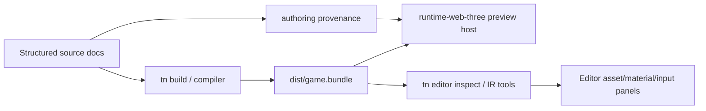
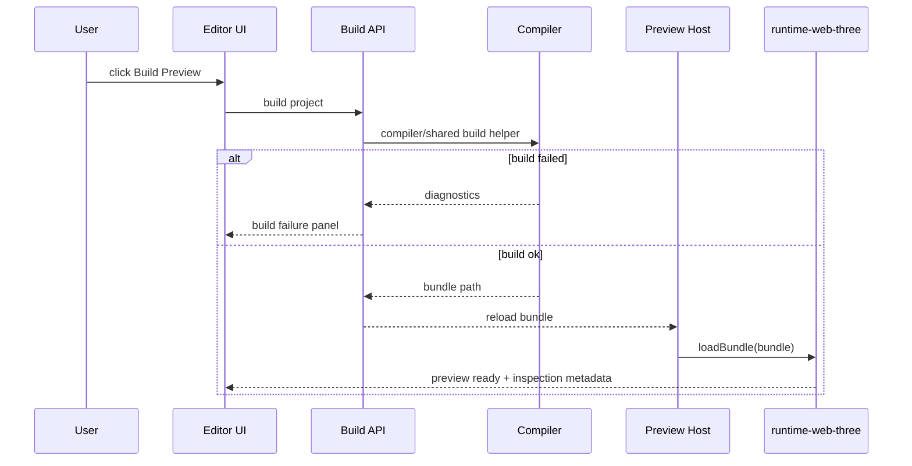

# PRD: Editor Runtime Preview and Vibe UI Port

Complexity: 13 -> HIGH mode

Score basis: +3 touches 10+ future files, +2 complex preview/build/watch
state, +2 multi-package runtime/editor/CLI integration, +2 user-facing visual
UI, +1 reusable external UI migration, +1 cross-runtime boundary risk, +2
Playwright/visual verification.

## 1. Context

**Problem:** The editor workbench needs a live preview loop and richer Vibe
Coder-derived UI panels, but ThreeNative preview must consume generated IR
bundles and runtime adapters rather than Vibe Coder's R3F/Rapier ECS as source
state.

**Files analyzed:**

- `packages/runtime-web-three/src/loadBundle.ts`
- `packages/runtime-web-three/src/devServer.ts`
- `packages/runtime-web-three/src/browser/main.ts`
- `packages/runtime-web-three/src/editor/inspector.ts`
- `packages/runtime-web-three/src/render.ts`
- `packages/runtime-web-three/src/sceneManager.ts`
- `packages/runtime-web-three/src/systems/runner.ts`
- `packages/cli/src/commands/build.ts`
- `packages/cli/src/commands/dev.ts`
- `packages/cli/src/commands/editor.ts`
- `packages/cli/src/verify/playwright.ts`
- `packages/ir/src/editorProject.ts`
- `/home/joao/projects/vibe-coder-3d/src/editor/components/panels/ViewportPanel/ViewportPanel.tsx`
- `/home/joao/projects/vibe-coder-3d/src/editor/components/panels/ViewportPanel/GizmoControls.tsx`
- `/home/joao/projects/vibe-coder-3d/src/editor/components/panels/ViewportPanel/EntityTransformControls.tsx`
- `/home/joao/projects/vibe-coder-3d/src/editor/components/materials/MaterialPreviewSphere.tsx`
- `/home/joao/projects/vibe-coder-3d/src/editor/components/shared/Model3DPreview.tsx`
- `/home/joao/projects/vibe-coder-3d/src/editor/components/shared/GeometryPreview.tsx`
- `/home/joao/projects/vibe-coder-3d/src/editor/components/shared/AudioPreview.tsx`
- `/home/joao/projects/vibe-coder-3d/src/editor/components/shared/GamepadSettings.tsx`
- `/home/joao/projects/vibe-coder-3d/src/editor/components/debug/SceneStatsExporter.tsx`
- `/home/joao/projects/vibe-coder-3d/src/editor/services/agent/*`
- `/home/joao/projects/vibe-coder-3d/src/editor/chat/*`

**Current behavior:**

- `runtime-web-three` can load and render generated bundles and has bounded
  editor inspector panel helpers.
- `tn dev`, `tn build`, `tn editor inspect`, visual proof, and verification
  commands already exist around bundles.
- Vibe Coder viewport UI uses React Three Fiber, Drei controls, Rapier physics,
  entity renderers, direct transform controls, and component registry events.
- Vibe Coder material/model/audio previews and shared modals are promising
  reusable UI, but must be fed by ThreeNative asset manifests and bundle paths.
- Vibe Coder agent/chat features target its project-specific services and should
  be deferred until ThreeNative operation parity is stable.

## 2. Integration Points

**How will this feature be reached?**

- [x] Entry point identified:
  - editor preview panel in `@threenative/editor`.
  - local editor server build/watch API.
  - existing `@threenative/runtime-web-three` bundle loader.
  - CLI `tn build`, `tn dev`, `tn editor inspect`.
- [x] Caller file identified:
  - `packages/editor/src/preview/*`
  - `packages/editor/src/server/buildApi.ts`
  - `packages/runtime-web-three/src/editor/*`
  - `packages/cli/src/commands/editor.ts`
- [x] Registration/wiring needed:
  - preview iframe or embedded runtime host route.
  - build/watch endpoint.
  - editor visual smoke gate under `tools/verify/src`.
  - docs/status/parity updates when implementation lands.

**Is this user-facing?**

- [x] YES. Users see build status, runtime preview, asset previews, and selected
  object overlays.
- [ ] NO.

**Full user flow:**

1. User edits source documents in the editor.
2. Editor runs validate/build through the local server.
3. Runtime preview reloads the generated bundle through web Three.js.
4. User selects an entity in the hierarchy.
5. Preview highlights or frames the matching runtime object when provenance or
   stable metadata exists.
6. User inspects asset/material/input preview panels derived from the bundle and
   source documents.

## 3. Solution

**Approach:**

- Implement preview as a runtime-web-three bundle consumer, preferably isolated
  in an iframe or explicit runtime host boundary.
- Use authoring provenance and `ThreeNativeId` metadata to correlate source
  selection to runtime-rendered entities where available.
- Reimplement Vibe Coder-inspired viewport chrome, gizmo mode controls, asset
  preview cards, material preview controls, input/gamepad panels, and status
  overlays only after replacing their data dependencies with ThreeNative
  bundle/source models.
- Keep direct transform gizmo persistence out of this PRD unless it calls the
  source-document operation registry from the workbench PRD.
- Defer chat/agent UI until the editor can safely execute the shared
  authoring/MCP operation registry.

**Key Decisions:**

- [x] Library/framework choices: reuse `@threenative/runtime-web-three` instead
  of bringing Vibe Coder's R3F/Rapier runtime loop into the editor.
- [x] Error-handling strategy: build and preview failures render diagnostics
  with command, file/path, and suggested fixes.
- [x] Reused utilities: `loadBundle`, runtime editor inspector helpers,
  `tn editor inspect --json`, authoring provenance sidecar, Vibe Coder preview
  visual patterns after dependency removal.
- [x] Runtime boundary: preview can observe runtime state and selection, but
  saved edits still go through source operations.
- [x] Vibe Coder boundary: do not import Vibe `ViewportPanel`, gizmo files,
  `EngineLoop`, `InputManager`, R3F/Drei/Rapier, physics systems, component
  registry, numeric entity renderers, camera managers, or play-mode logic. The
  editor Play button must run ThreeNative preview through generated bundles, not
  Vibe Coder's engine.

**Data Changes:** None required initially. May later add preview session state
or selection correlation metadata if provenance is insufficient.

## 4. Dependencies and Preview Contract

Prerequisites:

- [Editor Package Shell and Adapter Contract](editor-package-shell-and-adapter-contract.md)
  Phases 1, 3, and 5 complete.
- [Editor Source Path and Operation Bridge](editor-source-path-and-operation-bridge.md)
  complete.
- [Editor Source Document Workbench](editor-source-document-workbench.md)
  Phases 1 and 2 complete, so source hierarchy row IDs and transform edits have
  stable operation paths.
- Direct gizmo persistence is blocked until workbench operation registry parity
  is complete.

Preview routing:

- The editor iframe URL is `/preview?bundle=<encoded-project-relative-bundle>`.
- `packages/editor/src/server/previewRoutes.ts` validates the bundle path stays
  inside the active project and points at a generated bundle directory.
- The iframe host imports runtime-web-three preview code only; it does not
  import Vibe Coder viewport/runtime code.
- The editor server build endpoint calls compiler/shared build APIs directly.
  It must not shell back through `tn` when CLI owns editor launch, to avoid
  circular `cli -> editor server -> cli` dependency.

## 5. Sequence Flow

## 6. Execution Phases

#### Phase 1: Build and Preview Host - Users can build and view a bundle inside the editor.

**Files (max 5):**

- `packages/editor/src/server/buildApi.ts` - validate/build project endpoint.
- `packages/editor/src/preview/PreviewHost.tsx` - preview iframe/host component.
- `packages/editor/src/preview/previewState.ts` - build/ready/error state.
- `packages/editor/src/server/previewRoutes.ts` - `/preview?bundle=...` route
  and path guard.
- `packages/editor/src/preview/PreviewHost.test.tsx` - state/render tests.

**Implementation:**

- [x] Add editor server endpoint that runs build through the existing compiler
  or shared build helper, not by invoking `tn`.
- [x] Return bundle path, diagnostics, and timing.
- [x] Load generated bundle into runtime-web-three in an isolated preview host.
- [x] Render explicit empty/building/error/ready states.
- [x] Reject preview loads from paths outside the project or generated bundle.

**Tests Required:**

| Test File | Test Name | Assertion |
|-----------|-----------|-----------|
| `packages/editor/src/preview/PreviewHost.test.tsx` | `should render build error diagnostics` | diagnostics are visible and preview is not marked ready |
| `packages/editor/src/preview/PreviewHost.test.tsx` | `should render ready state with bundle path` | ready state includes bundle metadata |
| `packages/editor/src/preview/PreviewHost.test.tsx` | `should reject preview paths outside the project` | route guard returns diagnostic |

**User Verification:**

- Action: open structured-source starter and click Build Preview.
- Expected: generated bundle renders in the preview host or a clear diagnostic
  explains why it cannot.

#### Phase 2: Selection Correlation and Read-Only Overlays - Selecting source rows highlights runtime entities.

**Files (max 5):**

- `packages/editor/src/preview/selectionBridge.ts` - source-to-runtime
  correlation.
- `packages/editor/src/preview/selectionBridge.test.ts` - provenance tests.
- `packages/runtime-web-three/src/editor/selectionOverlay.ts` - runtime overlay
  model/helper.
- `packages/runtime-web-three/src/editor/selectionOverlay.test.ts` - overlay
  tests.
- `packages/editor/src/preview/PreviewOverlay.tsx` - overlay UI.

**Implementation:**

- [x] Resolve selected source scene/entity IDs to runtime IDs through provenance
  or stable metadata.
- [x] Add read-only overlay markers for bounds/selection.
- [x] Do not persist overlay state into source documents.
- [x] Return explicit "unmapped selection" diagnostics when provenance is
  missing.
- [x] Keep Play controls mapped to ThreeNative preview start/pause/reload
  semantics only; never call Vibe Coder physics or engine hooks.

**Tests Required:**

| Test File | Test Name | Assertion |
|-----------|-----------|-----------|
| `packages/editor/src/preview/selectionBridge.test.ts` | `should map source entity to runtime metadata` | source entity ID maps to preview target |
| `packages/runtime-web-three/src/editor/selectionOverlay.test.ts` | `should build read-only overlay model` | overlay contains bounds/id without source mutation |

**User Verification:**

- Action: select an entity in the hierarchy after building preview.
- Expected: preview highlights the corresponding rendered entity when mapped.

#### Phase 3: Asset, Material, Geometry, Audio, and Input Preview Panels - Bundle catalogs are inspectable.

**Files (max 5):**

- `packages/editor/src/preview/catalogPreviewModel.ts` - bundle/source preview
  model.
- `packages/editor/src/components/panels/AssetPreviewPanel.tsx` - asset preview.
- `packages/editor/src/components/panels/MaterialPreviewPanel.tsx` - material
  preview.
- `packages/editor/src/components/panels/InputPreviewPanel.tsx` - input/gamepad
  declaration preview.
- `packages/editor/src/preview/catalogPreviewModel.test.ts` - preview model
  tests.

**Implementation:**

- [x] Feed panels from `assets.manifest.json`, `materials.ir.json`,
  `audio.ir.json`, `input.ir.json`, `world.ir.json` mesh/component references,
  `gltf.scene.json` when present, and source `content/meshes/*.meshes.json`.
- [x] Reimplement Vibe Coder preview widget patterns to accept ThreeNative
  asset IDs and bundle-relative paths.
- [x] Disable connected-device gamepad claims unless live device state is
  actually available.
- [x] Keep unsupported custom decoders/streaming media as diagnostics.

**Tests Required:**

| Test File | Test Name | Assertion |
|-----------|-----------|-----------|
| `packages/editor/src/preview/catalogPreviewModel.test.ts` | `should build preview cards from bundle catalogs` | assets/materials/input rows are deterministic |
| `packages/editor/src/preview/catalogPreviewModel.test.ts` | `should mark unsupported media preview explicitly` | unsupported row includes diagnostic |

**User Verification:**

- Action: build starter project and open asset/material/input panels.
- Expected: panels show bundle catalog entries without Vibe Coder ECS fields.

#### Phase 4: Visual Smoke Gate - Editor package is verified in a browser.

**Files (max 5):**

- `tools/verify/src/editorPackage.ts` - focused editor smoke gate.
- `tools/verify/src/editorPackage.test.ts` - gate tests.
- `tools/verify/src/cli/run.ts` - register focused gate.
- `docs/STATUS.md` - implementation status update when landed.
- `docs/bevy-feature-parity.md` - editor evidence anchor when landed.

**Implementation:**

- [x] Start the editor against `templates/structured-source-starter`.
- [x] Use Playwright to assert shell panels, source inventory, and preview
  status render.
- [x] Capture a screenshot artifact under `tools/verify/artifacts/editor-package/`.
- [x] Register focused gate name `verify:editor-package` without putting visual
  work into pre-commit.
- [x] Update both status and parity docs when the gate lands.

**Tests Required:**

| Test File | Test Name | Assertion |
|-----------|-----------|-----------|
| `tools/verify/src/editorPackage.test.ts` | `should describe editor package smoke artifacts` | artifact paths are stable |
| browser smoke | `should render editor shell and preview status` | Playwright sees key panels and nonblank preview area |

**User Verification:**

- Action: run `pnpm verify:focused verify:editor-package`.
- Expected: Playwright screenshot and JSON report are written to the editor
  package artifact root.

## 7. Verification Strategy

- `pnpm --filter @threenative/editor test`
- `pnpm --filter @threenative/runtime-web-three test`
- `pnpm --filter @threenative/cli test`
- `pnpm verify:focused verify:editor-package`
- `pnpm check:docs`
- Manual browser check for viewport framing and non-overlapping editor panels
  before claiming visual UX complete.

## 8. Acceptance Criteria

- [x] Editor can build and preview a structured-source project through the
  generated ThreeNative bundle.
- [x] Runtime preview consumes `runtime-web-three`; Vibe Coder R3F/Rapier ECS is
  not imported as source state.
- [x] Editor Play controls run ThreeNative preview only and never call Vibe
  Coder engine/play-mode code.
- [x] Source selection can highlight preview entities when provenance exists.
- [x] Asset/material/input preview panels consume ThreeNative bundle/source
  models.
- [x] Browser smoke verification produces artifacts under `tools/verify`.
- [x] `docs/STATUS.md` and `docs/bevy-feature-parity.md` are updated when the
  editor preview gate lands.
- [x] Chat/agent UI remains deferred until operation registry parity is proven.
