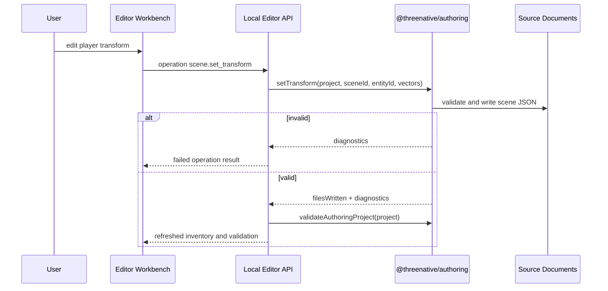

# PRD: Editor Source Document Workbench

Complexity: 13 -> HIGH mode

Score basis: +3 touches 10+ future files, +2 complex source-editing state,
+2 multi-package changes, +2 user-facing editor workflows, +2 shared
authoring/CLI/MCP operation parity, +1 source persistence risk, +1 verification
and docs wiring.

## 1. Context

**Problem:** After the editor package shell exists, users need a workbench that
loads, validates, edits, and saves ThreeNative structured source documents
through the shared authoring core instead of mutating generated IR or a runtime
ECS.

**Files analyzed:**

- `packages/authoring/src/project.ts`
- `packages/authoring/src/documents.ts`
- `packages/authoring/src/operations.ts`
- `packages/authoring/src/schemas.ts`
- `packages/authoring/src/importBundle.ts`
- `packages/authoring/src/__tests__/structured-documents.test.ts`
- `packages/cli/src/commands/scene.ts`
- `packages/cli/src/commands/sourceDocuments.ts`
- `packages/cli/src/commands/authoring.ts`
- `packages/mcp-server/src/index.ts`
- `docs/contracts/authoring-source-documents.md`
- `docs/contracts/authoring-mcp.md`
- `/home/joao/projects/vibe-coder-3d/src/editor/components/panels/HierarchyPanel/HierarchyPanelContent.tsx`
- `/home/joao/projects/vibe-coder-3d/src/editor/components/panels/InspectorPanel/InspectorPanelContent/InspectorPanelContent.tsx`
- `/home/joao/projects/vibe-coder-3d/src/editor/components/shared/Vector3Field.tsx`
- `/home/joao/projects/vibe-coder-3d/src/editor/components/shared/ColorField.tsx`
- `/home/joao/projects/vibe-coder-3d/src/editor/components/shared/InputActionsEditor.tsx`
- `/home/joao/projects/vibe-coder-3d/src/editor/components/materials/MaterialInspector.tsx`

**Current behavior:**

- `@threenative/authoring` can discover source documents, classify them, format
  them deterministically, validate project documents, import recoverable bundle
  catalogs, and perform typed source mutations.
- CLI command groups already expose scene, UI, material, mesh, prefab, input,
  and system mutations with JSON output.
- MCP wraps a subset of those same operations and proves the adapter contract.
- Vibe Coder has useful inspector fields and panels, but they write directly to
  its own component registry.
- ThreeNative source document schemas are still narrower than the full runtime
  surface; unsupported editor controls must be disabled or produce explicit
  diagnostics rather than silently writing invalid data.

## 2. Integration Points

**How will this feature be reached?**

- [x] Entry point identified:
  - `@threenative/editor` workbench components.
  - local editor server API: `GET /api/project`, `POST /api/operation`,
    `POST /api/validate`, `POST /api/build`.
  - CLI equivalent: `tn scene|ui|material|mesh|prefab|input|system ... --json`.
- [x] Caller file identified:
  - `packages/editor/src/workbench/*`
  - `packages/editor/src/server/projectApi.ts`
  - `packages/authoring/src/operations.ts`
  - `packages/cli/src/commands/sourceDocuments.ts`
- [x] Registration/wiring needed:
  - register workbench routes in editor server.
  - expose operation registry from `@threenative/authoring` where CLI/editor can
    share one table.
  - add package tests and CLI parity tests.

**Is this user-facing?**

- [x] YES. This is the first editable editor workflow.
- [ ] NO.

**Full user flow:**

1. User opens a structured-source project in the editor.
2. Workbench displays source scenes, entities, prefabs, UI, materials, meshes,
   input actions, systems, and diagnostics.
3. User changes a transform, material color, UI text/layout, input binding, or
   script reference.
4. Editor sends a typed operation to the local server.
5. Server calls `@threenative/authoring`, writes deterministic source JSON, and
   returns operation diagnostics plus changed files.
6. Editor refreshes project inventory and validation results.

## 3. Solution

**Approach:**

- Use the shared `@threenative/authoring` operation registry from
  [Editor Source Path and Operation Bridge](editor-source-path-and-operation-bridge.md)
  as the source of operation names, arguments, path policy, dispatch, and result
  shape. Editor, CLI, and MCP remain transport adapters over that registry.
- Build source-document-aware hierarchy and inspector panels. They must use
  document paths and source IDs, not generated `world.ir.json` entity indexes.
- Start with bounded edit operations already present in `@threenative/authoring`
  and add missing operation helpers only when a visible control requires them.
- Reuse only small Vibe Coder field visual patterns after a whitelist review.
  Do not import Vibe inspector containers, component adapters, component lists,
  entity hooks, or add/remove component flows.
- Show validation and save/build status from machine-readable diagnostics.

```mermaid
flowchart LR
    UI[Editor Workbench] --> Registry[@threenative/authoring operation registry]
    Registry --> Authoring[@threenative/authoring operations]
    Authoring --> Docs[Structured source JSON]
    Docs --> Validate[validateAuthoringProject]
    Validate --> UI
    Authoring --> CLI[CLI/MCP parity tests]
```

**Key Decisions:**

- [x] Library/framework choices: reuse `@threenative/authoring`; do not create a
  parallel editor mutation engine.
- [x] Error-handling strategy: every operation returns stable authoring
  diagnostics, changed files, and `ok/changed` status.
- [x] Reused utilities: `authoringOperationResult`, `writeChangedProjectDocuments`,
  `validateAuthoringProject`, CLI JSON payload conventions, Vibe Coder field
  presentation components.
- [x] Persistence strategy: write only `content/`, `src/`, or
  `threenative.authoring.json` source documents; reject generated bundle,
  artifact, cache, runtime, and platform paths.

**Data Changes:** May add optional editor-only `metadata` fields to structured
source documents only through schema-versioned authoring validation.

## 4. Dependencies and Transport Contract

Prerequisites:

- [Editor Source Path and Operation Bridge](editor-source-path-and-operation-bridge.md)
  Phase 1 complete, so `content/**` documents classify as source-persistable.
- [Editor Source Path and Operation Bridge](editor-source-path-and-operation-bridge.md)
  Phase 2 complete, so operation names and path policies are shared.
- [Editor Package Shell and Adapter Contract](editor-package-shell-and-adapter-contract.md)
  Phases 1, 3, and 5 complete: `@threenative/editor` exists, `tn editor dev`
  launches, boot config is validated, and adapter access-policy types are
  exported.

Local editor server route contract:

| Route | Request | Success Response | Error Response |
|-------|---------|------------------|----------------|
| `GET /api/project` | query uses boot project only; no arbitrary path | `{ ok: true, projectRevision, documents, diagnostics }` | `{ ok: false, diagnostics }` |
| `POST /api/validate` | `{ projectRevision? }` | shared authoring validation result plus `projectRevision` | diagnostics with file/path/suggestion |
| `POST /api/operation` | `{ name, args, projectRevision? }` where `name` exists in the authoring registry | shared `IAuthoringOperationResult` plus `projectRevision` | diagnostics; source files unchanged |
| `POST /api/build` | `{ projectRevision? }` | `{ ok: true, bundlePath, diagnostics, timings }` | `{ ok: false, diagnostics }` |

Path policy:

- API requests never accept a replacement project root after boot.
- Operation args that contain paths are validated by the shared registry.
- Generated bundle, cache, runtime, artifact, and traversal paths are rejected.

## 5. Inspector and Hierarchy Whitelist

The first editable workbench supports only controls backed by existing
ThreeNative source operations:

| UI Control | Source Operation | State |
|------------|------------------|-------|
| Scene/entity list | source document read | enabled |
| Transform position/rotation/scale | `scene.set_transform` | enabled |
| Camera component metadata | `scene.set_camera` when present | enabled for supported camera shape |
| Material color/roughness | `material.set` | enabled |
| Retained UI text/layout/binding | `ui.add_text`, `ui.set_layout`, `ui.bind` | enabled |
| Input action keys | `input.add_action` | enabled |
| System script module/export | `system.attach_script` / `scene.attach_script` | enabled |
| Prefab component JSON | `prefab.add_component` for supported structured values | guarded; no Vibe component adapters |
| Assets/import settings | no full mutation support yet | inspect-only/disabled |
| Vibe Script/Sound/Terrain/Animation/RigidBody/MeshCollider adapters | none | forbidden until matching ThreeNative source operations exist |

Hierarchy rules:

- Preserve source document order for entities unless an explicit sort is
  requested by the user.
- Parent/child rendering uses explicit ThreeNative hierarchy fields when
  present; otherwise scene documents are displayed as flat entity lists.
- Prefab instances are shown as references, not expanded into editable runtime
  children unless a source prefab document is opened.
- Drag/drop nesting, rename, duplicate, delete, lock state, and multi-select
  group operations are omitted until matching source operations exist.

## 6. Sequence Flow



## 7. Execution Phases

#### Phase 1: Project Load and Validation - Users can browse source documents and diagnostics.

**Files (max 5):**

- `packages/editor/src/workbench/projectState.ts` - project inventory state.
- `packages/editor/src/server/projectApi.ts` - load/validate project API.
- `packages/editor/src/server/operationApi.ts` - registry-backed operation
  endpoint contract, initially returning unsupported diagnostics for unhandled
  operations.
- `packages/editor/src/server/projectApi.test.ts` - API tests with temp project.
- `packages/editor/src/components/panels/ProjectPanel.tsx` - source inventory UI.

**Implementation:**

- [x] Load `IAuthoringProject` through server-side project API.
- [x] Render documents grouped by kind and path.
- [x] Render authoring diagnostics with file/path/severity/suggestion.
- [x] Expose refresh and validate actions.
- [x] Add the `POST /api/operation` endpoint shape with registry validation and
  a clear unsupported-operation diagnostic for operations not wired in this
  phase.
- [x] Reject projects outside the configured project root.

**Tests Required:**

| Test File | Test Name | Assertion |
|-----------|-----------|-----------|
| `packages/editor/src/server/projectApi.test.ts` | `should load structured-source starter inventory` | source documents are grouped by kind |
| `packages/editor/src/server/projectApi.test.ts` | `should surface validation diagnostics` | invalid document returns stable diagnostic code |
| `packages/editor/src/server/projectApi.test.ts` | `should reject unsupported operations without writing source` | operation endpoint returns diagnostic and no file writes |

**User Verification:**

- Action: open `templates/structured-source-starter` in the editor.
- Expected: project documents and diagnostics are visible without building.

#### Phase 2: Scene Hierarchy and Transform Editing - Users can edit entity transforms through source docs.

**Files (max 5):**

- `packages/editor/src/workbench/sceneModel.ts` - scene hierarchy model from
  source documents.
- `packages/editor/src/server/operationApi.ts` - wire `scene.set_transform`.
- `packages/editor/src/workbench/operations.ts` - typed operation client.
- `packages/editor/src/components/panels/TransformInspector.tsx` - transform
  controls.
- `packages/editor/src/workbench/sceneModel.test.ts` - model/operation tests.

**Implementation:**

- [x] Build hierarchy rows from `*.scene.json` and `*.prefab.json` source docs.
- [x] Use string entity IDs and source document paths.
- [x] Wire transform edits to `setTransform`.
- [x] Disable controls for generated/inspectable-only bundle rows.
- [x] Refresh validation after writes.

**Tests Required:**

| Test File | Test Name | Assertion |
|-----------|-----------|-----------|
| `packages/editor/src/workbench/sceneModel.test.ts` | `should build hierarchy from scene source documents` | rows include scene/entity/source path |
| `packages/editor/src/workbench/sceneModel.test.ts` | `should apply transform through authoring operation` | source document is changed and formatted deterministically |

**User Verification:**

- Action: change `player` position in the editor and reopen the project.
- Expected: the scene JSON contains the new transform and validation passes.

#### Phase 3: Material Catalog - Users can edit supported material properties.

**Files (max 5):**

- `packages/editor/src/workbench/materialModel.ts` - material catalog model.
- `packages/editor/src/server/operationApi.ts` - wire `material.set`.
- `packages/editor/src/components/panels/MaterialPanel.tsx` - material browser.
- `packages/editor/src/components/panels/MaterialInspector.tsx` - color and
  roughness controls.
- `packages/editor/src/workbench/materialModel.test.ts` - material tests.

**Implementation:**

- [x] Build material rows from structured material source documents.
- [x] Wire material edits to `setMaterial`.
- [x] Keep texture/PBR fields read-only unless source operations exist.
- [x] Avoid importing Vibe material services or preview runtime.

**Tests Required:**

| Test File | Test Name | Assertion |
|-----------|-----------|-----------|
| `packages/editor/src/workbench/materialModel.test.ts` | `should list material source documents` | material rows are deterministic |
| `packages/editor/src/workbench/materialModel.test.ts` | `should update material through authoring operation` | material source doc receives color/roughness changes |

**User Verification:**

- Action: edit a material color and rebuild.
- Expected: source doc changes and generated bundle reflects the color.

#### Phase 4: Mesh, Prefab, and Asset Catalogs - Users can create supported meshes/prefabs and inspect assets.

**Files (max 5):**

- `packages/editor/src/workbench/catalogModel.ts` - mesh/prefab/asset catalog
  model.
- `packages/editor/src/server/operationApi.ts` - wire mesh/prefab operations.
- `packages/editor/src/components/panels/CatalogPanel.tsx` - catalog browser.
- `packages/editor/src/components/panels/PrefabInspector.tsx` - guarded prefab
  controls.
- `packages/editor/src/workbench/catalogModel.test.ts` - catalog tests.

**Implementation:**

- [x] Wire mesh primitive creation to `createMeshPrimitive`.
- [x] Wire prefab document creation/component edits to existing prefab
  operations for supported structured values only.
- [x] Show asset catalog rows as inspect-only/disabled until asset source
  mutation operations land.
- [x] Do not expose Vibe add-component menus or live component adapters.

**Tests Required:**

| Test File | Test Name | Assertion |
|-----------|-----------|-----------|
| `packages/editor/src/workbench/catalogModel.test.ts` | `should list mesh prefab and asset documents` | catalog rows are deterministic |
| `packages/editor/src/workbench/catalogModel.test.ts` | `should mark asset mutations disabled` | assets are inspect-only without source operation |

**User Verification:**

- Action: create a primitive mesh and inspect an asset row.
- Expected: mesh source doc changes; asset mutation controls are disabled with
  a diagnostic.

#### Phase 5: UI, Input, and System References - Users can edit retained UI and script wiring.

**Files (max 5):**

- `packages/editor/src/workbench/uiInputSystemModel.ts` - UI/input/system model.
- `packages/editor/src/components/panels/UiPanel.tsx` - retained UI editor.
- `packages/editor/src/components/panels/InputPanel.tsx` - input action editor.
- `packages/editor/src/components/panels/SystemPanel.tsx` - script reference
  editor.
- `packages/editor/src/workbench/uiInputSystemModel.test.ts` - operation tests.

**Implementation:**

- [x] Wire UI text/layout/binding edits to `addUiText`, `setUiLayout`, and
  `bindUiDocument`.
- [x] Wire input action creation to `addInputAction`.
- [x] Wire system metadata/script references to `createSystem` and
  `attachSystemScript`.
- [x] Validate script paths stay inside source and do not target generated
  bundles.

**Tests Required:**

| Test File | Test Name | Assertion |
|-----------|-----------|-----------|
| `packages/editor/src/workbench/uiInputSystemModel.test.ts` | `should edit retained UI through source operations` | UI document is changed and validates |
| `packages/editor/src/workbench/uiInputSystemModel.test.ts` | `should reject generated script bundle paths` | diagnostic rejects generated path |

**User Verification:**

- Action: add a HUD text node and attach a system script reference.
- Expected: UI/system source docs change and validation passes.

#### Phase 6: CLI/MCP/Editor Operation Parity - The same operation payloads behave consistently.

**Files (max 5):**

- `packages/cli/src/commands/sourceDocuments.ts` - consume registry where
  practical.
- `packages/mcp-server/src/index.ts` - align wrappers with registry.
- `packages/editor/src/workbench/operationRegistry.test.ts` - editor parity
  tests.
- `docs/STATUS.md` - implementation note when landed.
- `docs/bevy-feature-parity.md` - editor operation parity evidence anchor when
  landed.

**Implementation:**

- [x] Consume shared operation metadata for names, args, source path policy, and
  result shape from `@threenative/authoring`.
- [x] Keep existing CLI behavior stable while reducing duplicated command
  assumptions.
- [x] Make editor operation names match MCP names where possible.
- [x] Add parity tests for at least `scene.set_transform`, `ui.set_layout`,
  `material.set`, and `system.attach_script`.

**Tests Required:**

| Test File | Test Name | Assertion |
|-----------|-----------|-----------|
| `packages/editor/src/workbench/operationRegistry.test.ts` | `should match CLI and editor operation result shape` | editor operation returns authoring result payload |

**User Verification:**

- Action: perform the same transform edit via CLI and editor on temp projects.
- Expected: the same source diff and diagnostics result.

## 8. Verification Strategy

- `pnpm --filter @threenative/authoring test`
- `pnpm --filter @threenative/editor test`
- `pnpm --filter @threenative/cli test`
- `pnpm --filter @threenative/mcp-server test`
- `pnpm check:names`
- `pnpm check:docs`
- focused Playwright smoke once the editor shell has a browser entry.

## 9. Acceptance Criteria

- [x] Editor loads source documents and diagnostics from a real project.
- [x] Scene transform edits persist through `@threenative/authoring`.
- [x] Material/UI/input/system operations use shared authoring behavior.
- [x] Asset mutation remains disabled/read-only until asset source operations
  land.
- [x] Generated/runtime artifacts remain read-only or rejected.
- [x] CLI, MCP, and editor operation names/results are aligned for the promoted
  operations.
- [x] Reopening the project after edits shows the persisted source state.
- [x] `docs/STATUS.md` and `docs/bevy-feature-parity.md` are updated when
  workbench capability slices land.
