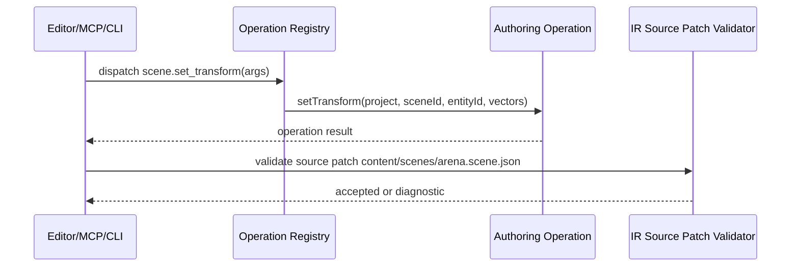

# PRD: Editor Source Path and Operation Bridge

Complexity: 9 -> HIGH mode

Score basis: +2 multi-package changes, +2 complex source-persistence policy,
+2 shared CLI/MCP/editor operation dispatch, +1 contract drift risk, +1 tests
across IR/authoring/CLI/MCP, +1 docs/status/parity updates.

## 1. Context

**Problem:** The visual editor plans depend on `content/**` structured source
documents and shared operation names, but the existing IR editor patch contract
still treats only `src/**` and `scenes/**` as source-persistable and operation
metadata is duplicated across CLI/MCP/editor plans.

**Files analyzed:**

- `docs/contracts/authoring-source-documents.md`
- `docs/contracts/authoring-mcp.md`
- `packages/ir/src/editorProject.ts`
- `packages/ir/src/editorProject.test.ts`
- `packages/authoring/src/sourceKinds.ts`
- `packages/authoring/src/operations.ts`
- `packages/authoring/src/index.ts`
- `packages/cli/src/commands/sourceDocuments.ts`
- `packages/mcp-server/src/index.ts`

**Current behavior:**

- Structured source documents are documented and scaffolded under `content/**`.
- `@threenative/authoring` discovers and mutates source documents under
  `content/**`.
- `classifyEditorDocumentPath()` and editor source patch validation in
  `@threenative/ir` still classify only `src/**` and `scenes/**` as durable
  source paths.
- MCP maps tool names to CLI arguments manually; future editor adapters would
  otherwise duplicate the same mapping again.

## 2. Integration Points

**How will this feature be reached?**

- [x] Entry point identified:
  - `@threenative/ir` editor project validation and preview edit
    classification.
  - `@threenative/authoring` operation descriptors and dispatch.
  - CLI/MCP/editor adapters consuming shared operation metadata.
- [x] Caller file identified:
  - `packages/ir/src/editorProject.ts`
  - `packages/authoring/src/operationRegistry.ts`
  - `packages/cli/src/commands/sourceDocuments.ts`
  - `packages/mcp-server/src/index.ts`
- [x] Registration/wiring needed:
  - export operation registry from `@threenative/authoring`.
  - update IR tests for `content/**` source persistence.
  - update CLI/MCP parity tests for shared operation names.

**Is this user-facing?**

- [x] YES indirectly. It prevents the visual editor from showing valid
  structured source documents as generated/inspect-only.
- [ ] NO.

**Full user flow:**

1. User opens a structured-source project.
2. Editor classifies `content/scenes/arena.scene.json` as source-persistable.
3. User performs an operation such as `scene.set_transform`.
4. Editor/MCP/CLI dispatch the same shared authoring operation.
5. Source patch validation accepts the durable source path and rejects generated
   bundle paths.

## 3. Solution

**Approach:**

- Extend IR editor path classification and source patch validation to treat
  supported structured source documents under `content/**` and
  `threenative.authoring.json` as durable source.
- Keep generated bundle artifacts and `dist/**` rejected.
- Add a shared authoring operation descriptor/dispatcher as the canonical list
  of promoted editor-safe operation names, argument schemas, path policies, and
  result shape.
- Make CLI/MCP/editor adapters thin translators over the shared registry rather
  than separate mutation models.

```mermaid
flowchart LR
    Editor --> Registry[@threenative/authoring operation registry]
    MCP --> Registry
    CLI --> Registry
    Registry --> Ops[@threenative/authoring operations]
    Editor --> IR[@threenative/ir source patch validation]
    IR --> Source[content/** source docs]
```

**Key Decisions:**

- [x] Library/framework choices: reuse existing authoring operations and IR
  editor project helpers.
- [x] Error-handling strategy: stable diagnostics for unsupported source paths,
  generated bundle paths, missing operation args, and registry dispatch errors.
- [x] Reused utilities: `classifyAuthoringDocumentPath`,
  `isGeneratedArtifactPath`, `authoringOperationResult`, and current CLI JSON
  payload shape.

**Data Changes:** None. This updates classification and operation metadata, not
source document schemas.

## 4. Sequence Flow



## 5. Execution Phases

#### Phase 1: Source Path Classification - `content/**` is accepted as durable editor source.

**Files (max 5):**

- `packages/ir/src/editorProject.ts` - path classification and source patch
  validation.
- `packages/ir/src/editorProject.test.ts` - focused classification tests.
- `docs/contracts/authoring-source-documents.md` - contract wording if needed.
- `docs/STATUS.md` - implementation note when landed.
- `docs/bevy-feature-parity.md` - editor/source bridge evidence anchor when
  landed.

**Implementation:**

- [x] Classify `content/**/*.scene.json`, `content/**/*.ui.json`,
  `content/**/*.materials.json`, `content/**/*.meshes.json`,
  `content/**/*.input.json`, `content/**/*.systems.json`,
  `content/**/*.prefab.json`, `content/**/*.audio.json`, and
  `threenative.authoring.json` as source-persistable.
- [x] Keep `dist/**`, `game.bundle/**`, `scripts.bundle.js`, runtime handles,
  cache paths, and generated IR files rejected.
- [x] Update source patch suggestions to name `content/**`, `src/scripts/**`,
  and `threenative.authoring.json`.
- [x] Add tests for accepted content paths and rejected generated paths.

**Tests Required:**

| Test File | Test Name | Assertion |
|-----------|-----------|-----------|
| `packages/ir/src/editorProject.test.ts` | `should classify content source documents as source persistable` | content scene/UI/material/etc. paths are source |
| `packages/ir/src/editorProject.test.ts` | `should reject generated bundle paths as source patches` | dist/game.bundle paths fail validation |

**User Verification:**

- Action: validate a patch targeting `content/scenes/arena.scene.json`.
- Expected: source patch validation accepts the source path.

#### Phase 2: Shared Operation Registry - CLI, MCP, and editor use one operation catalog.

**Files (max 5):**

- `packages/authoring/src/operationRegistry.ts` - operation descriptors and
  dispatcher.
- `packages/authoring/src/operationRegistry.test.ts` - registry tests.
- `packages/authoring/src/index.ts` - public exports.
- `packages/mcp-server/src/index.ts` - consume registry metadata where
  practical.
- `packages/mcp-server/src/index.test.ts` - wrapper parity tests.

**Implementation:**

- [x] Define promoted operation names using the MCP/editor naming convention
  such as `scene.set_transform`, `ui.set_layout`, `material.set`, and
  `system.attach_script`.
- [x] Store argument requirements, path policy, source family, and result shape
  metadata in the registry.
- [x] Dispatch to existing `@threenative/authoring` operations.
- [x] Keep MCP as a thin wrapper and preserve its CLI metadata response.
- [x] Add tests proving registry diagnostics and MCP wrapper names align.

**Tests Required:**

| Test File | Test Name | Assertion |
|-----------|-----------|-----------|
| `packages/authoring/src/operationRegistry.test.ts` | `should dispatch promoted editor-safe operations` | registry returns normal operation result |
| `packages/mcp-server/src/index.test.ts` | `should expose registry-backed tool names` | MCP tool names match registry subset |

**User Verification:**

- Action: dispatch `scene.set_transform` through the registry and MCP wrapper on
  temp projects.
- Expected: both return the same authoring operation payload.

## 6. Verification Strategy

- `pnpm --filter @threenative/ir test`
- `pnpm --filter @threenative/authoring test`
- `pnpm --filter @threenative/mcp-server test`
- `pnpm check:docs`
- `pnpm check:names`

## 7. Acceptance Criteria

- [x] `content/**` structured source documents are source-persistable in the IR
  editor contract.
- [x] Generated bundle/cache/runtime paths remain rejected.
- [x] `@threenative/authoring` exports a shared operation registry for promoted
  editor-safe operations.
- [x] MCP and future editor adapters can consume registry metadata without
  duplicating mutation policy.
- [x] `docs/STATUS.md` and `docs/bevy-feature-parity.md` are updated when the
  bridge lands.
