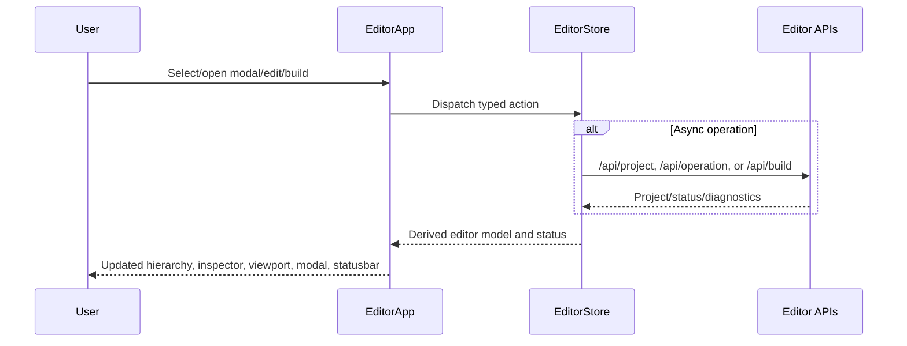

# P0 Editor Zustand State Store Refactor

Priority: P0

Complexity: 8 -> HIGH mode

Score basis: +2 touches 6-10 files, +2 new shared editor state module, +2
complex editor session state and async mutation flow, +1 external dependency,
+1 user-facing modal/selection/viewport behavior risk.

## 1. Context

**Problem:** Editor shell state is already split across component-local
`useState` calls and will become unmaintainable as modal, selection, viewport,
operation, save/build, and e2e workflows expand.

**Files Analyzed:**

- `packages/editor/src/EditorApp.tsx`
- `packages/editor/src/devFixture.tsx`
- `packages/editor/src/adapters/editorModel.ts`
- `packages/editor/src/preview/EditorViewport3d.tsx`
- `packages/editor/src/components/panels/HierarchyPanel.tsx`
- `packages/editor/src/components/panels/InspectorPanel.tsx`
- `packages/editor/package.json`
- `tools/verify/src/editorPackage.ts`

**Current Behavior:**

- `EditorApp` owns only modal state with local `useState`.
- `devFixture.tsx` owns project payload, selected row, hierarchy nesting,
  viewport transform overrides, status text, and async operation side effects.
- Selection, modal, transform, save/build, and add-component flows are wired by
  prop callbacks rather than a single editor-session contract.
- Existing tests mostly validate rendered shell output and server/project
  behavior, not state transitions.

## 2. Integration Points

**How will this feature be reached?**

- [x] Entry point identified: `EditorApp` rendering, editor dev fixture
  bootstrapping, hierarchy/viewport/inspector/modal interactions.
- [x] Caller file identified: `packages/editor/src/EditorApp.tsx` and
  `packages/editor/src/devFixture.tsx`.
- [x] Registration/wiring needed: add `zustand` dependency to
  `@threenative/editor`, introduce a typed editor store module, and route modal,
  selection, hierarchy nesting, project load, status, and transform override
  state through store actions.

**Is this user-facing?**

- [x] YES -> modal open/close behavior, hierarchy selection, viewport picking,
  inspector sync, drag/drop nesting status, save/build/add-object/add-component
  status, and transform commit behavior must remain identical.
- [ ] NO.

**Full user flow:**

1. User opens the editor.
2. Editor initializes the Zustand-backed session store and loads `/api/project`.
3. User selects rows, opens modals, edits fields, adds objects/components,
   builds, saves, and drags viewport transforms.
4. UI reads derived model/status from the store and dispatches typed actions.
5. Existing editor package verification proves no workflow regressed.

## 3. Solution

**Approach:**

- Add `zustand` only to `@threenative/editor`.
- Introduce a typed editor-session store with state, selectors, and actions for
  modal, selected row, project payload, hierarchy nesting, status, and viewport
  transform overrides.
- Keep pure model builders and operation helpers testable outside React.
- Migrate state in vertical slices so each user-visible behavior stays
  verifiable.
- Preserve source-of-truth boundaries: Zustand stores editor session/UI state,
  not generated bundle state or durable project source.

```mermaid
flowchart LR
    UI[EditorApp and panels] --> Store[Zustand editor session store]
    Store --> Model[Derived EditorShellModel]
    Store --> Ops[Typed async editor actions]
    Ops --> API[/api/project, /api/operation, /api/build]
    API --> Source[Structured source documents]
```

**Key Decisions:**

- [x] Library/framework choices: use Zustand for local editor-session state;
  keep React components presentational where practical.
- [x] Error-handling strategy: async store actions set stable status strings and
  preserve existing diagnostics returned by APIs.
- [x] Reused utilities: `createEditorShellModel`, `IEditorShellModel`,
  `IEditorSceneObject`, existing editor operation endpoints, and Playwright
  `verify:editor-package`.

**Data Changes:** None. This is a client/editor package state refactor only.

## 4. Sequence Flow



## 5. Execution Phases

#### Phase 1: Store Foundation and Modal State - Modal state moves out of component-local React state without UI regression.

**Files (max 5):**

- `packages/editor/package.json` - add `zustand`.
- `packages/editor/src/state/editorStore.ts` - create typed store, modal state,
  selected row, status, parent map, transform override state, and reset/action
  helpers.
- `packages/editor/src/state/editorStore.test.ts` - prove modal/selection/status
  transitions and reset behavior.
- `packages/editor/src/EditorApp.tsx` - read/write modal state through the store.
- `packages/editor/src/EditorApp.test.tsx` - prove modal actions still render
  and close through callbacks.

**Implementation:**

- [x] Add `zustand` dependency to the editor package.
- [x] Define `EditorModal`, session state, actions, and test reset helper.
- [x] Move `EditorApp` modal state to the store.
- [x] Keep public `EditorApp` props stable.
- [x] Add tests for modal open/close and selection/status actions.

**Evidence:**

- `packages/editor/src/state/editorStore.ts` owns modal, selection, status,
  parent-map, and transform override session state.
- `packages/editor/src/state/editorStore.test.ts` proves modal/selection/status
  transitions and reset behavior.
- `packages/editor/src/EditorApp.test.tsx` proves modal action rendering remains
  stable.
- `pnpm --filter @threenative/editor test` passes.

**Tests Required:**

| Test File | Test Name | Assertion |
|-----------|-----------|-----------|
| `packages/editor/src/state/editorStore.test.ts` | `should manage modal and selection state through editor store` | modal, selected row, and status update predictably |
| `packages/editor/src/EditorApp.test.tsx` | `should render modal actions from store state` | Add Object modal opens from toolbar and uses existing labels |

**User Verification:**

- Action: open Add, Save, New Scene, Build, Settings, Delete, and AI Chat.
- Expected: each modal opens/closes exactly as before.

#### Phase 2: Dev Fixture Session Store - Project, selection, status, nesting, and transform override state move into the store.

**Files (max 5):**

- `packages/editor/src/state/editorStore.ts` - project payload, parent map,
  transform override actions, and derived model selectors.
- `packages/editor/src/state/editorStore.test.ts` - selection, nesting, and
  transform override tests.
- `packages/editor/src/devFixture.tsx` - replace local `useState` session state
  with store selectors/actions.
- `packages/editor/src/devFixtureModel.ts` - only if fixture defaults need store
  initialization helpers.
- `packages/editor/src/EditorApp.test.tsx` - regression coverage if selectors
  change rendered state.

**Implementation:**

- [x] Move project payload and derived model input state into the store.
- [x] Move selected row, hierarchy nesting, and transform override state into
  store actions.
- [x] Keep existing project-to-editor model behavior deterministic.
- [x] Preserve selected-row defaults after project refresh.
- [x] Avoid stale closure bugs in async dev fixture actions.

**Evidence:**

- `packages/editor/src/devFixture.tsx` now reads project payload, selected row,
  status, parent map, and viewport transform overrides from the Zustand store.
- `packages/editor/src/state/editorStore.test.ts` covers project payload,
  selection, recursive hierarchy nesting rejection, and transform override
  apply/clear behavior.
- `pnpm --filter @threenative/editor test` passes.

**Tests Required:**

| Test File | Test Name | Assertion |
|-----------|-----------|-----------|
| `packages/editor/src/state/editorStore.test.ts` | `should derive editor model from project payload and selection` | selected object inspector follows selection |
| `packages/editor/src/state/editorStore.test.ts` | `should reject recursive hierarchy nesting` | parent map does not create cycles |
| `packages/editor/src/state/editorStore.test.ts` | `should apply and clear viewport transform overrides` | transform override appears then clears after commit |

**User Verification:**

- Action: select hierarchy rows, viewport-pick an object, drag hierarchy rows,
  drag viewport transform.
- Expected: inspector, hierarchy, viewport label, and status stay in sync.

#### Phase 3: Async Operation Actions - Source mutation workflows become store actions with stable status and refresh behavior.

**Files (max 5):**

- `packages/editor/src/state/editorStore.ts` - async action contracts for
  refresh, add primitive, add component, edit property, transform commit,
  create scene, save, and build.
- `packages/editor/src/state/editorStore.test.ts` - mock fetch/action tests.
- `packages/editor/src/devFixture.tsx` - delegate operation callbacks to store
  actions.
- `packages/editor/src/server/operationApi.ts` - only if action contracts expose
  missing diagnostics.
- `packages/editor/src/EditorApp.tsx` - only if callback signatures need narrow
  typing.

**Implementation:**

- [x] Centralize `/api/project`, `/api/operation`, and `/api/build` calls behind
  store actions.
- [x] Preserve existing status messages used by Playwright evidence.
- [x] Keep source mutation payload builders typed and testable.
- [x] Ensure failed actions leave source and selection state coherent.
- [x] Keep `EditorApp` callback props compatible for package consumers.

**Evidence:**

- `packages/editor/src/state/editorStore.ts` owns async refresh, add primitive,
  build, create scene, save, edit property, add component, transform commit, and
  viewport transform workflows.
- `packages/editor/src/devFixture.tsx` delegates editor mutation callbacks to
  store actions and keeps model derivation/rendering only.
- `packages/editor/src/state/editorStore.test.ts` covers project refresh,
  primitive operation sequence, and operation failure status behavior.
- `pnpm --filter @threenative/editor test` passes.

**Tests Required:**

| Test File | Test Name | Assertion |
|-----------|-----------|-----------|
| `packages/editor/src/state/editorStore.test.ts` | `should refresh project and select the first source object` | project payload and selected row update |
| `packages/editor/src/state/editorStore.test.ts` | `should add primitive through operation sequence` | expected operation names and args are posted |
| `packages/editor/src/state/editorStore.test.ts` | `should report operation failures as editor status` | failed fetch result sets status without throwing into UI |

**User Verification:**

- Action: add primitive, add component, edit property, create scene, save, and
  build from the editor.
- Expected: status messages and persisted source behavior match pre-refactor
  behavior.

#### Phase 4: E2E and Documentation Proof - The refactor is proven by the editor gate and documented as the new state boundary.

**Files (max 5):**

- `tools/verify/src/editorPackage.ts` - add focused assertions only if needed
  for store-specific regressions.
- `packages/editor/src/state/editorStore.test.ts` - final selector/action
  coverage gaps.
- `docs/STATUS.md` - record Zustand editor session boundary.
- `docs/bevy-feature-parity.md` - add evidence anchor.
- `docs/PRDs/other/editor-zustand-state-store-refactor.md` - mark completed
  phases and evidence.

**Implementation:**

- [x] Run package tests and `verify:editor-package`.
- [x] Ensure Playwright still proves selection, modal, source mutation, save,
  build, and artifact evidence.
- [x] Document Zustand as editor-session state only.
- [x] Confirm no durable source/generated/runtime boundary changed.

**Evidence:**

- `pnpm --filter @threenative/editor test` passes.
- `pnpm verify:focused verify:editor-package` passes with
  `TN_VERIFY_EDITOR_PACKAGE` status `pass`.
- The gate wrote `editor-package-report.json`,
  `arena.scene.after-edit.json`, `world.after-edit.ir.json`,
  `editor-package-smoke.png`, and `editor-package-edited.png` under
  `tools/verify/artifacts/editor-package/`.

**Tests Required:**

| Test File | Test Name | Assertion |
|-----------|-----------|-----------|
| `tools/verify/src/editorPackage.ts` | `editor-e2e functional editor operations` | existing modal/source/IR evidence still passes |
| `packages/editor/src/state/editorStore.test.ts` | `should keep durable project source out of store-only state` | store state contains project payload/session state, not generated bundle ownership |

**User Verification:**

- Action: run `pnpm verify:focused verify:editor-package`.
- Expected: report passes and editor artifacts are updated under
  `tools/verify/artifacts/editor-package`.

## 6. Verification Strategy

### Unit Tests

- `pnpm --filter @threenative/editor test`
- Store tests for modal, selection, project model derivation, parent map,
  transform overrides, async operation success, and async operation failure.

### Integration / E2E Tests

- `pnpm verify:focused verify:editor-package`

### Gate Checks

- `pnpm check:names`
- `pnpm check:docs`
- `pnpm verify:smoke`

## 7. Acceptance Criteria

- [x] Zustand is the single owner for editor-session state that crosses modal,
  hierarchy, inspector, viewport, and dev fixture operation workflows.
- [x] `EditorApp` no longer owns modal state with local `useState`.
- [x] `devFixture.tsx` no longer owns project payload, selected row, status,
  hierarchy nesting, or transform override state with scattered local
  `useState`.
- [x] Store actions cover refresh, modal open/close, row selection, hierarchy
  nesting, transform override, transform commit, property edit, add primitive,
  add component, create scene, save, and build.
- [x] Existing editor user flows continue to pass in
  `verify:editor-package`.
- [x] Docs describe Zustand as editor-session state only, not a durable source
  of truth.
