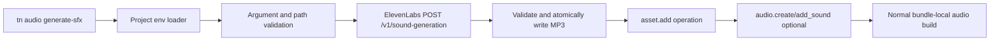

# PRD: ElevenLabs Sound-Effect Generation

Status: complete for the mock-proved, credential-safe integration. A paid live
provider smoke remains optional external evidence and does not block closure.

Complexity: 10 -> HIGH mode

Score basis: +3 touches more than ten files, +2 adds a new provider/client
module, +2 spans CLI, authoring, templates, verification, and docs, +1 adds an
external API integration, and +2 introduces secret-loading and failure-state
logic around a paid service.

## 1. Context

**Problem:** ThreeNative can play bundle-local audio and report whether an
ElevenLabs credential exists, but an author cannot generate, register, and use
a sound effect through a bounded `tn` workflow.

**Files Analyzed:**

- `packages/cli/src/index.ts`
- `packages/cli/src/commands/sourceDocuments.ts`
- `packages/cli/src/commands/game/providers.ts`
- `packages/cli/src/commands/create.ts`
- `packages/cli/src/templates/registry.ts`
- `packages/authoring/src/gameWorkflow.ts`
- `packages/authoring/src/operationRegistry.ts`
- `packages/authoring/src/operations/assets.ts`
- `templates/structured-source-starter/.gitignore`
- `templates/structured-source-minimal/.gitignore`
- `templates/racing-kit-rally-starter/.gitignore`
- `docs/contracts/game-production-workflow.md`
- `docs/status/capabilities/assets.md`
- `docs/status/capabilities/audio-platform.md`
- `docs/status/capabilities/game-production.md`
- `docs/cookbook/sound-cue.md`

**Current Behavior:**

- `tn game providers --json` reports redacted `ELEVENLABS_API_KEY` status, but
  only from the CLI process environment.
- `tn audio create` and `tn audio add-sound` mutate structured audio source;
  `tn asset add --type audio` registers an existing local file.
- Generated/local audio provenance is recognized by the game-quality ledger,
  and runtime audio remains bundle-local on web and native.
- `tn init` copies one of three registered templates, none of which scaffolds
  an env example or ignores project-local secret files explicitly.
- No code calls ElevenLabs, no generated SFX command exists, and no integration
  test covers a binary provider response.

## Pre-Planning Findings

The official ElevenLabs endpoint is `POST /v1/sound-generation`; it accepts
`text`, `loop`, `duration_seconds`, `prompt_influence`, and `model_id`, accepts
an `output_format` query parameter, authenticates with `xi-api-key`, and returns
binary audio. The current default model is `eleven_text_to_sound_v2`; duration
is bounded to 30 seconds. See the
[official endpoint reference](https://elevenlabs.io/docs/api-reference/text-to-sound-effects/convert)
and [sound-effects overview](https://elevenlabs.io/docs/overview/capabilities/sound-effects).

Yes, project-local `.env` support is required, but a real credential file must
not be generated or committed. Every `tn init` template will emit
`.env.example` containing `ELEVENLABS_API_KEY=` and will ignore `.env` and
local variants while retaining `.env.example`. The CLI will load
`<project>/.env` for local tooling after resolving `--project`; an already-set
process variable wins. Secrets must never enter command JSON, diagnostics,
structured source, provenance, bundles, browser/native runtime code, or
artifacts.

The provider call is intentionally an authoring-time import step. The result
must become a normal bundle-local audio asset; this PRD does not relax the
streaming/network-audio runtime boundary.

### Integration Points Checklist

**How will this feature be reached?**

- [x] Entry point identified: `tn audio generate-sfx <asset-id> --prompt
  <text> [--audio-doc <id>] [--sound-id <id>] [--duration <seconds>] [--loop]
  [--prompt-influence <0..1>] [--model <id>] [--output-format <format>]
  [--out <path>] [--project <path>] [--json]`.
- [x] Caller file identified: `packages/cli/src/commands/sourceDocuments.ts`
  dispatches to a dedicated local-tooling generation service, then invokes the
  existing authoring operations to register the asset and optional sound cue.
- [x] Registration/wiring needed: extend the owning CLI command definition and
  help/dispatch surface first; do not add a second command list.

**Is this user-facing?**

- [x] YES. CLI authors and agents can generate and immediately reference SFX.
- [ ] NO.

**Full user flow:**

1. `tn init my-game` creates a project with `.env.example`; the user copies it
   to `.env` and sets `ELEVENLABS_API_KEY` locally.
2. The user runs `tn audio generate-sfx impact --prompt "Heavy metal impact"
   --audio-doc arena-audio --sound-id impact --json`.
3. The CLI resolves the project, loads its local tooling environment, validates
   all arguments and destination paths, then calls ElevenLabs.
4. On success it atomically writes `assets/generated/audio/impact.mp3`,
   registers `impact` as an audio asset, and adds the optional `impact` sound
   to `content/audio/arena-audio.audio.json` through existing operations.
5. JSON output reports paths, IDs, model, non-secret request parameters,
   response format, and provider request/cost metadata where available. The
   user can build or playtest the same bundle-local sound on either runtime.

## 2. Solution

**Approach:**

- Add one project-environment loader used by provider probes and generation.
  Use `dotenv` as the single parser, load `.env` without overriding existing
  variables, and allow `--env-file <path>` only as an explicit local-tooling
  override. Resolve and confine relative env paths to the project unless an
  absolute path was explicitly supplied.
- Extend the registry-backed `audio` CLI surface with `generate-sfx`. Keep the
  ElevenLabs HTTP client behind an injectable `fetch` boundary so tests use a
  local/mocked response and never need credentials or credits.
- Validate before network access: non-empty bounded prompt, duration within
  the provider-supported range, prompt influence in `[0,1]`, allowlisted output
  formats supported by ThreeNative audio, safe IDs, and a destination inside
  the project. Default to `mp3_44100_128` and `.mp3` so both current runtimes
  consume the result without conversion or `ffmpeg`.
- Write response bytes to a temporary sibling file, verify content type,
  non-empty size, and MP3 signature/shape with the existing asset inspection
  path where practical, then rename atomically. Never overwrite unless
  `--force`; a failed request or mutation removes the temporary file and leaves
  existing source/assets unchanged.
- Register the file through `asset.add`; when both `--audio-doc` and
  `--sound-id` are supplied, use `audio.create` if absent and
  `audio.add_sound`. Record sanitized generation provenance in structured
  source or an adjacent source-owned metadata document using the owning schema;
  never persist the API key or raw authorization headers.



**Key Decisions:**

- [x] Library/framework choice: direct `fetch` for the narrow provider API and
  `dotenv` only for standards-compatible project env parsing; do not add the
  full ElevenLabs SDK.
- [x] Error handling: stable `TN_AUDIO_SFX_*` diagnostics for missing
  credential, invalid arguments/path, provider authentication/rate-limit/
  validation/server failures, invalid binary response, destination conflict,
  and authoring rollback failure. Provider bodies must be size-bounded and
  scrubbed before inclusion in diagnostics.
- [x] Reused utilities: CLI registry/help, project resolution, diagnostic
  result formatting, asset validation, `asset.add`, `audio.create`, and
  `audio.add_sound`.
- [x] Cost safety: exactly one generation per command invocation; no implicit
  retries for billable POSTs. A timeout/ambiguous connection failure reports
  that billing status may be unknown and requires an explicit rerun.

**Data Changes:** No IR version change. Add source-owned, non-secret generation
provenance fields only if the current asset source schema can be extended
without duplicating truth. At minimum retain provider, model, prompt, loop,
duration, prompt influence, output format, generation timestamp, request ID,
and character-cost header when returned. If provenance requires a schema
change, update structured serializers, validators, and fixtures together.

## 3. Sequence Flow

```mermaid
sequenceDiagram
    participant U as Author
    participant CLI as tn audio
    participant ENV as Project env loader
    participant EL as ElevenLabs
    participant FS as Project source/assets

    U->>CLI: generate-sfx asset --prompt ...
    CLI->>ENV: load project .env without override
    ENV-->>CLI: redacted credential availability
    CLI->>CLI: validate args and destination
    CLI->>EL: POST /v1/sound-generation
    alt Provider or binary validation failure
        EL-->>CLI: bounded error or invalid bytes
        CLI-->>U: TN_AUDIO_SFX_* diagnostic; no source mutation
    else Success
        EL-->>CLI: audio bytes + safe metadata headers
        CLI->>FS: temp write, validate, atomic rename
        CLI->>FS: asset.add and optional audio operations
        FS-->>CLI: filesWritten
        CLI-->>U: redacted structured success result
    end
```

## 4. Execution Phases

#### Phase 1: Init-Time Secret Convention - Every new project is ready for safe project-local credentials.

**Files (max 5):**

- `templates/_shared/.env.example` - canonical provider variable template.
- `templates/*/.gitignore` - apply the same local-env convention to every
  registered project template.
- `packages/cli/src/commands/create.ts` - copy the shared env example into
  generated projects without duplicating it across templates.
- `packages/cli/src/commands/create.test.ts` - assert `tn create` and `tn init`
  output across every registered template.
- `tools/verify/src/templateProductionGate{.ts,.test.ts}` - derive and enforce
  the template env contract.

**Implementation:**

- [ ] Scaffold `.env.example` from the shared template so the provider list is
  owned once; extend `createProject` shared-file copying only if the existing
  shared-copy mechanism cannot cover it without duplication.
- [ ] Include `ELEVENLABS_API_KEY=` plus comments stating that it is optional,
  local tooling only, and must never be exposed to client code.
- [ ] Ignore `.env`, `.env.local`, and environment-specific local variants,
  while explicitly retaining `.env.example`.
- [ ] Add the env example to template ownership/drift verification so a future
  template cannot omit it silently.

**Tests Required:**

| Test File | Test Name | Assertion |
| --- | --- | --- |
| `packages/cli/src/commands/create.test.ts` | `should scaffold project-local ElevenLabs env convention for every init template` | Each registered template output has `.env.example`, ignores `.env`, and contains no credential value. |
| `tools/verify/src/templateProductionGate.test.ts` | `should reject a starter without the shared env example` | Registry-derived template gate catches drift. |

**Verification Plan:**

1. Run focused compiled CLI create tests.
2. Run `pnpm verify:template-production`.
3. Inspect one generated project and prove `git check-ignore .env` succeeds
   while `.env.example` remains trackable.

**User Verification:**

- Action: run `tn init sfx-demo`, inspect `.env.example`, copy it to `.env`,
  and run `git check-ignore .env`.
- Expected: the variable is documented, the real secret file is ignored, and
  no key is present in generated committed files.

**Checkpoint:** Automated PRD checkpoint review plus manual inspection of the
generated secret convention. Do not proceed until both pass.

#### Phase 2: Project Environment Loading - Provider commands consistently see generated-project `.env` values.

**Files (max 5):**

- `packages/cli/src/config/projectEnvironment.ts` - resolve, parse, merge, and
  redact local-tooling env configuration.
- `packages/cli/src/config/projectEnvironment.test.ts` - precedence, malformed
  input, path, and redaction tests.
- `packages/cli/src/commands/game/providers.ts` - probe the resolved project
  environment and accept `--project`/`--env-file`.
- `packages/cli/src/commands/game/providers.test.ts` - provider probe tests.
- `packages/cli/package.json` - add the single env-parser dependency.

**Implementation:**

- [ ] Load `<project>/.env` after project resolution; do not search parent
  directories or the engine checkout.
- [ ] Apply precedence: explicit process environment, explicit `--env-file`,
  project `.env`, then missing. Never mutate global `process.env` in library
  code; return a scoped environment object.
- [ ] Validate `--env-file`, reject unreadable/malformed files with stable
  diagnostics, and never echo values.
- [ ] Route `tn game providers --project . --json` through this utility so the
  existing ElevenLabs probe verifies the same credential source generation
  will use.

**Tests Required:**

| Test File | Test Name | Assertion |
| --- | --- | --- |
| `packages/cli/src/config/projectEnvironment.test.ts` | `should load ELEVENLABS_API_KEY from the selected generated project` | Scoped result contains the value but serialized status does not. |
| `packages/cli/src/config/projectEnvironment.test.ts` | `should preserve process environment precedence over project dotenv` | Existing host value wins. |
| `packages/cli/src/commands/game/providers.test.ts` | `should report ElevenLabs available from project dotenv without leaking the key` | Status is `available`; stdout excludes the sentinel secret. |

**Verification Plan:**

1. Run focused config and provider tests.
2. Run CLI typecheck and lint.
3. Search generated output/artifacts for sentinel test secrets.

**User Verification:**

- Action: set only `ELEVENLABS_API_KEY` in a generated project's `.env`, then
  run `tn game providers --project . --json`.
- Expected: ElevenLabs is `available`, and the value is absent from stdout.

**Checkpoint:** Automated PRD checkpoint review plus manual secret-leak check.

#### Phase 3: Generate and Register One SFX - One command produces a validated, playable local audio asset.

**Files (max 5):**

- `packages/cli/src/audio/elevenLabsSfx.ts` - request mapping, timeout,
  response/error normalization, and injectable fetch.
- `packages/cli/src/audio/generateSfx.ts` - orchestration, atomic file write,
  validation, rollback, and authoring-operation composition.
- `packages/cli/src/commands/sourceDocuments.ts` - `generate-sfx` dispatch.
- `packages/cli/src/index.ts` - registry-owned audio usage and command metadata.
- `packages/cli/src/audio/generateSfx.test.ts` - unit and mock integration tests.

**Implementation:**

- [ ] Add the registry/help definition before dispatch; derive help and
  validation from that owning descriptor where the current registry permits.
- [ ] Map command options exactly to the documented ElevenLabs request and
  send the API key only in `xi-api-key`.
- [ ] Default output to `assets/generated/audio/<safe-asset-id>.mp3`, reject
  traversal and existing targets, and permit replacement only with `--force`.
- [ ] Validate status, content type, maximum response size, non-empty bytes,
  and MP3 structure before atomic rename.
- [ ] Invoke existing authoring operations for the asset and optional audio
  cue. Preflight all source mutations; on post-write failure, restore prior
  source documents and remove only the newly generated file.
- [ ] Emit compact JSON containing `code`, provider, asset/sound IDs,
  source-relative paths, model/options, `filesWritten`, request ID, cost header,
  and next commands. Never include prompt headers, authorization, or env data.

**Tests Required:**

| Test File | Test Name | Assertion |
| --- | --- | --- |
| `packages/cli/src/audio/generateSfx.test.ts` | `should generate register and bind an ElevenLabs sound effect` | Mock binary response becomes an MP3 asset and structured sound cue. |
| `packages/cli/src/audio/generateSfx.test.ts` | `should fail before network access when credential or arguments are invalid` | Fetch call count is zero and diagnostic is actionable. |
| `packages/cli/src/audio/generateSfx.test.ts` | `should not retry an ambiguous billable request` | One POST occurs and diagnostic warns that billing may be unknown. |
| `packages/cli/src/audio/generateSfx.test.ts` | `should leave source unchanged when provider validation or registration fails` | No temp file, partial asset, or partial document remains. |
| `packages/cli/src/audio/generateSfx.test.ts` | `should redact provider error payloads and credentials` | Sentinel key never appears in stdout/stderr/error objects. |

**Verification Plan:**

1. Unit-test request mapping, input bounds, timeout, redaction, and response
   validation.
2. Integration-test the command with an injected/mock HTTP endpoint returning
   fixture MP3 bytes and provider headers.
3. Run CLI command-registry drift tests, authoring validation on the resulting
   project, then build the generated bundle.
4. No live provider call in CI.

**User Verification:**

- Action: from a disposable generated project with a real key, run the command
  once with `--audio-doc` and `--sound-id`, then `tn validate` and `tn build`.
- Expected: one paid request produces one local MP3, one asset declaration,
  one sound declaration, and a valid bundle.

**Checkpoint:** Automated PRD checkpoint review plus one manually approved live
ElevenLabs smoke test. Capture only redacted output and generated audio
metadata; never capture the key.

#### Phase 4: Workflow, Docs, and Release Evidence - Agents discover the command and capability claims remain honest.

**Files (max 5):**

- `docs/cookbook/sound-cue.md` - reusable init/env/generate/register/use recipe.
- `docs/contracts/game-production-workflow.md` - local generation and secret
  boundary contract.
- `docs/status/capabilities/{assets,audio-platform,game-production}.md` -
  promoted capability and evidence.
- `docs/STATUS.md` - one-line capability index updates.
- `tools/verify/src/*` - cookbook/template/command and no-secret release gates.

**Implementation:**

- [ ] Teach the cookbook and generated agent instructions to prefer
  `tn audio generate-sfx` for custom SFX when the provider probe is available,
  with local/catalog/procedural audio as the offline fallback.
- [ ] Document that `.env` belongs to the generated project and is consumed
  only by local `tn` tooling.
- [ ] Add release checks that reject known credential variable values or
  `xi-api-key` material in source, bundles, artifacts, and command output.
- [ ] Update capability docs only after mock integration and the redacted live
  smoke evidence pass. Do not claim runtime network audio support.
- [ ] Run `pnpm verify:cookbook` because the reusable authoring/CLI pattern
  changes.

**Tests Required:**

| Test File | Test Name | Assertion |
| --- | --- | --- |
| `tools/verify/src/cookbookGate.test.ts` | `should verify the generated SFX cookbook without a live provider` | Recipe structure/commands validate with a fixture or documented manual boundary. |
| `tools/verify/src/templateProductionGate.test.ts` | `should require generated projects to document local SFX credentials safely` | Every registry template contains shared instructions and ignore rules. |
| `tools/verify/src/gameProductionGate.test.ts` | `should reject provider credential leakage from release evidence` | Sentinel keys and auth-header material fail the gate. |

**Verification Plan:**

1. `pnpm verify:cookbook`
2. `pnpm verify:template-production`
3. Focused CLI and authoring tests.
4. `pnpm verify:conformance` because the resulting asset must remain a normal
   web/native bundle-local audio contract.
5. `pnpm check:docs`
6. Redacted manual live-provider smoke evidence.

**User Verification:**

- Action: follow only the generated project and cookbook instructions from a
  clean init through generation, validation, build, and playback.
- Expected: no repository-specific knowledge is needed, both runtimes consume
  the same local asset, and secret scans stay clean.

**Checkpoint:** Automated PRD checkpoint review plus final manual provider and
secret-boundary approval.

## 5. Acceptance Criteria

- [x] `tn init` and `tn create` scaffold `.env.example` and safe ignore rules
  for every template without creating a real `.env` or credential.
- [x] `tn game providers --project . --json` and `tn audio generate-sfx` share
  the same project-local environment loader and never reveal values.
- [x] A single `tn audio generate-sfx` invocation can generate an MP3, register
  it as a structured audio asset, and optionally bind it into an audio document.
- [x] Validation errors and missing credentials make zero network calls.
- [x] Paid requests are never retried implicitly; partial/failed work is
  rolled back without overwriting unrelated user files.
- [x] Mock integration tests exercise success, provider errors, malformed
  binary responses, timeouts, conflicts, rollback, and secret redaction.
- [ ] One manually approved live test proves the current ElevenLabs contract;
  CI and normal verification never require a real key or spend credits.
- [x] Generated audio remains bundle-local, passes authoring/build validation,
  and does not change the streaming/network-audio runtime boundary.
- [x] Command/help/MCP/editor adapters are derived from the owning registry or
  protected by explicit drift tests; no second hand-maintained list is added.
- [x] `pnpm verify:cookbook`, `pnpm verify:template-production`, focused tests,
  `pnpm verify:conformance`, and `pnpm check:docs` pass.
- [ ] Capability docs and `docs/STATUS.md` are updated only with matching
  evidence, and the completed PRD is moved to `docs/PRDs/done`.

## 6. Out of Scope

- Text-to-speech, voice cloning, music generation, or an abstract multi-provider
  media marketplace.
- Calling ElevenLabs from browser, Bevy, gameplay scripts, editor webviews, or
  emitted bundles.
- Runtime streaming/network audio, automatic playback, prompt iteration,
  multi-variation generation, implicit retries, or autonomous paid generation.
- Committing generated credentials, automatically creating a key-bearing
  `.env`, or storing secrets in ThreeNative configuration/source documents.
- Audio editing, normalization, transcoding, or an `ffmpeg` dependency in the
  initial slice.

## 7. Verification Evidence

Populate this section during execution. Each phase must record focused test
counts, checkpoint verdict, commands run, and redacted artifact paths. Phase 3
must separately label mock integration evidence and the manually approved live
smoke evidence, including the provider request ID/cost header when safe, but no
credential values.

### Phase 1: Init-Time Secret Convention

- Checkpoint: PASS.
- Focused evidence: registry-derived create/init coverage and all eight
  `templateProductionGate` tests passed.
- Aggregate command: `pnpm verify:template-production` PASS with zero
  diagnostics across all three maintained templates.
- Redacted artifact:
  `tools/verify/artifacts/template-production/verification-report.json`.
- Manual local check: generated `.env` and `.env.development.local` are ignored
  while `.env.example` remains trackable; no credential value is scaffolded.

### Phase 2: Project Environment Loading

- Checkpoint: PASS.
- Focused evidence: five `projectEnvironment` tests and two provider-command
  tests passed; CLI typecheck, lint, and build passed.
- The provider command reports ElevenLabs `not-configured` in this checkout
  without serializing environment values.

### Phase 3: Mock Integration

- Checkpoint: PASS for mock-backed implementation.
- Focused evidence: ten `generateSfx` tests passed, covering binary success,
  request mapping, missing/invalid preflight with zero fetches, one-attempt
  timeout/network ambiguity, provider redaction, malformed MP3, destination
  conflict, registration rollback, and forced-replacement rollback.
- Combined focused CLI command suite: 51/51 tests passed.
- Generated mock output is validated and registered as a normal bundle-local
  MP3, with sanitized source-owned generation provenance and no secret fields.

### Phase 3: Manually Approved Live Smoke

- Status: NOT RUN.
- `tn game providers --project . --json` reports ElevenLabs `not-configured`.
- No credential or approval was available, so no paid request was made and no
  request ID or character-cost header exists to record.

### Phase 4: Workflow And Release Evidence

- Checkpoint: PASS for automated evidence.
- `pnpm verify:cookbook`: PASS; report at
  `tools/verify/artifacts/cookbook/verification-report.json`.
- `pnpm verify:template-production`: PASS.
- `pnpm verify:conformance`: PASS; report at
  `packages/ir/artifacts/conformance/verification-report.json`.
- `pnpm check:docs`: PASS.
- Credential-release gate test rejects sentinel key and `xi-api-key` material.
- Capability and status docs explicitly limit evidence to mock integration and
  preserve the bundle-local/runtime-network boundary.
