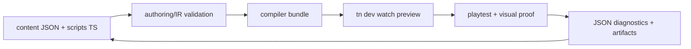
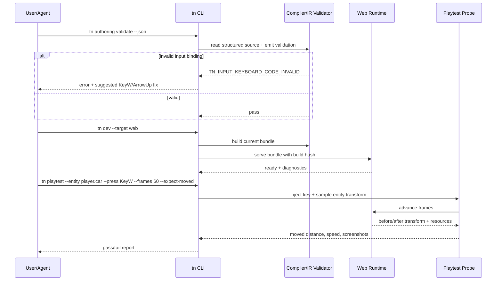

# PRD: Playable Game Authoring Loop Hardening

Complexity: 11 -> HIGH mode

Score basis: +3 touches 10+ future files, +2 spans CLI/compiler/IR/runtime-web/Bevy/templates/docs, +2 adds new validation and proof surfaces, +2 changes dev-loop behavior, +1 affects generated starter quality, +1 requires visual and runtime verification.

## 1. Context

**Problem:** ThreeNative can technically build playable games, but the current CLI and engine loop lets basic game-authoring mistakes pass silently and makes agents/developers debug stale builds, bad JSON, camera scale, modular assets, and input responsiveness by guesswork.

**Goal:** Make creating a small playable game feel closer to raw Three.js iteration while preserving ThreeNative's source -> compiler -> IR -> web/native adapter architecture.

**Non-goals:**

- Do not abandon structured source, IR bundles, or Bevy/Web portability.
- Do not expose raw Three.js or Bevy handles as authoring source.
- Do not build a full visual editor in this PRD.
- Do not make screenshot-perfect art direction a runtime adapter concern.
- Do not rely on generated `dist/**` edits as source fixes.

**Files Analyzed:**

- `AGENTS.md`
- `docs/PRDs/README.md`
- `docs/PRDs/other/agent-friendly-project-and-visual-debugging-workflows.md`
- `docs/PRDs/other/editor-ready-modular-authoring-and-scripting-architecture.md`
- `packages/cli/src/commands/dev.ts`
- `packages/cli/src/commands/scene.ts`
- `packages/cli/src/commands/asset.ts`
- `packages/compiler/src/emit/bundle.ts`
- `packages/ir/src/validate.ts`
- `packages/runtime-web-three/src/input.ts`
- `packages/runtime-web-three/src/render.ts`
- `examples/racing-kit-rally/content/input/rally.input.json`
- `examples/racing-kit-rally/src/scripts/racing.ts`
- `/home/joao/projects/threejs-racing-kit/src/main.js`

**Current Behavior:**

- `tn dev --target web` starts a preview, but it is not watch mode by default and can keep serving stale bundle data after source changes unless restarted or rebuilt carefully.
- Structured input source can contain plausible but runtime-dead bindings such as `keyboard.w` or `keyboard.arrow-up`; these compile into IR and fail only at gameplay time.
- Runtime input uses browser `KeyboardEvent.code` values such as `KeyW` and `ArrowUp`, but the authoring surface does not consistently validate or normalize ergonomic aliases.
- There is no focused command that proves "after pressing throttle for N frames, the player entity moved and speed changed."
- Modular asset kits require pivot, bounds, road-surface, and connector inference; without CLI proof, track assembly devolves into visual guessing.
- Camera framing and scale tuning require manual screenshot inspection instead of authored look-at helpers, target occupancy checks, and actionable diagnostics.
- A raw Three.js prototype can iterate scene, input, camera, and movement in one immediate loop, while ThreeNative requires source edits, compile, bundle validation, runtime load, and visual proof. That extra architecture is valuable but currently under-tooled.

## Pre-Planning Findings

No secret configuration is required. The feature is developer-facing and must work through CLI commands, structured source validation, generated templates, and runtime proof artifacts.

**How will this feature be reached?**

- [x] Entry points identified:
  - `tn authoring validate --json`
  - `tn validate --json`
  - `tn dev --target web`
  - `tn scene proof ...`
  - proposed `tn playtest ...`
  - proposed `tn input inspect/normalize ...`
  - proposed `tn scene proof-gameplay ...`
- [x] Caller files identified:
  - `packages/cli/src/index.ts`
  - `packages/cli/src/commands/dev.ts`
  - `packages/cli/src/commands/scene.ts`
  - `packages/cli/src/commands/sourceDocuments.ts`
  - new/focused CLI command modules as needed
  - `packages/compiler/src/emit/bundle.ts`
  - `packages/ir/src/validate.ts`
  - `packages/runtime-web-three/src/input.ts`
  - `packages/runtime-web-three/src/render.ts`
  - `templates/**`
- [x] Registration/wiring needed:
  - CLI command registration and help topics.
  - IR/source diagnostics and tests.
  - Runtime proof hooks or verify-tool support.
  - Starter template updates.
  - Docs/status updates where capability gates change.

**Is this user-facing?**

- [x] YES. Users and agents directly run these commands while building games.
- [ ] NO.

**Full user flow:**

1. User creates or edits a game in structured source.
2. User runs `tn authoring validate --json`.
3. CLI rejects malformed or runtime-dead input/camera/asset declarations with stable diagnostics and suggestions.
4. User runs `tn dev --target web`.
5. Dev server builds the current source, watches durable source files, and clearly reports rebuild state.
6. User runs `tn playtest --input keyboard.KeyW --entity player.car --expect-moved`.
7. CLI launches or attaches to preview, injects input, advances frames, and reports entity movement/speed/camera evidence.
8. User runs `tn scene proof-modular-track` or generator/proof commands for modular kits.
9. CLI reports connector gaps, off-road actors, camera framing, track width versus vehicle scale, and artifact paths.

## 2. Solution

**Approach:**

- Add strict source and IR validation for input bindings, with either accepted aliases normalized deterministically or unsupported aliases rejected before runtime.
- Make `tn dev` behave like a real game iteration loop: build current source before serving, support watch/rebuild as the default or a clearly promoted mode, and expose current bundle hash/build time in preview diagnostics.
- Add a playtest proof command that can press keys/buttons, advance frames, and assert that authored gameplay responds.
- Promote modular-kit inspection from "asset metadata dump" to "assembly contract": pivots, connector ports, road-surface bounds, recommended lane width, vehicle scale ratio, and gap diagnostics.
- Add camera and scale proof commands that answer "is the player visible, reasonably sized, and level?" with JSON metrics.
- Update templates so starter games ship with validated controls, tuned movement, watch-friendly scripts, and proof commands in README.
- Preserve web/Bevy parity by making all proof commands consume emitted IR and runtime adapters, not raw Three.js-only state.



**Key Decisions:**

- [x] Input bindings must not silently compile into runtime-dead controls.
- [x] Dev preview must surface stale-build state and current bundle identity.
- [x] Playability proof is a first-class CLI concern, not just screenshot proof.
- [x] Modular kit assembly should be driven by inspected geometry/connectors, not manual eyeballing.
- [x] Camera/scale proof should report metrics, not just save a screenshot.
- [x] Templates are regression fixtures; broken starter controls are engine bugs.

**Data Changes:**

- Add or extend JSON diagnostics for input validation, dev preview state, playtest reports, modular-kit reports, and camera/scale proof.
- No database changes.

**Risks:**

- Rejecting existing `keyboard.w` style bindings may break projects that accidentally rely on them. Mitigate with a transitional warning plus `tn input normalize` or a documented migration.
- Browser automation can be unavailable on some hosts. Commands must return `unsupported` diagnostics instead of hanging.
- Watch mode can hide build errors if not reported clearly. Preview overlay/JSON state must include latest build status.
- Geometry-derived modular connectors can be imperfect for arbitrary assets. Reports must include confidence, raw measurements, and escape hatches for authored overrides.
- Bevy proof may lag web proof. Any web-only proof must be labeled web-only until native parity exists.

## 3. Sequence Flow



## 4. Execution Phases

#### Phase 1: Strict Input Validation and Normalization - Bad controls fail before runtime.

**Files (max 5):**

- `packages/ir/src/validate.ts` - validate keyboard codes and binding shape.
- `packages/ir/src/input.test.ts` - accepted and rejected keyboard binding coverage.
- `packages/compiler/src/emit/bundle.ts` - normalize structured source bindings or preserve rejected diagnostics.
- `packages/compiler/src/emit/bundle.test.ts` - structured source alias/rejection coverage.
- `docs/contracts/input.md` - document accepted binding syntax and migration.

**Implementation:**

- [ ] Define supported keyboard code policy: canonical `KeyboardEvent.code` values are emitted IR.
- [ ] Decide transitional alias handling:
  - accepted aliases such as `keyboard.w` normalize to `KeyW`; or
  - aliases are rejected with a suggested canonical code.
- [ ] Add diagnostics:
  - `TN_INPUT_KEYBOARD_CODE_INVALID`
  - `TN_INPUT_KEYBOARD_CODE_NORMALIZED` if warnings are supported.
- [ ] Validate action bindings, axis negative/positive/value bindings, controls settings default bindings, and persisted overrides.
- [ ] Make diagnostics include source path and suggested replacement.

**Tests Required:**

| Test File | Test Name | Assertion |
|-----------|-----------|-----------|
| `packages/ir/src/input.test.ts` | `should reject invalid keyboard code when input binding uses lowercase key` | `keyboard.w` emits `TN_INPUT_KEYBOARD_CODE_INVALID` or normalization warning |
| `packages/ir/src/input.test.ts` | `should accept canonical KeyboardEvent code bindings` | `KeyW`, `ArrowUp`, `Space`, `Escape` pass |
| `packages/compiler/src/emit/bundle.test.ts` | `should normalize structured keyboard aliases before emitting input ir` | source `keyboard.w` emits `KeyW`, if alias policy chosen |
| `packages/compiler/src/emit/bundle.test.ts` | `should report structured input binding diagnostics with source path` | invalid binding points at `content/input/...` |

**User Verification:**

- Action: run `tn authoring validate --project examples/racing-kit-rally --json`.
- Expected: invalid controls fail or normalize with explicit diagnostics; no silent runtime-dead controls.

#### Phase 2: Dev Preview Freshness and Watch Defaults - The page serves the current source.

**Files (max 5):**

- `packages/cli/src/commands/dev.ts` - build/watch semantics, JSON report, preview state.
- `packages/cli/src/commands/dev.test.ts` - stale-build and watch behavior.
- `packages/runtime-web-three/src/devServer.ts` - expose bundle hash/build metadata.
- `packages/runtime-web-three/src/render.ts` - include build metadata in readiness diagnostics.
- `docs/workflows/dev-loop.md` - document reliable edit/build/preview flow.

**Implementation:**

- [ ] Ensure `tn dev --target web` always builds the current durable source before serving.
- [ ] Add `--watch` as the promoted default for local project development, or add explicit `TN_DEV_NOT_WATCHING` warning with next command.
- [ ] Include bundle path, bundle hash, build time, and source build status in JSON output and preview diagnostics.
- [ ] On rebuild failure, keep serving last good bundle but report stale status visibly and in JSON.
- [ ] Add a lightweight endpoint or global runtime state for current bundle metadata.

**Tests Required:**

| Test File | Test Name | Assertion |
|-----------|-----------|-----------|
| `packages/cli/src/commands/dev.test.ts` | `should build before starting web preview` | preview receives newly emitted bundle path |
| `packages/cli/src/commands/dev.test.ts` | `should report stale last-good bundle when rebuild fails` | JSON includes stale state and diagnostic |
| `packages/runtime-web-three/src/devServer.test.ts` | `should expose current bundle metadata` | metadata includes hash/build time |

**User Verification:**

- Action: change an input binding, run `tn dev --target web`, and reload the page.
- Expected: preview reports the rebuilt bundle hash and uses the new binding without manual restart confusion.

#### Phase 3: Playability Proof Command - CLI proves the player responds to input.

**Files (max 5):**

- `packages/cli/src/commands/playtest.ts` - new command implementation.
- `packages/cli/src/index.ts` - command registration.
- `packages/cli/src/commands/playtest.test.ts` - command parsing and report behavior.
- `tools/verify/src` or existing verify helpers - browser/input/frame probe support.
- `docs/workflows/playtest-proof.md` - examples and report contract.

**Implementation:**

- [ ] Add `tn playtest --project <path> --entity <id> --press <code> --frames <n> --expect-moved [--json]`.
- [ ] Start or attach to a web preview, wait for runtime readiness, press/release input, and sample target entity transform.
- [ ] Report before/after transform, movement distance, active input actions if available, resource deltas, screenshot artifact, and pass/fail diagnostics.
- [ ] Add diagnostics:
  - `TN_PLAYTEST_ENTITY_NOT_FOUND`
  - `TN_PLAYTEST_INPUT_NO_EFFECT`
  - `TN_PLAYTEST_RUNTIME_NOT_READY`
  - `TN_PLAYTEST_BROWSER_UNAVAILABLE`
- [ ] Keep native/Bevy proof optional until adapter support exists; report web-only clearly.

**Tests Required:**

| Test File | Test Name | Assertion |
|-----------|-----------|-----------|
| `packages/cli/src/commands/playtest.test.ts` | `should fail when entity does not move after input` | report includes `TN_PLAYTEST_INPUT_NO_EFFECT` |
| `packages/cli/src/commands/playtest.test.ts` | `should pass when target transform changes after input` | movement distance exceeds threshold |
| `tools/verify/src/playtest.test.ts` | `should inject keyboard code into preview` | runtime receives `KeyW` and action becomes true |

**User Verification:**

- Action: run `tn playtest --project examples/racing-kit-rally --entity player.car --press KeyW --frames 60 --expect-moved --json`.
- Expected: report passes with nonzero distance and artifact paths.

#### Phase 4: Modular Kit Assembly Proof - Track generation stops being visual guesswork.

**Files (max 5):**

- `packages/cli/src/commands/asset.ts` - connector/road-surface inspection improvements.
- `packages/cli/src/commands/scene.ts` - generator/proof refinements.
- `packages/cli/src/commands/asset.test.ts` - connector extraction coverage.
- `packages/cli/src/commands/scene-command.test.ts` - generated track and gap diagnostics.
- `docs/workflows/open-source-3d-asset-kits.md` - authoring workflow.

**Implementation:**

- [ ] Inspect GLB road materials/meshes for local road-surface bounds and cardinal connector ports.
- [ ] Report pivot offset, dimensions, suggested tile center spacing, and connector confidence.
- [ ] Add gap diagnostics between generated neighbors with world-space coordinates and expected/actual endpoints.
- [ ] Add actor-on-road proof and vehicle-scale-to-lane-width ratio.
- [ ] Add authored override support for kits where geometry inference is ambiguous.

**Tests Required:**

| Test File | Test Name | Assertion |
|-----------|-----------|-----------|
| `packages/cli/src/commands/asset.test.ts` | `should report road connector ports for modular GLB` | JSON includes cardinal road ports |
| `packages/cli/src/commands/scene-command.test.ts` | `should reject generated track with connector gaps` | diagnostic includes gap endpoints |
| `packages/cli/src/commands/scene-command.test.ts` | `should warn when vehicle scale is too large for lane width` | diagnostic includes ratio and suggestion |

**User Verification:**

- Action: run `tn scene proof-modular-track racing-kit-rally --asset-dir assets --prefix road.modular --actors player.car,rival.car --json`.
- Expected: no connector gaps, actors on road, lane/vehicle scale reported.

#### Phase 5: Camera and Scale Proof - Bad framing becomes measurable.

**Files (max 5):**

- `packages/cli/src/commands/scene.ts` - camera look-at/framing proof commands.
- `packages/cli/src/verify/cameraViews.ts` - occupancy and roll/horizon metrics.
- `packages/cli/src/commands/scene-command.test.ts` - camera command coverage.
- `tools/verify/src` - screenshot metric integration.
- `docs/workflows/visual-qa.md` - camera/scale acceptance.

**Implementation:**

- [ ] Add or finalize `tn scene set-camera-look-at` with no-roll behavior.
- [ ] Add `tn scene proof-camera --camera <id> --target <entity> --min-occupancy <n> --max-roll <n>`.
- [ ] Report target screen occupancy, target visibility, active camera, approximate roll, clipping range, and world bounds.
- [ ] Add suggested camera position/target hints for common third-person and racing starts.
- [ ] Ensure web/Bevy adapter differences are diagnosed as mapping issues, not screenshot color tuning.

**Tests Required:**

| Test File | Test Name | Assertion |
|-----------|-----------|-----------|
| `packages/cli/src/commands/scene-command.test.ts` | `should frame a camera with no roll` | emitted transform rotation has zero roll |
| `tools/verify/src/camera-proof.test.ts` | `should fail when player occupancy is below threshold` | diagnostic includes occupancy value |
| `tools/verify/src/camera-proof.test.ts` | `should fail when active camera target is outside viewport` | diagnostic references camera and target |

**User Verification:**

- Action: run `tn scene proof-camera racing-kit-rally --camera camera.main --target player.car --json`.
- Expected: player is visible, framed, and reported with occupancy metrics.

#### Phase 6: Starter Template Quality Gates - Templates are playable by default.

**Files (max 5):**

- `templates/racing-kit-rally-starter/**` - validated controls, movement, README proof commands.
- `packages/cli/src/templates/registry.ts` - template registration if needed.
- `packages/cli/src/commands/create.test.ts` - template smoke coverage.
- `tools/verify/src` - example/template proof gate.
- `docs/STATUS.md` - update capability evidence if this becomes release-gated.

**Implementation:**

- [ ] Every game template must include `AGENTS.md`, `CLAUDE.md`, proof commands, and known-good controls.
- [ ] Add a template smoke gate that builds, validates input, starts preview, and proves one primary action changes game state.
- [ ] For racing templates, assert acceleration reaches a minimum movement threshold within 60 frames.
- [ ] Keep template gameplay tuning in durable `src/scripts/**/*.ts` and structured JSON, not generated bundles.
- [ ] Document remaining limitations honestly.

**Tests Required:**

| Test File | Test Name | Assertion |
|-----------|-----------|-----------|
| `packages/cli/src/commands/create.test.ts` | `should scaffold racing template with validated controls` | generated input uses canonical bindings |
| `tools/verify/src/template-playability.test.ts` | `should prove starter player moves on throttle` | movement threshold passes |
| `tools/verify/src/template-playability.test.ts` | `should fail starter with malformed input binding` | validation fails before runtime |

**User Verification:**

- Action: `tn create scratch-racer --template racing-kit-rally-starter`, then run listed README proof commands.
- Expected: new project builds and the kart moves under CLI playtest.

## 5. Checkpoint Protocol

After each phase:

- Run the focused tests listed in that phase.
- Run the narrowest relevant package build.
- Run `tn authoring validate --json` or equivalent fixture validation for affected examples/templates.
- For phases touching runtime proof, save artifacts under the example-local artifact root.
- Spawn the PRD work reviewer for automated checkpoint review when available.

Manual checkpoint is required for Phases 3, 4, 5, and 6 because they involve visual/runtime playability.

## 6. Verification Strategy

**Required command coverage:**

```bash
pnpm --filter @threenative/ir test -- dist/input.test.js
pnpm --filter @threenative/compiler test -- dist/emit/bundle.test.js
pnpm --filter @threenative/cli test -- dist/commands/playtest.test.js dist/commands/scene-command.test.js dist/commands/asset.test.js
node packages/cli/dist/index.js authoring validate --project examples/racing-kit-rally --json
node packages/cli/dist/index.js build --project examples/racing-kit-rally --json
node packages/cli/dist/index.js playtest --project examples/racing-kit-rally --entity player.car --press KeyW --frames 60 --expect-moved --json
node packages/cli/dist/index.js scene proof-modular-track racing-kit-rally --project examples/racing-kit-rally --asset-dir assets --prefix road.modular --actors player.car,rival.car --json
```

**Evidence required:**

- Input validation catches or normalizes all malformed keyboard examples from this session.
- Dev preview report proves it is serving the latest bundle.
- Playtest report proves the player entity moved after input.
- Modular track proof reports no connector gaps and actors on road.
- Camera proof reports player visibility and acceptable framing.
- Template smoke proof passes for the racing starter.

## 7. Acceptance Criteria

- [ ] Bad input JSON cannot silently compile into runtime-dead controls.
- [ ] `tn dev` makes stale bundle state visible and has a reliable watch/rebuild path.
- [ ] A CLI command can prove a game entity responds to input.
- [ ] Modular track assembly reports connector gaps and actor placement failures before screenshot inspection.
- [ ] Camera and scale proof produce numeric diagnostics for framing issues.
- [ ] Racing starter controls, acceleration, camera, and track scale pass automated playability proof.
- [ ] Docs explain the ThreeNative game-authoring loop and its differences from raw Three.js plainly.
- [ ] Web proof is implemented; Bevy/native parity is either implemented or explicitly diagnosed as pending.

## Session Learnings Captured

- Silent validation gaps are more damaging than missing features. `keyboard.w` looked reasonable, compiled, and failed only when the user tried to drive.
- Stale preview state wastes trust. A rebuild that happens before a source patch, or a non-watch server serving old data, looks like the engine is broken even after source is fixed.
- Visual proof alone is insufficient for games. A screenshot can show a kart and track while the primary verb, acceleration, is broken.
- Raw Three.js feels easier because scene state, input, camera, and tuning live in one immediate loop. ThreeNative can keep its architecture only if the CLI closes that loop with validation, watch, and playtest proof.
- Modular kit assembly needs geometry-aware tooling. AI/manual placement by screenshot is too slow and unreliable.
- Starter templates must be treated as product quality bars, not demos. If a starter's kart does not move, the engine has failed the first-use workflow.
