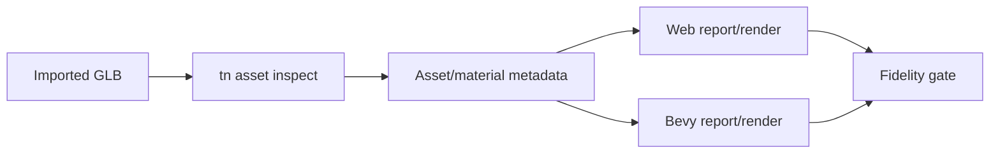
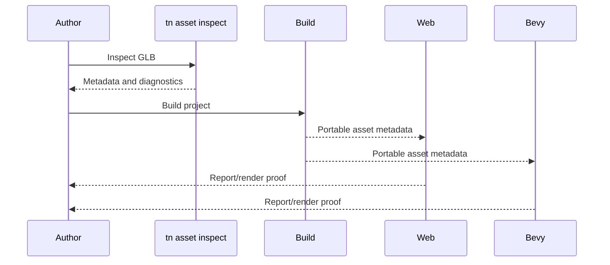

# PRD: Imported glTF Visual Fidelity

Complexity: 8 -> HIGH mode

Score basis: +2 touches 6-10 future files, +2 spans asset, material, animation,
and compiler contracts, +2 requires web/Bevy report or screenshot parity, +1
updates CLI inspection, +1 updates docs and gates.

## 1. Context

**Problem:** Imported assets still need better preservation and diagnostics for
glTF material extensions, texture transforms, extras, morph target names, and
unsupported loader-specific behavior.

**Files Analyzed:**

- `docs/bevy-feature-parity.md`
- `docs/PRDs/other/advanced-visual-effects-lighting-material-depth.md`
- `docs/PRDs/other/advanced-animation-physics-depth.md`

**Current Behavior:**

- Bundle-local GLB/glTF assets, dependencies, scene instances, animation clips,
  and inspection workflows are promoted.
- Some advanced PBR scalar and texture fields are promoted, but extension
  coverage is uneven.
- The parity file now asks for preserving/reporting texture transform,
  clearcoat, transmission, emissive strength, extras, anisotropy, and morph
  metadata without exposing Bevy loader internals.

**How will this feature be reached?**

- [x] Entry point identified: `tn asset inspect`, compiler asset manifest emit,
  web/native model loading, and conformance fixtures.
- [x] Caller file identified: asset inspectors, compiler asset normalization,
  web glTF loader integration, Bevy asset report extraction, and verify gates.
- [x] Registration/wiring needed: report schema fields, fixture assets,
  unsupported-extension diagnostics, docs/status evidence, and focused gate
  commands.

**Is this user-facing?**

- [x] YES. Authors expect imported models to keep authored material identity and
  to fail clearly when metadata is not portable.
- [ ] NO.

**Full user flow:**

1. User adds a GLB with advanced material or morph metadata.
2. `tn asset inspect` reports recognized metadata and unsupported extensions.
3. Build emits portable metadata or diagnostics.
4. Web and Bevy runtimes report or render the same promoted subset.

## 2. Solution

**Approach:**

- Preserve source provenance for all recognized metadata, even when not
  visually promoted.
- Promote only fields with deterministic report or screenshot evidence.
- Reject executable/custom transforms and backend-only loader behavior.
- Keep Bevy loader details private behind ThreeNative asset/material reports.

**Key Decisions:**

- [x] Library/framework choices: use existing glTF loaders and asset inspection
  pipeline.
- [x] Error-handling strategy: unsupported extensions become stable diagnostics
  with source path/provenance and fallback suggestions.
- [x] Reused utilities: asset manifest validation, model-test, conformance
  fixtures, and screenshot/report gates.

**Data Changes:** Extend asset/material/model inspection reports. No database
migrations.

## 3. Sequence Flow

## 4. Execution Phases

#### Phase 1: Metadata Preservation - Asset inspection reports the portable subset and unsupported extensions.

**Files (max 5):**

- `packages/cli/src/*` - asset inspection output
- `packages/ir/src/*` - metadata/report schemas
- `packages/compiler/src/*` - asset metadata normalization
- `packages/ir/fixtures/*` - glTF metadata fixtures
- `docs/bevy-feature-parity.md` - evidence row update

**Implementation:**

- [x] Report texture transforms, extras, material extensions, and morph target
  names with provenance.
- [x] Add stable diagnostics for unsupported extensions and custom executable
  transforms.
- [x] Preserve metadata without implying runtime visual support.

**Tests Required:**

| Test File | Test Name | Assertion |
| --- | --- | --- |
| `packages/cli/src/asset-inspect.test.ts` | `should report glTF material extension metadata` | Output includes extension id and source path. |
| `packages/compiler/src/assets.test.ts` | `should preserve portable glTF metadata in manifest` | Manifest contains normalized metadata rows. |

**Verification Plan:**

1. CLI inspection fixture tests.
2. Compiler metadata normalization tests.
3. `pnpm check:docs`.

**User Verification:**

- Action: run `tn asset inspect` on a fixture GLB.
- Expected: report lists supported metadata and unsupported extensions clearly.

#### Phase 2: Runtime Fidelity Evidence - Promoted metadata maps across web and Bevy.

**Files (max 5):**

- `packages/runtime-web-three/src/*` - web material/model metadata report
- `runtime-bevy/crates/threenative_runtime/src/*` - native metadata report
- `tools/verify/src/*` - fidelity gate
- `examples/*` - fixture scene if needed
- `docs/STATUS.md` - status evidence

**Implementation:**

- [x] Prove promoted material metadata in web and Bevy reports.
- [x] Add screenshot proof only for fields whose visual result can be compared
  without per-adapter tuning.
- [x] Keep anisotropy/specular tint and loader feature flags diagnostic-only
  until visual proof exists.

**Tests Required:**

| Test File | Test Name | Assertion |
| --- | --- | --- |
| `packages/runtime-web-three/src/gltf-fidelity.test.ts` | `should report promoted glTF material metadata` | Web report matches fixture metadata. |
| `runtime-bevy/crates/threenative_runtime/tests/gltf_fidelity.rs` | `should report promoted glTF material metadata` | Native report matches fixture metadata. |
| `tools/verify/src/gltf-fidelity.test.ts` | `should fail when runtime metadata reports drift` | Gate names mismatched field path. |

**Verification Plan:**

1. Web/native report tests.
2. Focused fidelity gate.
3. `pnpm verify:conformance`.

**User Verification:**

- Action: open the fixture in web and native preview.
- Expected: promoted material identity is retained or unsupported fields are
  diagnosed.

## 5. Acceptance Criteria

- [x] glTF metadata preservation is source-provenanced and schema-backed.
- [x] Unsupported extensions fail or warn with stable diagnostics.
- [x] Promoted fields have web and Bevy report or screenshot evidence.
- [x] No Bevy loader internals become public authoring API.
