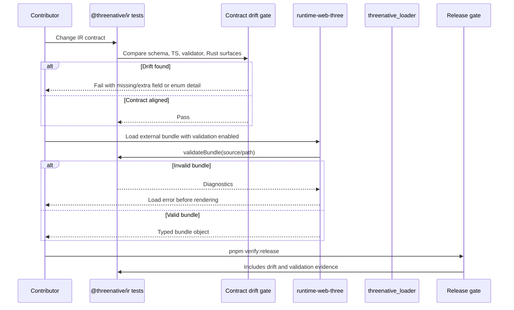

# PRD: IR Contract Drift Hardening

Complexity: 10 -> HIGH mode

## 1. Context

**Problem:** The IR contract is represented in TypeScript interfaces, JSON Schema
files, hand-written validators, web loader casts, and Rust serde structs, which
creates drift risk as the portable bundle format grows.

**Files Analyzed:**

- `AGENTS.md`
- `packages/AGENTS.md`
- `runtime-bevy/AGENTS.md`
- `package.json`
- `packages/ir/package.json`
- `packages/ir/src/types.ts`
- `packages/ir/src/schemas.ts`
- `packages/ir/src/validate.ts`
- `packages/ir/src/schema.test.ts`
- `packages/ir/src/contractDrift.test.ts`
- `packages/ir/schemas/world.schema.json`
- `packages/ir/schemas/manifest.schema.json`
- `packages/compiler/src/emit/bundle.ts`
- `packages/compiler/src/validate/index.ts`
- `packages/runtime-web-three/src/loadBundle.ts`
- `packages/runtime-web-three/src/loadBundle.test.ts`
- `runtime-bevy/crates/threenative_loader/src/lib.rs`
- `docs/PRDs/README.md`
- `docs/PRDs/cleanup-versioned-debt.md`
- `docs/STATUS.md`
- `docs/bevy-feature-parity.md`

**Current Behavior:**

- The bundle artifact boundary is correctly JSON: compiler emits
  `manifest.json`, `world.ir.json`, `assets.manifest.json`,
  `materials.ir.json`, and related bundle documents with deterministic
  serialization.
- `@threenative/ir` owns TypeScript IR types and the primary semantic
  validator, but structural schema files are maintained separately.
- The Bevy loader re-declares the IR contract as Rust serde structs and only
  performs narrow schema/version checks while loading.
- The web runtime loader parses JSON and casts it to IR types without an
  explicit validation mode at the runtime boundary.
- `packages/ir/src/contractDrift.test.ts` guards a few known drift-prone
  fields, but it is not a general contract consistency gate.

## Pre-Planning Findings

No relevant `.env` or configuration files exist for this PRD.

**How will this feature be reached?**

- [x] Entry point identified:
  - `pnpm --filter @threenative/ir test`
  - `pnpm check:docs`
  - `pnpm verify:conformance`
  - `pnpm verify:release`
  - `loadBundle(source)` in the web runtime
  - `load_bundle(path)` in the Bevy loader
- [x] Caller files identified:
  - `packages/ir/scripts/run-tests.mjs`
  - `packages/runtime-web-three/src/loadBundle.ts`
  - `runtime-bevy/crates/threenative_loader/src/lib.rs`
  - `packages/compiler/src/validate/index.ts`
  - current release/check scripts through package scripts and docs gates
- [x] Registration/wiring needed:
  - Add a contract consistency test or script under `packages/ir`.
  - Wire that check into `@threenative/ir` tests and broader repo gates.
  - Expose a validating web loader path without breaking existing callers.
  - Document the canonical contract policy in current docs.

**Is this user-facing?**

- [ ] YES.
- [x] NO. This is internal/release-hardening work. Users see the outcome
  indirectly through earlier validation failures, fewer runtime surprises, and
  clearer contributor guidance.

**Full user flow:**

1. Contributor changes an IR field, schema, validator, or Rust loader struct.
2. Contributor runs package tests or release verification.
3. The contract drift gate compares the changed structural contract across
   JSON Schema, TypeScript, validators, and Rust loader expectations.
4. If the change is incomplete, tests fail with a path-specific diagnostic
   explaining which representation needs updating.
5. If an external bundle is loaded by the web runtime through the validating
   path, invalid JSON fails before render-time code consumes unchecked data.

## 2. Solution

**Approach:**

- Keep JSON as the stable IR artifact format. Do not introduce `.ts` IR files
  as runtime bundle artifacts.
- Make the canonical contract policy explicit: JSON Schema owns structural
  document shape for portable bundle files; TypeScript and Rust loaders must be
  checked against it; hand-written validators own semantic and cross-document
  rules.
- Add a small contract introspection tool that compares required fields, known
  enums/literals, schema/version constants, manifest path constants, and
  top-level document registration across the TS, JSON Schema, validator, and
  Rust surfaces.
- Add an explicit web runtime validation path so runtime loading does not rely
  only on TypeScript casts when consuming external bundles.
- Reduce duplicated literals and validation responsibilities where doing so
  keeps the system simpler: centralize document metadata and manifest paths,
  move compiler-only duplicate semantic checks into `@threenative/ir` when they
  are shared IR rules, and avoid broad validator rewrites until tests make
  behavior stable.

```mermaid
flowchart LR
    Author[TS authoring] --> Compiler[compiler emit]
    Compiler --> Bundle[JSON bundle]
    Bundle --> IrValidate[@threenative/ir validateBundle]
    Bundle --> Web[web loader]
    Bundle --> Bevy[Bevy loader]
    Schemas[JSON Schema docs] --> Drift[contract drift gate]
    TsTypes[TS IR types] --> Drift
    Validators[IR validators] --> Drift
    RustSerde[Rust serde structs] --> Drift
    Drift --> Gates[pnpm test / check:docs / verify:release]
```

**Key Decisions:**

- [x] JSON remains the portable runtime artifact boundary.
- [x] TypeScript remains the ergonomic authoring and compiler-side type layer.
- [x] JSON Schema is treated as the structural contract for serialized bundle
  documents.
- [x] Manual validators remain responsible for semantic validation that schema
  cannot express cleanly: duplicate IDs, cross-file references, asset existence,
  capability boundaries, budgets, and runtime support diagnostics.
- [x] Rust serde structs remain runtime loader DTOs, not the source of truth.
- [x] Prefer a small local drift tool before adding a heavy schema generation
  dependency. Revisit generation only after the inventory proves repeated
  mechanical drift.

**Refactoring Scope:**

- **DRY:** centralize IR document metadata and manifest file constants in
  `@threenative/ir`; use them from compiler emit, validation, and tests.
- **KISS:** start with top-level document and high-value field drift checks,
  not a complete TypeScript or Rust parser.
- **SRP:** keep structural contract checks separate from semantic validators.
- **YAGNI:** do not generate all TS/Rust types from schemas in the first pass;
  prove the drift inventory and gate first.
- **Risk-controlled cleanup:** split the large `validate.ts` only when moving a
  coherent document validator behind equivalent tests. Do not churn the whole
  validator as part of this PRD.

**Data Changes:** None. No database, save-data, or bundle schema-version
migration is required.

## 3. Sequence Flow



## 4. Execution Phases

#### Phase 1: Contract Inventory and Policy - Contributors can see what is canonical before changing IR.

**Files (max 5):**

- `docs/PRDs/ir-contract-drift-hardening.md` - keep phase checklist current.
- `docs/ir-contract.md` - add or update canonical contract policy.
- `docs/STATUS.md` - link the current contract hardening initiative.
- `docs/bevy-feature-parity.md` - add contract-hardening evidence anchor.
- `packages/ir/src/contractDrift.test.ts` - replace ad hoc checks with an
  inventory-driven first gate.

**Implementation:**

- [ ] Document that JSON remains the artifact format and JSON Schema is the
  structural contract for serialized bundle documents.
- [ ] Define which checks belong in JSON Schema, TypeScript types, manual
  validators, compiler emit, web loading, and Bevy loading.
- [ ] Inventory current document kinds:
  `manifest`, `world`, `materials`, `assets`, `targetProfile`, `input`,
  `runtimeConfig`, `ui`, `overlays`, `systems`, `animations`, `audio`,
  `environmentScene`, `localData`, `gltfScene`, component/resource/event
  schemas.
- [ ] Mark document kinds that currently have JSON Schema files versus only TS
  types and manual validators.
- [ ] Convert the existing drift test into named subtests that report exact
  document and field paths.

**Tests Required:**

| Test File | Test Name | Assertion |
|-----------|-----------|-----------|
| `packages/ir/src/contractDrift.test.ts` | `should list every registered IR document when checking contract drift` | Document inventory includes every manifest entry/file document currently emitted by compiler. |
| `packages/ir/src/contractDrift.test.ts` | `should keep runtime config antialias aligned across schema TypeScript and Rust` | Existing antialias requiredness check still passes through the new inventory helper. |
| `packages/ir/src/contractDrift.test.ts` | `should keep world component extension point explicit across schema TypeScript and Rust` | Existing world `components`/Rust `extra` check still passes through the new inventory helper. |

**User Verification:**

- Action: run `pnpm --filter @threenative/ir test -- --run contractDrift`.
- Expected: the drift inventory passes and prints path-specific failing test
  names if a representation is missing.

**Checkpoint:**

- Automated: run the PRD checkpoint reviewer for Phase 1.
- Manual: not required.

#### Phase 2: Shared Document Metadata - Manifest paths and schema/version literals have one TS source for emit and validation.

**Files (max 5):**

- `packages/ir/src/documents.ts` - add canonical document metadata constants
  and exported helpers.
- `packages/ir/src/index.ts` - export document metadata.
- `packages/ir/src/schemas.ts` - derive schema URL registration from metadata
  where schema files exist.
- `packages/ir/src/validate.ts` - use document metadata for schema/version and
  manifest path checks.
- `packages/compiler/src/emit/bundle.ts` - use document metadata for emitted
  manifest paths and document schema/version literals.

**Implementation:**

- [ ] Add `IR_VERSION`, schema IDs, manifest file names, entry/file keys, and
  optional JSON Schema URL names to `documents.ts`.
- [ ] Replace repeated `"0.1.0"`, `"threenative.*"`, and canonical manifest
  path literals in compiler emit and IR validation where replacement is
  mechanical and improves clarity.
- [ ] Keep generated JSON output byte-stable except for intentional ordering if
  `stableJson` sorts keys differently after metadata use.
- [ ] Add focused tests that prove emitted manifest paths still match current
  bundle names.
- [ ] Avoid changing bundle schema fields or adding new required documents.

**Tests Required:**

| Test File | Test Name | Assertion |
|-----------|-----------|-----------|
| `packages/ir/src/contractDrift.test.ts` | `should register schema urls only for schema-backed documents` | `schemaUrls` keys match metadata entries with schema files. |
| `packages/compiler/src/emit/bundle.test.ts` | `should emit canonical manifest paths from IR document metadata` | Emitted `manifest.json` uses `world.ir.json`, `materials.ir.json`, `assets.manifest.json`, and `target.profile.json`. |
| `packages/ir/src/validate.test.ts` | `should reject manifest paths that drift from canonical document metadata` | Non-canonical required manifest paths still fail with existing diagnostics. |

**User Verification:**

- Action: run `pnpm --filter @threenative/ir test -- --run contractDrift` and
  `pnpm --filter @threenative/compiler test -- --run bundle`.
- Expected: metadata is reused without changing accepted bundle shape.

**Checkpoint:**

- Automated: run the PRD checkpoint reviewer for Phase 2.
- Manual: not required.

#### Phase 3: Structural Drift Gate - Schema, TypeScript, and Rust loader required fields cannot silently diverge.

**Files (max 5):**

- `packages/ir/src/contractDrift.ts` - add reusable local drift inspection
  helpers.
- `packages/ir/src/contractDrift.test.ts` - add document-level drift tests.
- `packages/ir/src/testFixtures.ts` - add small helper fixtures if needed.
- `runtime-bevy/crates/threenative_loader/src/lib.rs` - add stable comment
  anchors or minimal DTO annotations only if necessary for inspection.
- `packages/ir/package.json` - ensure the drift gate runs with package tests.

**Implementation:**

- [ ] Parse JSON Schema files with `JSON.parse`, not string matching.
- [ ] Inspect TypeScript source for top-level interface field names and
  optional markers using the TypeScript compiler API already available in the
  workspace.
- [ ] Inspect Rust loader structs conservatively with explicit struct names and
  field allowlists; avoid building a general Rust parser.
- [ ] Compare required top-level document fields, known literal schema/version
  constants, and high-risk enum strings for schema-backed documents.
- [ ] Produce failure messages that name the document, representation, field,
  expected status, and source file path.

**Tests Required:**

| Test File | Test Name | Assertion |
|-----------|-----------|-----------|
| `packages/ir/src/contractDrift.test.ts` | `should keep schema backed document required fields aligned with TypeScript interfaces` | Schema required fields for manifest/world/materials/assets/targetProfile/input/runtimeConfig exist as non-optional TS fields. |
| `packages/ir/src/contractDrift.test.ts` | `should keep Bevy loader required fields aligned for runtime consumed documents` | Required Rust serde fields exist for documents loaded by `load_bundle`. |
| `packages/ir/src/contractDrift.test.ts` | `should fail with a document path when a schema backed field is missing from an inspected surface` | Synthetic fixture proves diagnostic quality without mutating real source files. |

**User Verification:**

- Action: intentionally remove one field from a temporary fixture used by the
  test helper.
- Expected: the drift helper reports the exact document and representation that
  is incomplete.

**Checkpoint:**

- Automated: run the PRD checkpoint reviewer for Phase 3.
- Manual: not required.

#### Phase 4: Runtime Boundary Validation - Web runtime can reject invalid external bundles before rendering.

**Files (max 5):**

- `packages/runtime-web-three/src/loadBundle.ts` - add explicit validation mode
  or `validateAndLoadBundle` wrapper.
- `packages/runtime-web-three/src/loadBundle.test.ts` - cover valid and invalid
  loading paths.
- `packages/runtime-web-three/src/index.ts` - export the validating API if a
  new function is added.
- `packages/ir/src/validate.ts` - add a source abstraction only if necessary to
  validate fetchable bundles without duplicating file reads.
- `packages/ir/src/validate.test.ts` - cover any new validation source helper.

**Implementation:**

- [ ] Decide API shape:
  - preferred: keep `loadBundle(source)` as current unchecked compatibility
    behavior and add `validateAndLoadBundle(source)` or
    `loadBundle(source, { validate: true })`;
  - if changing default behavior, document the compatibility impact and update
    all callers in the same phase.
- [ ] Reuse `@threenative/ir` validation diagnostics instead of duplicating
  runtime-web checks.
- [ ] For local filesystem sources, validate before hydrating generated mesh
  payloads.
- [ ] For fetchable sources, either add a bundle reader abstraction to
  `@threenative/ir` or keep validation unsupported with an explicit diagnostic
  and documented follow-up. Do not silently skip validation when validation was
  requested.
- [ ] Keep error messages stable and actionable: include diagnostic code, path,
  and suggestion when available.

**Tests Required:**

| Test File | Test Name | Assertion |
|-----------|-----------|-----------|
| `packages/runtime-web-three/src/loadBundle.test.ts` | `should validate and load a valid local bundle when validation is requested` | Valid fixture returns `IWebBundle`. |
| `packages/runtime-web-three/src/loadBundle.test.ts` | `should reject invalid local bundle before hydration when validation is requested` | Duplicate entity or malformed manifest returns/throws validation diagnostic before render code sees typed data. |
| `packages/runtime-web-three/src/loadBundle.test.ts` | `should preserve unchecked loadBundle compatibility by default` | Existing tests keep passing without requiring validation options. |

**User Verification:**

- Action: create a malformed local bundle and call the validating web loader.
- Expected: runtime-web-three reports IR validation diagnostics instead of
  returning a typed bundle object.

**Checkpoint:**

- Automated: run the PRD checkpoint reviewer for Phase 4.
- Manual: not required.

#### Phase 5: Shared Semantic Validation Cleanup - Shared IR rules live in `@threenative/ir`, not compiler-only wrappers.

**Files (max 5):**

- `packages/ir/src/validate.ts` - move shared semantic checks into the IR
  validator if missing there.
- `packages/ir/src/validate.test.ts` - add accepted/rejected bundle coverage.
- `packages/compiler/src/validate/index.ts` - remove duplicated checks after
  IR validator covers them.
- `packages/compiler/src/validate/validate.test.ts` - update compiler
  diagnostic wrapping expectations.
- `packages/compiler/src/diagnostics.ts` - adjust mapping only if diagnostic
  shape requires it.

**Implementation:**

- [ ] Compare compiler wrapper checks with `@threenative/ir` validation:
  missing material refs, missing mesh refs, and non-finite transforms.
- [ ] Move any shared bundle invariant into `@threenative/ir`.
- [ ] Keep compiler validation as a diagnostic adapter that adds compiler file
  and suggestion shape, not as a second source of semantic truth.
- [ ] Preserve existing diagnostic codes where external users may depend on
  them, or document replacement mapping if changing codes.
- [ ] Avoid broad `validate.ts` refactors in this phase; only move covered
  shared rules.

**Tests Required:**

| Test File | Test Name | Assertion |
|-----------|-----------|-----------|
| `packages/ir/src/validate.test.ts` | `should reject mesh renderer material references missing from materials document` | Invalid bundle fails in `@threenative/ir`. |
| `packages/ir/src/validate.test.ts` | `should reject mesh renderer mesh references missing from assets document` | Invalid bundle fails in `@threenative/ir`. |
| `packages/ir/src/validate.test.ts` | `should reject non finite transform values` | Invalid transform fails in `@threenative/ir`. |
| `packages/compiler/src/validate/validate.test.ts` | `should wrap shared IR diagnostics with compiler report shape` | Compiler validation still returns expected `IValidationReport`. |

**User Verification:**

- Action: run `pnpm --filter @threenative/ir test -- --run validate` and
  `pnpm --filter @threenative/compiler test -- --run validate`.
- Expected: shared semantic failures are emitted from IR validation and compiler
  wrapper behavior remains compatible.

**Checkpoint:**

- Automated: run the PRD checkpoint reviewer for Phase 5.
- Manual: not required.

#### Phase 6: Gate Wiring and Documentation Evidence - Release checks prove the contract cannot drift unnoticed.

**Files (max 5):**

- `package.json` - add or confirm canonical check script wiring if needed.
- `scripts/check-current-names.mjs` or verify tools docs gate file - include
  the PRD/docs contract references if docs gates enforce current initiatives.
- `docs/STATUS.md` - record completion evidence and current gate.
- `docs/bevy-feature-parity.md` - add final evidence anchor.
- `docs/PRDs/README.md` - mark this PRD as current/completed once implemented.

**Implementation:**

- [ ] Ensure `pnpm --filter @threenative/ir test` includes the contract drift
  gate by default.
- [ ] Ensure `pnpm verify:release` or its package-level prerequisites run the
  drift gate before publishing/release evidence is considered passing.
- [ ] Ensure docs explain how to update IR contract fields without creating
  parallel unchecked representations.
- [ ] Update `docs/STATUS.md` and `docs/bevy-feature-parity.md` with evidence
  only after implementation, not when this PRD is merely created.
- [ ] Add a short contributor checklist for future IR changes:
  update metadata, schema if structural, TS type, validator if semantic, Rust
  loader if consumed by Bevy, web runtime mapping if consumed by web, fixture
  and conformance evidence if behavior changes.

**Tests Required:**

| Test File | Test Name | Assertion |
|-----------|-----------|-----------|
| `scripts/*.test.mjs` or verify-tools test file | `should include IR contract drift checks in release verification` | Release/check gate invokes the IR drift check or package test containing it. |
| `packages/ir/src/contractDrift.test.ts` | `should expose future IR change checklist coverage through failing paths` | Drift tests remain part of default package test run. |

**User Verification:**

- Action: run `pnpm check:docs`, `pnpm --filter @threenative/ir test`, and the
  narrow release gate command selected by the implementation.
- Expected: docs and release checks pass with contract drift coverage included.

**Checkpoint:**

- Automated: run the PRD checkpoint reviewer for Phase 6.
- Manual: not required.

## 5. Checkpoint Protocol

After each phase:

1. Run the phase-specific narrow tests first.
2. Run the automated PRD checkpoint reviewer:
   `Review checkpoint for phase N of PRD at docs/PRDs/ir-contract-drift-hardening.md`.
3. Fix any `NEEDS CORRECTION` findings before starting the next phase.
4. For this PRD, manual checkpoints are not required because the work is
   internal validation/tooling and has no UI or visual surface.

## 6. Verification Strategy

**Unit Tests:**

- `packages/ir/src/contractDrift.test.ts`
- `packages/ir/src/validate.test.ts`
- `packages/runtime-web-three/src/loadBundle.test.ts`
- `packages/compiler/src/validate/validate.test.ts`

**Integration Tests:**

- `packages/compiler/src/emit/bundle.test.ts`
- `packages/compiler/src/examples.test.ts` where bundle validation is already
  part of emitted example verification.
- `runtime-bevy/crates/threenative_loader/tests/load_bundle.rs` if Rust loader
  behavior changes.

**Gate Commands:**

```bash
pnpm --filter @threenative/ir test -- --run contractDrift
pnpm --filter @threenative/ir test -- --run validate
pnpm --filter @threenative/runtime-web-three test -- --run loadBundle
pnpm --filter @threenative/compiler test -- --run validate
pnpm check:docs
pnpm verify:conformance
```

If Phase 3 or later changes Rust loader structs:

```bash
cargo test --manifest-path runtime-bevy/Cargo.toml -p threenative_loader
```

If Phase 6 wires release checks:

```bash
pnpm verify:release
```

**Evidence Required:**

- [ ] Contract drift gate fails on synthetic missing-field fixtures.
- [ ] Current real schema-backed documents pass drift checks.
- [ ] Validating web loader rejects invalid local bundles before returning
  `IWebBundle`.
- [ ] Compiler validation delegates shared semantic rules to `@threenative/ir`.
- [ ] Docs identify the canonical IR contract update path.
- [ ] Release or package-level gates include contract drift coverage.

## 7. Acceptance Criteria

- [ ] JSON remains the emitted and consumed IR artifact format.
- [ ] `@threenative/ir` exposes canonical document metadata for schema IDs,
  schema version, document names, and manifest paths.
- [ ] Drift tests compare schema-backed required fields and high-risk literals
  across JSON Schema, TypeScript, and Rust loader surfaces.
- [ ] Web runtime has an explicit validating load path for local bundles.
- [ ] Shared semantic checks are not duplicated between compiler validation and
  IR validation unless a compatibility adapter is intentionally documented.
- [ ] `pnpm --filter @threenative/ir test` runs the drift gate by default.
- [ ] Current docs explain how to update IR contract surfaces without drift.
- [ ] `docs/STATUS.md` and `docs/bevy-feature-parity.md` are updated when the
  implementation is complete.
- [ ] All phase tests and checkpoint reviews pass.

## Non-Goals

- Replacing JSON bundle artifacts with TypeScript files.
- Migrating the public bundle schema version from `0.1.0`.
- Renaming JSON Schema `$id` paths such as `/v1/world.schema.json`.
- Generating all Rust and TypeScript IR types from JSON Schema in the first
  implementation pass.
- Rewriting the entire `packages/ir/src/validate.ts` validator at once.
- Changing user-facing SDK authoring APIs unless a drift fix requires a
  separately planned contract correction.

## Implementation Notes

- The first implementation should favor explicit, boring checks over clever
  reflection. It is acceptable for the drift helper to know about a limited set
  of document/interface/struct names if failure messages are precise.
- If the TypeScript compiler API makes interface inspection too expensive for
  package tests, constrain the first gate to schema-backed document interfaces
  and add broader coverage only after measuring cost.
- If Rust source inspection becomes fragile, add small stable comment anchors
  or a Rust-side JSON report generated by tests rather than parsing arbitrary
  Rust syntax.
- Do not let schema validation replace semantic validation. JSON Schema cannot
  cleanly cover the most important bundle invariants in this repo: cross-file
  references, asset file existence, runtime support policy, and conformance
  semantics.
