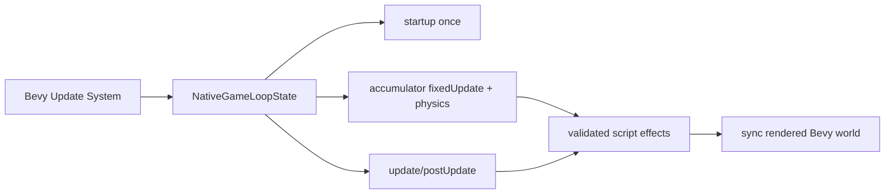
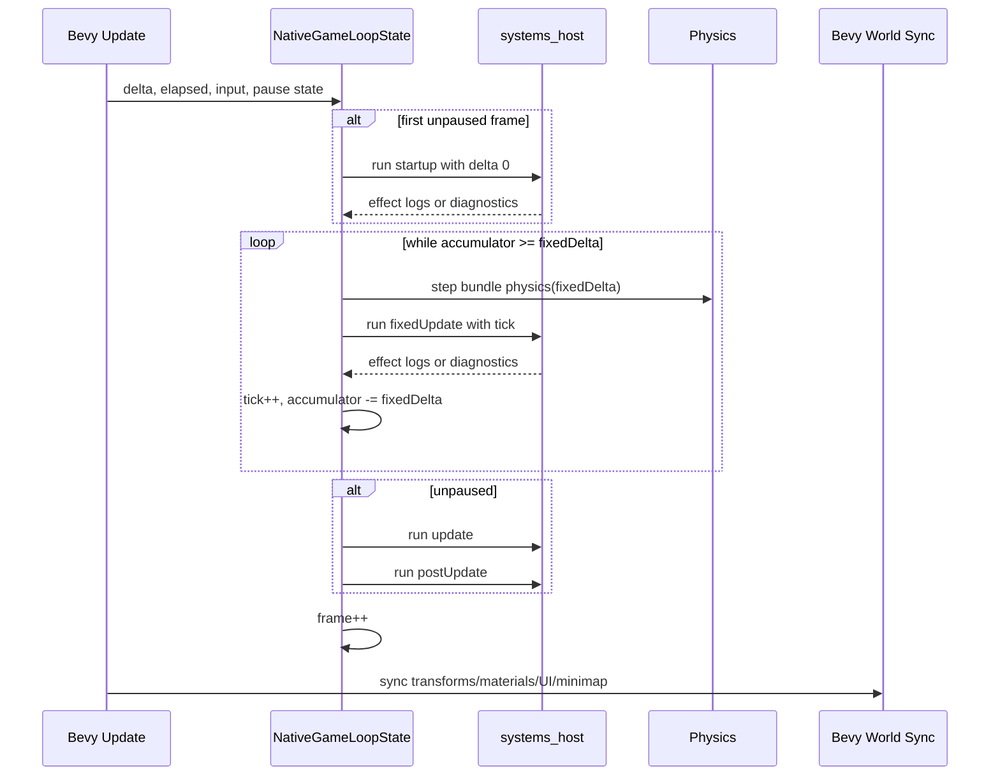

# PRD: Native Game Loop State Parity

Complexity: 6 -> MEDIUM mode

Score basis: +2 touches 6-10 files, +2 complex runtime state logic, +1
verification gate/conformance evidence, +1 docs/status updates when the
capability claim changes.

## 1. Context

**Problem:** The native Bevy scripted runtime can run `startup` and
`fixedUpdate` at different lifecycle cadence than the web runtime, which makes
portable gameplay behavior drift despite using the same emitted bundle.

**Files Analyzed:**

- `packages/runtime-web-three/src/gameLoop.ts`
- `packages/runtime-web-three/src/gameLoop.test.ts`
- `runtime-bevy/crates/threenative_runtime/src/systems_host.rs`
- `runtime-bevy/crates/threenative_runtime/src/lib.rs`
- `runtime-bevy/crates/threenative_runtime/tests/systems_host.rs`
- `docs/PRDs/done/other/post-v10-runtime-gameplay-host.md`
- `docs/status/code-quality-audit-2026-07-04.md`
- `docs/STATUS.md`
- `docs/bevy-feature-parity.md`

**Current Behavior:**

- Web keeps explicit `IGameLoopState` with `startupComplete`, accumulator,
  elapsed time, frame, tick, and pause state.
- Web runs `startup` once, steps physics and `fixedUpdate` only while the
  accumulator crosses the fixed timestep, then runs `update`/`postUpdate`.
- Native `run_native_systems_once_with_input()` currently iterates
  `startup`, `fixedUpdate`, `update`, and `postUpdate` every call.
- Native runtime setup in `lib.rs` hard-codes `fixed_delta = 1 / 60` and steps
  physics once per rendered Bevy update before calling the one-shot systems
  host.
- Existing native tests prove schedule ordering for a single host call, but do
  not prove multi-frame startup-once or accumulator behavior.

## 2. Solution

**Approach:**

- Add a native loop-state layer that mirrors the web runtime's durable frame
  semantics: startup-once, accumulator-based fixed steps, elapsed/frame/tick
  propagation, and pause-aware schedule execution.
- Keep the existing one-shot systems host useful for trace-style tests by
  introducing a stateful runner API instead of silently changing every helper's
  meaning.
- Route Bevy's real scripted runtime update path through the stateful runner.
- Add focused native tests that mirror web `gameLoop.test.ts` behavior for
  startup-once, fixed-step accumulation, and pause handling.
- Promote the proof into the focused runtime gameplay host evidence only after
  native tests and conformance pass.



**Key Decisions:**

- [x] Library/framework choices: reuse existing Bevy resources, existing
  `systems_host` script/effect machinery, and web runtime loop semantics.
- [x] Error-handling strategy: preserve existing `NativeSystemsHostError`
  diagnostics for script load/effect failures; loop state should not swallow
  host errors.
- [x] Reused utilities: reuse `ordered_systems_for_schedule`,
  `call_system_export`, `apply_system_effects`, `physics::step_bundle_physics`,
  and existing input/time snapshot types.

**Data Changes:** None. This PRD changes runtime execution semantics and tests,
not persisted source or IR shape.

## 3. Integration Points

**How will this feature be reached?**

- [x] Entry point identified: native Bevy runtime update system for scripted
  bundles.
- [x] Caller file identified:
  `runtime-bevy/crates/threenative_runtime/src/lib.rs`.
- [x] Registration/wiring needed: register a `NativeGameLoopState` resource
  when a scripted runtime bundle is inserted, then call the stateful systems
  runner from `run_scripted_runtime_systems`.

**Is this user-facing?**

- [x] YES -> Users observe this through native runtime gameplay behavior,
  conformance reports, and parity status.
- [ ] NO.

**Full user flow:**

1. User authors a portable script with `startup` initialization and
   `fixedUpdate` movement/timers.
2. `tn build` emits the same systems bundle consumed by web and Bevy.
3. User launches native Bevy runtime or runs the runtime gameplay host proof.
4. Native startup runs once, fixed ticks follow configured timestep semantics,
   and frame/tick evidence matches web expectations.

## 4. Sequence Flow



## 5. Execution Phases

#### Phase 1: Native Loop State API - Native tests can prove startup-once and fixed-step accumulation without Bevy app wiring.

**Files (max 5):**

- `runtime-bevy/crates/threenative_runtime/src/systems_host.rs` - add
  `NativeGameLoopState`, stateful run options, and schedule-specific runner.
- `runtime-bevy/crates/threenative_runtime/tests/systems_host.rs` - add
  startup-once, accumulator, and pause tests.
- `runtime-bevy/crates/threenative_runtime/src/runtime_gameplay_host.rs` - use
  the stateful helper if this trace surface currently depends on multi-frame
  host behavior.

**Implementation:**

- [x] Introduce `NativeGameLoopState` with `accumulator`, `elapsed`, `frame`,
  `paused`, `startup_complete`, and `tick`.
- [x] Add a stateful runner that accepts `delta`, `fixed_delta`, input, and
  pause state, and returns accumulated host logs.
- [x] Keep `run_native_systems_once()` semantics available for one-shot tests
  and existing trace helpers.
- [x] Ensure `startup` is skipped after the first successful startup pass.
- [x] Ensure `fixedUpdate` and physics run only once per consumed fixed tick.

**Tests Required:**

| Test File | Test Name | Assertion |
|-----------|-----------|-----------|
| `runtime-bevy/crates/threenative_runtime/tests/systems_host.rs` | `should run startup once when native loop advances multiple frames` | Startup resource mutation happens once while fixed/update can continue. |
| `runtime-bevy/crates/threenative_runtime/tests/systems_host.rs` | `should run fixed update once per accumulated fixed tick` | `delta = 0.6`, `fixed_delta = 0.25` produces exactly two fixed ticks and leaves accumulator remainder. |
| `runtime-bevy/crates/threenative_runtime/tests/systems_host.rs` | `should skip gameplay schedules while native loop is paused` | Startup/fixed/update/postUpdate do not mutate gameplay state while paused; elapsed/frame accounting remains explicit. |

**User Verification:**

- Action: Run
  `cargo test -p threenative_runtime systems_host --manifest-path runtime-bevy/Cargo.toml`.
- Expected: Existing one-shot host tests and new stateful loop tests pass.

#### Phase 2: Bevy Runtime Wiring - Native gameplay preview uses the same stateful loop semantics.

**Files (max 5):**

- `runtime-bevy/crates/threenative_runtime/src/lib.rs` - add loop-state resource
  wiring and call the stateful runner from `run_scripted_runtime_systems`.
- `runtime-bevy/crates/threenative_runtime/src/systems_host.rs` - adjust public
  API if Phase 1 exposes extra runtime options.
- `runtime-bevy/crates/threenative_runtime/tests/runtime_gameplay_host.rs` or
  existing native runtime test file - add app-level proof if a suitable harness
  exists.
- `docs/STATUS.md` - record promoted native loop-state behavior after tests.
- `docs/bevy-feature-parity.md` - update evidence anchors if the parity row is
  promoted or clarified.

**Implementation:**

- [x] Insert `NativeGameLoopState` alongside `ScriptedRuntimeBundle`.
- [x] Use runtime-config fixed timestep when available; otherwise preserve
  current `1 / 60` default.
- [x] Move physics stepping into the fixed-step loop so physics and
  `fixedUpdate` share tick cadence.
- [x] Preserve transform/material/UI/minimap sync after script execution.
- [x] Surface host errors through the existing Bevy `error!` path without
  corrupting loop state.

**Tests Required:**

| Test File | Test Name | Assertion |
|-----------|-----------|-----------|
| Native runtime app test | `should preserve startup state across Bevy update frames` | Repeated Bevy updates do not re-run startup effects. |
| Native runtime app test | `should step fixed update by accumulated Bevy delta` | Multiple small updates accumulate before fixed tick executes. |

**User Verification:**

- Action: Run
  `cargo test -p threenative_runtime --manifest-path runtime-bevy/Cargo.toml`
  and `pnpm verify:conformance`.
- Expected: Native runtime tests pass and conformance has no web/Bevy gameplay
  schedule regressions.

#### Phase 3: Focused Gate Evidence - Runtime gameplay host parity cannot regress silently.

**Files (max 5):**

- `tools/verify/src/*` - extend or add focused runtime gameplay host proof if
  existing gate output does not include loop-state evidence.
- `package.json` - register or update the focused script only if no existing
  script covers this proof.
- `docs/STATUS.md` - add command and artifact evidence.
- `docs/bevy-feature-parity.md` - link the proof in the parity evidence anchor.

**Implementation:**

- [x] Add report fields for startup count, fixed tick count, frame count, and
  pause behavior if the current gate lacks them.
- [x] Ensure the focused gate fails when native startup runs more than once or
  fixed ticks are tied to render frames.
- [x] Keep artifact ordering deterministic.
- [x] Document exact verification commands and artifact paths.

**Tests Required:**

| Test File | Test Name | Assertion |
|-----------|-----------|-----------|
| `tools/verify/src/*.test.ts` | `should fail runtime gameplay host proof when loop-state evidence is missing` | Missing startup/fixed-tick evidence fails with stable diagnostic. |
| `tools/verify/src/*.test.ts` | `should accept matching native loop-state evidence` | Report with startup-once and expected fixed ticks passes. |

**User Verification:**

- Action: Run `pnpm verify:runtime-gameplay-host` and then
  `pnpm verify:release` if the gate is part of release.
- Expected: The focused gate reports explicit native loop-state evidence and
  release picks it up in deterministic order.

## 6. Checkpoint Protocol

After each implementation phase, run an automated checkpoint review against
this PRD before continuing to the next phase.

Automated checkpoint prompt:

```txt
Review implementation checkpoint.
PRD path: docs/PRDs/done/other/native-game-loop-state-parity.md
Phase: <N>
Summary: <implemented summary>
```

Continue only when the review reports PASS or the required corrections have
been made and re-reviewed.

## 7. Verification Strategy

1. **Unit/runtime tests:**
   - `cargo test -p threenative_runtime systems_host --manifest-path runtime-bevy/Cargo.toml`
   - Proves native loop-state behavior without full app startup.

2. **Native integration tests:**
   - `cargo test -p threenative_runtime --manifest-path runtime-bevy/Cargo.toml`
   - Proves Bevy app wiring keeps state across update frames.

3. **Cross-runtime proof:**
   - `pnpm verify:conformance`
   - Proves shared runtime contracts still align.

4. **Focused release evidence:**
   - `pnpm verify:runtime-gameplay-host`
   - `pnpm verify:release` when release-gate membership changes.

## 8. Acceptance Criteria

- [x] Native runtime has explicit loop state equivalent to web's
  startup/accumulator/frame/tick model.
- [x] Native startup schedule runs once per runtime session, not once per frame.
- [x] Native fixedUpdate and physics step only according to accumulated fixed
  timestep.
- [x] Pause behavior is explicit and tested.
- [x] Existing one-shot native systems host tests remain meaningful.
- [x] Bevy runtime update path uses the stateful runner.
- [x] Focused tests and conformance pass.
- [x] `docs/STATUS.md` and `docs/bevy-feature-parity.md` are updated when the
  native parity claim changes.

## 9. Open Questions

- Should a failed startup schedule leave `startup_complete = false` so a later
  frame can retry, or should it latch failure until reload? Initial preference:
  mark complete only after successful startup.
- Should pause prevent startup, matching current web behavior, or should
  startup initialize even while paused? Initial preference: match web exactly
  unless a separate PRD changes both runtimes.
- Where should runtime-config fixed timestep be read in native if the loaded
  bundle path has multiple runtime config sources? Initial preference: use the
  already-loaded bundle runtime config and keep the existing `1 / 60` fallback.
