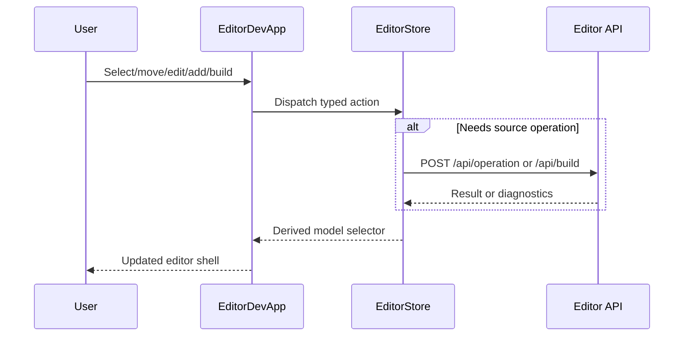

# P0 Editor Zustand Store Completion and Guardrails

Priority: P0

Complexity: 7 -> HIGH mode

Score basis: +2 touches 6-10 files, +2 complex editor session state and async
mutation flow, +2 user-facing selection/modal/viewport state risk, +1 adds
regression guardrail tests.

## 1. Context

**Problem:** The editor already has a Zustand session store, but some derived
view-model construction and event orchestration still live in the dev fixture
component, leaving a path for editor state to fragment again as features expand.

**Files Analyzed:**

- `docs/PRDs/done/other/editor-zustand-state-store-refactor.md`
- `packages/editor/package.json`
- `packages/editor/src/state/editorStore.ts`
- `packages/editor/src/state/editorStore.test.ts`
- `packages/editor/src/EditorApp.tsx`
- `packages/editor/src/devFixture.tsx`
- `packages/editor/src/devFixtureModel.ts`
- `packages/editor/src/adapters/editorModel.ts`
- `packages/editor/src/preview/EditorViewport3d.tsx`

**Current Behavior:**

- `@threenative/editor` already depends on `zustand`.
- `editorStore.ts` owns modal, selected row, project payload, scene path,
  status, hierarchy parent map, gizmo mode, transform overrides, and async
  source mutation actions.
- `devFixture.tsx` still builds the editor shell model and wires selection/move
  orchestration in component-local functions.
- There is no explicit automated guard that prevents new editor session
  `useState`, `useReducer`, or context state from being added outside the store.

## 2. Integration Points

**How will this feature be reached?**

- [x] Entry point identified: `tn editor dev` launches the editor package and
  renders `EditorDevApp` through `packages/editor/src/devFixture.tsx`.
- [x] Caller file identified: `packages/editor/src/devFixture.tsx` invokes
  `EditorApp`, editor store selectors/actions, and project API refresh.
- [x] Registration/wiring needed: route derived editor model and event
  orchestration through store-owned helpers/actions, and add a package test that
  enforces the state boundary.

**Is this user-facing?**

- [x] YES -> selection, scene switching, hierarchy nesting, viewport transforms,
  modal flows, status text, and source mutation callbacks must behave the same.
- [ ] NO.

**Full user flow:**

1. User opens the editor with `tn editor dev`.
2. `EditorDevApp` initializes the Zustand-backed session and refreshes
   `/api/project`.
3. User selects hierarchy rows, switches source scenes, drags hierarchy items,
   edits inspector fields, adds objects/components, saves, builds, or uses the
   viewport gizmo.
4. UI dispatches typed store actions and reads a derived editor shell model from
   the store boundary.
5. Tests fail if new React-local editor session state is introduced.

## 3. Solution

**Approach:**

- Keep Zustand as the only mutable editor-session state container.
- Move dev-fixture-specific model derivation into store-owned exported helpers
  so the React component stays a thin adapter.
- Move scene row selection and hierarchy move orchestration into store actions
  so state changes and status updates are centralized.
- Add a guardrail test that scans editor React source for forbidden session
  state primitives, with explicit allow-listing for non-session refs/effects.
- Preserve existing public `EditorApp` props and source-of-truth boundaries:
  Zustand stores editor session/UI state, not durable source documents or
  generated bundle JSON.

```mermaid
flowchart LR
    Dev[EditorDevApp] --> Store[Zustand editor store]
    Store --> Selector[Derived editor shell model]
    Store --> Actions[Selection, hierarchy, operations]
    Actions --> API[/api/project and /api/operation]
    Dev --> App[EditorApp presentational shell]
```

**Key Decisions:**

- [x] Library/framework choices: continue with Zustand already installed in
  `@threenative/editor`.
- [x] Error-handling strategy: store actions keep stable status strings and
  return booleans only where UI needs immediate control-flow feedback.
- [x] Reused utilities: existing `IEditorShellModel`, editor operation API
  payloads, `devFixtureModel`, and editor package test harness.

**Data Changes:** None. This is a client/editor package state refactor only.

## 4. Sequence Flow



## 5. Execution Phases

#### Phase 1: Store Boundary Guardrail - Package tests fail when editor session state is added outside the Zustand store.

**Files (max 5):**

- `docs/PRDs/other/p0-editor-zustand-store-completion.md` - record active PRD
  evidence.
- `docs/PRDs/README.md` - add this P0 PRD ahead of lower-priority active work.
- `packages/editor/src/state/editorStoreBoundary.test.ts` - scan editor React
  source for forbidden session state primitives outside approved files.
- `packages/editor/src/state/editorStore.test.ts` - add focused tests for new
  centralized selection/move actions if they land in this phase.

**Implementation:**

- [x] Add an active P0 index entry before the distribution contract PRD.
- [x] Add a store boundary test that rejects `useState`, `useReducer`, and
  `createContext` in editor React source except documented allow-listed files.
- [x] Keep `useEffect` allowed for lifecycle subscriptions and keyboard
  bindings.
- [x] Document evidence in this PRD after the phase is verified.

**Evidence:**

- `packages/editor/src/state/editorStoreBoundary.test.ts` scans editor `.tsx`
  source files and rejects `useState`, `useReducer`, and `createContext`.
- `pnpm --filter @threenative/editor test` passes with the new guardrail test.

**Tests Required:**

| Test File | Test Name | Assertion |
|-----------|-----------|-----------|
| `packages/editor/src/state/editorStoreBoundary.test.ts` | `should keep editor session state inside the Zustand store` | no forbidden React state primitives appear in editor source files |

**User Verification:**

- Action: run the editor package tests.
- Expected: state-boundary guard passes and would fail if a new component-local
  editor session `useState` appears.

#### Phase 2: Derived Model and Event Orchestration - Dev fixture becomes a thin adapter over store-owned session actions.

**Files (max 5):**

- `packages/editor/src/state/editorStore.ts` - export derived model selector and
  centralized `selectEditorRow` / `moveEditorRow` actions.
- `packages/editor/src/state/editorStore.test.ts` - prove selection, source
  scene switching, hierarchy move, and derived model behavior.
- `packages/editor/src/devFixture.tsx` - remove component-owned derivation and
  event orchestration.
- `packages/editor/src/EditorApp.test.tsx` - update only if public callback
  wiring needs regression coverage.
- `docs/PRDs/other/p0-editor-zustand-store-completion.md` - record evidence.

**Implementation:**

- [x] Move `projectToEditorModel` and its private helper functions into
  `editorStore.ts` or a store-owned sibling imported by the store.
- [x] Add an exported selector/helper that derives `IEditorShellModel` from the
  current store state plus the fallback fixture model.
- [x] Add store actions for selecting source document rows and moving hierarchy
  rows with stable status messages.
- [x] Simplify `EditorDevApp` so it only subscribes to the derived model and
  dispatches store actions.
- [x] Preserve existing `EditorApp` public props and labels.

**Evidence:**

- `packages/editor/src/state/editorStore.ts` exports
  `createEditorSessionModel`, `selectEditorRow`, and `moveEditorRow`.
- `packages/editor/src/devFixture.tsx` is now a thin adapter over store
  selectors/actions.
- `packages/editor/src/state/editorStore.test.ts` covers derived model,
  source-scene selection, and hierarchy move status behavior.
- `pnpm --filter @threenative/editor typecheck` passes.
- `pnpm --filter @threenative/editor test` passes.

**Tests Required:**

| Test File | Test Name | Assertion |
|-----------|-----------|-----------|
| `packages/editor/src/state/editorStore.test.ts` | `should derive the dev editor model from store state` | model hierarchy, inspector, status items, and selected row match project payload |
| `packages/editor/src/state/editorStore.test.ts` | `should route source document selection through the store` | selecting a source scene loads the scene and selects its first object |
| `packages/editor/src/state/editorStore.test.ts` | `should move hierarchy rows through the store` | parent map and status update for valid and invalid nesting |

**User Verification:**

- Action: open editor, select rows, switch scenes, drag hierarchy rows, add an
  object, save, build, and drag a viewport transform.
- Expected: visible editor behavior matches the previous Zustand refactor, with
  state now flowing through one store boundary.

## 6. Verification Strategy

**Phase 1:**

- `pnpm --filter @threenative/editor test`
- `pnpm check:docs`

**Phase 2:**

- `pnpm --filter @threenative/editor test -- editorStore`
- `pnpm --filter @threenative/editor test`
- `pnpm check:docs`
- `pnpm check:names`
- `git diff --check`

## 7. Acceptance Criteria

- [x] Active P0 PRD exists and is indexed before lower-priority active PRDs.
- [x] Zustand remains the only mutable editor-session state container.
- [x] Editor React source has an automated guard against new `useState`,
  `useReducer`, or `createContext` session state.
- [x] Dev fixture model derivation and selection/move orchestration are routed
  through store-owned helpers/actions.
- [x] Existing editor UI behavior remains compatible.
- [x] Focused editor tests, docs check, names check, and whitespace check pass.

## 8. Verification Evidence

- `pnpm --filter @threenative/editor typecheck` - PASS.
- `pnpm --filter @threenative/editor test` - PASS, 70 tests.
- `pnpm check:docs` - PASS.
- `pnpm check:names` - PASS.
- `git diff --check` - PASS.
