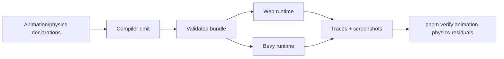

# Post-V10 Animation, Physics, and Navigation Residuals

Complexity: 13 -> HIGH mode

## Complexity Assessment

- +3 touches 10+ implementation/test/docs files during implementation
- +2 adds animation masking, morph target, physics, and navigation surfaces
- +2 includes complex solver, pathfinding, and animation blending behavior
- +2 spans SDK, IR, compiler, web runtime, Bevy runtime, examples, and docs
- +2 requires deterministic cross-runtime traces and visual evidence
- +2 covers diagnostic-only advanced physics and animation boundaries

## Context

**Problem:** Animation playback, particles, primitive physics, character
movement, and pathfinding have strong coverage, but the remaining unchecked
rows cover common mid-tier game needs like animation masks, morph targets,
sloped mesh grounding, constraints, dynamic navmesh updates, and crowd steering.

**Files Analyzed:**

- `docs/bevy-feature-parity.md`
- `docs/PRDs/done/v9/V9-01-animation-particles-runtime-parity.md`
- `docs/PRDs/done/v9/V9-02-physics-character-runtime-parity.md`
- `docs/PRDs/done/v10/V10-02-advanced-renderer-materials-and-physics.md`
- `/home/joao/.claude/skills/prd-creator/SKILL.md`

**Current Behavior:**

- Animation metadata, clip refs, graph metadata, event markers, playback
  binding, visual skeletal animation, transform animation, stop/query semantics,
  blending, and particles are promoted.
- Physics supports primitive bodies/colliders, sensors, character movement,
  ramps, pushing, dynamic mesh collider metadata, joints metadata, and navmesh
  pathfinding behavior.
- Animation masks, morph-target animation, UI/property animation, arbitrary
  blend trees, arbitrary sloped mesh grounding, full constraints, dynamic
  navmesh rebakes, crowd steering, vehicles, soft bodies, and ragdolls remain
  unchecked.

## Checklist Coverage

- `P2` Animation masks.
- `P2` Morph-target animation.
- `P2` UI/property animation.
- `P2` Arbitrary blend trees beyond bounded crossfade/graph traces.
- `P3` Retargeting and inverse kinematics: diagnostic-first.
- `P1` Arbitrary sloped mesh terrain for character grounding.
- `P1` Full constraint solving beyond hinge/slider/suspension metadata.
- `P2` Arbitrary triangle narrow phase for mesh colliders.
- `P2` Dynamic navmesh rebakes.
- `P2` Crowd steering and off-mesh links.
- `P2` Vehicle drivetrain and tire/friction models: diagnostic-first unless a
  narrow vehicle fixture is promoted.
- `P3` Soft bodies and ragdolls: diagnostic-only.
- `D` Public backend physics/navmesh handles in portable APIs: diagnostic-only.

## Impact

**Planned files touched by implementation:** SDK animation/physics/navigation
APIs, IR schemas and validators, compiler emit, web runtime animation/physics,
Bevy runtime animation/physics, model fixtures, conformance reports, visual
artifacts, verification tooling, docs, and status.

**Features affected:** animation graphs, model morph targets, UI animation,
character grounding, mesh collider traces, constraints, navmesh updates, crowd
agents, off-mesh links, vehicle diagnostics, and unsupported physics handles.

**Main risks:**

- Physics solver parity can drift if tolerances and ordering are not explicit.
- Animation masks and morph targets depend on asset data that may not be
  present in every glTF; diagnostics must distinguish missing asset data from
  unsupported runtime behavior.
- Dynamic navmesh and crowd behavior can become nondeterministic without fixed
  sample fixtures and bounded agents.

## Integration Points

**How will this feature be reached?**

- [x] Entry point identified: SDK animation/physics/navigation declarations,
  `tn build`, web/native previews, conformance reports, visual examples, and
  `pnpm verify:animation-physics-residuals`.
- [x] Caller file identified: SDK animation/physics helpers, compiler emit
  paths, IR validators, web runtime adapters, Bevy runtime adapters, and verify
  tooling.
- [x] Registration/wiring needed: schemas, diagnostics, fixtures, traces,
  screenshots, package scripts, docs, and release gate.

**Is this user-facing?**

- [x] YES. Authors see the behavior through animated models, character
  movement, physics interactions, navigation, and validation diagnostics.
- [ ] NO -> Internal/background feature.

**Full user flow:**

1. User authors animation masks/morphs, UI animation, sloped mesh terrain,
   constraints, or dynamic navigation declarations.
2. `tn build` validates assets and rejects raw backend handles or unsupported
   solver features.
3. Web and Bevy runtimes execute promoted traces and write matching reports.
4. `pnpm verify:animation-physics-residuals` proves runtime and visual parity.

## Solution

**Approach:**

- Promote only deterministic animation and physics slices with bounded asset
  fixtures and numeric tolerances.
- Use visual proof for morph targets, masks, UI/property animation, and
  character grounding where trace-only evidence would be misleading.
- Add dynamic navmesh and crowd behavior as bounded fixtures with fixed inputs,
  small agent counts, and reportable paths.
- Keep IK, retargeting, vehicles, soft bodies, ragdolls, and public backend
  handles diagnostic-only until a future PRD narrows them.

**Key Decisions:**

- [x] Library/framework choices: reuse existing animation graph, glTF asset,
  primitive physics, navmesh, conformance, and visual verification patterns.
- [x] Error-handling strategy: missing morph/mask asset data, unsupported solver
  requests, raw physics handles, IK, ragdoll, soft-body, and unbounded vehicle
  features emit stable diagnostics.
- [x] Reused utilities: animation report writers, physics trace fixtures,
  navigation reports, diagnostic model, and docs guard patterns.

**Data Changes:** Extend animation/physics/navigation IR and reports. No
database migrations.

## Execution Phases

#### Phase 1: Animation Residuals - Model and UI animation gaps get bounded runtime proof.

**Files (max 5):**

- `packages/ir/src/*` - animation mask/morph/UI schemas
- `packages/compiler/src/*` - animation extraction/emit
- `packages/runtime-web-three/src/*` - web animation mapping
- `runtime-bevy/src/*` - native animation mapping
- `examples/*/artifacts/animation-physics-residuals/*` - evidence

**Implementation:**

- [ ] Add bounded animation masks and asset validation.
- [ ] Add morph-target animation when glTF asset data supports it.
- [ ] Add UI/property animation or stable diagnostics for unsupported targets.
- [ ] Reject arbitrary blend trees, IK, and retargeting unless promoted.

**Tests Required:**

| Test File | Test Name | Assertion |
|-----------|-----------|-----------|
| `packages/ir/src/animation-residuals.test.ts` | `should reject mask paths not present in model skeleton` | Diagnostic includes clip and path. |
| `packages/runtime-web-three/src/animation-residuals.test.ts` | `should report morph target weight at sampled frame` | Web report matches fixture. |
| `runtime-bevy/tests/animation_residuals.rs` | `should report morph target weight at sampled frame` | Native report matches fixture. |

**User Verification:**

- Action: Run the animation residual fixture in web and native preview.
- Expected: Masked animation and morph target evidence match.

#### Phase 2: Mesh Grounding, Constraints, and Narrow Phase - Character/physics traces broaden safely.

**Files (max 5):**

- `packages/ir/src/*` - physics residual schemas
- `packages/compiler/src/*` - physics emit
- `packages/runtime-web-three/src/*` - web trace behavior
- `runtime-bevy/src/*` - native solver behavior
- `packages/ir/fixtures/animation-physics-residuals/*` - shared fixtures

**Implementation:**

- [ ] Add arbitrary sloped mesh terrain character grounding with bounded
  triangle count and tolerances.
- [ ] Promote full constraint solving only for deterministic constrained cases.
- [ ] Add arbitrary triangle narrow-phase traces or clear diagnostics.
- [ ] Reject public backend handles, soft bodies, ragdolls, and unbounded
  solver features.

**Tests Required:**

| Test File | Test Name | Assertion |
|-----------|-----------|-----------|
| `packages/ir/src/physics-residuals.test.ts` | `should reject raw physics backend handle declarations` | Diagnostic is stable. |
| `packages/runtime-web-three/src/mesh-grounding.test.ts` | `should ground character on authored sloped mesh terrain` | Ground normal and position match tolerance. |
| `runtime-bevy/tests/mesh_grounding.rs` | `should ground character on authored sloped mesh terrain` | Native trace matches tolerance. |

**User Verification:**

- Action: Run the sloped mesh character fixture.
- Expected: Character remains grounded and trace tolerances pass in both runtimes.

#### Phase 3: Dynamic Navigation and Crowd Fixtures - Navigation updates are bounded and observable.

**Files (max 5):**

- `packages/sdk/src/*` - dynamic nav/crowd declarations
- `packages/ir/src/*` - navigation schemas/diagnostics
- `packages/runtime-web-three/src/*` - web navigation reports
- `runtime-bevy/src/*` - native navigation reports
- `tools/verify/src/*` - focused gate

**Implementation:**

- [ ] Add dynamic navmesh rebake policy with bounded geometry and timing.
- [ ] Add off-mesh link traversal observations.
- [ ] Add small-agent-count crowd steering reports.
- [ ] Keep full vehicle drivetrain/tire models diagnostic-first unless a
  bounded vehicle trace is promoted.

**Tests Required:**

| Test File | Test Name | Assertion |
|-----------|-----------|-----------|
| `packages/ir/src/navigation-residuals.test.ts` | `should reject dynamic navmesh rebake over budget` | Diagnostic includes budget values. |
| `packages/runtime-web-three/src/navigation-residuals.test.ts` | `should report off-mesh link traversal` | Path includes link id. |
| `runtime-bevy/tests/navigation_residuals.rs` | `should report crowd steering separation` | Agent positions match tolerance. |

**User Verification:**

- Action: Run `pnpm verify:animation-physics-residuals`.
- Expected: Animation, physics, and navigation artifacts are present and pass.

## Verification Strategy

- `pnpm --filter @threenative/ir test`
- `pnpm --filter @threenative/compiler test`
- Web animation/physics/navigation tests
- Bevy animation/physics/navigation Rust tests
- Visual screenshots for animation and grounding fixtures
- `pnpm verify:animation-physics-residuals`
- `pnpm verify:conformance`
- `pnpm verify:release`

## Acceptance Criteria

- [ ] Promoted animation, physics, and navigation residuals have matching web
  and Bevy traces.
- [ ] Advanced solver/IK/vehicle/soft-body/ragdoll/backend-handle requests emit
  stable diagnostics.
- [ ] Visual artifacts prove behavior where traces are insufficient.
- [ ] `docs/STATUS.md` and `docs/bevy-feature-parity.md` are updated.
