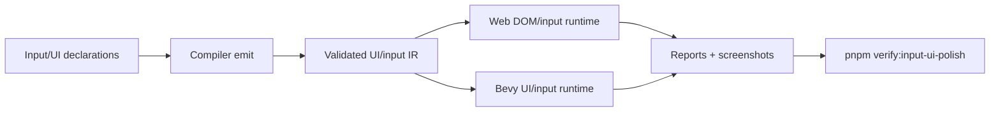

# Post-V10 Input, UI, and Platform UX Polish

Complexity: 12 -> HIGH mode

## Complexity Assessment

- +3 touches 10+ implementation/test/docs files during implementation
- +2 adds richer runtime UI mutation, navigation, touch, keyboard, and settings behavior
- +2 includes cross-platform input state, focus, accessibility, and layout logic
- +2 spans SDK, IR, compiler, web runtime, Bevy runtime, examples, and docs
- +2 requires visual/manual verification in addition to automated gates
- +1 affects release-gate documentation and parity status

## Context

**Problem:** Input and retained UI now cover many foundational paths, but the
remaining P1/P2 rows are the practical polish layer authors need for native
menus, settings screens, platform text entry, focus narration, scrolling, and
device repair diagnostics.

**Files Analyzed:**

- `docs/bevy-feature-parity.md`
- `docs/PRDs/done/v9/V9-05-input-ui-accessibility-parity.md`
- `docs/PRDs/done/v8/V8-15-rich-ui-text-accessibility-residuals.md`
- `docs/PRDs/done/v8/V8-14-input-picking-controls-hardening.md`
- `/home/joao/.claude/skills/prd-creator/SKILL.md`

**Current Behavior:**

- Keyboard, mouse, gamepad, touch hooks, rebinding, drag picking, UI action
  dispatch, accessibility metadata, retained UI, rich text, widgets, and debug
  reports exist.
- Platform touch streams are still deterministic hooks rather than host event
  wiring.
- Settings-screen UX, runtime disabled/enabled changes, nested scrolling,
  spatial navigation, focus narration, and native italic rendering remain
  unchecked.
- Device repair overlays and richer navigation diagnostics remain P2 gaps.

## Checklist Coverage

- `P1` Platform touch event stream wiring beyond deterministic hooks.
- `P1` Full visual settings-screen UX polish.
- `P2` Richer touch/gamepad gestures beyond tap, swipe, and pinch.
- `P2` Richer device diagnostics overlays and repair hints.
- `P2` Richer navigation diagnostics for input/UI flows.
- `P1` Platform virtual keyboard behavior.
- `P1` Runtime disabled-to-enabled UI updates.
- `P1` Nested and axis-specific scroll behavior.
- `P1` Spatial navigation heuristics.
- `P1` Focus narration.
- `P2` Native-rendered italic rich text.
- `P2` Arbitrary grid placement, named areas, and dense packing.
- `P2` Broad gamepad/touch UI coverage.
- `P2` Broad manually inspected desktop webview packaging.
- `P2` UI transforms and render-to-texture/3D-world UI: diagnostic-first unless
  a narrow portable contract is promoted.
- `P2` Connected-device gamepad inspection.

## Impact

**Planned files touched by implementation:** SDK input/UI/accessibility APIs, IR
schemas and validators, compiler emit, web DOM runtime, Bevy UI/input runtime,
CLI/editor diagnostics, UI examples, visual artifacts, verification tooling,
docs, and status.

**Features affected:** touch input, gamepad inspection, controls/settings UI,
virtual keyboard, disabled state mutation, scrolling, spatial navigation,
accessibility narration, rich text rendering, layout grids, webview packaging,
and diagnostics.

**Main risks:**

- Platform input semantics differ by browser, desktop, and mobile target.
  Reports must distinguish host support from portable contract failures.
- Focus/navigation behavior can become nondeterministic without explicit
  tie-breakers.
- Visual settings screens can regress without screenshot and action-flow
  evidence.

## Integration Points

**How will this feature be reached?**

- [x] Entry point identified: SDK input/UI declarations, controls settings
  helpers, `tn build`, web preview, native Bevy preview, optional editor/debug
  panels, and `pnpm verify:input-ui-polish`.
- [x] Caller file identified: SDK input/UI helpers, compiler UI emitters, IR
  validators, web input/UI adapters, Bevy input/UI adapters, debug report
  writers, and verify-tool registration.
- [x] Registration/wiring needed: platform input reports, UI mutation events,
  navigation diagnostics, visual fixtures, screenshots, docs, and release gate.

**Is this user-facing?**

- [x] YES. Authors and players interact with settings screens, input devices,
  virtual keyboard prompts, scrolling panels, focus movement, narration, and
  diagnostics.
- [ ] NO -> Internal/background feature.

**UI components required:**

- Settings screen fixture with tabs, rebinding, sliders, toggles, disabled
  controls, scroll areas, text input, gamepad/touch affordances, and accessible
  focus labels.
- Device diagnostics overlay fixture with gamepad/touch repair hints.

**Full user flow:**

1. User authors a settings/menu UI with focusable controls, text input,
   scrolling sections, disabled states, touch/gamepad controls, and narration
   metadata.
2. `tn build` validates UI/input declarations and rejects unsupported 3D UI or
   platform-only behavior.
3. Web and Bevy runtimes render and mutate the UI, process host touch/gamepad
   events, open virtual keyboard where supported, and write diagnostics.
4. `pnpm verify:input-ui-polish` captures conformance reports and visual/manual
   evidence.

## Solution

**Approach:**

- Promote host touch stream wiring, richer gesture reports, and connected-device
  inspection with target capability reporting.
- Promote runtime UI mutation for disabled/enabled state, nested/axis scrolling,
  spatial navigation, and focus narration with deterministic tie-breakers.
- Build a polished settings-screen fixture that exercises controls, audio/video
  settings, accessibility settings, rebinding, touch/gamepad navigation, and
  disabled state changes.
- Keep 3D UI/render-to-texture UI diagnostic-first unless the implementation can
  prove a constrained portable contract.

**Key Decisions:**

- [x] Library/framework choices: reuse existing retained UI, DOM overlay, Bevy
  UI, input snapshots, accessibility metadata, and visual artifact conventions.
- [x] Error-handling strategy: unsupported platform keyboard, 3D UI, dense grid,
  or device behavior reports capability-aware diagnostics with repair hints.
- [x] Reused utilities: UI validators, input snapshots, action queue reports,
  accessibility diagnostics, screenshot verification, and docs guard patterns.

**Data Changes:** Extend UI/input IR and diagnostics reports. No database
migrations.

## Execution Phases

#### Phase 1: Platform Input Streams - Touch/gamepad events are host-backed.

**Files (max 5):**

- `packages/ir/src/*` - input capability/report schema
- `packages/runtime-web-three/src/*` - touch/gamepad stream wiring
- `runtime-bevy/src/*` - touch/gamepad stream wiring
- `examples/*/artifacts/input-ui-polish/*` - evidence output
- `tools/verify/src/*` - focused gate

**Implementation:**

- [ ] Wire host touch stream events into runtime snapshots.
- [ ] Add richer gesture and gamepad inspection reports.
- [ ] Emit repair hints for missing devices, denied permissions, or unsupported
  target capabilities.

**Tests Required:**

| Test File | Test Name | Assertion |
|-----------|-----------|-----------|
| `packages/ir/src/input-capabilities.test.ts` | `should reject unsupported device diagnostic shape when code is missing` | Diagnostic code is required. |
| `packages/runtime-web-three/src/input-streams.test.ts` | `should convert touch stream into portable snapshot` | Snapshot includes touch id, phase, and position. |
| `runtime-bevy/tests/input_streams.rs` | `should report connected gamepad capabilities` | Report includes device id and supported axes/buttons. |

**User Verification:**

- Action: Open the input diagnostics fixture and connect/disconnect a gamepad.
- Expected: Overlay and JSON report update with repair hints.

#### Phase 2: Runtime UI Mutation and Navigation - Menus behave like game UI.

**Files (max 5):**

- `packages/sdk/src/*` - UI mutation/navigation helpers
- `packages/ir/src/*` - UI mutation and navigation validation
- `packages/runtime-web-three/src/*` - DOM mutation/navigation
- `runtime-bevy/src/*` - Bevy UI mutation/navigation
- `packages/ir/fixtures/input-ui-polish/*` - shared fixtures

**Implementation:**

- [ ] Mutate disabled/enabled state at runtime and suppress focus/action when
  disabled.
- [ ] Implement nested and axis-specific scroll behavior.
- [ ] Add deterministic spatial navigation heuristics and diagnostics.
- [ ] Add focus narration metadata and report output.

**Tests Required:**

| Test File | Test Name | Assertion |
|-----------|-----------|-----------|
| `packages/runtime-web-three/src/ui-navigation.test.ts` | `should skip disabled controls during spatial navigation` | Focus moves to expected node. |
| `runtime-bevy/tests/ui_navigation.rs` | `should keep nested scroll delta on matching axis` | Inner or outer scroll target is deterministic. |
| `packages/ir/src/ui-accessibility.test.ts` | `should report missing focus narration when narration is required` | Diagnostic includes UI node path. |

**User Verification:**

- Action: Navigate the settings fixture by keyboard, gamepad, and touch.
- Expected: Focus, disabled state, scroll areas, and narration traces match.

#### Phase 3: Visual Settings Polish and Packaging Evidence - The UI has release proof.

**Files (max 5):**

- `examples/*` - settings-screen fixture
- `packages/runtime-web-three/src/*` - italic/grid/platform behavior
- `runtime-bevy/src/*` - italic/grid/platform behavior
- `tools/verify/src/*` - screenshot and report checks
- `docs/*` - status/parity updates

**Implementation:**

- [ ] Add a settings-screen fixture with controls, rebinding, sliders, toggles,
  text input, and accessibility settings.
- [ ] Promote native italic text if Bevy evidence is stable.
- [ ] Add dense-grid and 3D UI diagnostics or promote only bounded behavior.
- [ ] Add desktop webview packaging inspection evidence.

**Tests Required:**

| Test File | Test Name | Assertion |
|-----------|-----------|-----------|
| `packages/runtime-web-three/src/settings-ui.test.ts` | `should apply disabled-to-enabled update when setting changes` | Button action becomes available. |
| `runtime-bevy/tests/settings_ui.rs` | `should render italic rich text when supported` | Report marks italic rendered or host-unavailable. |
| `tools/verify/src/input-ui-polish.test.ts` | `should require screenshots and reports for settings fixture` | Missing artifact fails gate. |

**User Verification:**

- Action: Run `pnpm verify:input-ui-polish`.
- Expected: Reports, screenshots, and manual inspection checklist are generated.

## Verification Strategy

- `pnpm --filter @threenative/ir test`
- Web runtime input/UI tests
- Bevy input/UI Rust tests
- Visual screenshot/contact-sheet checks for the settings fixture
- Manual verification for device connection, virtual keyboard, and settings UX
- `pnpm verify:input-ui-polish`
- `pnpm verify:release`

## Acceptance Criteria

- [ ] P1 input/UI polish rows are implemented or explicitly diagnostic-only.
- [ ] Settings-screen fixture proves keyboard, gamepad, touch, scroll, disabled
  state, text input, and narration behavior.
- [ ] Device diagnostics include repair hints.
- [ ] Web and Bevy reports match promoted behavior.
- [ ] `docs/STATUS.md` and `docs/bevy-feature-parity.md` are updated.
