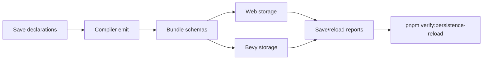

# Post-V10 Durable Persistence and State-Preserving Reload

Complexity: 10 -> HIGH mode

## Complexity Assessment

- +3 touches 10+ implementation/test/docs files during implementation
- +2 adds durable runtime storage and restore behavior
- +2 includes state migration, autosave, checkpoint, and reload state policy
- +2 spans SDK, IR, compiler, CLI, web runtime, Bevy runtime, examples, and docs
- +1 affects release-gate documentation and parity status

## Context

**Problem:** The parity tracker marks portable save/settings concepts as present
but still lacks a durable Bevy runtime backend, runtime autosave/restore flow,
and state-preserving hot reload behavior that authors can rely on while testing
ordinary games.

**Files Analyzed:**

- `docs/bevy-feature-parity.md`
- `docs/PRDs/done/v8/V8-17-portable-save-slots-settings-local-data.md`
- `docs/PRDs/done/v9/V9-06-audio-persistence-tooling-support.md`
- `docs/PRDs/done/v10/V10-04-production-platform-audio-assets-and-release.md`
- `/home/joao/.claude/skills/prd-creator/SKILL.md`

**Current Behavior:**

- Save slots, local settings/key-value metadata, migration diagnostics, and
  checkpoint/autosave lifecycle hooks exist as contract surfaces.
- Bevy does not yet have a general durable backend for declared
  resources/components.
- Runtime autosave/checkpoint execution and restore are not proved end to end.
- Dev-time asset reload and policy reports exist, but full state-preserving hot
  reload remains a gap.

## Checklist Coverage

- `P0` Durable Bevy save/settings backend for declared resources/components.
- `P1` Runtime autosave/checkpoint execution and restore flow.
- `P2` Hot reload with state policy.
- `P1` Live runtime scene mutation, where mutation is required to prove reload.
- `P3` Cloud save and account-bound storage integration: diagnostic boundary.
- `D` Arbitrary npm, filesystem, worker, timer, or platform APIs in portable
  scripts: diagnostic boundary.

## Impact

**Planned files touched by implementation:** SDK save/settings declarations, IR
schemas and validators, compiler emit, CLI preview/build commands, web runtime
storage adapter, Bevy runtime storage adapter, example save fixtures, reload
fixtures, verification tooling, docs, and status.

**Features affected:** save slots, settings, migration, checkpoint/autosave,
runtime restore, asset/bundle reload policy, scene mutation, diagnostics, and
release evidence.

**Main risks:**

- Backend storage paths can become platform-specific and fragile if target
  profile policy is not explicit.
- Migration and restore can silently corrupt gameplay state without schema
  versioning and rejected fixtures.
- Hot reload can hide runtime drift unless state retention, replacement, and
  reset behavior are observable.

## Integration Points

**How will this feature be reached?**

- [x] Entry point identified: SDK save/settings declarations, `tn build`,
  `tn preview --native`, runtime autosave hooks, reload commands, and
  `pnpm verify:persistence-reload`.
- [x] Caller file identified: SDK persistence helpers, compiler emitters, IR
  validators, CLI preview/runtime launcher, web storage adapter, Bevy storage
  adapter, and verify-tool gate registration.
- [x] Registration/wiring needed: storage backend reports, migration diagnostics,
  reload policy reports, example artifacts, package scripts, docs, and release
  verifier integration.

**Is this user-facing?**

- [x] YES. Authors configure saves/settings and observe restore/reload behavior
  through preview commands, runtime output, and diagnostics.
- [ ] NO -> Internal/background feature.

**Full user flow:**

1. User declares persistent resources/components and local settings in
   TypeScript.
2. `tn build` emits validated save schemas and migration policy.
3. Web and Bevy runtimes autosave/checkpoint declared state and restore it on
   restart.
4. During preview, user triggers reload; accepted state is retained and rejected
   state changes produce stable diagnostics.
5. `pnpm verify:persistence-reload` proves durable native restore and reload
   policy evidence.

## Solution

**Approach:**

- Promote a durable native storage adapter for declared resources/components and
  settings, with target-profile-aware paths and JSON report evidence.
- Execute autosave/checkpoint hooks at runtime and prove restore after process
  restart for web and Bevy.
- Add state-preserving reload policy that separates retained resources,
  replaced bundle data, reset-only declarations, and incompatible migrations.
- Keep cloud/account storage and arbitrary filesystem access outside the
  portable contract with stable diagnostics.

**Key Decisions:**

- [x] Library/framework choices: reuse existing IR validation, local-data
  helpers, target-profile diagnostics, runtime report writers, and verify-tool
  patterns.
- [x] Error-handling strategy: invalid migration, undeclared state, cloud
  storage, arbitrary filesystem, and incompatible reload requests fail with
  stable diagnostics.
- [x] Reused utilities: diagnostic model, asset/reload reports, conformance
  fixtures, and docs guard patterns.

**Data Changes:** Extend save/settings IR and runtime reports. No database
migrations.

## Execution Phases

#### Phase 1: Durable Native Save Backend - Bevy persists declared state.

**Files (max 5):**

- `packages/ir/src/*` - save schema and diagnostics
- `packages/compiler/src/*` - save metadata emit
- `runtime-bevy/src/*` - durable storage adapter
- `runtime-bevy/tests/*` - native restart/restore tests
- `examples/*/artifacts/persistence-reload/*` - evidence output

**Implementation:**

- [ ] Persist declared resources/components and settings to target-profile
  storage.
- [ ] Reject undeclared or unsupported value shapes.
- [ ] Write restore reports with schema version, slot, path, and diagnostics.

**Tests Required:**

| Test File | Test Name | Assertion |
|-----------|-----------|-----------|
| `packages/ir/src/persistence.test.ts` | `should reject undeclared persistent state paths` | Diagnostic code and path are stable. |
| `runtime-bevy/tests/persistence.rs` | `should restore declared resource state after restart` | Restored value matches saved checkpoint. |

**User Verification:**

- Action: Run native preview twice with the persistence fixture.
- Expected: Second run restores state written by the first run.

#### Phase 2: Autosave, Checkpoint, and Migration - Runtime save lifecycle is executable.

**Files (max 5):**

- `packages/sdk/src/*` - checkpoint/autosave helpers
- `packages/ir/src/*` - migration policy validation
- `packages/runtime-web-three/src/*` - web autosave/restore
- `runtime-bevy/src/*` - native autosave/restore
- `packages/ir/fixtures/persistence-reload/*` - shared fixtures

**Implementation:**

- [ ] Run autosave/checkpoint hooks on declared lifecycle boundaries.
- [ ] Validate migration version metadata and incompatible restore cases.
- [ ] Compare web and Bevy restore observations.

**Tests Required:**

| Test File | Test Name | Assertion |
|-----------|-----------|-----------|
| `packages/runtime-web-three/src/persistence.test.ts` | `should autosave at declared checkpoint` | Web storage contains checkpoint payload. |
| `runtime-bevy/tests/persistence.rs` | `should report migration mismatch when save version is incompatible` | Diagnostic includes previous/current versions. |

**User Verification:**

- Action: Run `pnpm verify:persistence-reload`.
- Expected: Web and Bevy save/restore evidence is generated and matching.

#### Phase 3: State-Preserving Reload - Preview reload keeps declared state.

**Files (max 5):**

- `packages/cli/src/*` - reload command/report wiring
- `packages/ir/src/*` - reload policy schema
- `packages/runtime-web-three/src/*` - web state retention
- `runtime-bevy/src/*` - Bevy state retention
- `tools/verify/src/*` - focused gate registration

**Implementation:**

- [ ] Define retained, reset, and incompatible reload policies.
- [ ] Replace bundle/runtime assets without losing retained save/settings state.
- [ ] Reject cloud/account storage and arbitrary filesystem APIs.
- [ ] Wire the focused gate into release verification.

**Tests Required:**

| Test File | Test Name | Assertion |
|-----------|-----------|-----------|
| `packages/cli/src/reload-policy.test.ts` | `should write reload report when state is retained` | Report lists retained and replaced sections. |
| `runtime-bevy/tests/hot_reload.rs` | `should retain declared state across bundle reload` | State value survives reload. |

**User Verification:**

- Action: Trigger preview reload in the persistence fixture.
- Expected: Declared state remains and incompatible fields are reported.

## Verification Strategy

- `pnpm --filter @threenative/ir test`
- `pnpm --filter @threenative/compiler test`
- Web runtime persistence tests
- Bevy persistence and hot-reload tests
- `pnpm verify:persistence-reload`
- `pnpm verify:release`

## Acceptance Criteria

- [ ] Durable native save/settings backend persists declared state.
- [ ] Runtime autosave/checkpoint and restore are proved in web and Bevy.
- [ ] State-preserving reload policy has reports and rejected fixtures.
- [ ] Cloud/account and arbitrary filesystem access emit stable diagnostics.
- [ ] `docs/STATUS.md` and `docs/bevy-feature-parity.md` are updated.
