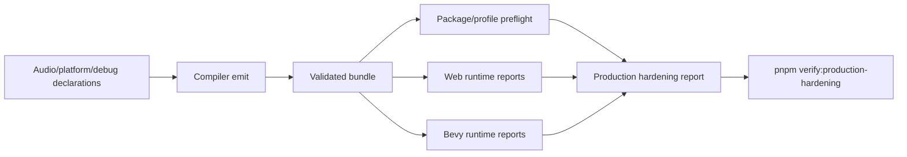

# Post-V10 Production Audio, Diagnostics, Profiling, and Packaging

Complexity: 12 -> HIGH mode

## Complexity Assessment

- +3 touches 10+ implementation/test/docs files during implementation
- +2 adds production audio, diagnostics, profiling, and packaging surfaces
- +2 includes platform capability, device routing, profiling, signing, and release policy
- +2 spans SDK, IR, compiler, CLI, web runtime, Bevy runtime, examples, and docs
- +2 requires host-capability reports and optional manual verification
- +1 affects release-gate documentation and parity status

## Context

**Problem:** The parity tracker still has production-readiness gaps around live
audio mixer/effect behavior, platform audio diagnostics, profiler captures,
GPU timing, signed/mobile packaging, richer failure codes, and engine-integrated
debug rendering.

**Files Analyzed:**

- `docs/bevy-feature-parity.md`
- `docs/PRDs/done/v9/V9-06-audio-persistence-tooling-support.md`
- `docs/PRDs/done/v9/V9-07-engine-quality-control-hardening.md`
- `docs/PRDs/done/v10/V10-04-production-platform-audio-assets-and-release.md`
- `/home/joao/.claude/skills/prd-creator/SKILL.md`

**Current Behavior:**

- Audio supports local OGG/WAV, commands, attenuation, buses, ducking, pitch,
  tones, music transitions, and platform-specific diagnostics.
- Performance has fixed metric reports, stress fixtures, in-app FPS overlay,
  and packaging target profiles.
- Live mixer/effect chains, device routing diagnostics, platform-native audio
  handles, rich UI/audio integration, live profiler captures, GPU pass timing,
  signed/mobile packaging, better domain-specific repair hints, and live debug
  rendering remain unchecked.

## Checklist Coverage

- `P1` Live mixer/effect-chain behavior.
- `P2` Platform audio device routing diagnostics.
- `P2` Platform-native audio handles: diagnostic-first, not public raw handles.
- `P2` Richer UI/audio service integration.
- `P3` Custom audio source/decoder support: diagnostic-first.
- `P3` Streaming and network audio: diagnostic boundary.
- `P2` Live profiler captures and native platform profiler evidence.
- `P2` GPU profiling and render-pass timing breakdowns.
- `P3` Signed installers and app-store/mobile packaging.
- `P1` Better domain-specific asset/runtime failure codes and repair hints.
- `P2` Live engine-integrated debug rendering beyond current overlay/report
  helpers.
- `D` Online services, networking, replication, collaboration, arbitrary
  platform APIs, and backend-only features: stable diagnostics where relevant.

## Impact

**Planned files touched by implementation:** SDK audio/platform/debug APIs, IR
schemas and validators, compiler emit, CLI packaging/profiling commands, web
runtime audio/profiler/debug reports, Bevy runtime audio/profiler/debug
reports, examples, verification tooling, docs, and status.

**Features affected:** audio routing, mixer/effect chains, UI/audio service
calls, profiler reports, GPU timing, packaging preflight, signing manifests,
mobile target profiles, debug rendering, and diagnostic taxonomy.

**Main risks:**

- Platform-native handles can become escape hatches unless exposed only as
  diagnostics or internal report identifiers.
- Profilers and GPU timers are host-dependent; gates must distinguish
  unavailable optional tools from regressions.
- Signing/mobile packaging can require external credentials; repo verification
  must rely on dry-run/preflight evidence.

## Integration Points

**How will this feature be reached?**

- [x] Entry point identified: SDK audio/platform declarations, `tn build`,
  `tn package preflight`, runtime debug/profiler commands, web/native previews,
  and `pnpm verify:production-hardening`.
- [x] Caller file identified: SDK audio/platform/debug helpers, compiler emit
  paths, IR validators, CLI package/profile commands, web/Bevy audio and
  profiler reporters, and verify tooling.
- [x] Registration/wiring needed: audio effect schemas, device reports,
  diagnostic taxonomy, profiler artifacts, package preflight manifests, debug
  render reports, docs, and release verifier integration.

**Is this user-facing?**

- [x] YES. Authors and release engineers use audio behavior, package preflight,
  profiler reports, debug rendering, and diagnostics.
- [ ] NO -> Internal/background feature.

**Full user flow:**

1. User declares mixer/effect chains, UI audio actions, package targets,
   profiler settings, and debug rendering requests.
2. `tn build` validates portable declarations and rejects raw handles,
   executable decoders, network streams, online services, and arbitrary platform
   APIs.
3. Runtime previews emit audio/profiler/debug reports.
4. `tn package preflight` validates signed/mobile metadata without requiring
   private credentials.
5. `pnpm verify:production-hardening` proves promoted behavior and diagnostics.

## Solution

**Approach:**

- Promote live mixer/effect-chain behavior with bounded effect types and
  matching web/Bevy reports.
- Add platform audio routing diagnostics and UI/audio service integration while
  keeping raw native handles internal-only.
- Add live profiler and GPU timing reports with host capability states:
  captured, unavailable, warning, and failure.
- Extend packaging to signed/mobile preflight manifests and dry-run artifact
  checks without storing secrets.
- Improve domain-specific diagnostics for asset/runtime failures and add
  engine-integrated debug rendering as report-backed overlays.

**Key Decisions:**

- [x] Library/framework choices: reuse existing audio runtime, package target
  profiles, profiler report shapes, diagnostics, and verify tooling.
- [x] Error-handling strategy: unsupported audio decoders, network streams, raw
  handles, missing signing credentials, unavailable profilers, and backend-only
  features emit stable diagnostics.
- [x] Reused utilities: diagnostic model, package preflight reports, performance
  budget reports, audio observations, and docs guard patterns.

**Data Changes:** Extend audio, platform, profiling, packaging, debug-render,
and diagnostic report schemas. No database migrations.

## Execution Phases

#### Phase 1: Live Audio Mixer and Routing - Runtime audio behavior is observable.

**Files (max 5):**

- `packages/ir/src/*` - audio effect/device schema
- `packages/compiler/src/*` - audio emit/diagnostics
- `packages/runtime-web-three/src/*` - web mixer/device reports
- `runtime-bevy/src/*` - native mixer/device reports
- `examples/*/artifacts/production-hardening/*` - evidence output

**Implementation:**

- [ ] Add bounded mixer/effect-chain runtime behavior.
- [ ] Add device routing diagnostics with target capability reports.
- [ ] Add UI/audio service integration for menu feedback and settings changes.
- [ ] Reject raw native handles, custom decoders, streaming audio, and network
  audio unless a future PRD promotes them.

**Tests Required:**

| Test File | Test Name | Assertion |
|-----------|-----------|-----------|
| `packages/ir/src/audio-production.test.ts` | `should reject custom decoder declarations` | Diagnostic includes suggested local codec alternative. |
| `packages/runtime-web-three/src/audio-production.test.ts` | `should apply declared mixer effect chain` | Web report includes chain and bus. |
| `runtime-bevy/tests/audio_production.rs` | `should apply declared mixer effect chain` | Native report matches fixture. |

**User Verification:**

- Action: Run the audio settings fixture and toggle effects.
- Expected: Audio report and UI state update together.

#### Phase 2: Profiling, GPU Timing, and Debug Rendering - Runtime diagnostics are release-grade.

**Files (max 5):**

- `packages/ir/src/*` - profiler/debug schema
- `packages/runtime-web-three/src/*` - web profiler/debug reports
- `runtime-bevy/src/*` - native profiler/debug reports
- `tools/verify/src/*` - production hardening gate
- `docs/*` - status/parity updates

**Implementation:**

- [ ] Add live profiler capture report fields for supported hosts.
- [ ] Add GPU/render-pass timing breakdowns or host-unavailable diagnostics.
- [ ] Add live engine-integrated debug rendering overlays/reports.
- [ ] Improve domain-specific asset/runtime failure codes and repair hints.

**Tests Required:**

| Test File | Test Name | Assertion |
|-----------|-----------|-----------|
| `tools/verify/src/production-hardening.test.ts` | `should fail when profiler report omits host capability state` | Missing state fails gate. |
| `packages/runtime-web-three/src/profiler.test.ts` | `should report GPU timing unavailable when host lacks timer support` | Report state is unavailable, not pass/fail drift. |
| `runtime-bevy/tests/profiler.rs` | `should write native profiler capture report` | Report contains frame and pass sections. |

**User Verification:**

- Action: Run profiler/debug fixture in native preview.
- Expected: FPS overlay, debug render, and profiler report are produced.

#### Phase 3: Signed/Mobile Packaging Preflight - Release packaging has actionable dry-run evidence.

**Files (max 5):**

- `packages/cli/src/*` - package preflight command updates
- `packages/ir/src/*` - target profile/signing schema
- `tools/verify/src/*` - package artifact checks
- `templates/*` - target metadata where needed
- `docs/*` - release docs and parity updates

**Implementation:**

- [ ] Add signed installer metadata validation and unsigned/signed artifact
  manifests.
- [ ] Add mobile/app-store target preflight fields and repair hints.
- [ ] Distinguish missing credentials from invalid package metadata.
- [ ] Wire `pnpm verify:production-hardening` into release verification.

**Tests Required:**

| Test File | Test Name | Assertion |
|-----------|-----------|-----------|
| `packages/cli/src/package-preflight.test.ts` | `should report credential-required when signing identity is omitted` | Diagnostic is non-secret and actionable. |
| `packages/cli/src/package-preflight.test.ts` | `should fail invalid mobile store metadata` | Report identifies missing field path. |
| `tools/verify/src/production-hardening.test.ts` | `should require packaging preflight artifacts` | Missing artifact fails gate. |

**User Verification:**

- Action: Run `tn package preflight --target mobile` on the package fixture.
- Expected: Report lists metadata status, credential requirements, and repair
  hints without requiring secrets.

## Verification Strategy

- `pnpm --filter @threenative/ir test`
- `pnpm --filter @threenative/cli test`
- Web audio/profiler/debug tests
- Bevy audio/profiler/debug Rust tests
- `pnpm verify:production-hardening`
- `pnpm verify:release`
- Manual verification for optional host audio device routing and profiler tools

## Acceptance Criteria

- [ ] Promoted audio and production diagnostics rows have web/native evidence.
- [ ] Profiler reports distinguish captured, unavailable, warning, and failure.
- [ ] Packaging preflight validates signed/mobile metadata without secrets.
- [ ] Unsupported production escape hatches emit stable diagnostics.
- [ ] `docs/STATUS.md` and `docs/bevy-feature-parity.md` are updated.
