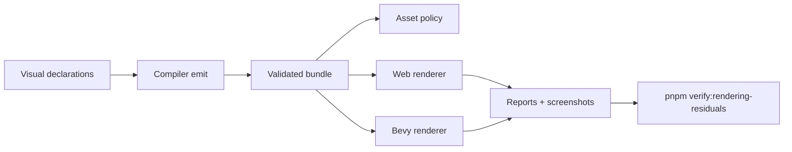

# Post-V10 Rendering, Materials, Geometry, and Asset Residuals

Complexity: 13 -> HIGH mode

## Complexity Assessment

- +3 touches 10+ implementation/test/docs files during implementation
- +2 adds several renderer, material, geometry, and asset contract surfaces
- +2 includes complex visual parity and target capability negotiation
- +2 spans SDK, IR, compiler, web runtime, Bevy runtime, assets, examples, and docs
- +2 requires screenshot/calibration evidence and conformance reports
- +2 covers diagnostic-only advanced renderer boundaries

## Context

**Problem:** V10 assigned many advanced visual gaps but several P1/P2 rows
remain useful for ordinary shipped scenes: runtime LOD swapping, streaming
terrain, material proof, asset streaming diagnostics, and bounded extensions.

**Files Analyzed:**

- `docs/bevy-feature-parity.md`
- `docs/PRDs/done/v10/V10-02-advanced-renderer-materials-and-physics.md`
- `docs/PRDs/done/v10/V10-03-cross-runtime-visual-calibration.md`
- `docs/PRDs/done/v10/V10-04-production-platform-audio-assets-and-release.md`
- `/home/joao/.claude/skills/prd-creator/SKILL.md`

**Current Behavior:**

- Core material fields, texture slots, samplers, bloom, skyboxes, environment
  maps, FXAA/TAA/SMAA metadata, instancing proof, visibility/HLOD observations,
  and many lighting controls are present.
- Several advanced renderer/material/shader items remain intentionally
  unsupported or diagnostic-first.
- Runtime LOD mesh swapping, user-authored instancing APIs, material rendering
  proof gaps, streamed terrain, compressed environment formats, and broader
  asset streaming remain unchecked.

## Checklist Coverage

- `P2` Runtime mesh deformation.
- `P2` Chunked/streamed mesh terrain and world geometry.
- `P1` Visual runtime LOD mesh swapping.
- `P2` Arbitrary user-authored instancing APIs.
- `P2` Custom GPU instance attributes.
- `P2` Compressed skybox/environment texture formats.
- `P2` Advanced blend parity on Bevy beyond normal alpha/mask/blend policy.
- `P2` Native specular texture rendering proof.
- `P2` Broader extended-material catalog beyond current constrained presets.
- `P1` Broader live asset streaming.
- `P2` Custom shader consumption of glTF custom attributes.
- `P3` Custom asset loaders and custom asset types: diagnostic-first unless
  metadata-only asset declarations are promoted.
- `P3` Spherical/area lights, lightmaps, parallax, anisotropy, custom shaders,
  bindless, atmospheric/volumetric effects, SSR, deferred rendering, virtual
  geometry, and custom post passes: diagnostic-only unless a future slice
  narrows them.
- `P3` CSG and boolean mesh operations: diagnostic-only.
- `P3` Storage-buffer/shader-driven procedural geometry: diagnostic-only.

## Impact

**Planned files touched by implementation:** SDK material/geometry/asset APIs,
IR schemas and validators, compiler emit, web runtime renderer/material/asset
adapters, Bevy renderer/material/asset adapters, visual fixtures, verification
tooling, docs, and status.

**Features affected:** LOD, terrain streaming, runtime mesh updates,
instancing, material slots, blend modes, specular proof, extended materials,
asset streaming, glTF custom attributes, environment textures, and diagnostics.

**Main risks:**

- Visual features can appear implemented without matching web/native output.
- Asset streaming can become arbitrary network/filesystem access if manifest
  policy is not enforced.
- Instancing and GPU attributes can expose renderer-specific behavior unless the
  IR contract stays narrow.

## Integration Points

**How will this feature be reached?**

- [x] Entry point identified: SDK renderer/material/geometry/asset declarations,
  `tn build`, web and native previews, conformance reports, visual examples, and
  `pnpm verify:rendering-residuals`.
- [x] Caller file identified: SDK material/mesh/asset helpers, compiler emit
  paths, IR validators, web/Bevy renderer adapters, asset loaders, and verify
  tooling.
- [x] Registration/wiring needed: capability fields, diagnostics, fixtures,
  screenshots, conformance reports, package scripts, docs, and release gate.

**Is this user-facing?**

- [x] YES. Authors see accepted declarations through rendered scenes and
  rejected declarations through build/runtime diagnostics.
- [ ] NO -> Internal/background feature.

**Full user flow:**

1. User authors LOD, terrain chunks, streamed assets, instancing, extended
   materials, specular textures, or custom glTF attribute consumption.
2. `tn build` validates bundle-local and target-profile-safe declarations.
3. Web and Bevy render promoted behavior and write visual/conformance evidence.
4. Unsupported advanced renderer or asset escape hatches produce stable
   diagnostics with promotion criteria.

## Solution

**Approach:**

- Prioritize P1/P2 visual features that improve ordinary scenes and can be
  proved with bounded fixtures.
- Require screenshot/contact-sheet plus deterministic report evidence before
  any rendering row is checked off.
- Keep custom shader, storage-buffer, bindless, deferred, SSR, volumetric,
  CSG, raw asset loader, and arbitrary streaming requests diagnostic-only.
- Promote asset streaming only through manifest-declared, target-profile-aware
  policies with cache/offline diagnostics.

**Key Decisions:**

- [x] Library/framework choices: reuse existing Three.js and Bevy render
  adapters, asset manifest validation, visual calibration artifacts, and verify
  tooling.
- [x] Error-handling strategy: advanced unsupported features fail validation
  with stable renderer/material/asset diagnostics and suggestions.
- [x] Reused utilities: conformance report normalization, screenshot sampling,
  asset manifest validators, material slot reporters, and docs guard patterns.

**Data Changes:** Extend renderer/material/geometry/asset IR and report types.
No database migrations.

## Execution Phases

#### Phase 1: Runtime LOD, Terrain, and Mesh Updates - Large scenes can stream visible geometry.

**Files (max 5):**

- `packages/ir/src/*` - LOD/terrain/mesh-update schema and validation
- `packages/compiler/src/*` - emit visual runtime declarations
- `packages/runtime-web-three/src/*` - web LOD/terrain mapping
- `runtime-bevy/src/*` - native LOD/terrain mapping
- `examples/*/artifacts/rendering-residuals/*` - evidence output

**Implementation:**

- [ ] Promote runtime LOD mesh swapping with deterministic threshold reports.
- [ ] Add chunked terrain/world geometry streaming policy.
- [ ] Add bounded runtime mesh deformation or explicit diagnostics where
  runtime mutation is unsupported.

**Tests Required:**

| Test File | Test Name | Assertion |
|-----------|-----------|-----------|
| `packages/ir/src/rendering-residuals.test.ts` | `should reject terrain chunks outside declared asset groups` | Diagnostic includes asset path. |
| `packages/runtime-web-three/src/lod.test.ts` | `should swap visual LOD at declared threshold` | Report contains selected LOD. |
| `runtime-bevy/tests/lod.rs` | `should swap visual LOD at declared threshold` | Native report matches fixture. |

**User Verification:**

- Action: Run the large-scene LOD fixture in web and native preview.
- Expected: Screenshots and reports show matching LOD selection.

#### Phase 2: Materials and Instancing Proof - Existing material gaps get evidence.

**Files (max 5):**

- `packages/sdk/src/*` - material/instancing authoring helpers
- `packages/ir/src/*` - material/instance validation
- `packages/runtime-web-three/src/*` - material/instance mapping
- `runtime-bevy/src/*` - material/instance mapping
- `tools/verify/src/*` - visual gate checks

**Implementation:**

- [ ] Prove native specular texture rendering with focused screenshots.
- [ ] Promote or reject advanced blend parity beyond current alpha/mask modes.
- [ ] Add bounded user-authored instancing and custom GPU attribute policy.
- [ ] Expand extended materials only when each preset has web/native evidence.

**Tests Required:**

| Test File | Test Name | Assertion |
|-----------|-----------|-----------|
| `packages/ir/src/materials.test.ts` | `should reject unsupported custom GPU instance attribute type` | Diagnostic is stable. |
| `packages/runtime-web-three/src/materials.test.ts` | `should report specular texture slot usage` | Report includes texture asset id. |
| `runtime-bevy/tests/materials.rs` | `should report specular texture rendering proof` | Native proof artifact path exists. |

**User Verification:**

- Action: Run `pnpm verify:rendering-residuals`.
- Expected: Material screenshots, reports, and diff/contact sheets are present.

#### Phase 3: Asset Streaming and Advanced Boundaries - Streaming is safe and escape hatches fail clearly.

**Files (max 5):**

- `packages/ir/src/*` - asset streaming and diagnostic schemas
- `packages/compiler/src/*` - streaming policy emit/reject paths
- `packages/runtime-web-three/src/*` - web asset policy reports
- `runtime-bevy/src/*` - native asset policy reports
- `docs/*` - status/parity updates

**Implementation:**

- [ ] Promote manifest-declared live asset streaming with target profile,
  cache, timeout, offline, and required/optional behavior.
- [ ] Add compressed skybox/environment texture diagnostics or bounded support.
- [ ] Add glTF custom attribute consumption policy for promoted shader/material
  paths.
- [ ] Reject custom executable loaders, raw shaders, bindless, storage buffers,
  CSG, and arbitrary file/network access.

**Tests Required:**

| Test File | Test Name | Assertion |
|-----------|-----------|-----------|
| `packages/ir/src/asset-streaming.test.ts` | `should reject arbitrary runtime network asset access from scripts` | Diagnostic includes portable alternative. |
| `packages/runtime-web-three/src/asset-streaming.test.ts` | `should report optional streamed asset timeout without failing load` | Report severity is warning. |
| `runtime-bevy/tests/asset_streaming.rs` | `should report offline target rejecting live streaming` | Native diagnostic includes target profile. |

**User Verification:**

- Action: Build the streaming fixture for online and offline target profiles.
- Expected: Online target reports allowed streaming; offline target reports
  actionable diagnostics.

## Verification Strategy

- `pnpm --filter @threenative/ir test`
- Web renderer/material/asset tests
- Bevy renderer/material/asset Rust tests
- Screenshot/contact-sheet visual verification
- `pnpm verify:rendering-residuals`
- `pnpm verify:conformance`
- `pnpm verify:release`

## Acceptance Criteria

- [ ] Promoted P1/P2 renderer/material/asset rows have web and Bevy evidence.
- [ ] Advanced unsupported rows emit stable diagnostics.
- [ ] Visual artifacts are nonblank and indexed in docs.
- [ ] `docs/STATUS.md` and `docs/bevy-feature-parity.md` are updated.
