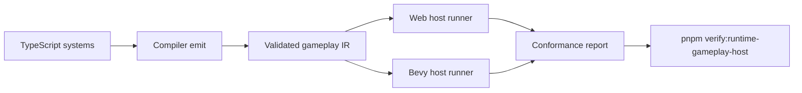
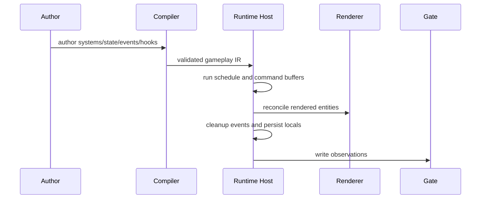

# Post-V10 Runtime Gameplay Host Semantics

Complexity: 12 -> HIGH mode

## Complexity Assessment

- +3 touches 10+ implementation/test/docs files during implementation
- +2 adds live gameplay host semantics across rendered entities
- +2 includes complex state, lifecycle, event, and reconciliation behavior
- +2 spans SDK, IR, compiler, web runtime, Bevy runtime, conformance, and docs
- +2 adds runtime scheduling and host-service behavior beyond fixed traces
- +1 affects release-gate documentation and parity status

## Context

**Problem:** The parity tracker still has P0/P1 gameplay rows where ECS,
state, events, hooks, and command buffers are declared or trace-backed but not
fully executed against live rendered Bevy entities.

**Files Analyzed:**

- `docs/bevy-feature-parity.md`
- `docs/PRDs/README.md`
- `docs/PRDs/done/v10/README.md`
- `docs/PRDs/done/v10/V10-05-ecs-tags-groups-and-scene-containers.md`
- `docs/PRDs/done/v7/V7-07-scripting-determinism-and-runtime-lifecycle.md`
- `/home/joao/.claude/skills/prd-creator/SKILL.md`

**Current Behavior:**

- ECS entities, components, resources, events, schedules, lifecycle traces,
  observers, hooks, tasks, and plugin declarations exist as portable contract
  surfaces.
- The Bevy side still lacks full gameplay host semantics against live rendered
  entities for all promoted lifecycle paths.
- Spawn/despawn reconciliation, event cleanup/windowing, dynamic app-state
  handoff, command-time hooks, and system-local state remain unchecked.
- Async timers/workers/channels are still fixed-trace or declaration-backed
  rather than real runtime services.

## Checklist Coverage

- `P0` Full gameplay host semantics against live rendered Bevy entities.
- `P1` Broad dynamic reconciliation for spawned/despawned rendered entities.
- `P1` Resource/event cleanup and event-windowing semantics.
- `P1` Dynamic app-state lifecycle transitions and richer state handoff.
- `P1` Command-time/removal component hook callbacks.
- `P1` System-local persisted state.
- `P2` Stoppable observer propagation.
- `P2` True async timers, workers, promises, and channels beyond fixed traces.
- `P2` Dynamic runtime plugin loading: diagnostic-only in this PRD.
- `D` Raw Bevy/renderer type IDs in portable gameplay APIs: diagnostic-only.

## Impact

**Planned files touched by implementation:** SDK ECS/system APIs, IR schemas and
validators, compiler extraction, web runtime host, Bevy runtime host, shared
conformance fixtures, example gameplay scenes, verification tooling,
`docs/STATUS.md`, and `docs/bevy-feature-parity.md`.

**Features affected:** runtime ECS execution, rendered entity lifecycle, events,
state machines, observers, component hooks, system locals, async host services,
and unsupported runtime-plugin diagnostics.

**Main risks:**

- Runtime behavior can diverge between web and Bevy if command ordering,
  event-window boundaries, or hook timing is not specified precisely.
- Live rendered-entity reconciliation can leak renderer resources or orphan
  gameplay entities if spawn/despawn paths do not share ownership rules.
- Async services can become arbitrary platform APIs if they are not bounded to
  deterministic portable contracts.

## Integration Points

**How will this feature be reached?**

- [x] Entry point identified: TypeScript ECS/system declarations, `tn build`,
  web preview runtime, native Bevy runtime, conformance fixtures, and
  `pnpm verify:runtime-gameplay-host`.
- [x] Caller file identified: SDK ECS/system helpers, compiler capture/emit
  paths, IR validators, web and Bevy system runners, runtime host-service
  facades, and verify-tool gate registration.
- [x] Registration/wiring needed: new diagnostic codes, runtime host lifecycle
  hooks, conformance observations, example artifacts, package scripts, docs, and
  release verifier integration.

**Is this user-facing?**

- [x] YES. Authors see behavior through portable TypeScript systems, runtime
  rendered output, diagnostics, conformance reports, and example scenes.
- [ ] NO -> Internal/background feature.

**Full user flow:**

1. User authors systems that spawn/despawn rendered entities, transition state,
   emit events, use component hooks, and keep system-local state.
2. `tn build` emits validated IR and rejects raw Bevy IDs, runtime plugin
   loading, or unbounded platform APIs.
3. Web and Bevy runtimes execute the same system lifecycle and record matching
   observations.
4. User runs `pnpm verify:runtime-gameplay-host` and gets conformance evidence
   plus rendered examples proving live host behavior.

## Solution

**Approach:**

- Specify one runtime lifecycle contract for startup, fixed update, update,
  post-update, state entry/exit, command flush, event cleanup, hooks, and
  observer propagation.
- Promote live rendered-entity reconciliation through explicit ownership:
  gameplay entity, renderer handle, asset reference, and teardown observation.
- Add bounded system-local state and event-window semantics that are identical
  in web and Bevy.
- Promote async services only when they are deterministic enough for portable
  verification; keep workers/plugins/raw handles diagnostic-only.

**Key Decisions:**

- [x] Library/framework choices: reuse existing SDK, IR, compiler, web runtime,
  Bevy runtime, conformance, and verify-tool patterns.
- [x] Error-handling strategy: unsupported runtime plugin loading, raw backend
  IDs, arbitrary workers, and arbitrary platform APIs fail validation with
  stable diagnostics and repair hints.
- [x] Reused utilities: existing diagnostic model, command-buffer traces,
  lifecycle trace helpers, runtime host facades, and docs parity guards.

**Data Changes:** Extend existing IR gameplay schemas and conformance report
types. No database migrations.

## Sequence Flow

## Execution Phases

#### Phase 1: Live Entity Host Baseline - Systems mutate rendered Bevy and web entities.

**Files (max 5):**

- `packages/ir/src/*` - host lifecycle schema fields and diagnostics
- `packages/compiler/src/*` - emit lifecycle and rendered-entity requirements
- `packages/runtime-web-three/src/*` - web host reconciliation
- `runtime-bevy/src/*` - Bevy host reconciliation
- `packages/ir/fixtures/runtime-gameplay-host/*` - shared fixtures

**Implementation:**

- [ ] Define command-flush ordering for spawn, despawn, component add/remove,
  transform update, and renderer teardown.
- [ ] Map rendered mesh/UI/audio entity ownership in both runtimes.
- [ ] Reject raw backend handles and unmanaged rendered entities.

**Tests Required:**

| Test File | Test Name | Assertion |
|-----------|-----------|-----------|
| `packages/ir/src/runtime-host.test.ts` | `should reject raw backend handles when authored in gameplay IR` | Diagnostic code and path are stable. |
| `packages/runtime-web-three/src/runtime-host.test.ts` | `should reconcile spawned rendered entities when command buffer flushes` | Web observation includes spawned and removed renderer handles. |
| `runtime-bevy/tests/runtime_host.rs` | `should reconcile spawned rendered entities when command buffer flushes` | Bevy observation matches shared fixture. |

**User Verification:**

- Action: Run `pnpm verify:runtime-gameplay-host`.
- Expected: Web and Bevy reports show matching live spawn/despawn behavior.

#### Phase 2: Events, State, Hooks, and Locals - Gameplay lifecycle has stable runtime semantics.

**Files (max 5):**

- `packages/sdk/src/*` - state/event/hook/system-local authoring helpers
- `packages/ir/src/*` - validation and report schema updates
- `packages/compiler/src/*` - extraction and diagnostics
- `packages/runtime-web-three/src/*` - lifecycle execution
- `runtime-bevy/src/*` - lifecycle execution

**Implementation:**

- [ ] Define event window boundaries and cleanup timing.
- [ ] Implement state entry/exit/update handoff in both runtimes.
- [ ] Run command-time and removal hooks with deterministic ordering.
- [ ] Persist system-local state across frames and reset it on declared teardown.

**Tests Required:**

| Test File | Test Name | Assertion |
|-----------|-----------|-----------|
| `packages/compiler/src/runtime-lifecycle.test.ts` | `should emit lifecycle metadata when systems declare state handoff` | Bundle contains expected schedule/state sections. |
| `packages/runtime-web-three/src/runtime-lifecycle.test.ts` | `should clear events after the declared event window` | Event is visible for the expected frames only. |
| `runtime-bevy/tests/runtime_lifecycle.rs` | `should run removal hooks before renderer teardown` | Hook trace precedes teardown trace. |

**User Verification:**

- Action: Run the lifecycle example through web and native previews.
- Expected: State transitions, event counters, and hook traces match.

#### Phase 3: Bounded Async and Observer Controls - Timers and observers are portable or rejected.

**Files (max 5):**

- `packages/sdk/src/*` - bounded timer/channel APIs
- `packages/ir/src/*` - async and observer schemas/diagnostics
- `packages/runtime-web-three/src/*` - deterministic async runner
- `runtime-bevy/src/*` - deterministic async runner
- `tools/verify/src/*` - focused gate registration

**Implementation:**

- [ ] Add bounded timer and channel declarations with deterministic tick
  semantics.
- [ ] Add stoppable observer propagation with explicit stop scope.
- [ ] Reject dynamic runtime plugin loading, arbitrary workers, and unbounded
  promises.
- [ ] Wire `pnpm verify:runtime-gameplay-host` into release verification.

**Tests Required:**

| Test File | Test Name | Assertion |
|-----------|-----------|-----------|
| `packages/ir/src/runtime-async.test.ts` | `should reject arbitrary worker declarations when not portable` | Diagnostic includes repair hint. |
| `packages/runtime-web-three/src/runtime-async.test.ts` | `should fire bounded timer after fixed ticks` | Timer event count matches fixture. |
| `runtime-bevy/tests/runtime_async.rs` | `should stop observer propagation when handler requests stop` | Later observer does not run. |

**User Verification:**

- Action: Run `pnpm verify:release`.
- Expected: Runtime gameplay host gate is included and passing.

## Checkpoint Protocol

After each implementation phase, run an automated checkpoint review against
this PRD. Continue only after the review reports PASS.

## Verification Strategy

- `pnpm --filter @threenative/ir test`
- `pnpm --filter @threenative/compiler test`
- Web runtime focused tests for host lifecycle and reconciliation
- Bevy focused Rust tests for the same fixtures
- `pnpm verify:runtime-gameplay-host`
- `pnpm verify:conformance`
- `pnpm verify:release`

## Acceptance Criteria

- [ ] All phases complete.
- [ ] P0/P1 runtime gameplay rows covered by SDK/IR/compiler/web/Bevy evidence.
- [ ] Unsupported runtime plugin/raw handle paths emit stable diagnostics.
- [ ] Web and Bevy conformance observations match for promoted lifecycle paths.
- [ ] `docs/STATUS.md` and `docs/bevy-feature-parity.md` are updated.
- [ ] `pnpm verify:release` passes with the new focused gate.
