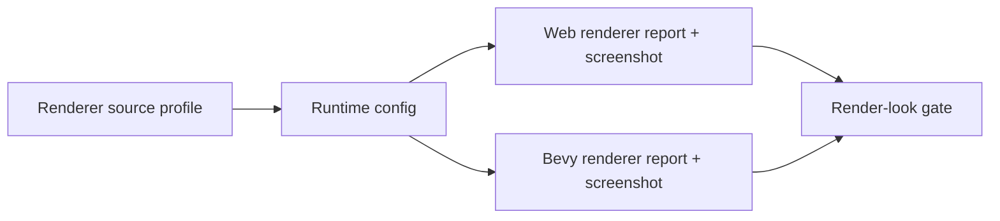
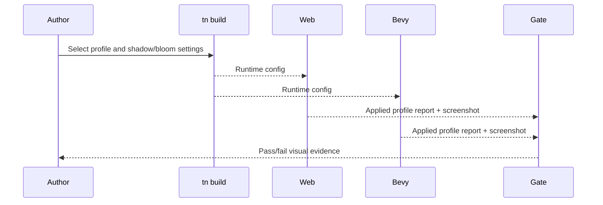

# PRD: Render Look, Shadow, and Bloom Polish Profiles

Complexity: 8 -> HIGH mode

Score basis: +2 touches 6-10 future files, +2 spans SDK/IR/compiler/web/Bevy,
+2 requires cross-runtime screenshot calibration, +1 affects starter defaults,
+1 updates docs and release evidence.

## 1. Context

**Problem:** The parity tracker now identifies `balanced` render look defaults,
shadow quality profiles, bloom, exposure, and material defaults as the next
visual-polish slice before exposing high-end renderer internals.

**Files Analyzed:**

- `docs/bevy-feature-parity.md`
- `docs/STATUS.md`
- `docs/PRDs/README.md`
- `docs/PRDs/other/advanced-visual-effects-lighting-material-depth.md`

**Current Behavior:**

- `parity` and `balanced` render-look profile rows are partially promoted.
- `cinematic` and `stylized` remain reserved until web/Bevy screenshot proof
  exists.
- Shadow and bloom metadata exists, but bounded low/medium/high polish profiles
  are still backlog work.
- Release-profile promotion for screenshot-backed render look proof is pending.

**How will this feature be reached?**

- [x] Entry point identified: runtime config/source renderer declarations,
  `tn build`, web/native preview, and focused verification gates.
- [x] Caller file identified: SDK helpers, IR validators, compiler runtime-config
  emitters, web and Bevy renderer adapters, and visual verification scripts.
- [x] Registration/wiring needed: profile schema rows, starter defaults,
  screenshot fixtures, docs/status updates, and release-gate inclusion after CI
  capture is stable.

**Is this user-facing?**

- [x] YES. Authors choose a render look or starter default and see the result in
  web and native screenshots.
- [ ] NO.

**Full user flow:**

1. User selects a render-look/shadow/bloom profile in source or accepts a
   starter default.
2. `tn build` validates profile metadata and emits runtime config.
3. Web and Bevy runtimes report requested/applied/fallback values.
4. Verification captures screenshots and rejects per-adapter color tuning.

## 2. Solution

**Approach:**

- Promote bounded semantic controls first: tone map, exposure, saturation,
  contrast, bloom intensity, and shadow quality.
- Keep `cinematic` and `stylized` reserved until screenshot evidence proves
  portable output.
- Define shadow profile rows as budgets and defaults, not backend knobs.
- Reuse the existing render-look threshold gate and visual calibration artifacts.

**Key Decisions:**

- [x] Library/framework choices: use existing Three.js/Bevy renderer adapters and
  visual verification tooling.
- [x] Error-handling strategy: reject unknown profile ids and unsupported profile
  fields with stable diagnostics and fallback notes.
- [x] Reused utilities: render-look verification, visual calibration reports,
  screenshot metrics, and docs checks.

**Data Changes:** Extend renderer profile schema/config/report shapes. No
database migrations.

## 3. Sequence Flow

## 4. Execution Phases

#### Phase 1: Profile Contract - Authors can select bounded visual polish profiles.

**Files (max 5):**

- `packages/sdk/src/*` - profile authoring helpers and types
- `packages/ir/src/*` - renderer profile validation
- `packages/compiler/src/*` - runtime config emission
- `docs/bevy-feature-parity.md` - evidence row update
- `docs/STATUS.md` - supported profile status

**Implementation:**

- [ ] Define bounded profile fields for tone map, exposure, saturation,
  contrast, bloom intensity, and shadow quality.
- [ ] Reject backend-specific renderer options.
- [ ] Preserve `cinematic` and `stylized` as reserved ids until visual proof
  lands.

**Tests Required:**

| Test File | Test Name | Assertion |
| --- | --- | --- |
| `packages/ir/src/renderLook.test.ts` | `should accept bounded balanced profile fields` | Runtime config validates without diagnostics. |
| `packages/ir/src/renderLook.test.ts` | `should reject backend renderer knobs` | Diagnostic names the unsupported field path. |

**Verification Plan:**

1. Unit tests for accepted/rejected profile metadata.
2. Compiler output tests for runtime config shape.
3. `pnpm check:docs`.

**User Verification:**

- Action: build a fixture with each promoted profile.
- Expected: runtime config reports requested/applied/fallback profile values.

#### Phase 2: Screenshot Gate - Profiles have web/Bevy visual evidence.

**Files (max 5):**

- `packages/runtime-web-three/src/*` - applied profile reporting
- `runtime-bevy/crates/threenative_runtime/src/*` - native applied profile reporting
- `tools/verify/src/*` - screenshot and metric gate checks
- `scripts/*render-look*` - focused command wrapper if needed
- `docs/pr-evidence/*` - artifact index when generated

**Implementation:**

- [ ] Capture web and Bevy screenshots for `balanced`.
- [ ] Add screenshot-derived metric thresholds and artifact paths.
- [ ] Promote the focused gate into the release profile only after CI capture is
  reliable.

**Tests Required:**

| Test File | Test Name | Assertion |
| --- | --- | --- |
| `packages/runtime-web-three/src/renderLook.test.ts` | `should report applied render look profile` | Web report includes requested/applied/fallback. |
| `runtime-bevy/crates/threenative_runtime/tests/render_look.rs` | `should report applied render look profile` | Native report matches fixture profile. |
| `tools/verify/src/render-look.test.ts` | `should fail when screenshot evidence is missing` | Gate reports missing artifact paths. |

**Verification Plan:**

1. Runtime report tests.
2. Focused render-look verification with screenshots.
3. `pnpm verify:conformance`.

**User Verification:**

- Action: inspect the web/native contact sheet.
- Expected: `balanced` improves scene readability without adapter-specific color
  overrides.

## 5. Acceptance Criteria

- [ ] Bounded render-look, shadow, and bloom profile metadata is validated and
  emitted.
- [ ] Web and Bevy report matching requested/applied/fallback profile state.
- [ ] Screenshot evidence exists before any visual parity row is updated.
- [ ] Reserved profile ids remain diagnostics until proven.
