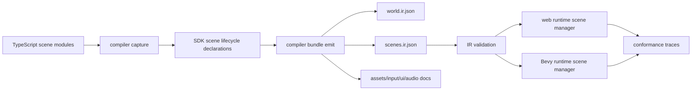
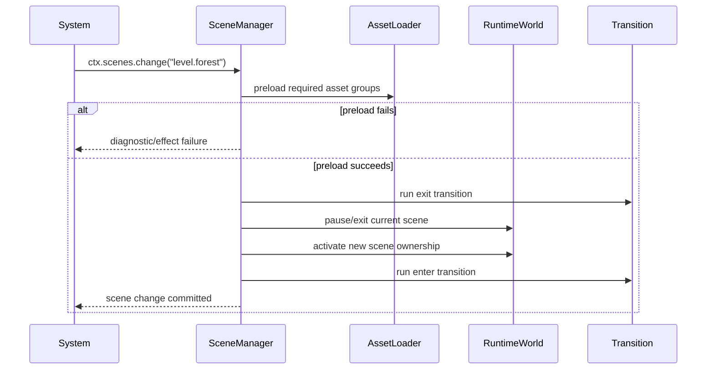

# PRD: Scene Lifecycle and Game Flow Contract

Complexity: 13 -> HIGH mode

Score basis: +3 touches 10+ files during future execution, +2 adds new
scene-lifecycle modules and IR, +2 requires complex runtime state and transition
logic, +2 spans SDK/compiler/IR/CLI/web/Bevy/docs/examples, +1 affects release
gates, +1 affects user-facing templates and examples, +2 requires cross-runtime
asset/input/audio/UI coordination.

## 1. Context

**Problem:** ThreeNative supports a Three.js-like visual scene graph, but it does
not yet provide the scene lifecycle, scene module, transition, loading, and game
flow systems that game authors expect from a complete engine.

**Files Analyzed:**

- `AGENTS.md`
- `packages/AGENTS.md`
- `packages/sdk/src/scene/Scene.ts`
- `packages/sdk/src/scene/Object3D.ts`
- `packages/sdk/src/scene/Group.ts`
- `packages/sdk/src/game.ts`
- `packages/sdk/src/prefab.ts`
- `packages/sdk/src/index.ts`
- `packages/compiler/src/capture.ts`
- `packages/compiler/src/emit/bundle.ts`
- `packages/compiler/src/emit/scene-to-world.ts`
- `packages/compiler/src/capture.test.ts`
- `packages/compiler/src/examples.test.ts`
- `docs/sdk.md`
- `docs/ecs.md`
- `docs/environment-scene-ir.md`
- `docs/STATUS.md`
- `docs/bevy-feature-parity.md`
- `docs/PRDs/v10/V10-05-ecs-tags-groups-and-scene-containers.md`
- `templates/starter-functional/src/game.ts`
- `templates/v5-game-starter/src/game.ts`
- `examples/v10-tags-groups/src/game.ts`

**Current Behavior:**

- `Scene` is an `Object3D` root with active camera metadata. It models visual
  hierarchy, not game flow.
- `Group` and `Object3D.add()` provide transform/editor organization, and
  `sceneToWorld()` lowers children into ECS entities with `Hierarchy`.
- `defineGame({ scene, world, input, ui, audio, environment })` composes one
  bundle root. It is authoring sugar over existing documents, not a scene
  manager.
- Compiler capture validates relative imports recursively, but practical module
  splitting is currently broken because only the entry file is transpiled into
  the temporary capture directory; valid `import "./scene.js"` resolves from
  `packages/compiler/.tn/` instead of the project source directory.
- `environment.scene.json` is a dense environment composition document, not a
  general level/menu/lifecycle system.
- Runtime adapters consume one merged `world.ir.json` plus optional companion
  documents. They do not have a portable concept of loading, activating,
  pausing, transitioning, or unloading named gameplay scenes.

## Pre-Planning Findings

No relevant `.env` or secret configuration is required for this PRD.

**How will this feature be reached?**

- [x] Entry point identified:
  - project entry through `threenative.config.json` `entry`;
  - `defineGame({ scenes, initialScene })` and direct `defineScene(...)`
    authoring APIs;
  - CLI build/validate/dev flows;
  - web runtime bundle load and game loop;
  - Bevy runtime bundle load and app state systems;
  - editor/inspection command paths that read bundle documents.
- [x] Caller files identified:
  - `packages/compiler/src/capture.ts`
  - `packages/compiler/src/emit/bundle.ts`
  - new compiler scene lifecycle emitter called from bundle emit
  - `packages/ir/src/validate.ts`
  - `packages/runtime-web-three/src/index.ts` and game loop/runtime state files
  - `runtime-bevy/crates/threenative_loader/src/lib.rs`
  - `runtime-bevy/crates/threenative_runtime/src/*`
  - `packages/cli/src/commands/build.ts`, `dev.ts`, `validate.ts`, and
    `editor.ts`
- [x] Registration/wiring needed:
  - export SDK scene lifecycle APIs from `@threenative/sdk`;
  - add `scenes.ir.json` or equivalent scene lifecycle document to manifest
    entries/files;
  - wire compiler emit and validation into existing bundle generation;
  - wire web and Bevy runtimes to honor the active scene state;
  - add conformance fixtures and release verification coverage;
  - update templates and docs so users reach this through normal project
    structure.

**Is this user-facing?**

- [x] YES. This is a core game-authoring feature.
- [ ] NO.

**Full user flow:**

1. User creates `src/scenes/menu.ts`, `src/scenes/level-1.ts`, and
   `src/game.ts`.
2. `src/game.ts` imports scene modules and exports
   `defineGame({ scenes: [menuScene, levelOne], initialScene: "menu" })`.
3. `tn build`, `tn dev`, or `tn validate` captures the entry and imported
   modules, emits `world.ir.json` plus scene lifecycle metadata, and validates
   cross-document references.
4. Runtime loads the bundle, preloads the initial scene's required asset groups,
   activates lifecycle systems, routes input/UI/audio/camera state to the active
   scene, and applies declared transitions.
5. Portable systems request scene changes through a declared scene service or
   command. The active scene changes deterministically in web and Bevy.
6. User sees menu -> loading -> level -> pause overlay -> resume -> next level
   behavior with matching runtime traces and diagnostics.

## Product Model

ThreeNative needs two distinct meanings of "scene":

- **Visual scene graph:** current `Scene`, `Object3D`, `Group`, `Mesh`,
  cameras, lights, and hierarchy. This is static or mostly visual authoring.
- **Lifecycle scene:** a named game flow unit such as `main-menu`,
  `level-forest`, `pause-menu`, `inventory-overlay`, `loading-screen`, or
  `credits`. It owns activation policy, asset groups, entity/UI/input/audio
  scope, transitions, lifecycle hooks, and state persistence.

Do not overload `Scene` to mean both. Keep the existing visual scene graph API
stable, and add lifecycle APIs around it.

## Goals

- Let authors split games into modules without dumping everything into
  `src/game.ts`.
- Add first-class lifecycle scenes for menus, levels, overlays, loading screens,
  cutscenes, credits, pause screens, and additive sub-scenes.
- Support deterministic lifecycle phases: preload, enter, active, pause,
  resume, exit, unload.
- Support scene transitions: instant, fade, crossfade, loading-screen,
  stack push/pop, overlay open/close, and additive load/unload.
- Provide portable scene change commands/services callable from ECS systems.
- Scope scene-owned entities, UI, input maps, audio, cameras, asset groups, and
  runtime systems so entering/exiting a scene has predictable effects.
- Preserve persistent world state across scene changes when explicitly declared.
- Emit structured IR and diagnostics instead of relying on runtime JS closures
  or adapter-private behavior.
- Prove web Three.js and native Bevy parity through conformance traces and at
  least one playable multi-scene example.

## Non-Goals

- Do not replace the existing visual `Scene` graph.
- Do not implement arbitrary runtime code loading, dynamic imports, or eval from
  portable systems.
- Do not expose Bevy `States`, `Commands`, `Entity`, `Parent`, or renderer
  internals as public SDK concepts.
- Do not make scene transitions a free-form shader/post-processing system in
  the first implementation.
- Do not solve networking, replication, save-game serialization for every
  component, world streaming, or editor timelines in this PRD.
- Do not allow scene APIs to silently ignore unsupported lifecycle features.

## Proposed API

### Scene modules

```ts
// src/scenes/level-forest.ts
import {
  BoxGeometry,
  Mesh,
  MeshStandardMaterial,
  PerspectiveCamera,
  Scene,
  World,
  defineScene,
  sceneTransition,
} from "@threenative/sdk";

const visual = new Scene({ id: "scene.level-forest.visual" });
const player = new Mesh({
  geometry: new BoxGeometry({ size: [1, 2, 1] }),
  id: "player",
  material: new MeshStandardMaterial({ color: "#f4d35e" }),
});
visual.add(player);

const camera = new PerspectiveCamera({ id: "camera.level", fovY: 60 });
visual.add(camera);
visual.setActiveCamera(camera);

const world = new World()
  .spawn("player", Player(), Health({ current: 100, max: 100 }))
  .addSystem(levelLoop);

export const levelForest = defineScene({
  id: "level.forest",
  kind: "level",
  visual,
  world,
  preload: {
    assetGroups: ["bundle.requiredAssets", "level.forest.assets"],
  },
  input: levelInput,
  ui: levelHud,
  audio: {
    music: "music.forest.loop",
    transition: { kind: "crossfade", durationMs: 500 },
  },
  transitions: {
    enter: sceneTransition.fade({ color: "#000000", durationMs: 350 }),
    exit: sceneTransition.fade({ color: "#000000", durationMs: 250 }),
  },
  persistence: {
    keepResources: ["PlayerProgress", "Settings"],
    keepEntities: ["player"],
  },
});
```

```ts
// src/game.ts
import { defineGame } from "@threenative/sdk";
import { mainMenu } from "./scenes/main-menu.js";
import { pauseMenu } from "./scenes/pause-menu.js";
import { levelForest } from "./scenes/level-forest.js";

export default defineGame({
  initialScene: "main-menu",
  scenes: [mainMenu, pauseMenu, levelForest],
});
```

### Runtime scene commands

Portable systems should request scene changes through declared services or
commands, not arbitrary runtime globals:

```ts
update("menuActions", {
  services: ["scene.change"],
  run(ctx) {
    if (ctx.input.action("Start")) {
      ctx.scenes.change("level.forest", {
        transition: "default",
        preserve: ["Settings", "PlayerProgress"],
      });
    }
  },
});
```

Expected scene operations:

- `ctx.scenes.change(id, options)` exits the active exclusive scene and enters
  another.
- `ctx.scenes.push(id, options)` pauses the current scene and activates an
  overlay/modal scene.
- `ctx.scenes.pop(options)` exits the top scene and resumes the previous scene.
- `ctx.scenes.loadAdditive(id, options)` loads scene-owned entities/UI/audio
  without deactivating the current scene.
- `ctx.scenes.unload(id, options)` unloads a loaded additive scene.
- `ctx.scenes.current()` returns declared active scene metadata.

All services require explicit system declarations and must lower to deterministic
effect records in `systems.ir.json` / runtime traces.

## IR and Bundle Contract

Add a scene lifecycle document, preferably `scenes.ir.json`, referenced from
`manifest.json`:

```json
{
  "schema": "threenative.scenes",
  "version": "0.1.0",
  "initialScene": "main-menu",
  "scenes": [
    {
      "id": "main-menu",
      "kind": "menu",
      "activation": "exclusive",
      "entities": ["camera.menu", "menu.logo"],
      "ui": ["ui.main-menu"],
      "input": "input.main-menu",
      "assetGroups": ["bundle.requiredAssets"],
      "audio": { "music": "music.menu", "transition": { "kind": "fade", "durationMs": 300 } },
      "transitions": {
        "enter": { "kind": "fade", "color": "#000000", "durationMs": 250 },
        "exit": { "kind": "fade", "color": "#000000", "durationMs": 250 }
      }
    }
  ]
}
```

The exact shape may evolve during implementation, but it must preserve these
properties:

- stable scene IDs;
- explicit initial scene;
- deterministic ownership lists for entities, UI roots, input maps, audio
  scopes, camera resources, asset groups, systems, and persistent state;
- activation type: `exclusive`, `overlay`, `additive`, `loading`, or
  `persistent`;
- lifecycle phase metadata;
- transition metadata with bounded, portable options;
- diagnostics for unknown references, duplicate ownership conflicts, invalid
  transitions, unsupported activation combinations, and missing initial scenes.

## Lifecycle Semantics

### Phases

- `preload`: required asset groups are requested. Runtime may show a loading
  scene if declared.
- `enter`: scene-owned entities/UI/input/audio/cameras become active. Enter
  transitions run.
- `active`: scene systems and input routing run normally.
- `pause`: scene remains loaded but no longer receives gameplay input or update
  systems unless explicitly marked `runWhilePaused`.
- `resume`: paused scene regains active input/systems after an overlay pop.
- `exit`: exit transition runs and scene-owned resources are detached.
- `unload`: scene-owned entities/UI/transient resources are removed unless
  declared persistent.

### Ownership

- Scene-owned visual entities are emitted into `world.ir.json` as normal ECS
  entities and referenced by `scenes.ir.json`.
- ECS-only entities can be scene-owned through `World` scene metadata.
- Persistent entities/resources/components must be explicitly declared.
- Ownership conflicts are invalid unless the scene relationship is explicitly
  `persistent` or `additive`.
- Global systems/resources remain available, but scene-scoped systems run only
  when their scene lifecycle policy allows.

### Input

- Exclusive scene input maps replace the current route.
- Overlay scenes can either capture all input, capture UI/pointer only, or pass
  through gameplay input.
- Additive scenes must declare whether they add bindings, override bindings, or
  are input-inert.
- Ambiguous binding conflicts emit diagnostics unless a policy is declared.

### UI

- Scene UI roots are mounted/unmounted with lifecycle phases.
- Overlay scenes should support modal focus capture, pass-through overlays, and
  stack order.
- Accessibility metadata must remain valid after scene activation and overlay
  changes.

### Audio

- Scene music and ambience transitions must be portable and bounded: fade,
  crossfade, stop, continue, duck.
- One-shot event routing follows active scene systems and event queues.
- Paused scenes may keep music, duck music, or pause music by explicit policy.

### Cameras and Rendering

- Scene activation updates `ActiveCamera` / `ActiveCameras` resources.
- Overlay UI scenes do not need a 3D camera unless they own visual content.
- Loading screens and transitions must work in web and Bevy without custom
  renderer internals.

### Physics and Time

- Exiting a scene removes scene-owned colliders/bodies from the physics world.
- Paused scenes do not advance gameplay systems unless marked
  `runWhilePaused`.
- Transition timing is deterministic and based on runtime time services.
- Physics state preservation must be explicit for persistent entities.

## Architecture



## Sequence Flow



## Execution Phases

Each phase is a user-testable vertical slice. Future execution must run the
automated PRD checkpoint reviewer after each phase and continue only after PASS.

#### Phase 1: Capture Real Scene Modules - Authors can split `game.ts` into imported modules

**Files (max 5):**

- `packages/compiler/src/capture.ts` - transpile/load project modules from the
  correct source-relative location.
- `packages/compiler/src/capture.test.ts` - add valid relative import capture
  coverage.
- `packages/compiler/src/examples.test.ts` - add or update a modular template
  build test.
- `templates/v5-game-starter/src/game.ts` - use imported scene/world/input
  modules only if test fixture scope allows.
- `docs/sdk.md` - document supported project module structure.

**Implementation:**

- [ ] Replace entry-only temp transpilation with a project-aware capture path.
- [ ] Preserve current portable import validation and diagnostics.
- [ ] Support NodeNext `.js` specifiers resolving to `.ts`/`.tsx` source files.
- [ ] Ensure unsupported imports in transitive modules still report the source
  file path.
- [ ] Add a modular example that builds and validates.

**Tests Required:**

| Test File | Test Name | Assertion |
| --- | --- | --- |
| `packages/compiler/src/capture.test.ts` | `should capture scene from valid relative module` | `captureEntry` succeeds and root type is `Scene`. |
| `packages/compiler/src/capture.test.ts` | `should preserve diagnostics for invalid transitive imports` | unsupported import path points at imported file. |
| `packages/compiler/src/examples.test.ts` | `should build modular game starter` | bundle validates and contains expected scene entities. |

**User Verification:**

- Action: create `src/scene.ts`, import it from `src/game.ts`, run `pnpm build`
  or `tn build`.
- Expected: bundle emits successfully; no `ERR_MODULE_NOT_FOUND` from
  `packages/compiler/.tn`.

#### Phase 2: Scene Lifecycle SDK Shape - Authors can declare named scenes without runtime behavior yet

**Files (max 5):**

- `packages/sdk/src/game.ts` - extend `defineGame` root options for lifecycle
  scenes and `initialScene`.
- `packages/sdk/src/sceneLifecycle.ts` - add `defineScene`, transition helpers,
  activation/kind/persistence types.
- `packages/sdk/src/index.ts` - export scene lifecycle APIs.
- `packages/sdk/src/game.test.ts` - validate game root behavior.
- `packages/sdk/src/sceneLifecycle.test.ts` - validate scene declaration rules.

**Implementation:**

- [ ] Add `defineScene({ id, kind, visual, world, input, ui, audio, preload,
  transitions, persistence })`.
- [ ] Add `sceneTransition.instant/fade/crossfade/loadingScreen` helpers.
- [ ] Add stable SDK diagnostics for empty IDs, duplicate scene IDs, missing
  initial scene, invalid transition durations, and unsupported lifecycle
  options.
- [ ] Keep direct `defineGame({ scene, world })` behavior backward-compatible.

**Tests Required:**

| Test File | Test Name | Assertion |
| --- | --- | --- |
| `packages/sdk/src/sceneLifecycle.test.ts` | `should define lifecycle scene with visual scene and world` | returned declaration is deterministic. |
| `packages/sdk/src/sceneLifecycle.test.ts` | `should reject invalid transition duration` | throws stable `TN_SDK_SCENE_*` error. |
| `packages/sdk/src/game.test.ts` | `should require initialScene when scenes are declared` | missing/unknown initial scene fails. |

**User Verification:**

- Action: import two scene declarations and call
  `defineGame({ scenes, initialScene })`.
- Expected: TypeScript types guide the author and invalid declarations fail
  before emit.

#### Phase 3: Scene Lifecycle IR and Validation - Bundles contain validated scene metadata

**Files (max 5):**

- `packages/ir/src/types.ts` - add scene lifecycle IR types.
- `packages/ir/schemas/scenes.schema.json` - add structural schema.
- `packages/ir/src/validate.ts` - validate scene lifecycle references.
- `packages/ir/src/validate.test.ts` - accepted/rejected lifecycle fixtures.
- `packages/ir/src/schemas.ts` - export the new schema.

**Implementation:**

- [ ] Define `threenative.scenes` schema/version.
- [ ] Validate initial scene exists and scene IDs are unique.
- [ ] Validate entity/UI/input/audio/asset group references.
- [ ] Validate activation policy combinations.
- [ ] Validate transition kinds and bounded timing.

**Tests Required:**

| Test File | Test Name | Assertion |
| --- | --- | --- |
| `packages/ir/src/validate.test.ts` | `should accept valid scene lifecycle document` | no diagnostics. |
| `packages/ir/src/validate.test.ts` | `should reject unknown initial scene` | `TN_IR_SCENE_INITIAL_UNKNOWN`. |
| `packages/ir/src/validate.test.ts` | `should reject duplicate exclusive ownership` | ownership diagnostic with path. |

**User Verification:**

- Action: run `tn validate` against a bundle with a bad scene reference.
- Expected: stable diagnostic identifies `scenes.ir.json` path and suggested
  fix.

#### Phase 4: Compiler Emit and Bundle Manifest - `defineGame({ scenes })` emits `scenes.ir.json`

**Files (max 5):**

- `packages/compiler/src/emit/bundle.ts` - include scene lifecycle document in
  manifest and emit path.
- `packages/compiler/src/emit/scenes.ts` - lower SDK scene declarations into
  scene lifecycle IR and merge scene-owned roots.
- `packages/compiler/src/emit/bundle.test.ts` - verify manifest and bundle
  output.
- `packages/compiler/src/validate/index.ts` - include lifecycle validation in
  compiler validation path if needed.
- `packages/compiler/src/emit/scenes.test.ts` - focused lowerer tests.

**Implementation:**

- [ ] Lower lifecycle scene visual roots through existing `sceneToWorld()`.
- [ ] Merge multiple scene worlds deterministically into `world.ir.json`.
- [ ] Emit ownership metadata in `scenes.ir.json`.
- [ ] Include `manifest.entry.scenes` and `manifest.files.scenes`.
- [ ] Preserve old single-scene and world-only bundle behavior.

**Tests Required:**

| Test File | Test Name | Assertion |
| --- | --- | --- |
| `packages/compiler/src/emit/scenes.test.ts` | `should lower two lifecycle scenes deterministically` | stable entity ownership and sorted IDs. |
| `packages/compiler/src/emit/bundle.test.ts` | `should emit scenes document for lifecycle game` | manifest references `scenes.ir.json`. |
| `packages/compiler/src/emit/bundle.test.ts` | `should preserve legacy scene root bundle` | no scenes document for old API. |

**User Verification:**

- Action: build a two-scene project.
- Expected: bundle contains `scenes.ir.json`, validates, and old examples still
  build.

#### Phase 5: Runtime Scene Manager Trace - Web and Bevy agree on lifecycle state transitions

**Files (max 5):**

- `packages/runtime-web-three/src/sceneManager.ts` - implement lifecycle state
  machine and effect traces.
- `packages/runtime-web-three/src/index.ts` or game loop file - wire manager
  into runtime update.
- `runtime-bevy/crates/threenative_runtime/src/scene_manager.rs` - native state
  machine.
- `runtime-bevy/crates/threenative_runtime/src/lib.rs` or app setup file - wire
  manager into runtime.
- `packages/ir/fixtures/conformance/scene-lifecycle/game.bundle/*` - shared
  fixture.

**Implementation:**

- [ ] Load initial scene state from `scenes.ir.json`.
- [ ] Implement deterministic `change`, `push`, `pop`, `loadAdditive`, and
  `unload` traces without full rendering transitions yet.
- [ ] Activate/deactivate scene-scoped systems, input, UI, and entity
  visibility/removal according to lifecycle policy.
- [ ] Emit matching web/native conformance observations.

**Tests Required:**

| Test File | Test Name | Assertion |
| --- | --- | --- |
| `packages/runtime-web-three/src/*test.ts` | `should trace change from menu to level` | lifecycle phases occur in order. |
| `runtime-bevy/.../tests/*.rs` | `maps scene lifecycle fixture` | native trace matches expected sequence. |
| conformance fixture test | `scene-lifecycle` | web/native reports match. |

**User Verification:**

- Action: run conformance for `scene-lifecycle`.
- Expected: menu -> level -> pause overlay -> resume trace matches across web
  and Bevy.

#### Phase 6: Scene Services in Portable Systems - Gameplay can request transitions

**Files (max 5):**

- `packages/sdk/src/ecs/system.ts` - add typed scene service context.
- `packages/compiler/src/emit/systems.ts` - emit scene service declarations and
  validate usage.
- `packages/runtime-web-three/src/scripts/*` - expose scene service to portable
  script host.
- `runtime-bevy/crates/threenative_runtime/src/systems_effects.rs` - expose
  native scene service effects.
- `packages/compiler/src/emit/systems.test.ts` - service declaration tests.

**Implementation:**

- [ ] Add `ctx.scenes.change/push/pop/loadAdditive/unload/current`.
- [ ] Require systems to declare scene services.
- [ ] Lower scene service calls to deterministic command/effect records.
- [ ] Reject undeclared service usage with stable diagnostics.

**Tests Required:**

| Test File | Test Name | Assertion |
| --- | --- | --- |
| `packages/compiler/src/emit/systems.test.ts` | `should emit scene service declaration` | `systems.ir.json` includes service. |
| web runtime script test | `should request scene push from system` | scene manager receives effect. |
| Bevy runtime test | `should apply scene change effect` | active scene changes after schedule boundary. |

**User Verification:**

- Action: press Start in a menu example.
- Expected: portable system requests a scene change and both runtimes enter the
  level.

#### Phase 7: Transitions, Loading, and Asset Readiness - Users see real scene changes

**Files (max 5):**

- `packages/runtime-web-three/src/renderTransitions.ts` - web fade/crossfade
  overlay implementation.
- `runtime-bevy/crates/threenative_runtime/src/render_transitions.rs` - Bevy
  fade/loading overlay implementation.
- `packages/compiler/src/emit/capabilities.ts` - derive scene lifecycle and
  transition capabilities.
- `packages/ir/src/validate.ts` - add any transition/load readiness validation
  gaps.
- `packages/cli/src/verify/*scene*` - focused verification harness or report.

**Implementation:**

- [ ] Implement `instant`, `fade`, and `loadingScreen` transitions in both
  runtimes.
- [ ] Gate transition completion on required asset groups.
- [ ] Emit diagnostics for missing loading scene, unsupported transition kind,
  or timed-out asset readiness.
- [ ] Add screenshot or frame-trace proof for visible transitions.

**Tests Required:**

| Test File | Test Name | Assertion |
| --- | --- | --- |
| web transition test | `should complete fade transition after duration` | active scene changes after fade. |
| Bevy transition test | `should block level entry until asset group ready` | loading state precedes enter. |
| CLI verify test | `should report scene transition evidence` | report includes frame/trace artifacts. |

**User Verification:**

- Action: run the multi-scene example in web and native.
- Expected: visible fade/loading behavior; no blank frame during transition.

#### Phase 8: Example, Template, Docs, and Release Gate - New projects use scene lifecycle by default

**Files (max 5):**

- `examples/scene-lifecycle/src/game.ts` and supporting scene modules - canonical
  playable example.
- `templates/starter-functional/src/*` or new template files - modular
  multi-scene starter.
- `docs/sdk.md` - lifecycle scene authoring guide.
- `docs/STATUS.md` - current support and residual gaps.
- `docs/bevy-feature-parity.md` - evidence and parity status.

**Implementation:**

- [ ] Add menu, loading, level, pause overlay, and credits/finish flow.
- [ ] Show input routing, UI focus, audio transition, active camera switch, and
  persistent resource state.
- [ ] Update starter template to avoid one huge `game.ts`.
- [ ] Add release/conformance gate evidence and docs.

**Tests Required:**

| Test File | Test Name | Assertion |
| --- | --- | --- |
| `packages/compiler/src/examples.test.ts` | `should build scene lifecycle example` | validates emitted bundle. |
| CLI verification test | `should verify scene lifecycle example` | report includes web/native traces. |
| docs check | `check:docs` | new docs links resolve. |

**User Verification:**

- Action: create or run the multi-scene starter.
- Expected: first screen is a menu, Start enters a level, Pause opens an
  overlay, Resume returns to the level, Finish exits to credits/menu.

## Verification Strategy

Use narrow checks first, then broader release gates:

- `pnpm --filter @threenative/sdk test`
- `pnpm --filter @threenative/compiler test`
- `pnpm --filter @threenative/ir test`
- runtime-web focused tests
- focused Rust tests under `runtime-bevy`
- `pnpm verify:conformance`
- `pnpm check:docs`
- `pnpm verify:release` once scene lifecycle is release-gated

Evidence required before claiming support:

- SDK unit tests for declarations and diagnostics.
- Compiler tests proving modular entry capture and deterministic `scenes.ir.json`
  emit.
- IR validation tests for accepted and rejected lifecycle documents.
- Web/native conformance trace for menu -> loading -> level -> pause overlay ->
  resume -> exit.
- Visual evidence for at least fade/loading transition in both runtimes.
- Starter template smoke build and validation.
- Docs/status/parity updates.

## Acceptance Criteria

- [ ] Authors can split scene, world, input, UI, audio, and assets into imported
  project modules.
- [ ] `defineScene` and `defineGame({ scenes, initialScene })` are typed,
  documented, and backward-compatible with old roots.
- [ ] Bundles can include validated `scenes.ir.json` lifecycle metadata.
- [ ] Runtime scene manager exists in web and Bevy.
- [ ] Portable systems can request declared scene operations.
- [ ] Scene transitions and loading readiness are deterministic and covered by
  web/native evidence.
- [ ] Scene-owned input/UI/audio/cameras/entities/systems activate and
  deactivate predictably.
- [ ] Persistent entities/resources survive scene changes only when explicitly
  declared.
- [ ] Unsupported lifecycle features produce stable diagnostics.
- [ ] Templates stop encouraging a single giant `game.ts`.
- [ ] `docs/STATUS.md` and `docs/bevy-feature-parity.md` accurately describe
  implemented support and remaining gaps when work lands.

## Open Questions

- Should lifecycle scene visual roots be emitted as hidden/inactive entities in
  one global `world.ir.json`, or should the bundle support per-scene world
  chunks for faster load/unload?
- Should the first release support additive scenes visually only, or full
  additive ECS systems/input/UI?
- Should scene-scoped input maps be separate documents, or should `input.ir.json`
  become a multi-map document keyed by scene?
- Should transition rendering be represented as retained UI, a runtime overlay
  primitive, or a new minimal render-transition IR?
- How much of persistent state belongs in lifecycle scenes versus the existing
  persistence/save-slot system?
- What editor affordances are required after the runtime contract lands:
  scene graph inspector per lifecycle scene, scene stack inspector, transition
  preview, or lifecycle trace timeline?

## Risk Notes

- Scene lifecycle can easily become a second ECS. Keep lifecycle metadata about
  activation and ownership, while gameplay behavior remains systems/components.
- Runtime parity is the main risk. Every supported operation needs shared
  conformance traces, not web-only behavior.
- Module capture should be fixed before adding lifecycle APIs. Otherwise the
  public API will still funnel authors into one giant entry file.
- Loading and transitions must not hide validation failures. Missing assets,
  unsupported transition kinds, and ownership conflicts should fail explicitly.
- Avoid over-promising streaming/open-world behavior. This PRD covers complete
  scene lifecycle and additive loading foundations, not terrain/world streaming.

