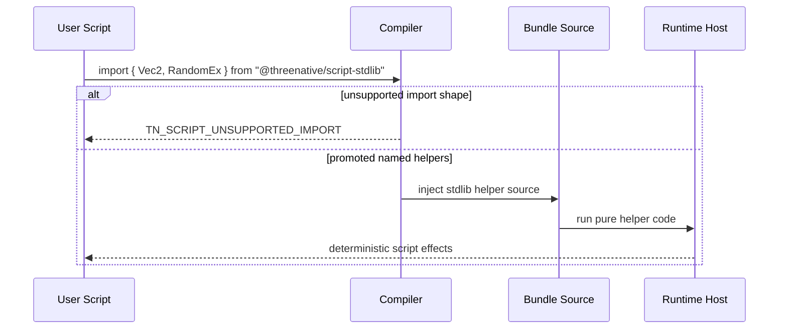

# PRD: Script Stdlib Common Gameplay Helpers

Complexity: 9 -> HIGH mode

Score basis: +3 touches 10+ future implementation/test/docs files, +2 expands
the public `@threenative/script-stdlib` module surface, +2 spans compiler
helper-import bundling and web/Bevy script hosts through bundle evidence, +1
requires deterministic math/random policy, +1 affects release/status evidence.

## 1. Context

**Problem:** `@threenative/script-stdlib` currently covers only the first small
math slice, so most game scripts still need local helper code for common
gameplay chores such as 2D input math, interpolation, bounds checks,
deterministic random choices, color interpolation, and HUD formatting.

**Goal:** Expand `@threenative/script-stdlib` to cover roughly the reusable
80 percent of helpers needed by portable game scripts while preserving the
ThreeNative boundary: helpers are pure, deterministic, dependency-free, and
portable across web JavaScript and Bevy QuickJS.

**Files Analyzed:**

- `AGENTS.md`
- `packages/AGENTS.md`
- `docs/PRDs/README.md`
- `docs/PRDs/done/other/portable-scripting-ergonomics-stdlib-and-lifecycle.md`
- `docs/PRDs/other/portable-scripting-audio-facade.md`
- `docs/contracts/scripting.md`
- `docs/STATUS.md`
- `docs/bevy-feature-parity.md`
- `packages/script-stdlib/src/index.ts`
- `packages/script-stdlib/src/index.test.ts`
- `examples/racing-kit-rally/src/scripts/rally.ts`
- `templates/racing-kit-rally-starter/src/scripts/racing.ts`
- `package.json`

**Current Behavior:**

- `@threenative/script-stdlib` exports `NumberEx`, `Vec3`, `Quat`, and
  `TransformMath`.
- The compiler allows named imports for those promoted helpers and injects
  `SCRIPT_STDLIB_BUNDLE_SOURCE` into `scripts.bundle.js`.
- The stdlib package duplicates helper code in TypeScript exports and an
  embedded bundle string, which is manageable for the current small surface but
  risky for a larger one.
- Existing helpers are pure and host-free; package tests execute the bundle
  source inside an empty `vm` context.
- More advanced runtime facades such as audio, particles, UI, persistence,
  delayed commands, and character contacts are tracked by separate PRDs and
  should not be pulled into this pure helper package.

## Pre-Planning Findings

No `.env` or secret configuration is relevant.

**How will this feature be reached?**

- [x] Entry point identified: user scripts in `src/scripts/**/*.ts` import
  named helpers from `@threenative/script-stdlib`.
- [x] Caller file identified: compiler script bundling currently consumes the
  package's promoted helper bundle source, and examples/templates consume the
  public package exports.
- [x] Registration/wiring needed: public exports, bundled helper source,
  compiler supported-import metadata if new helper objects are added,
  examples/templates, docs/status/parity evidence, and focused verification.

**Is this user-facing?**

- [x] YES. This is a public authoring API for portable gameplay scripts.
- [ ] NO.

**Full user flow:**

1. User authors `src/scripts/player.ts`.
2. Script imports helpers such as `Vec2`, `Ease`, `Bounds2`, `RandomEx`, and
   `TextEx` from `@threenative/script-stdlib`.
3. `tn authoring validate --json`, `tn scene proof ... --json`, or project
   build accepts only promoted named imports and rejects unsupported helper
   shapes with `TN_SCRIPT_UNSUPPORTED_IMPORT`.
4. Compiler emits deterministic helper code into `scripts.bundle.js` and records
   helper import metadata in `scripts.manifest.json`.
5. Web and Bevy execute the same bundle without host API access.
6. User writes shorter scripts for movement, steering, overlap checks, UI text,
   seeded choices, and simple animation curves.

## 2. Product Model

### Promotion Criteria

A helper belongs in `@threenative/script-stdlib` only when it satisfies all of
these rules:

- It is useful across multiple game genres, not a domain kit such as racing,
  tactics, platforming, inventory, dialogue, or quests.
- It is pure and deterministic for the same inputs.
- It has no access to time, timers, promises, randomness globals, DOM, Node,
  workers, filesystem, network, renderer handles, Bevy handles, or Three.js
  objects.
- It accepts and returns plain JSON-compatible values where practical.
- It has stable edge-case behavior for `undefined`, `NaN`, infinities, zero
  length vectors, empty arrays, and invalid precision.
- It is small enough to bundle into every script payload that imports the
  package.

### Initial Inventory Target

The "80 percent" target is a practical authoring heuristic, not a claim that
one package can cover every game. The promoted surface should cover common
cross-genre script chores:

| Area | Helper Object | Target Helpers |
|------|---------------|----------------|
| Numeric guards and interpolation | `NumberEx`, `AngleEx` | `sign`, `saturate`, `wrap`, `repeat`, `pingPong`, `inverseLerp`, `remap`, `moveToward`, `approximately`, `degToRad`, `radToDeg`, `deltaAngle`, `moveTowardAngle` |
| 2D vectors for input/UI/top-down games | `Vec2` | `from`, `add`, `sub`, `scale`, `dot`, `length`, `distance`, `normalize`, `lerp`, `round`, `angle`, `fromAngle`, `rotate` |
| 3D vectors | `Vec3` | existing helpers plus `dot`, `length`, `distance`, `angle`, `projectOnPlane`, `moveToward`, `rotateYaw`, `withY` |
| Quaternions | `Quat` | existing helpers plus `identity`, `normalize`, `multiply`, `slerp`, `fromEuler`, `lookRotation`, `rotateVec3` |
| Transforms | `TransformMath` | existing helpers plus `forward`, `right`, `up`, `withPosition`, `translate`, `lookAtPose` |
| Bounds and proximity | `Bounds2`, `Bounds3` | `rect`, `aabb`, `containsPoint`, `overlaps`, `center`, `size`, `expand`, `closestPoint`, `distanceToPoint` |
| Easing and simple curves | `Ease` | `linear`, `inQuad`, `outQuad`, `inOutQuad`, `outCubic`, `inOutCubic`, `step`, `smoothStep`, `smootherStep` |
| Deterministic random helpers | `RandomEx` | `hash32`, `float01(seed, index)`, `range`, `rangeInt`, `chance`, `pickIndex` |
| Color values | `ColorEx` | `rgb`, `rgba`, `hex`, `lerp`, `multiply`, `withAlpha`, `toHex` |
| Short formatting helpers | `TextEx` | `fixed`, `signedFixed`, `percent`, `timeSeconds`, `padLeft`, `joinNonEmpty` |
| Explicit-state gameplay reducers | `InputEx`, `MotionEx`, `TimerEx`, `ArrayEx` | deadzone shaping, 2D axis normalization, velocity integration, friction/deceleration, seek/arrive steering, explicit cooldown/timer reducers, wrap/clamp index, cycle, groupBy key |
| Pure camera helpers | `CameraMath` | follow offset, look-at pose, orbit pose, screen-shake offset from seed/amplitude/index |

### High-Leverage Boilerplate Reducers

The stdlib should include a small number of pure "do the chore for me" helpers,
not only primitive math. These helpers remove repeated gameplay boilerplate
without accessing `ctx` or runtime services:

```ts
const move = InputEx.axis2({ x: steer, y: throttle }, { deadzone: 0.15 });
const body = MotionEx.planarVelocity({
  velocity: state.velocity,
  input: move,
  maxSpeed: 7,
  acceleration: 20,
  friction: 9,
  dt,
});

const attack = TimerEx.cooldown(state.attackCooldown, dt);
if (attack.ready && pressed) {
  state.attackCooldown = TimerEx.restart(0.35);
}

camera.transform().setPose(
  CameraMath.followPose({
    target: playerPosition,
    yaw,
    offset: [0, 8, 14],
  }),
);
```

Rules:

- `InputEx` shapes numeric action/axis values already read from `ctx.input`;
  it must not read input bindings or actions itself.
- `MotionEx` returns next plain values such as position, velocity, heading, or
  steering output. It must not patch entities.
- `TimerEx` is explicit-state only: callers pass `dt` and the current remaining
  time/state, then store the returned value in declared script state. It must
  not use wall-clock time, promises, runtime schedulers, or callbacks.
- `CameraMath` returns authored transform tuples. It must not inspect renderer
  cameras, projection matrices, DOM size, or native windows.
- `ArrayEx` can cover common deterministic collection chores, but it must not
  hide entity queries or mutate arrays in place.

### Explicit Non-Goals

- No script lifecycle, scene, audio, particle, UI, persistence, settings,
  prefab, hierarchy, physics-contact, navigation, scheduling, or platform
  facades. Those are runtime services or separate PRDs.
- No arbitrary npm helper imports.
- No default, namespace, aliased, or re-exported helper import support.
- No mutable global PRNG state. Random helpers must be seed/index based or
  return explicit next-state values.
- No hidden stateful gameplay systems. Reducers such as `TimerEx` and
  `MotionEx` may return next state, but scripts remain responsible for storing
  that state through declared resources/components.
- No renderer color-space tuning or material/light art-direction transforms.
  Color helpers only manipulate authored data values.
- No matrix/world-hierarchy transform solving unless a future runtime contract
  supplies the required data as plain inputs.
- No BigInt, Date, Intl, locale-sensitive formatting, regex-heavy parsing, or
  host-dependent formatting.

## 3. Solution

**Approach:**

- Add helper objects in bounded phases, with each phase proving both TypeScript
  exports and injected bundle behavior.
- Replace or harden the current duplicated bundle string approach before the
  surface grows too large. Acceptable implementation options are a build-time
  generated bundle source from a canonical helper module or a strict parity test
  that exercises every promoted helper through both entry points.
- Keep compiler supported-import policy explicit: only promoted named helper
  objects are accepted.
- Update docs and examples only after helpers are proven through package tests
  and script-bundle tests.
- Keep domain-specific helpers in opt-in packages such as
  `@threenative/racing-kit`.

```mermaid
flowchart LR
    Script[src/scripts/**/*.ts] --> Import[@threenative/script-stdlib named imports]
    Import --> Compiler[compiler helper import whitelist]
    Compiler --> Bundle[scripts.bundle.js helper injection]
    Bundle --> Web[web JS host]
    Bundle --> Bevy[Bevy QuickJS host]
    Stdlib[packages/script-stdlib] --> Compiler
    Stdlib --> Bundle
```

**Key Decisions:**

- [x] Library/framework choices: no runtime dependencies; use TypeScript, Node
  test, and existing compiler/runtime verification gates.
- [x] Error-handling strategy: stdlib helpers coerce invalid numeric input only
  where the helper contract says so; unsupported imports still fail through
  compiler diagnostics.
- [x] Reused utilities: existing `NumberEx.finite`, tuple coercion patterns,
  `SCRIPT_STDLIB_BUNDLE_SOURCE`, helper import diagnostics, and
  `verify:scripting-helpers-lifecycle`.

**Data Changes:** None. This is public helper API and bundle-source behavior,
not an IR schema change unless a future phase decides to record more precise
helper object metadata in `scripts.manifest.json`.

## 4. Sequence Flow



## 5. Execution Phases

#### Phase 1: Bundle Source Integrity - Every promoted helper has one proven behavior.

**Files (max 5):**

- `packages/script-stdlib/src/index.ts` - introduce the bundle-source
  integrity pattern or generator hook
- `packages/script-stdlib/src/index.test.ts` - parity tests for exported and
  bundled helpers
- `packages/script-stdlib/package.json` - add local build/test hook if needed
- `packages/script-stdlib/scripts/run-tests.mjs` - keep focused execution
  aligned with new tests
- `docs/contracts/scripting.md` - document helper promotion policy

**Implementation:**

- [ ] Choose the canonical source strategy for helper code and
  `SCRIPT_STDLIB_BUNDLE_SOURCE`.
- [ ] Add parity coverage that exercises every existing promoted helper through
  both package exports and the VM bundle context.
- [ ] Document that helper additions require export/bundle parity tests.

**Tests Required:**

| Test File | Test Name | Assertion |
|-----------|-----------|-----------|
| `packages/script-stdlib/src/index.test.ts` | `should keep exported and bundled helper behavior identical` | Existing helpers return identical JSON-compatible values from both paths. |
| `packages/script-stdlib/src/index.test.ts` | `should keep stdlib helpers deterministic and host-free` | Bundle context still lacks `process`, `window`, and `document`. |

**User Verification:**

- Action: Run `pnpm --filter @threenative/script-stdlib test`.
- Expected: Existing helper behavior is unchanged and bundle parity is proven.

#### Phase 2: Core Gameplay Math - Scripts get angle, 2D, 3D, easing, and bounds helpers.

**Files (max 5):**

- `packages/script-stdlib/src/index.ts` - add `AngleEx`, `Vec2`, expanded
  `Vec3`, `Bounds2`, `Bounds3`, and `Ease`
- `packages/script-stdlib/src/index.test.ts` - accepted edge-case tests
- `packages/compiler/src/scripts/sourceRefs.ts` - promote new helper object
  bindings
- `packages/compiler/src/scripts/bundle.test.ts` - bundle import coverage for
  new helper objects
- `packages/compiler/src/scripts/sourceRefs.test.ts` - supported import
  metadata coverage

**Implementation:**

- [ ] Add `AngleEx`, `Vec2`, and expanded `Vec3` helpers with tuple/object
  coercion where applicable.
- [ ] Add bounds helpers for plain 2D rectangles and 3D AABBs.
- [ ] Add easing helpers with clamped `0..1` behavior where appropriate.
- [ ] Promote named helper objects in compiler import validation.

**Tests Required:**

| Test File | Test Name | Assertion |
|-----------|-----------|-----------|
| `packages/script-stdlib/src/index.test.ts` | `should compute common gameplay math deterministically` | `AngleEx`, `Vec2`, expanded `Vec3`, bounds, and easing helpers match expected rounded values. |
| `packages/compiler/src/scripts/bundle.test.ts` | `should bundle promoted gameplay math helpers` | Script importing new helper objects executes from `scripts.bundle.js`. |
| `packages/compiler/src/scripts/sourceRefs.test.ts` | `should record promoted gameplay math helper imports` | Manifest helper metadata lists the new named imports. |

**User Verification:**

- Action: Build a small script that moves an entity with `AngleEx`, `Vec2`,
  `Ease`, and `Bounds2` helpers.
- Expected: Compiler accepts promoted imports and rejects unsupported shapes.

#### Phase 3: Deterministic Random, Color, and Text - Scripts can express common feedback logic.

**Files (max 5):**

- `packages/script-stdlib/src/index.ts` - add `RandomEx`, `ColorEx`, and
  `TextEx`
- `packages/script-stdlib/src/index.test.ts` - deterministic random/color/text
  tests
- `packages/compiler/src/scripts/sourceRefs.ts` - promote new helper object
  bindings
- `packages/compiler/src/scripts/bundle.test.ts` - bundle coverage
- `packages/compiler/src/scripts/sourceRefs.test.ts` - import policy coverage

**Implementation:**

- [ ] Add seed/index random helpers with no global state.
- [ ] Add color helpers for authored numeric and hex values.
- [ ] Add locale-independent text formatting helpers for HUD/status strings.
- [ ] Verify unsupported `Math.random`, `Date`, `Intl`, and host formatting
  remain outside the stdlib contract.

**Tests Required:**

| Test File | Test Name | Assertion |
|-----------|-----------|-----------|
| `packages/script-stdlib/src/index.test.ts` | `should compute random color and text helpers deterministically` | Same seed/index and inputs always produce identical outputs. |
| `packages/compiler/src/scripts/bundle.test.ts` | `should bundle deterministic feedback helpers` | `RandomEx`, `ColorEx`, and `TextEx` work in emitted bundle. |
| `packages/compiler/src/scripts/sourceRefs.test.ts` | `should reject unsupported helper import shapes for feedback helpers` | Default, namespace, aliased, and arbitrary imports keep stable diagnostics. |

**User Verification:**

- Action: Build a script that picks deterministic loot text and color from a
  seed.
- Expected: Rebuilds produce the same bundle output and runtime observations.

#### Phase 4: Boilerplate Reducers - Scripts replace repeated gameplay chores with pure reducers.

**Files (max 5):**

- `packages/script-stdlib/src/index.ts` - add `InputEx`, `MotionEx`,
  `TimerEx`, `ArrayEx`, and `CameraMath`
- `packages/script-stdlib/src/index.test.ts` - reducer and camera helper tests
- `packages/compiler/src/scripts/sourceRefs.ts` - promote new helper object
  bindings
- `packages/compiler/src/scripts/bundle.test.ts` - bundle coverage
- `packages/compiler/src/scripts/sourceRefs.test.ts` - import policy coverage

**Implementation:**

- [ ] Add pure input shaping helpers for deadzones and normalized 2D axes.
- [ ] Add pure motion reducers for velocity integration, friction, seek/arrive,
  and heading changes.
- [ ] Add explicit-state timer/cooldown reducers that require caller-provided
  `dt` and return next state.
- [ ] Add deterministic array/index helpers and pure camera pose helpers.
- [ ] Promote named helper objects in compiler import validation.

**Tests Required:**

| Test File | Test Name | Assertion |
|-----------|-----------|-----------|
| `packages/script-stdlib/src/index.test.ts` | `should reduce common gameplay boilerplate without host state` | Input, motion, timer, array, and camera helpers return deterministic next values. |
| `packages/compiler/src/scripts/bundle.test.ts` | `should bundle pure gameplay reducer helpers` | Reducer helpers work in emitted bundle source. |
| `packages/compiler/src/scripts/sourceRefs.test.ts` | `should record promoted gameplay reducer imports` | Manifest helper metadata lists reducer helper objects. |

**User Verification:**

- Action: Build a script using `InputEx.axis2`, `MotionEx.planarVelocity`,
  `TimerEx.cooldown`, and `CameraMath.followPose`.
- Expected: Script compiles without local helper boilerplate and emits stable
  helper import metadata.

#### Phase 5: Example Migration - Real scripts demonstrate smaller authoring code.

**Files (max 5):**

- `examples/racing-kit-rally/src/scripts/rally.ts` - replace local/general math
  helper code with stdlib helpers where appropriate
- `templates/racing-kit-rally-starter/src/scripts/racing.ts` - remove duplicated
  general-purpose helper code where compiler support allows it
- `examples/racing-kit-rally/package.json` - ensure stdlib dependency is present
- `docs/workflows/developer-workflow.md` - update scripting guidance
- `docs/contracts/scripting.md` - add complete before/after snippet

**Implementation:**

- [ ] Replace general-purpose vector, number, quaternion, bounds, and text
  helpers in examples/templates with stdlib imports.
- [ ] Keep racing/checkpoint/path logic in `@threenative/racing-kit` or local
  gameplay data, not the core stdlib.
- [ ] Confirm generated bundle output remains deterministic.

**Tests Required:**

| Test File | Test Name | Assertion |
|-----------|-----------|-----------|
| Existing rally/example gate | `should build helper-driven rally scripts` | Example still builds and emits helper import metadata. |
| Existing playtest gate | `should preserve rally playtest observations` | Web playtest output remains stable except for expected helper metadata. |

**User Verification:**

- Action: Run `pnpm verify:scripting-helpers-lifecycle`.
- Expected: Helper-driven examples pass web playtest and Bevy bridge evidence.

#### Phase 6: Release Evidence And Docs - The expanded stdlib is promoted.

**Files (max 5):**

- `docs/STATUS.md` - update promoted helper inventory and evidence
- `docs/bevy-feature-parity.md` - update parity/status notes
- `docs/PRDs/README.md` - move/link PRD as appropriate when implemented
- `tools/verify/src/**` - update focused gate if the helper inventory needs
  explicit coverage
- `package.json` - update verification script only if a new focused gate is
  required

**Implementation:**

- [ ] Record the expanded helper surface in active docs.
- [ ] Add or update focused verification so release evidence covers package,
  compiler, web, and Bevy paths.
- [ ] Keep visual parity docs explicit that helper math preserves authored data
  and does not tune adapter rendering.

**Tests Required:**

| Test File | Test Name | Assertion |
|-----------|-----------|-----------|
| `tools/verify/src/**` focused gate tests if changed | `should run expanded scripting stdlib evidence` | Gate invokes stdlib, compiler, and runtime proof commands. |
| Docs checker | `pnpm check:docs` | PRD/status/parity links are valid. |

**User Verification:**

- Action: Run `pnpm check:docs` and `pnpm verify:scripting-helpers-lifecycle`
  or the replacement focused gate.
- Expected: Docs and release evidence acknowledge the expanded helper surface.

## 6. Verification Strategy

**Focused commands:**

- `pnpm --filter @threenative/script-stdlib test`
- `pnpm --filter @threenative/compiler test`
- `pnpm --filter @threenative/runtime-web-three test`
- `cargo test -p threenative_runtime systems_host`
- `pnpm verify:scripting-helpers-lifecycle`
- `pnpm check:docs`
- `pnpm verify:conformance` for shared runtime-contract changes

**Evidence Required:**

- [ ] Exported TypeScript helpers and VM-bundled helpers produce identical
  outputs for every promoted helper object.
- [ ] Helper bundle remains host-free.
- [ ] Compiler accepts promoted named imports and rejects unsupported import
  shapes with stable diagnostics.
- [ ] Web and Bevy script hosts execute helper-driven bundles without exposing
  raw runtime handles.
- [ ] Examples/templates demonstrate reduced local helper code.
- [ ] Docs/status/parity evidence reflect the promoted helper inventory.

## 7. Acceptance Criteria

- [ ] `@threenative/script-stdlib` exposes the promoted helper objects:
  `NumberEx`, `AngleEx`, `Vec2`, `Vec3`, `Quat`, `TransformMath`, `Bounds2`,
  `Bounds3`, `Ease`, `RandomEx`, `ColorEx`, `TextEx`, `InputEx`, `MotionEx`,
  `TimerEx`, `ArrayEx`, and `CameraMath`.
- [ ] Every promoted helper is covered through package exports and
  `SCRIPT_STDLIB_BUNDLE_SOURCE`.
- [ ] Compiler helper-import support is explicit and rejects unsupported import
  shapes.
- [ ] No helper accesses host globals, runtime handles, DOM, Node, network,
  filesystem, timers, promises, or mutable global random state.
- [ ] Existing script stdlib helpers remain backward compatible.
- [ ] Example scripts use the expanded stdlib for general helpers while keeping
  domain-specific logic out of the core package.
- [ ] `pnpm --filter @threenative/script-stdlib test`,
  `pnpm verify:scripting-helpers-lifecycle`, `pnpm check:docs`, and relevant
  compiler/runtime tests pass.
- [ ] Capability promotion updates `docs/STATUS.md` and
  `docs/bevy-feature-parity.md`.
