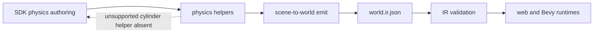
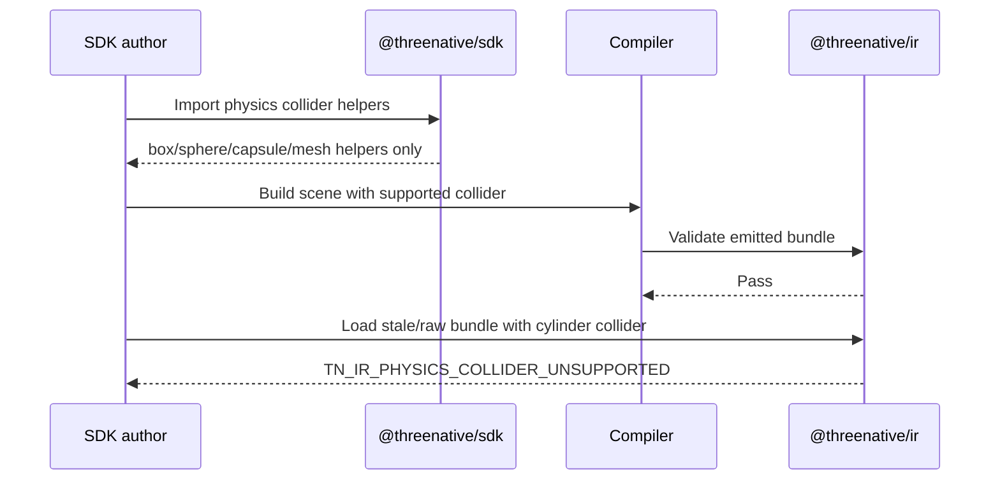

# PRD: SDK Physics Collider Contract Boundary

Complexity: 4 -> MEDIUM mode

Score basis: +2 touches 6-10 future files across docs, SDK, compiler, and IR
tests; +2 spans multiple packages. No new system, database, external API,
complex concurrency, or UI surface is introduced.

## 1. Context

**Problem:** The public SDK exposes `cylinderCollider()` and a `cylinder`
physics collider kind even though IR validation rejects cylinder colliders as
unsupported portable physics.

**Files Analyzed:**

- `AGENTS.md`
- `packages/AGENTS.md`
- `docs/status/code-quality-audit-2026-07-04.md`
- `docs/STATUS.md`
- `docs/bevy-feature-parity.md`
- `docs/PRDs/README.md`
- `packages/sdk/src/physics.ts`
- `packages/sdk/src/physics.test.ts`
- `packages/sdk/src/index.ts`
- `packages/compiler/src/emit/scene-to-world.ts`
- `packages/compiler/src/emit/physics.test.ts`
- `packages/ir/src/validate.ts`
- `packages/ir/src/physics.test.ts`
- `packages/runtime-web-three/src/character.ts`
- `runtime-bevy/crates/threenative_runtime/src/character.rs`

**Current Behavior:**

- `PhysicsColliderKind` includes `"cylinder"` and `cylinderCollider()` returns
  `{ kind: "cylinder", radius, height }`.
- `packages/sdk/src/index.ts` re-exports `cylinderCollider()` as public API.
- Compiler physics emit copies the SDK collider kind directly into
  `world.ir.json`.
- IR validation rejects `Collider.kind: "cylinder"` with
  `TN_IR_PHYSICS_COLLIDER_UNSUPPORTED`.
- Runtime character helpers contain defensive cylinder sizing code, but this is
  not a promoted IR contract because the bundle validator rejects the shape.

## Pre-Planning Findings

No `.env` or external configuration is required. This is a contract-boundary
fix, not a runtime physics feature.

**How will this feature be reached?**

- [x] Entry point identified: SDK physics helpers used by TypeScript authors,
  compiler scene emission, and IR bundle validation.
- [x] Caller file identified:
  `packages/compiler/src/emit/scene-to-world.ts` consumes SDK physics
  declarations and emits `components.Collider`.
- [x] Registration/wiring needed: update SDK exports/types/tests, add compiler
  regression coverage, keep IR unsupported-cylinder validation stable, and
  document the public capability boundary.

**Is this user-facing?**

- [x] YES. Game authors import SDK physics helpers directly.
- [ ] NO.

**Full user flow:**

1. User imports physics helpers from `@threenative/sdk`.
2. User authors a mesh with `physics({ collider: ... })`.
3. Compiler lowers the authored declaration into `world.ir.json`.
4. IR validation accepts only promoted portable collider kinds.
5. Unsupported cylinder collider authoring fails early in SDK/compile-time
   tests or is absent from the public helper surface until the collider is
   promoted through IR, web, Bevy, conformance, and docs.

## 2. Solution

**Approach:**

- Treat cylinder physics colliders as unsupported for now. Do not promote them
  through IR/runtime mapping in this slice.
- Remove `cylinder` from the public `PhysicsColliderKind` union and stop
  re-exporting `cylinderCollider()` from the SDK package entry point.
- Keep geometry cylinder support untouched. This PRD is only about physics
  collider shapes, not mesh primitives.
- Preserve IR validation behavior that rejects `Collider.kind: "cylinder"`.
- Add regression tests so SDK/compiler surfaces cannot silently reintroduce a
  helper that emits invalid portable IR.



**Key Decisions:**

- [x] Library/framework choices: reuse existing `node:test` package tests and
  current SDK/compiler/IR validation utilities.
- [x] Error-handling strategy: unsupported cylinder physics should not be
  presented as a valid SDK helper. Raw or stale serialized cylinder colliders
  continue to fail with the existing IR diagnostic.
- [x] Reused utilities: existing SDK error tests, compiler scene emit tests,
  and IR physics validation tests.

**Data Changes:** None. No bundle schema migration is introduced because
cylinder colliders remain unsupported.

## 3. Sequence Flow



## 4. Execution Phases

#### Phase 1: SDK Boundary - Authors can no longer create invalid cylinder collider declarations through the public helper.

**Files (max 5):**

- `packages/sdk/src/physics.ts` - remove `cylinder` from
  `PhysicsColliderKind` and remove or make private the `cylinderCollider`
  helper.
- `packages/sdk/src/index.ts` - stop exporting `cylinderCollider`.
- `packages/sdk/src/physics.test.ts` - assert the supported collider helpers
  remain deterministic and document the unsupported cylinder boundary.

**Implementation:**

- [ ] Remove `"cylinder"` from `PhysicsColliderKind`.
- [ ] Remove `cylinderCollider()` from the public SDK physics module, or keep
  only a non-exported compatibility diagnostic helper if TypeScript API
  compatibility requires a staged deprecation.
- [ ] Remove the entry-point export from `packages/sdk/src/index.ts`.
- [ ] Keep `boxCollider`, `sphereCollider`, `capsuleCollider`, and
  `meshCollider` behavior unchanged.
- [ ] Add a type-level or runtime test that prevents re-exporting unsupported
  cylinder collider helpers.

**Tests Required:**

| Test File | Test Name | Assertion |
| --- | --- | --- |
| `packages/sdk/src/physics.test.ts` | `physics should expose only promoted portable collider helpers` | Supported helpers still return deterministic declarations and cylinder is not part of the public helper surface. |

**User Verification:**

- Action: run `pnpm --filter @threenative/sdk test`.
- Expected: SDK physics tests pass and no public SDK helper emits
  `Collider.kind: "cylinder"`.

#### Phase 2: Compiler and IR Regression - Emitted bundles cannot silently carry SDK-authored unsupported cylinder physics.

**Files (max 5):**

- `packages/compiler/src/emit/physics.test.ts` - add a regression proving the
  SDK physics emit surface covers only supported collider declarations.
- `packages/ir/src/physics.test.ts` - keep or sharpen the rejected raw-cylinder
  bundle test.
- `packages/ir/src/validate.ts` - change only if the diagnostic path/message
  needs stabilization; do not promote cylinder support.

**Implementation:**

- [ ] Add compiler coverage that uses the public SDK helper set and validates
  emitted collider kinds are accepted by IR.
- [ ] Keep the raw serialized cylinder rejection test in IR.
- [ ] If needed, make the unsupported-cylinder diagnostic path stable and
  actionable without changing accepted kinds.
- [ ] Do not add `collider.cylinder` capability derivation.
- [ ] Do not change web or Bevy runtime mappings in this slice.

**Tests Required:**

| Test File | Test Name | Assertion |
| --- | --- | --- |
| `packages/compiler/src/emit/physics.test.ts` | `physics emit should stay within promoted collider kinds` | Compiler-emitted SDK physics collider kinds are `box`, `sphere`, `capsule`, or `mesh`. |
| `packages/ir/src/physics.test.ts` | `physics should reject unsupported cylinder collider kind` | Raw `Collider.kind: "cylinder"` fails with `TN_IR_PHYSICS_COLLIDER_UNSUPPORTED`. |

**User Verification:**

- Action: run `pnpm --filter @threenative/compiler test` and
  `pnpm --filter @threenative/ir test`.
- Expected: compiler and IR tests pass; raw cylinder remains rejected.

#### Phase 3: Documentation and Status - Contributors can see that cylinder mesh primitives are not cylinder physics colliders.

**Files (max 5):**

- `docs/STATUS.md` - record the SDK/IR boundary decision in current status.
- `docs/bevy-feature-parity.md` - clarify that cylinder mesh primitive support
  does not imply cylinder physics collider support.
- `docs/PRDs/README.md` - keep this active PRD discoverable until done.

**Implementation:**

- [ ] Add a concise current-status note that promoted physics colliders remain
  box, sphere, capsule, and mesh.
- [ ] Clarify any parity checklist text that mentions cylinder primitives so it
  cannot be read as cylinder physics collider support.
- [ ] Link this PRD from the active runtime/gameplay parity initiative list.
- [ ] When implementation is finished and reviewed, move this PRD to
  `docs/PRDs/done/other/` and update the index.

**Tests Required:**

| Test File | Test Name | Assertion |
| --- | --- | --- |
| Docs gate | `pnpm check:docs` | PRD/status/parity links resolve and current support text is consistent. |

**User Verification:**

- Action: read `docs/STATUS.md` and `docs/bevy-feature-parity.md`.
- Expected: docs distinguish renderable cylinder mesh primitives from portable
  physics collider kinds.

## 5. Checkpoint Protocol

After each implementation phase, run an automated checkpoint review with the
`prd-work-reviewer` agent:

```text
Review checkpoint for phase N of PRD at docs/PRDs/other/sdk-physics-collider-contract-boundary.md
```

Continue only after the reviewer reports PASS. Manual checkpoint is not
required because this PRD has no visual UI, external service, or
performance-sensitive manual verification surface.

## 6. Verification Strategy

Run the narrowest package checks first:

```bash
pnpm --filter @threenative/sdk test
pnpm --filter @threenative/compiler test
pnpm --filter @threenative/ir test
pnpm check:docs
```

Full release verification is not required for this slice unless the
implementation changes release gates, capability manifests, or runtime adapter
behavior.

## Non-Goals

- Promoting cylinder physics collider support.
- Changing cylinder mesh primitive rendering or geometry helpers.
- Adding `collider.cylinder` capability metadata.
- Tuning web or Bevy runtime physics approximations for cylinder colliders.
- Reworking broader physics validation architecture.

## Open Questions

- Should a staged deprecation preserve a runtime `cylinderCollider()` export
  that always throws a stable `SdkError`, or should the helper be removed from
  the public export immediately? The conservative default is removal from the
  public entry point with docs/status clarification.
- Should unsupported helper removals require a package changelog entry in this
  repo's current release workflow, or are status/parity docs sufficient for
  unreleased API slices?
