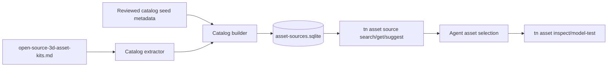
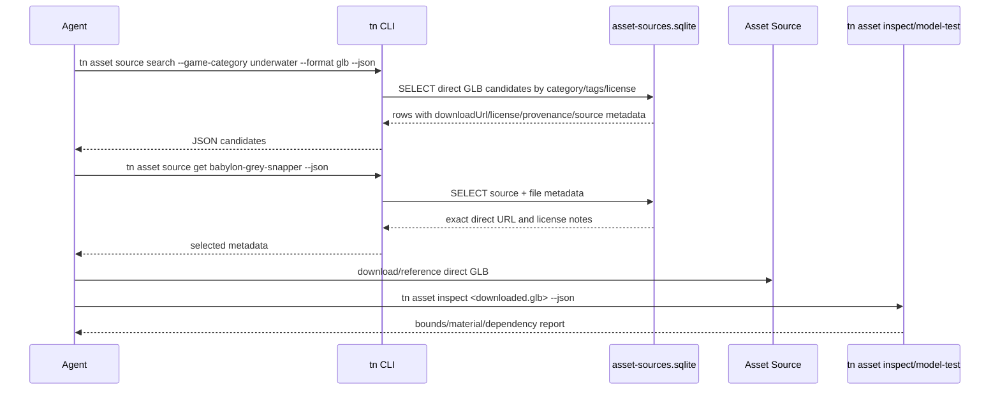

# PRD: Shippable Asset Source Catalog

Complexity: 6 -> MEDIUM mode

Score basis: +2 new tooling/data module, +2 multi-package CLI/docs changes,
+1 database schema, +1 external asset-source ingestion.

## 1. Context

**Problem:** Agents need direct GLB/glTF asset URLs and provenance metadata, but
the current human-readable asset sourcing guide requires manual reading,
browsing, and link extraction.

**Goal:** Ship a queryable SQLite asset-source catalog with direct model links,
license posture, game-category tags, provenance, and agent instructions so
agents can find usable assets before doing web research.

**Non-goals:**

- Do not vendor third-party asset binaries into the repo as part of this PRD.
- Do not make the runtime adapters depend on the catalog.
- Do not treat marketplace/index pages as license proof for a specific asset.
- Do not replace `docs/workflows/open-source-3d-asset-kits.md`; use it as the
  human guide and extraction source.
- Do not ingest unclear-license assets as usable entries. Store them only as
  blocked/review-needed candidates if needed.

**Files Analyzed:**

- `AGENTS.md`
- `package.json`
- `docs/PRDs/README.md`
- `docs/workflows/open-source-3d-asset-kits.md`
- `docs/PRDs/other/agent-friendly-project-and-visual-debugging-workflows.md`
- `docs/PRDs/other/game-authoring-loop-hardening.md`
- `packages/cli/src/index.ts`
- `packages/cli/src/commands/asset.ts`
- `packages/cli/src/commands/asset.test.ts`
- `packages/cli/src/commands/help.ts`

**Current Behavior:**

- `docs/workflows/open-source-3d-asset-kits.md` lists recommended packs,
  genre routes, license cautions, and source pages.
- Some entries are direct asset files, but many are pack pages or generated
  indexes that require manual navigation.
- Agents currently need to read Markdown, infer the right pack, browse source
  pages, and find exact GLB URLs by hand.
- `tn asset inspect` works on local files and directories, but there is no CLI
  command for searching remote asset candidates before download.
- There is no shippable database artifact for direct asset references.

## Pre-Planning Findings

The asset-source catalog is developer/agent tooling data. It belongs with CLI
and docs distribution, not inside web/native runtime packages. The catalog must
be queryable without loading a large JSON file into memory because it is
expected to grow continuously.

**How will this feature be reached?**

- [x] Entry point identified:
  - `tn asset source search [--game-category <category>] [--format glb]`
  - `tn asset source get <asset-source-id>`
  - `tn asset source suggest --goal <text>`
  - `tn asset source export --format jsonl`
  - `tn asset source ingest --from docs/workflows/open-source-3d-asset-kits.md`
- [x] Caller file identified:
  - `packages/cli/src/index.ts`
  - `packages/cli/src/commands/asset.ts`
  - new helper module under `packages/cli/src/assetSourceCatalog/`
  - generated/shipped data under `packages/cli/data/` or equivalent package
    asset path
- [x] Registration/wiring needed:
  - Add subcommands to `tn asset`.
  - Include the SQLite file in CLI package/distribution output.
  - Add build/check command that regenerates the SQLite file from reviewed
    source metadata and fails on drift.
  - Update `AGENTS.md` and `docs/workflows/open-source-3d-asset-kits.md` with
    query-first instructions.

**Is this user-facing?**

- [x] YES. Developers and agents run these commands while choosing assets for
  generated games, examples, fixtures, and visual tests.
- [ ] NO.

**Full user flow:**

1. User asks an agent to create or improve a ThreeNative game.
2. Agent identifies the target game category, such as `racing`, `platformer`,
   `dungeon-crawler`, `shooter`, `farming`, `underwater`, or `pbr-test`.
3. Agent runs `tn asset source search --game-category <category> --format glb
   --license CC0 --json`.
4. CLI queries the shipped SQLite catalog and returns direct `downloadUrl`,
   `sourceUrl`, `license`, `format`, `gameCategory`, `tags`, source metadata,
   and cautions.
5. Agent selects a candidate, records the provenance, downloads or references
   the direct GLB/glTF URL, then runs `tn asset inspect` and `tn model-test`.
6. If no suitable result exists, agent consults
   `docs/workflows/open-source-3d-asset-kits.md`, performs web research, and
   adds reviewed metadata back through the catalog ingestion flow.

## 2. Solution

**Approach:**

- Make SQLite the shipped/queryable catalog because the asset corpus is expected
  to grow large.
- Use reviewed structured source metadata plus extraction from
  `docs/workflows/open-source-3d-asset-kits.md` as input to generate the SQLite
  artifact.
- Store direct file-level records separately from pack/source-page records.
  Agents should prefer records with a direct `downloadUrl`.
- Store source-origin metadata separately from asset rows so every asset can be
  traced back to the exact doc section, upstream repository path, generated
  index row, importer, and review evidence that produced it.
- Add CLI search/get/suggest/export commands that return stable JSON for agents
  and concise tables for humans.
- Keep Markdown as narrative guidance and policy; keep SQLite as the direct-link
  lookup source of truth for automation.
- Add agent instructions that require querying the catalog before broad web
  research.



**Key Decisions:**

- [x] SQLite is the shippable query artifact.
- [x] The database ships with CLI/tooling distribution, not runtime adapters.
- [x] Direct file URLs are first-class. Pack pages are still stored, but they do
  not satisfy “ready to download a GLB” unless a direct `downloadUrl` exists.
- [x] Source metadata is required for every row. A record without a clear origin
  can exist only as `review-needed` or `blocked`, never as a recommended asset.
- [x] License posture is stored per asset file or per source record, never
  inferred from a broad marketplace unless the exact page/file proves it.
- [x] `docs/workflows/open-source-3d-asset-kits.md` remains the required
  extraction reference for initial metadata and ongoing curation.

**Data Changes:**

Add a generated SQLite artifact, proposed path:

- `packages/cli/data/asset-sources.sqlite`

Add reviewed source metadata and extraction configuration, proposed paths:

- `docs/data/asset-sources.seed.jsonl`
- `docs/data/asset-sources.schema.sql`
- `scripts/build-asset-source-catalog.mjs`

No runtime bundle schema changes.

### SQLite Schema

```sql
CREATE TABLE catalog_meta (
  key TEXT PRIMARY KEY,
  value TEXT NOT NULL
);

CREATE TABLE source_origins (
  id TEXT PRIMARY KEY,
  origin_type TEXT NOT NULL CHECK (
    origin_type IN ('workflow-doc', 'generated-index', 'repository', 'asset-page', 'api', 'manual-review')
  ),
  origin_name TEXT NOT NULL,
  origin_url TEXT NOT NULL,
  origin_path TEXT,
  origin_section TEXT,
  origin_ref TEXT,
  origin_line_start INTEGER,
  origin_line_end INTEGER,
  importer_name TEXT NOT NULL,
  importer_version TEXT NOT NULL,
  imported_on TEXT NOT NULL,
  review_status TEXT NOT NULL CHECK (
    review_status IN ('reviewed', 'needs-license-review', 'needs-format-review', 'blocked')
  ),
  review_evidence TEXT NOT NULL DEFAULT '',
  notes TEXT NOT NULL DEFAULT ''
);

CREATE TABLE asset_sources (
  id TEXT PRIMARY KEY,
  origin_id TEXT NOT NULL REFERENCES source_origins(id),
  name TEXT NOT NULL,
  source_kind TEXT NOT NULL CHECK (
    source_kind IN ('direct-file', 'pack-page', 'index', 'repository', 'scan')
  ),
  source_url TEXT NOT NULL,
  provenance_url TEXT NOT NULL,
  creator TEXT,
  license_id TEXT NOT NULL,
  license_url TEXT,
  license_posture TEXT NOT NULL CHECK (
    license_posture IN ('cc0', 'permissive-attribution', 'mixed', 'review-needed', 'blocked')
  ),
  redistribution_allowed INTEGER NOT NULL CHECK (redistribution_allowed IN (0, 1)),
  attribution_required INTEGER NOT NULL CHECK (attribution_required IN (0, 1)),
  notes TEXT NOT NULL DEFAULT '',
  cautions TEXT NOT NULL DEFAULT '',
  reviewed_on TEXT NOT NULL,
  reviewed_by TEXT NOT NULL DEFAULT 'repo-curation'
);

CREATE TABLE asset_files (
  id TEXT PRIMARY KEY,
  source_id TEXT NOT NULL REFERENCES asset_sources(id),
  direct_name TEXT NOT NULL,
  game_category TEXT NOT NULL,
  download_url TEXT,
  format TEXT NOT NULL,
  file_role TEXT NOT NULL DEFAULT 'model',
  preview_url TEXT,
  sha256 TEXT,
  byte_size INTEGER,
  engine_fit TEXT NOT NULL DEFAULT 'web-and-native',
  import_notes TEXT NOT NULL DEFAULT '',
  is_direct_download INTEGER NOT NULL CHECK (is_direct_download IN (0, 1))
);

CREATE TABLE asset_tags (
  asset_file_id TEXT NOT NULL REFERENCES asset_files(id),
  tag TEXT NOT NULL,
  PRIMARY KEY (asset_file_id, tag)
);

CREATE TABLE asset_source_metadata (
  asset_file_id TEXT NOT NULL REFERENCES asset_files(id),
  key TEXT NOT NULL,
  value TEXT NOT NULL,
  PRIMARY KEY (asset_file_id, key)
);

CREATE INDEX idx_source_origins_type ON source_origins(origin_type);
CREATE INDEX idx_source_origins_review ON source_origins(review_status);
CREATE INDEX idx_asset_files_category ON asset_files(game_category);
CREATE INDEX idx_asset_files_format ON asset_files(format);
CREATE INDEX idx_asset_sources_license ON asset_sources(license_id);
CREATE INDEX idx_asset_files_direct ON asset_files(is_direct_download);
```

### Source Metadata Requirements

Every record must answer “where did this come from?” without reopening a browser
or guessing from a name. Required origin metadata:

- `originType`: `workflow-doc`, `generated-index`, `repository`, `asset-page`,
  `api`, or `manual-review`.
- `originName`: human-readable source, such as `BabylonJS Assets.md`,
  `Khronos glTF Sample Assets`, or `Open Source 3D Asset Kits`.
- `originUrl`: exact URL used to find the record.
- `originPath`: repository path, generated-index path, or source file path when
  available, such as `meshes/aerobatic_plane.glb` or
  `docs/workflows/open-source-3d-asset-kits.md`.
- `originSection`: workflow doc heading or index grouping, such as
  `Use-Case Shortlist`, `GitHub-Hosted Sources`, or `glTF And Loader Test
  Sources`.
- `originRef`: upstream commit SHA, release tag, index snapshot date, or `HEAD`
  marker when no immutable ref is available yet.
- `originLineStart` and `originLineEnd`: line anchors for local Markdown
  extraction when applicable.
- `importerName` and `importerVersion`: script/importer that created the row.
- `importedOn`: date the metadata was imported.
- `reviewStatus`: `reviewed`, `needs-license-review`, `needs-format-review`, or
  `blocked`.
- `reviewEvidence`: short text naming what proved the direct URL, license, and
  format, for example `Assets.md row + repository README license statement`.
- `notes`: source-specific caveats.

Examples:

```json
{
  "id": "origin-babylon-assets-md",
  "originType": "generated-index",
  "originName": "BabylonJS Assets.md",
  "originUrl": "https://github.com/BabylonJS/Assets/blob/master/Assets.md",
  "originPath": "Assets.md",
  "originSection": "generated asset index",
  "originRef": "master",
  "importerName": "babylon-assets-md",
  "importerVersion": "1",
  "reviewStatus": "reviewed",
  "reviewEvidence": "Assets.md direct mesh path plus BabylonJS/Assets README license posture"
}
```

### Required Metadata Fields

Every usable direct asset record must include:

- `id`: stable repo-local ID, e.g. `babylon-aerobatic-plane-glb`.
- `directName`: human-readable asset name, e.g. `aerobatic_plane`.
- `gameCategory`: normalized category, e.g. `flight`, `vehicle`, `underwater`,
  `pbr-test`, `animation-skinning`, `webxr-controller`.
- `downloadUrl`: direct GLB/glTF URL when available.
- `format`: `glb`, `gltf`, `fbx`, `obj`, `blend`, `zip`, or `unknown`.
- `sourceUrl`: human source page or repository file page.
- `provenanceUrl`: exact upstream source or index entry used for metadata.
- `originId`: reference to `source_origins.id`.
- `sourceMetadata`: key/value metadata such as upstream repository, commit/tag,
  source path, package/version, index row, archive URL, or folder license file.
- `licenseId`: SPDX-like value where possible, e.g. `CC0-1.0`, `CC-BY-4.0`,
  `MIT`, `Mixed`, `ReviewRequired`.
- `licensePosture`: queryable classification.
- `redistributionAllowed` and `attributionRequired`.
- `tags`: searchable descriptors, such as `aircraft`, `controller`, `fish`,
  `shader-ball`, `morph-target`, `vehicle`, `space`.
- `cautions`: conversion, attribution, scale, or per-folder license notes.

## 3. Sequence Flow



## 4. Execution Phases

#### Phase 1: Catalog Schema and Seed Extraction - Agents have a committed schema and initial metadata source.

**Files (max 5):**

- `docs/data/asset-sources.schema.sql` - SQLite schema and indexes.
- `docs/data/asset-sources.seed.jsonl` - reviewed seed records extracted from
  `docs/workflows/open-source-3d-asset-kits.md`.
- `scripts/build-asset-source-catalog.mjs` - deterministic builder from seed
  JSONL to SQLite.
- `scripts/build-asset-source-catalog.test.mjs` - schema/build validation.
- `docs/workflows/open-source-3d-asset-kits.md` - document that SQLite is the
  direct-link automation source.

**Implementation:**

- [x] Define normalized `gameCategory` values from the workflow doc coverage
  table.
- [x] Extract pack/source metadata from
  `docs/workflows/open-source-3d-asset-kits.md`.
- [x] Create `source_origins` rows for every extraction source, including the
  local workflow doc path/heading/line range and the upstream index or asset
  page used to verify direct file URLs.
- [x] Seed direct GLB records first from sources that expose stable direct file
  paths, such as Babylon.js Assets, Khronos sample assets, Three.js examples,
  raylib glTF examples, and any reviewed direct GLB repositories.
- [x] Store pack-page records from Kenney, Quaternius, KayKit, Tiny Treats, and
  similar sources with `is_direct_download = 0` until exact GLB URLs are
  ingested.
- [x] Reject or mark unclear-license sources as `review-needed` or `blocked`.
- [x] Build the SQLite file deterministically.

**Tests Required:**

| Test File | Test Name | Assertion |
|-----------|-----------|-----------|
| `scripts/build-asset-source-catalog.test.mjs` | `should build deterministic sqlite catalog from seed jsonl` | Rebuilding produces stable row counts and schema version |
| `scripts/build-asset-source-catalog.test.mjs` | `should require direct records to include download url format license and category` | Missing required fields fail |
| `scripts/build-asset-source-catalog.test.mjs` | `should require source origin metadata for every asset source` | Missing origin, origin URL, importer, review status, or evidence fails |
| `scripts/build-asset-source-catalog.test.mjs` | `should preserve pack page records without treating them as direct downloads` | Pack rows have `is_direct_download = 0` |

**User Verification:**

- Action: run `node scripts/build-asset-source-catalog.mjs --check`.
- Expected: generated SQLite matches committed artifact and reports direct file
  count, pack-page count, review-needed count, and schema version.

#### Phase 2: CLI Query Commands - Agents can query direct assets without browsing.

**Files (max 5):**

- `packages/cli/src/commands/asset.ts` - add `asset source` subcommands.
- `packages/cli/src/commands/asset.test.ts` - search/get/export command tests.
- `packages/cli/src/assetSourceCatalog/catalog.ts` - SQLite query helper.
- `packages/cli/src/index.ts` - help usage updates for `tn asset`.
- `packages/cli/package.json` - include shipped data artifact if needed.

**Implementation:**

- [x] Add `tn asset source search` with filters:
  - `--game-category <category>`
  - `--tag <tag>`
  - `--format <glb|gltf|...>`
  - `--license <license-id-or-posture>`
  - `--direct-only`
  - `--limit <n>`
  - `--json`
- [x] Add `tn asset source get <id> --json`.
- [x] Add `tn asset source suggest --goal <text> --json` using deterministic
  local matching over category/tag/name/license fields.
- [x] Add `tn asset source export --format jsonl --out <path>` for agents or
  external tools that cannot use SQLite directly.
- [x] Human output should be compact; JSON output should include every required
  metadata field and a recommended next command.

**Tests Required:**

| Test File | Test Name | Assertion |
|-----------|-----------|-----------|
| `packages/cli/src/commands/asset.test.ts` | `should search direct GLB sources by game category` | `--game-category underwater --format glb --direct-only --json` returns direct URLs only |
| `packages/cli/src/commands/asset.test.ts` | `should get one asset source record by id` | Output includes `directName`, `downloadUrl`, `licenseId`, `provenanceUrl`, `origin`, and `sourceMetadata` |
| `packages/cli/src/commands/asset.test.ts` | `should not return blocked records unless requested` | Default search excludes `licensePosture = blocked` |
| `packages/cli/src/commands/asset.test.ts` | `should export jsonl from sqlite catalog` | Export contains one JSON object per asset file |

**User Verification:**

- Action: run
  `tn asset source search --game-category racing --format glb --direct-only --json`.
- Expected: command returns direct candidates or an explicit no-direct-match
  diagnostic plus pack-page fallback suggestions.

#### Phase 3: Agent Instructions and Workflow Integration - Agents know when and how to use the database.

**Files (max 5):**

- `AGENTS.md` - query-first asset sourcing rule.
- `docs/workflows/open-source-3d-asset-kits.md` - explain catalog versus human
  guide responsibilities.
- `docs/workflows/asset-pipeline.md` - add catalog-to-download-to-inspect loop.
- `docs/workflows/README.md` - link catalog workflow notes if split out.
- `docs/PRDs/README.md` - index this PRD.

**Implementation:**

- [x] Update repo-wide agent instructions:
  - Query the SQLite catalog before web research.
  - Prefer direct GLB/glTF entries with compatible license posture.
  - Use pack-page entries only when direct entries do not fit.
  - Always record catalog ID, direct URL, source URL, license, and downloaded
    date next to committed assets.
  - Always run `tn asset inspect` and `tn model-test` after downloading or
    referencing a selected model.
- [x] Add a short “When to query” section:
  - before creating generated games,
  - before adding example assets,
  - before making visual fixtures,
  - before using primitives as fallback,
  - before broad web search.
- [x] Add a short “When not to query” section:
  - when editing existing local project assets,
  - when a user explicitly provides an asset,
  - when the task is about runtime mapping rather than asset selection.
- [x] Document that `docs/workflows/open-source-3d-asset-kits.md` is still the
  policy/reference document, while SQLite is the direct-link automation index.
- [x] Document that agents must report source origin metadata when selecting an
  asset: catalog ID, origin name, origin URL, source URL, provenance URL,
  license evidence, and review status.

**Tests Required:**

| Test File | Test Name | Assertion |
|-----------|-----------|-----------|
| docs gate | `pnpm check:docs` | Docs links and PRD index pass |
| `scripts/build-asset-source-catalog.test.mjs` | `should include workflow-doc extracted categories` | Categories from the workflow doc exist in SQLite metadata |
| `scripts/build-asset-source-catalog.test.mjs` | `should preserve workflow-doc source line anchors` | Extracted rows include local doc path, section, and line range |

**User Verification:**

- Action: ask an agent to find a model for a category covered by the database.
- Expected: the agent first runs `tn asset source search`, reports catalog IDs
  and direct URLs, then uses web research only if no suitable direct result is
  returned.

#### Phase 4: Packaging and Drift Gates - The SQLite artifact ships and stays current.

**Files (max 5):**

- `packages/cli/package.json` - package files include catalog database.
- `package.json` - add root check script if appropriate.
- `tools/verify/src/...` or `scripts/...` - add catalog drift verification.
- `docs/STATUS.md` - status update if surfaced as a supported CLI capability.
- `docs/bevy-feature-parity.md` - update only if release/capability gates are
  changed.

**Implementation:**

- [x] Ensure packaged CLI installs include `asset-sources.sqlite`.
- [x] Add `pnpm check:asset-sources` or fold it into an existing docs/check
  gate.
- [x] The drift check must fail when seed metadata, workflow doc extraction, or
  schema changes without regenerating the SQLite artifact.
- [x] Add package-path resolution that works from source checkout and installed
  package layouts.
- [x] If the command is promoted as supported release capability, update
  `docs/STATUS.md` and `docs/bevy-feature-parity.md`.

**Tests Required:**

| Test File | Test Name | Assertion |
|-----------|-----------|-----------|
| package/CLI test | `should resolve catalog from source checkout and packaged layout` | Query helper locates DB in both layouts |
| drift gate test | `should fail when sqlite artifact is stale` | Modified seed without rebuild causes non-zero check |

**User Verification:**

- Action: run `pnpm check:asset-sources` and
  `pnpm --filter @threenative/cli tn asset source search --game-category pbr-test --format glb --json`.
- Expected: check passes, and CLI reads from the shipped SQLite artifact.

## 5. Agent Operating Instructions

Add this policy to repo-wide agent guidance when implementing the PRD:

```md
Before selecting third-party art for generated games, examples, starter content,
or visual fixtures, query the local asset source catalog first:

`tn asset source search --game-category <category> --format glb --direct-only --json`

Prefer records with:
- `isDirectDownload: true`
- `downloadUrl`
- compatible `licenseId` and `licensePosture`
- matching `gameCategory` or tags
- clear `sourceUrl`, `provenanceUrl`, `origin`, and `sourceMetadata`

If no direct result fits, inspect pack-page fallback records, then consult
`docs/workflows/open-source-3d-asset-kits.md`, then research externally.
Always preserve catalog ID, direct URL, source URL, provenance URL, origin name,
origin URL, license evidence, downloaded date, and conversion notes with
committed assets. Run `tn asset inspect` and `tn model-test` before placing the
asset in a scene.
```

## 6. Verification Strategy

- `pnpm check:docs` must pass after PRD/docs updates.
- Catalog builder tests must prove schema validity and deterministic output.
- CLI tests must prove search/get/suggest/export JSON behavior.
- Drift gate must prove committed SQLite is generated from reviewed metadata.
- At least one fixture command must demonstrate a direct GLB query, for example:

```bash
tn asset source search --game-category underwater --format glb --direct-only --json
tn asset source get babylon-grey-snapper-vert-color --json
```

## 7. Acceptance Criteria

- [x] A SQLite catalog artifact ships with CLI/tooling distribution.
- [x] The catalog contains direct file records with `directName`,
  `gameCategory`, `downloadUrl`, `format`, `licenseId`, `sourceUrl`, and
  `provenanceUrl`.
- [x] Every asset source links to source-origin metadata that records where the
  row came from, including origin type, origin URL, local workflow-doc section
  or upstream path, importer, review status, and review evidence.
- [x] Initial metadata is extracted from and cross-referenced against
  `docs/workflows/open-source-3d-asset-kits.md`.
- [x] Pack-page sources from the workflow doc are represented without pretending
  they are direct downloadable GLBs.
- [x] `tn asset source search` can filter by game category, format, license,
  tags, and direct-download availability.
- [x] `tn asset source get` returns exact metadata for one record.
- [x] Agent instructions require database lookup before broad web research.
- [x] Agent instructions require reporting source-origin metadata for selected
  assets, not just direct URLs.
- [x] Docs explain when to use the SQLite catalog and when to fall back to the
  human workflow guide.
- [x] Verification covers deterministic DB generation, stale artifact drift, CLI
  query behavior, and docs consistency.
