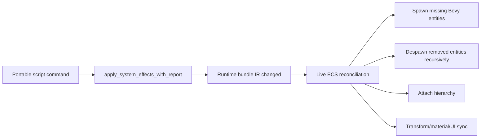
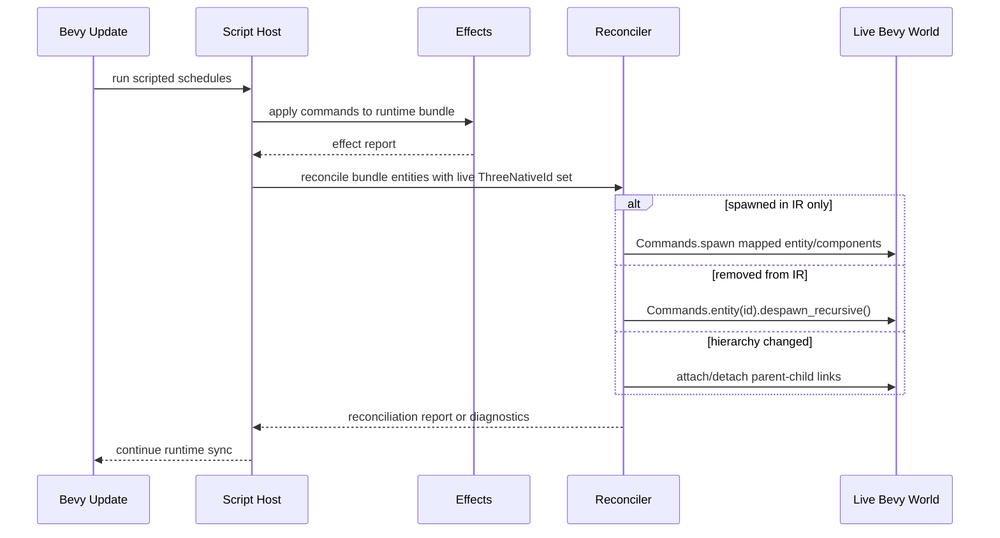

# PRD: Native Scripted Spawn/Despawn Live Reconciliation

Complexity: 7 -> HIGH mode

Score basis: +2 touches 6-10 files, +2 complex runtime state/reconciliation
logic, +2 multi-package/runtime-adapter behavior, +1 verification/status
updates.

## 1. Context

**Problem:** Native script `spawn`, `despawn`, and prefab `instantiate` effects
mutate bundle IR but do not reconcile the live Bevy ECS world, so traces can
report success while visible/native gameplay state is wrong.

**Files Analyzed:**

- `docs/status/systems-code-quality-diagnostic-2026-07-08.md`
- `docs/status/SYSTEMS_CODE_QUALITY_STATUS.md`
- `runtime-bevy/crates/threenative_runtime/src/systems_effects.rs`
- `runtime-bevy/crates/threenative_runtime/src/lib.rs`
- `runtime-bevy/crates/threenative_runtime/src/map_world.rs`
- `runtime-bevy/crates/threenative_runtime/tests/systems_effects.rs`
- `runtime-bevy/crates/threenative_runtime/tests/spawner.rs`
- `runtime-bevy/crates/threenative_runtime/tests/map_world.rs`
- `docs/PRDs/done/other/portable-scripting-runtime-prefabs-hierarchy.md`
- `docs/PRDs/done/other/native-game-loop-state-parity.md`

**Current Behavior:**

- `apply_command` mutates `bundle.world.entities` for spawn/despawn/instantiate
  and records effect logs.
- `run_scripted_runtime_systems` receives `Commands` but does not use it to
  create or remove live Bevy entities.
- Startup mapping is the only place that calls `world.spawn`.
- Sync systems update live entities that already exist and skip IR entities
  with no live counterpart.
- Existing tests assert IR/event-log outcomes, not live ECS/render state.

## Pre-Planning Findings

No relevant `.env` configuration is required.

**How will this feature be reached?**

- [x] Entry point identified: Bevy runtime update system
  `run_scripted_runtime_systems`.
- [x] Caller file identified:
  `runtime-bevy/crates/threenative_runtime/src/lib.rs`.
- [x] Registration/wiring needed: call a new live reconciliation helper after
  script effects mutate the runtime bundle and before rendered/physics state is
  considered authoritative.

**Is this user-facing?**

- [x] YES. Users observe this through native rendered entities, prefab
  hierarchy, collider teardown, and native playtest parity.
- [ ] NO.

**Full user flow:**

1. User authors a portable script that calls `ctx.world.spawn`,
   `ctx.world.despawn`, or `ctx.prefabs.instantiate`.
2. The compiler emits systems/prefab/world IR consumed by native Bevy.
3. The native runtime runs script effects during a frame.
4. The runtime reconciles changed bundle IR into live Bevy ECS entities.
5. The spawned entity renders and participates in systems, or the despawned
   entity and descendants disappear from live queries and physics.

## 2. Solution

**Approach:**

- Extract reusable per-entity mapping from startup `map_bundle_into_world` so
  startup and runtime reconciliation share component/material/mesh behavior.
- Add a deterministic reconciliation pass that diffs `bundle.world.entities`
  against live `ThreeNativeId` entities after script effects apply.
- Spawn missing live entities in IR array order, attach hierarchy for new
  children, and recursively despawn live entities whose IR records disappeared.
- Fail closed while work is incomplete: effect logs or diagnostics must mark
  spawn/despawn commands whose live reconciliation did not occur.
- Add headless Bevy App tests that query live ECS state, not only bundle IR.

**Key Decisions:**

- [x] Library/framework choices: reuse Bevy `Commands`, existing
  `ThreeNativeId`, and existing native mapping helpers.
- [x] Error-handling strategy: unresolved live reconciliation produces an
  explicit runtime diagnostic/effect-log marker; no silent success trace.
- [x] Reused utilities: startup world mapping, current effect report plumbing,
  and the existing `scripted_runtime_app` test harness.

**Data Changes:** None. Bundle shape does not change.

## 3. Sequence Flow

## 4. Execution Phases

#### Phase 1: Fail-Closed Diagnostics - Native traces cannot claim live spawn/despawn success when reconciliation is absent.

**Files (max 5):**

- `runtime-bevy/crates/threenative_runtime/src/systems_effects.rs` - extend
  effect report entries with reconciliation-required status or diagnostics.
- `runtime-bevy/crates/threenative_runtime/src/lib.rs` - emit the fail-closed
  diagnostic when spawn/despawn effects occur before reconciliation support.
- `runtime-bevy/crates/threenative_runtime/tests/systems_effects.rs` - assert
  report shape for spawn/despawn/instantiate requiring live reconciliation.
- `docs/status/SYSTEMS_CODE_QUALITY_STATUS.md` - link this PRD as the active
  next action without downgrading the row.

**Implementation:**

- [ ] Identify effect report entries for `spawn`, `despawn`, and
  `instantiate`.
- [ ] Add a structured field or diagnostic code that distinguishes "IR applied"
  from "live reconciled".
- [ ] Ensure the field is deterministic and stable for conformance artifacts.
- [ ] Preserve existing effect-log tests for successful IR mutation.

**Tests Required:**

| Test File | Test Name | Assertion |
|-----------|-----------|-----------|
| `runtime-bevy/crates/threenative_runtime/tests/systems_effects.rs` | `should mark spawn effect as requiring live reconciliation when only bundle changes` | Spawn applies to IR but report is not live-success. |
| `runtime-bevy/crates/threenative_runtime/tests/systems_effects.rs` | `should mark despawn effect as requiring live reconciliation when only bundle changes` | Despawn applies to IR but report is not live-success. |

**User Verification:**

- Action:
  `cargo test -p threenative_runtime systems_effects --manifest-path runtime-bevy/Cargo.toml`
- Expected: effect report tests pass and traces no longer imply live success for
  unreconciled commands.

#### Phase 2: Shared Entity Mapping Helper - Runtime spawn uses the same mapping rules as startup.

**Files (max 5):**

- `runtime-bevy/crates/threenative_runtime/src/map_world.rs` - extract
  per-entity spawn/mapping helper from startup mapping.
- `runtime-bevy/crates/threenative_runtime/src/lib.rs` - import/use the helper
  only behind reconciliation plumbing.
- `runtime-bevy/crates/threenative_runtime/tests/map_world.rs` - prove startup
  mapping behavior is unchanged.
- `runtime-bevy/crates/threenative_runtime/tests/runtime_reconciliation.rs` -
  add helper-level spawn mapping test if no suitable file exists.

**Implementation:**

- [ ] Extract a helper that accepts one IR entity plus mapping context and
  emits the same Bevy components as startup.
- [ ] Keep material, mesh, transform, collider, camera/light/UI, and ID mapping
  behavior unchanged.
- [ ] Preserve deterministic asset handle lookup and diagnostics.
- [ ] Keep startup mapping implemented through the helper.

**Tests Required:**

| Test File | Test Name | Assertion |
|-----------|-----------|-----------|
| `runtime-bevy/crates/threenative_runtime/tests/map_world.rs` | existing startup mapping tests | Existing mapped components and handles remain unchanged. |
| `runtime-bevy/crates/threenative_runtime/tests/runtime_reconciliation.rs` | `should map runtime-spawned entity with transform and render handles` | Spawn helper creates live `ThreeNativeId`, transform, mesh/material handles. |

**User Verification:**

- Action:
  `cargo test -p threenative_runtime map_world --manifest-path runtime-bevy/Cargo.toml`
- Expected: startup mapping coverage passes with no behavior drift.

#### Phase 3: Live Reconciliation - Spawn, instantiate, and recursive despawn update the live Bevy world.

**Files (max 5):**

- `runtime-bevy/crates/threenative_runtime/src/lib.rs` - call reconciliation
  after script effects and before live sync.
- `runtime-bevy/crates/threenative_runtime/src/runtime_reconciliation.rs` -
  add reconciler if keeping it separate from `lib.rs`.
- `runtime-bevy/crates/threenative_runtime/src/map_world.rs` - expose helper
  APIs needed by the reconciler.
- `runtime-bevy/crates/threenative_runtime/tests/runtime_reconciliation.rs` -
  add headless App tests.
- `runtime-bevy/crates/threenative_runtime/tests/spawner.rs` - adjust any
  affected expectations for prefab instantiate evidence.

**Implementation:**

- [ ] Query live `ThreeNativeId` entities at the reconciliation point.
- [ ] Spawn live entities missing from Bevy but present in IR.
- [ ] Recursively despawn live entities missing from IR.
- [ ] Attach new parent/child relationships for instantiated prefabs.
- [ ] Make reconciliation idempotent across frames.
- [ ] Clear the fail-closed diagnostic only after live reconciliation succeeds.

**Tests Required:**

| Test File | Test Name | Assertion |
|-----------|-----------|-----------|
| `runtime-bevy/crates/threenative_runtime/tests/runtime_reconciliation.rs` | `should spawn live entity when script adds bundle entity` | Live `ThreeNativeId` query finds spawned entity with expected components. |
| `runtime-bevy/crates/threenative_runtime/tests/runtime_reconciliation.rs` | `should instantiate prefab hierarchy into live children` | Parent/child relationships exist in Bevy ECS. |
| `runtime-bevy/crates/threenative_runtime/tests/runtime_reconciliation.rs` | `should recursively despawn live entity and descendants` | Removed entity and children are absent from live queries. |
| `runtime-bevy/crates/threenative_runtime/tests/runtime_reconciliation.rs` | `should remove collider contacts after despawn` | Despawned collider no longer participates in physics contact observations. |

**User Verification:**

- Action:
  `cargo test -p threenative_runtime runtime_reconciliation --manifest-path runtime-bevy/Cargo.toml`
- Expected: live ECS assertions pass for spawn, instantiate, recursive despawn,
  and collider teardown.

#### Phase 4: Conformance and Status Evidence - Native spawn/despawn claims are backed by live proof.

**Files (max 5):**

- `packages/ir/fixtures/conformance/fixture-catalog.json` - add or tag a
  runtime spawn/despawn fixture if the catalog is the right owning surface.
- `tools/verify/src/conformance.ts` - include live native evidence if the
  current conformance runner needs registration.
- `docs/status/SYSTEMS_CODE_QUALITY_STATUS.md` - downgrade row only with linked
  test/evidence.
- `docs/bevy-feature-parity.md` - update evidence only if the parity claim is
  promoted.
- `docs/status/capabilities/scripting.md` - update if script spawn/despawn
  capability text changes.

**Implementation:**

- [ ] Add a fixture/proof path that exercises script spawn/despawn on both web
  and native where supported.
- [ ] Record live native assertion evidence, not only effect traces.
- [ ] Update status docs with exact commands and artifact links.

**Tests Required:**

| Test File | Test Name | Assertion |
|-----------|-----------|-----------|
| Conformance fixture | `script-spawn-despawn-live-reconciliation` | Web and native evidence prove visible/live world state, not trace-only IR mutation. |

**User Verification:**

- Action:
  `pnpm verify:conformance`
- Expected: conformance passes with live spawn/despawn evidence included.

## 5. Checkpoint Protocol

- Automated checkpoint after every phase: ask `prd-work-reviewer` to review
  implementation against this PRD and run the phase's commands.
- Manual checkpoint after Phase 3 because live rendered/native behavior may
  require artifact inspection in addition to ECS tests.

## 6. Verification Strategy

- Phase-specific `cargo test` commands under `runtime-bevy`.
- Full native runtime test sweep before status downgrade:
  `cargo test -p threenative_runtime --manifest-path runtime-bevy/Cargo.toml`.
- Shared runtime contract proof before parity/status promotion:
  `pnpm verify:conformance`.

## 7. Acceptance Criteria

- [ ] Spawn effects create live Bevy entities with expected transform/render
      state.
- [ ] Prefab instantiate creates live hierarchy relationships.
- [ ] Despawn removes live entities and descendants, including physics
      participation.
- [ ] Effect traces distinguish IR mutation from live reconciliation.
- [ ] Status/parity docs are updated only with linked test evidence.

## Non-Goals

- New public scripting APIs.
- Raw Bevy handles exposed to scripts.
- Refactoring unrelated startup mapping behavior.
