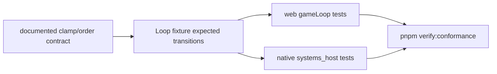
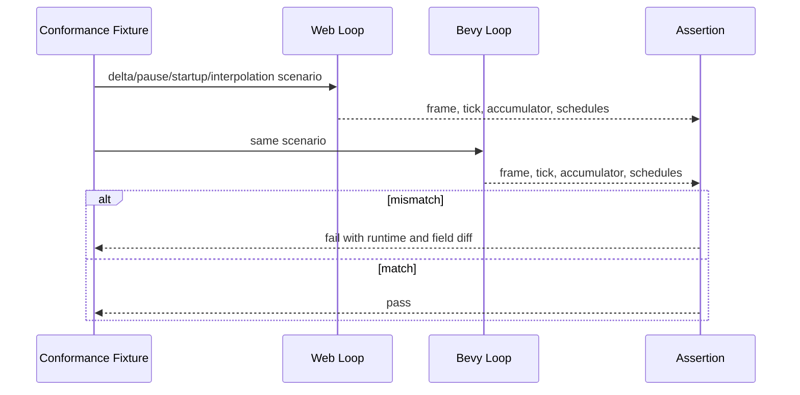

# PRD: Native/Web Game Loop Scheduling Contract

Complexity: 8 -> HIGH mode

Score basis: +2 touches 6-10 files, +2 complex runtime state logic, +2
multi-package runtime changes, +1 conformance fixture work, +1 docs/status
updates.

## 1. Context

**Problem:** Web and Bevy implement game-loop scheduling independently, and
the diagnostic found a real long-frame clamp divergence that changes fixed
tick counts and simulation time after a hitch.

**Files Analyzed:**

- `docs/status/systems-code-quality-diagnostic-2026-07-08.md`
- `packages/runtime-web-three/src/gameLoop.ts`
- `packages/runtime-web-three/src/gameLoop.test.ts`
- `runtime-bevy/crates/threenative_runtime/src/systems_host.rs`
- `runtime-bevy/crates/threenative_runtime/tests/systems_host.rs`
- `tools/verify/src/conformance.ts`
- `packages/ir/fixtures/conformance/fixture-catalog.json`
- `docs/PRDs/done/other/native-game-loop-state-parity.md`
- `docs/status/SYSTEMS_CODE_QUALITY_STATUS.md`

**Current Behavior:**

- Web clamps incoming frame delta to `0.25s` and can execute up to 15 fixed
  ticks at `1/60`.
- Bevy clamps accumulated fixed work to `fixed_delta * 5`, so the same hitch
  produces at most 5 fixed ticks.
- Web runs `update` and `postUpdate` as separate passes; Bevy currently batches
  them in its host helper.
- Existing tests prove each runtime independently, not a shared expected
  transition contract.

## Pre-Planning Findings

No relevant `.env` configuration is required.

**How will this feature be reached?**

- [x] Entry point identified: web `advanceGameLoop` and native scripted
  runtime loop/state helper.
- [x] Caller files identified:
  `packages/runtime-web-three/src/gameLoop.ts` and
  `runtime-bevy/crates/threenative_runtime/src/systems_host.rs`.
- [x] Registration/wiring needed: shared fixture registration in
  `packages/ir/fixtures/conformance/fixture-catalog.json` and
  `tools/verify/src/conformance.ts` if the runner needs explicit handling.

**Is this user-facing?**

- [x] YES. Users observe this through portable gameplay determinism after
  frame hitches, pause/resume, interpolation, and schedule ordering.
- [ ] NO.

**Full user flow:**

1. User authors portable gameplay with `startup`, `fixedUpdate`, `update`, and
   `postUpdate`.
2. The same emitted bundle runs in web preview and native Bevy.
3. A long frame, pause transition, or mid-step interpolation occurs.
4. Both runtimes follow one documented loop contract and produce matching tick,
   frame, accumulator, and schedule evidence.

## 2. Solution

**Approach:**

- Choose one canonical long-frame clamp rule and apply it to both runtimes.
  The diagnostic recommends the Bevy-style `maxFixedStepsPerFrame` guard.
- Encode loop semantics in shared conformance fixtures with explicit expected
  state snapshots.
- Decide whether `update`/`postUpdate` separation is contractual; document and
  test the decision.
- Keep runtime-specific physics/interpolation implementation private while
  making observable loop state and schedule order portable.

**Key Decisions:**

- [x] Library/framework choices: reuse existing runtime test harnesses and
  conformance fixture catalog.
- [x] Error-handling strategy: unsupported or intentionally divergent behavior
  is documented as non-contractual; accidental divergence fails tests.
- [x] Reused utilities: existing `gameLoop.test.ts`, native `systems_host.rs`
  tests, and conformance infrastructure.

**Data Changes:** None.

## 3. Sequence Flow

## 4. Execution Phases

#### Phase 1: Clamp Contract Fix - Long frames consume the same fixed ticks on web and native.

**Files (max 5):**

- `packages/runtime-web-three/src/gameLoop.ts` - apply canonical
  `maxFixedStepsPerFrame` clamp or equivalent.
- `packages/runtime-web-three/src/gameLoop.test.ts` - assert long-frame tick
  count and accumulator behavior.
- `runtime-bevy/crates/threenative_runtime/src/systems_host.rs` - expose or
  document the same clamp constant/option if needed.
- `runtime-bevy/crates/threenative_runtime/tests/systems_host.rs` - assert
  matching native behavior.
- `docs/status/SYSTEMS_CODE_QUALITY_STATUS.md` - link this PRD as active
  remediation without downgrading yet.

**Implementation:**

- [ ] Define the canonical clamp in a named constant or documented option.
- [ ] Apply it before fixed-step iteration in web.
- [ ] Preserve existing Bevy clamp behavior unless the chosen contract differs.
- [ ] Add tests for `delta = 0.25`, `fixedDelta = 1/60`, `max steps = 5`.

**Tests Required:**

| Test File | Test Name | Assertion |
|-----------|-----------|-----------|
| `packages/runtime-web-three/src/gameLoop.test.ts` | `should cap fixed updates per long frame` | A 0.25s hitch at 60Hz runs exactly 5 fixed ticks under the canonical cap. |
| `runtime-bevy/crates/threenative_runtime/tests/systems_host.rs` | `should cap native fixed updates per long frame` | Native produces the same tick count and accumulator policy. |

**User Verification:**

- Action:
  `pnpm --filter @threenative/runtime-web-three test -- gameLoop`
  and
  `cargo test -p threenative_runtime systems_host --manifest-path runtime-bevy/Cargo.toml`
- Expected: long-frame clamp tests pass in both runtimes.

#### Phase 2: Shared Loop Fixtures - Runtime parity is checked against one expected transition table.

**Files (max 5):**

- `packages/ir/fixtures/conformance/fixture-catalog.json` - register loop
  scheduling fixtures.
- `packages/ir/fixtures/conformance/*` - add focused fixture documents for
  loop state transitions.
- `tools/verify/src/conformance.ts` - run or classify loop fixture assertions.
- `packages/runtime-web-three/src/gameLoop.test.ts` - consume shared fixture
  expectations if practical.
- `runtime-bevy/crates/threenative_runtime/tests/systems_host.rs` - consume the
  same expectations if practical.

**Implementation:**

- [ ] Add fixtures for fixed-step accumulation with remainder.
- [ ] Add fixture for long-frame clamping.
- [ ] Add fixture for pause: elapsed/frame accounting is explicit and ticks do
  not advance while paused.
- [ ] Add fixture for startup-once ordering.
- [ ] Add fixture for interpolation alpha at a mid-step boundary.
- [ ] Add fixture for variable-schedule writes versus interpolation overlay.

**Tests Required:**

| Test File | Test Name | Assertion |
|-----------|-----------|-----------|
| `packages/runtime-web-three/src/gameLoop.test.ts` | `should satisfy shared loop fixture expectations` | Web loop output matches fixture snapshots. |
| `runtime-bevy/crates/threenative_runtime/tests/systems_host.rs` | `should satisfy shared loop fixture expectations` | Native loop output matches fixture snapshots. |
| `tools/verify/src/conformance.ts` or related test | `should include loop scheduling fixtures in conformance` | `pnpm verify:conformance` runs or reports loop fixture evidence. |

**User Verification:**

- Action: `pnpm verify:conformance`
- Expected: conformance includes loop scheduling fixture evidence and passes.

#### Phase 3: Schedule Ordering Decision - `update` and `postUpdate` behavior is contractual or explicitly not observable.

**Files (max 5):**

- `docs/runtime/game-loop.md` or nearest existing runtime contract doc -
  document the scheduling decision.
- `packages/runtime-web-three/src/gameLoop.ts` - adjust only if the contract
  changes web behavior.
- `runtime-bevy/crates/threenative_runtime/src/systems_host.rs` - split Bevy
  batching if `update`/`postUpdate` separation is contractual.
- `packages/runtime-web-three/src/gameLoop.test.ts` - add ordering assertion.
- `runtime-bevy/crates/threenative_runtime/tests/systems_host.rs` - add
  ordering assertion.

**Implementation:**

- [ ] Decide if writes from `update` must be observable to `postUpdate` in the
  same frame as a portable contract.
- [ ] If yes, make Bevy run separate passes and add fixture/test evidence.
- [ ] If no, document the behavior as intentionally unobservable and avoid
  adding false parity claims.

**Tests Required:**

| Test File | Test Name | Assertion |
|-----------|-----------|-----------|
| `packages/runtime-web-three/src/gameLoop.test.ts` | `should apply variable schedule ordering contract` | Web follows documented `update`/`postUpdate` visibility rule. |
| `runtime-bevy/crates/threenative_runtime/tests/systems_host.rs` | `should apply variable schedule ordering contract` | Native follows the same visibility rule or documents non-observability. |

**User Verification:**

- Action: run the narrow web/native loop tests and `pnpm check:docs`.
- Expected: implementation and docs agree on observable schedule ordering.

#### Phase 4: Status Promotion - Red row is downgraded only with two-runtime fixture evidence.

**Files (max 5):**

- `docs/status/SYSTEMS_CODE_QUALITY_STATUS.md` - update risk and next action.
- `docs/STATUS.md` - add or adjust one-line current initiative entry if
  needed.
- `docs/bevy-feature-parity.md` - update only if parity evidence changes.
- `docs/status/capabilities/scripting.md` - update if scheduling claims change.

**Implementation:**

- [ ] Link the loop fixture evidence and exact verification commands.
- [ ] Downgrade the red row only if clamp, pause, startup, interpolation, and
  ordering expectations are covered.
- [ ] Keep residual known divergences as yellow follow-up items.

**Tests Required:**

| Test File | Test Name | Assertion |
|-----------|-----------|-----------|
| Docs/check gate | `pnpm check:docs` | New links and status entries are valid. |

**User Verification:**

- Action: `pnpm check:docs && pnpm verify:conformance`
- Expected: docs and loop conformance pass.

## 5. Checkpoint Protocol

- Automated checkpoint after every phase with `prd-work-reviewer`.
- Manual checkpoint after Phase 2 if conformance artifacts need human
  inspection to confirm both runtimes are represented.

## 6. Verification Strategy

- `pnpm --filter @threenative/runtime-web-three test -- gameLoop`
- `cargo test -p threenative_runtime systems_host --manifest-path runtime-bevy/Cargo.toml`
- `pnpm verify:conformance`
- `pnpm check:docs` for status/contract documentation changes.

## 7. Acceptance Criteria

- [ ] Web and native share one long-frame clamp rule.
- [ ] Shared fixtures cover accumulation, clamp, pause, startup-once,
      interpolation alpha, and variable schedule ordering.
- [ ] `update`/`postUpdate` visibility is documented and tested.
- [ ] Status docs link two-runtime evidence before downgrading the risk row.

## Non-Goals

- Rewriting the full runtime host.
- Changing authored script APIs.
- Making physics implementation internals identical across runtimes beyond
  observable loop semantics.
