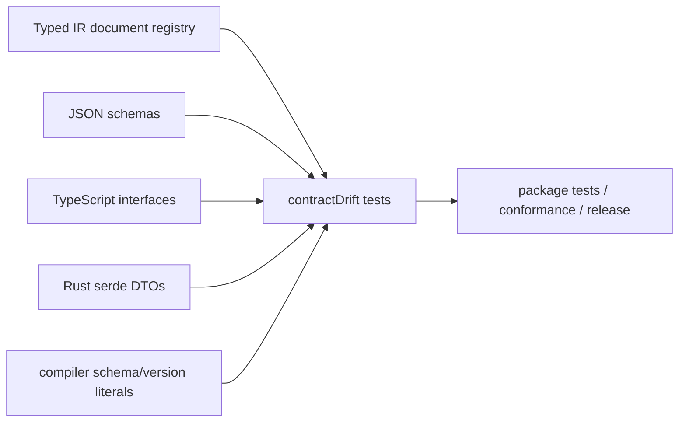
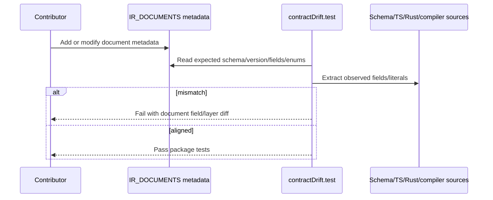

# PRD: IR Document Contract Truth Hardening

Complexity: 9 -> HIGH mode

Score basis: +3 touches 10+ files across the full initiative, +2
multi-package contract checks, +2 new typed registry surface, +1 verification
gate work, +1 docs/status updates.

## 1. Context

**Problem:** IR document truth is duplicated across JSON schemas, TypeScript
interfaces, compiler literals, registry metadata, Rust loader DTOs, and tests,
leaving optional fields, enum constraints, schema/version literals, and
unschemed documents exposed to silent drift.

**Files Analyzed:**

- `docs/status/systems-code-quality-diagnostic-2026-07-08.md`
- `docs/status/SYSTEMS_CODE_QUALITY_STATUS.md`
- `packages/ir/src/documents.ts`
- `packages/ir/src/schemas.ts`
- `packages/ir/src/types.ts`
- `packages/ir/src/reflection.ts`
- `packages/ir/src/contractDrift.test.ts`
- `packages/ir/schemas/*.schema.json`
- `packages/compiler/src/emit/scene-to-world.ts`
- `runtime-bevy/crates/threenative_loader/src/types.rs`
- `docs/PRDs/done/other/ir-contract-drift-hardening.md`

**Current Behavior:**

- Existing drift tests validate document registration, schema IDs/versions, and
  required fields for schema-backed documents.
- Roughly nine document types have no JSON schema and therefore no structural
  contract check.
- Optional fields are not compared across schema, TypeScript, and Rust DTOs.
- Enum constraints are checked only for hand-picked cases.
- Compiler emitters can hardcode stale schema/version literals.

## Pre-Planning Findings

No relevant `.env` configuration is required.

**How will this feature be reached?**

- [x] Entry point identified: `@threenative/ir` tests, compiler tests,
  Bevy loader tests, `pnpm verify:conformance`, and release/status docs.
- [x] Caller files identified:
  `packages/ir/src/contractDrift.test.ts`,
  `packages/compiler/src/emit/*.ts`, and
  `runtime-bevy/crates/threenative_loader/src/types.rs`.
- [x] Registration/wiring needed: promote `IR_DOCUMENTS` into richer metadata
  and make drift tests consume it.

**Is this user-facing?**

- [ ] YES.
- [x] NO. This is internal contract hardening. Users see earlier, clearer
  validation failures and fewer runtime drops.

**Full user flow:**

1. Contributor adds or changes an IR document field, enum, schema ID, or
   version.
2. Contributor runs package tests or release verification.
3. Drift tests compare schema, TS, compiler literals, and Rust DTO expectations
   using registry metadata.
4. Incomplete changes fail with document/field-specific output before bundles
   can silently drop data at runtime.

## 2. Solution

**Approach:**

- Extend the existing document registry with typed metadata: schema ID,
  version, manifest key, emitted file name, schema file or explicit
  `schemaFile: null`, required keys, optional keys, enum-valued fields, and
  drift layers that must agree.
- Land the cheapest high-value drift checks first: optional field comparison
  and compiler schema/version literal checks.
- Add schema debt markers for unschemed documents, then author schemas in
  runtime-risk order: `systems`, `gameFlow`, `prefabs`, `ui`, `animations`,
  `audio`, `sequences`, `localData`, `gltfScene`.
- Add enum-set comparison for registry-marked fields so Rust catch-all strings
  and TS/schema enums cannot diverge silently.

**Key Decisions:**

- [x] Library/framework choices: reuse existing source-scan drift test
  technique before adding code generation dependencies.
- [x] Error-handling strategy: drift tests fail with document path, field name,
  expected layer, and missing/extra field details.
- [x] Reused utilities: `IR_DOCUMENTS`, `IR_SCHEMA_IDS`, `IR_VERSION`, and
  existing contract drift parsing helpers.

**Data Changes:** New or expanded JSON schemas may describe existing document
shape but should not change bundle semantics unless a separate migration PRD is
created.

## 3. Sequence Flow

## 4. Execution Phases

#### Phase 1: Optional Field Drift Check - Optional IR growth cannot be silently dropped by Rust or schema drift.

**Files (max 5):**

- `packages/ir/src/contractDrift.test.ts` - extract and compare optional field
  sets.
- `runtime-bevy/crates/threenative_loader/src/types.rs` - adjust DTOs only if
  tests reveal current drift.
- `packages/ir/src/types.ts` - adjust only if tests reveal current drift.
- `packages/ir/schemas/*.schema.json` - adjust only for confirmed mismatch in
  existing schema-backed documents.
- `docs/status/SYSTEMS_CODE_QUALITY_STATUS.md` - link active remediation.

**Implementation:**

- [ ] Reuse existing TS/schema/Rust parsing helpers to collect optional fields.
- [ ] Compare optional fields for the schema-backed documents already covered
  by required-field checks.
- [ ] Report missing/extra optional fields by document and layer.
- [ ] Fix any real mismatches discovered by the new check.

**Tests Required:**

| Test File | Test Name | Assertion |
|-----------|-----------|-----------|
| `packages/ir/src/contractDrift.test.ts` | `should keep optional document fields aligned across schema ts and rust` | Schema-backed documents have matching optional field sets or explicit registry exceptions. |

**User Verification:**

- Action: `pnpm --filter @threenative/ir test -- contractDrift`
- Expected: optional field drift check passes or reports exact mismatches that
  are fixed in the same phase.

#### Phase 2: Compiler Schema/Version Literal Check - Emitters cannot produce stale document literals after a version or schema update.

**Files (max 5):**

- `packages/ir/src/documents.ts` - expose registry metadata needed by tests.
- `packages/ir/src/contractDrift.test.ts` - scan compiler emitters for
  schema/version literals.
- `packages/compiler/src/emit/scene-to-world.ts` - replace or align hardcoded
  literals if needed.
- `packages/compiler/src/emit/*.ts` - update only touched emitters with stale
  literals.
- `packages/compiler/src/emit/*.test.ts` or existing compiler tests - add
  manifest/document assertion if the test belongs there.

**Implementation:**

- [ ] Identify emitters that write `schema` and `version` fields.
- [ ] Compare emitted string literals or imported constants against
  `IR_SCHEMA_IDS`/`IR_VERSION`/document registry metadata.
- [ ] Prefer imports from `@threenative/ir` constants where package boundaries
  already allow them.
- [ ] Keep source scan stable and focused; do not build a general TS parser
  unless the existing test style cannot handle the emitters.

**Tests Required:**

| Test File | Test Name | Assertion |
|-----------|-----------|-----------|
| `packages/ir/src/contractDrift.test.ts` | `should keep compiler document schema and version literals aligned with registry` | Every scanned emitter uses current registry schema/version values. |

**User Verification:**

- Action:
  `pnpm --filter @threenative/ir test -- contractDrift`
  and `pnpm --filter @threenative/compiler test`
- Expected: drift and compiler tests pass.

#### Phase 3: Typed Document Registry - Drift tests consume one registry instead of hardcoded document assumptions.

**Files (max 5):**

- `packages/ir/src/documents.ts` - promote document metadata shape.
- `packages/ir/src/documents.test.ts` - validate registry completeness and
  uniqueness.
- `packages/ir/src/contractDrift.test.ts` - consume registry metadata.
- `packages/ir/src/schemas.ts` - align schema ID exports with registry if
  needed.
- `packages/compiler/src/emit/bundle.ts` - consume document metadata only if
  needed for manifest/file constants.

**Implementation:**

- [ ] Add typed metadata for schema ID, version, file name, manifest key, and
  `schemaFile`.
- [ ] Represent unschemed documents with explicit `schemaFile: null` debt
  markers.
- [ ] Add metadata for required/optional keys and drift layers in a compact,
  maintainable form.
- [ ] Make existing drift tests iterate the registry instead of local hardcoded
  arrays where practical.
- [ ] Add registry uniqueness tests for file names, manifest keys, and schema
  IDs.

**Tests Required:**

| Test File | Test Name | Assertion |
|-----------|-----------|-----------|
| `packages/ir/src/documents.test.ts` | `should define unique document registry identifiers` | No duplicate schema IDs, file names, or manifest keys. |
| `packages/ir/src/contractDrift.test.ts` | existing drift tests | Drift coverage is registry-driven and still passes. |

**User Verification:**

- Action: `pnpm --filter @threenative/ir test`
- Expected: registry and drift tests pass.

#### Phase 4: High-Risk Missing Schemas - Systems, gameFlow, and prefabs get structural contracts first.

**Files (max 5):**

- `packages/ir/schemas/systems.schema.json` - add schema for systems document.
- `packages/ir/schemas/gameFlow.schema.json` - add schema for game flow.
- `packages/ir/schemas/prefabs.schema.json` - add schema for prefabs.
- `packages/ir/src/documents.ts` - replace `schemaFile: null` markers with
  schema file metadata.
- `packages/ir/src/schema.test.ts` or `contractDrift.test.ts` - register schema
  tests.

**Implementation:**

- [ ] Encode current emitted document shape without widening runtime support.
- [ ] Preserve existing schema/version fields and stable document IDs.
- [ ] Add required and optional field metadata to the registry.
- [ ] Add negative tests for unsupported or misspelled critical fields where
  existing schema tests use that pattern.

**Tests Required:**

| Test File | Test Name | Assertion |
|-----------|-----------|-----------|
| `packages/ir/src/schema.test.ts` | `should validate systems document schema` | Current valid systems fixture passes and invalid critical shape fails. |
| `packages/ir/src/schema.test.ts` | `should validate gameFlow document schema` | Current valid gameFlow fixture passes and invalid critical shape fails. |
| `packages/ir/src/schema.test.ts` | `should validate prefabs document schema` | Current valid prefabs fixture passes and invalid critical shape fails. |

**User Verification:**

- Action: `pnpm --filter @threenative/ir test`
- Expected: new schemas validate current fixtures and drift checks pass.

#### Phase 5: Enum Drift Guard and Remaining Schema Debt - Enum-valued fields and lower-risk documents are tracked.

**Files (max 5 per implementation sub-slice):**

- `packages/ir/src/documents.ts` - add enum-valued field metadata.
- `packages/ir/src/contractDrift.test.ts` - compare schema/TS/Rust enum sets.
- `packages/ir/schemas/ui.schema.json` - add or align schema when selected.
- `packages/ir/schemas/animations.schema.json` - add or align schema when
  selected.
- `packages/ir/schemas/audio.schema.json` - add or align schema when selected.

**Implementation:**

- [ ] Add enum-set comparison for registry-marked fields.
- [ ] Flag Rust `String` catch-alls where schema/TS define a closed enum.
- [ ] Add remaining schemas in small sub-slices: `ui`, `animations`, `audio`,
  then `sequences`, `localData`, `gltfScene`.
- [ ] Keep each schema sub-slice to five files or fewer.

**Tests Required:**

| Test File | Test Name | Assertion |
|-----------|-----------|-----------|
| `packages/ir/src/contractDrift.test.ts` | `should keep enum-valued fields aligned across contract layers` | Registry-marked enum sets match schema, TS, and Rust DTOs or explicit exceptions. |

**User Verification:**

- Action: `pnpm --filter @threenative/ir test && pnpm verify:conformance`
- Expected: enum drift and conformance gates pass.

## 5. Checkpoint Protocol

- Automated checkpoint after every phase with `prd-work-reviewer`.
- Manual checkpoint after Phase 4 if schemas affect docs/status claims or
  require review of compatibility notes.

## 6. Verification Strategy

- `pnpm --filter @threenative/ir test -- contractDrift`
- `pnpm --filter @threenative/ir test`
- `pnpm --filter @threenative/compiler test` when compiler emitters change.
- `cargo test -p threenative_loader --manifest-path runtime-bevy/Cargo.toml`
  when Rust DTOs change.
- `pnpm verify:conformance` before downgrading the status risk.

## 7. Acceptance Criteria

- [ ] Optional fields are compared across schema, TS, and Rust for
      schema-backed documents.
- [ ] Compiler schema/version literals are checked against registry metadata.
- [ ] `IR_DOCUMENTS` records schema file/debt, manifest key, file name,
      version, field, and drift metadata.
- [ ] High-risk `systems`, `gameFlow`, and `prefabs` documents have JSON
      schemas.
- [ ] Enum-valued drift is checked for registry-marked fields.

## Non-Goals

- Generating all TypeScript/Rust DTOs from schema in this PRD.
- Changing the public bundle format without a separate migration plan.
- Broad validator rewrites unrelated to drift evidence.
