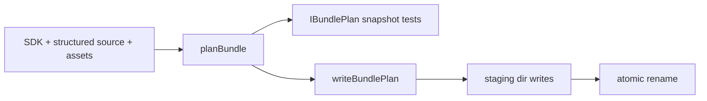
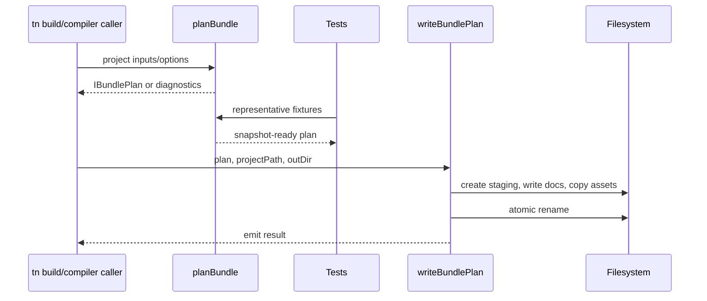

# PRD: Compiler Bundle Planning and Writer Split

Complexity: 8 -> HIGH mode

Score basis: +3 touches 10+ files across the initiative, +2 multi-package
compiler/IR contract behavior, +2 refactor of coupled emit logic, +1
verification/status updates.

## 1. Context

**Problem:** Compiler bundle emission interleaves document assembly, manifest
construction, capability derivation, asset dependency discovery, staging
writes, asset copies, and atomic rename, making behavior expensive to prove
without full integration fixtures.

**Files Analyzed:**

- `docs/status/systems-code-quality-diagnostic-2026-07-08.md`
- `packages/compiler/src/emit/bundle.ts`
- `packages/compiler/src/emit/structured-documents.ts`
- `packages/compiler/src/emit/asset-copy.ts`
- `packages/compiler/src/emit/scene-to-world.ts`
- `packages/compiler/src/emit/bundle.test.ts`
- `packages/ir/src/documents.ts`
- `tools/verify/src/conformance.ts`
- `docs/status/SYSTEMS_CODE_QUALITY_STATUS.md`

**Current Behavior:**

- `emitBundle` handles structured document reading, SDK/ECS lowering, input/UI
  merges, asset collection, capability derivation, manifest construction,
  provenance, staging writes, asset copies, and atomic rename in one flow.
- GLB dependency discovery happens inside the copy loop in `asset-copy.ts`.
- Merge helpers and structured document readers have limited direct unit
  coverage.
- Manifest and emitted document assertions largely require full temp-directory
  integration emits.

## Pre-Planning Findings

No relevant `.env` configuration is required.

**How will this feature be reached?**

- [x] Entry point identified: existing compiler `emitBundle(...)` API and CLI
  build path.
- [x] Caller files identified:
  `packages/compiler/src/emit/bundle.ts` and the CLI build command that calls
  compiler emit.
- [x] Registration/wiring needed: keep `emitBundle` as the public entry point
  while routing it through `planBundle(...)` and `writeBundlePlan(...)`.

**Is this user-facing?**

- [ ] YES.
- [x] NO. This is internal compiler architecture. Users see unchanged bundle
  output and better regression failures.

**Full user flow:**

1. User runs `tn build` or a compiler test emits a bundle.
2. Compiler reads structured source and SDK/ECS inputs.
3. `planBundle` creates deterministic documents, manifest, mesh payloads, and
   asset copy list without writing output.
4. Tests can snapshot the plan before filesystem writes occur.
5. `writeBundlePlan` performs staging, document writes, asset copies, and
   atomic rename with existing failure guarantees.

## 2. Solution

**Approach:**

- Split `emitBundle` along the diagnostic's existing seam:
  `planBundle(...) -> IBundlePlan | ICompilerError[]` and
  `writeBundlePlan(plan, projectPath, outDir)`.
- Move asset dependency discovery into planning so the copy list is complete
  before writes.
- Give environment/overlay emitters a read-then-plan shape where practical, so
  plan snapshots include their document outputs.
- Backfill unit tests for merge helpers and structured document parsers most
  likely to be touched by future document registry work.
- Keep integration tests for staging atomicity, failure preservation, and temp
  cleanup.

**Key Decisions:**

- [x] Library/framework choices: reuse existing compiler emit functions and
  test runner; do not introduce a new build system.
- [x] Error-handling strategy: planning returns existing compiler diagnostics;
  writing preserves current staging/cleanup/atomicity behavior.
- [x] Reused utilities: current merge helpers, structured document readers,
  provenance builder, mesh payload preparation, and asset copy helpers.

**Data Changes:** None. Emitted bundle JSON should remain byte-equivalent or
intentionally snapshot-reviewed.

## 3. Sequence Flow

## 4. Execution Phases

#### Phase 1: Plan Type and Manifest Snapshot - Manifest/document assembly can be tested before writes.

**Files (max 5):**

- `packages/compiler/src/emit/bundle.ts` - introduce internal `IBundlePlan`
  shape and pure plan construction seam.
- `packages/compiler/src/emit/bundle.test.ts` - add first plan snapshot for a
  representative fixture.
- `packages/compiler/src/emit/bundle-plan.ts` - add only if separating types
  keeps `bundle.ts` smaller in this phase.
- `packages/compiler/src/emit/manifest.ts` - add only if manifest construction
  is extracted cleanly.

**Implementation:**

- [ ] Define `IBundlePlan` with documents, manifest shape, mesh payloads,
  asset copy list, provenance, and diagnostics.
- [ ] Extract enough pure computation from `emitBundle` to create a plan before
  staging begins.
- [ ] Keep `emitBundle` output unchanged by immediately passing the plan to the
  existing write path.
- [ ] Add a focused snapshot of plan documents and manifest shape.

**Tests Required:**

| Test File | Test Name | Assertion |
|-----------|-----------|-----------|
| `packages/compiler/src/emit/bundle.test.ts` | `should plan bundle documents and manifest before writing files` | Plan snapshot contains expected documents, manifest entries, and no staging paths. |

**User Verification:**

- Action: `pnpm --filter @threenative/compiler test -- bundle`
- Expected: existing emit tests and the new plan snapshot pass.

#### Phase 2: Writer Extraction - Filesystem behavior is isolated behind `writeBundlePlan`.

**Files (max 5):**

- `packages/compiler/src/emit/bundle.ts` - route `emitBundle` through planner
  and writer.
- `packages/compiler/src/emit/bundle-writer.ts` - own staging, document writes,
  copies, and atomic rename.
- `packages/compiler/src/emit/bundle.test.ts` - keep/adjust atomicity tests.
- `packages/compiler/src/emit/asset-copy.ts` - adjust writer-facing API only if
  needed.

**Implementation:**

- [ ] Move staging directory creation into `writeBundlePlan`.
- [ ] Move document writes and mesh payload writes into writer.
- [ ] Move asset copy execution into writer using a precomputed copy list.
- [ ] Preserve failure-preserves-previous-bundle and temp cleanup behavior.
- [ ] Keep `emitBundle` public API unchanged.

**Tests Required:**

| Test File | Test Name | Assertion |
|-----------|-----------|-----------|
| `packages/compiler/src/emit/bundle.test.ts` | existing atomicity tests | Failed write preserves previous bundle and cleans staging dirs. |
| `packages/compiler/src/emit/bundle.test.ts` | `should write a planned bundle through the writer` | Writer materializes documents/assets matching the plan. |

**User Verification:**

- Action: `pnpm --filter @threenative/compiler test -- bundle`
- Expected: writer extraction preserves integration behavior.

#### Phase 3: Asset Dependency Planning - GLB texture dependencies are known before copy I/O.

**Files (max 5):**

- `packages/compiler/src/emit/asset-copy.ts` - split dependency discovery from
  copy execution.
- `packages/compiler/src/emit/bundle.ts` or `bundle-plan.ts` - add dependency
  discovery to planning.
- `packages/compiler/src/emit/bundle-writer.ts` - consume final asset copy
  list.
- `packages/compiler/src/emit/bundle.test.ts` - snapshot planned copy list.
- `packages/compiler/src/emit/asset-copy.test.ts` - add if no direct asset copy
  tests exist.

**Implementation:**

- [ ] Extract GLB dependency discovery into a planning helper that returns copy
  tuples and diagnostics.
- [ ] Ensure writer does not parse GLB files during copy execution.
- [ ] Snapshot the copy list for a fixture with texture dependencies.
- [ ] Preserve existing asset validation diagnostics.

**Tests Required:**

| Test File | Test Name | Assertion |
|-----------|-----------|-----------|
| `packages/compiler/src/emit/bundle.test.ts` | `should include glb texture dependencies in planned asset copy list` | Plan includes source/destination tuples before writer runs. |
| `packages/compiler/src/emit/asset-copy.test.ts` | `should discover glb dependencies without copying files` | Discovery returns dependencies and diagnostics without writing output. |

**User Verification:**

- Action: `pnpm --filter @threenative/compiler test -- bundle asset-copy`
- Expected: asset dependency planning and copy execution tests pass.

#### Phase 4: Merge and Structured Reader Unit Tests - Future document changes fail close to the helper that drifted.

**Files (max 5 per sub-slice):**

- `packages/compiler/src/emit/bundle.ts` or extracted `merge.ts` - export
  merge helpers for tests if needed.
- `packages/compiler/src/emit/bundle.test.ts` or `merge.test.ts` - test
  `mergeWorlds`, `mergeInputs`, `mergeUis`, `mergeSceneEmits`,
  `mergeEcsEmits`.
- `packages/compiler/src/emit/structured-documents.ts` - expose parser helpers
  only as needed.
- `packages/compiler/src/emit/structured-documents.test.ts` - test structured
  document parsing.
- `packages/compiler/src/emit/test-fixtures/*` - add minimal fixtures only if
  existing fixtures are too broad.

**Implementation:**

- [ ] Add unit tests for entity deduplication by ID.
- [ ] Add unit tests for input action/axis merge behavior.
- [ ] Add unit tests for multi-root UI stacking.
- [ ] Add unit tests for scene/ECS emit merge precedence.
- [ ] Add structured reader tests for malformed and valid source documents.

**Tests Required:**

| Test File | Test Name | Assertion |
|-----------|-----------|-----------|
| `packages/compiler/src/emit/merge.test.ts` | `should deduplicate merged world entities by id` | Duplicate IDs produce the documented diagnostic or precedence. |
| `packages/compiler/src/emit/merge.test.ts` | `should merge input actions and axes deterministically` | Merged input order and conflicts are stable. |
| `packages/compiler/src/emit/merge.test.ts` | `should stack multiple UI roots deterministically` | UI roots preserve intended order and IDs. |
| `packages/compiler/src/emit/structured-documents.test.ts` | `should parse valid structured documents and reject malformed shape` | Parser diagnostics are stable and path-specific. |

**User Verification:**

- Action: `pnpm --filter @threenative/compiler test`
- Expected: compiler unit and integration tests pass.

#### Phase 5: Status Evidence - Compiler emission risk is downgraded only after snapshots and writer tests are in place.

**Files (max 5):**

- `docs/status/SYSTEMS_CODE_QUALITY_STATUS.md` - update row and evidence links.
- `docs/STATUS.md` - add or adjust current initiative link if needed.
- `docs/status/capabilities/tooling-proof.md` or compiler-related capability
  doc - update only if verification claims change.

**Implementation:**

- [ ] Link plan snapshot, writer atomicity, and merge/parser unit test
  evidence.
- [ ] Downgrade the red row only if `emitBundle` has planner/writer separation
  and snapshot coverage.
- [ ] Keep any remaining large-file or extraction debt as yellow follow-up.

**Tests Required:**

| Test File | Test Name | Assertion |
|-----------|-----------|-----------|
| Docs/check gate | `pnpm check:docs` | Status and evidence links are valid. |

**User Verification:**

- Action: `pnpm check:docs`
- Expected: docs links and status entries pass.

## 5. Checkpoint Protocol

- Automated checkpoint after every phase with `prd-work-reviewer`.
- Manual checkpoint after Phase 1 and Phase 3 if snapshot diffs need human
  review to confirm intentional emitted bundle shape.

## 6. Verification Strategy

- `pnpm --filter @threenative/compiler test -- bundle`
- `pnpm --filter @threenative/compiler test`
- `pnpm --filter @threenative/ir test` if document registry constants are
  consumed by planning.
- `pnpm verify:conformance` before status downgrade if emitted contract shape
  or conformance fixtures change.
- `pnpm check:docs` for status updates.

## 7. Acceptance Criteria

- [ ] `emitBundle` routes through a pure `IBundlePlan` and isolated writer.
- [ ] Plan snapshots cover representative documents, manifest shape, and asset
      copy list.
- [ ] GLB dependency discovery happens before copy execution.
- [ ] Merge helpers and structured document readers have direct unit coverage.
- [ ] Existing atomic write/failure cleanup guarantees remain covered by
      integration tests.

## Non-Goals

- Changing the emitted bundle contract for consumers.
- Replacing all compiler integration tests with snapshots.
- Refactoring unrelated CLI build behavior.
