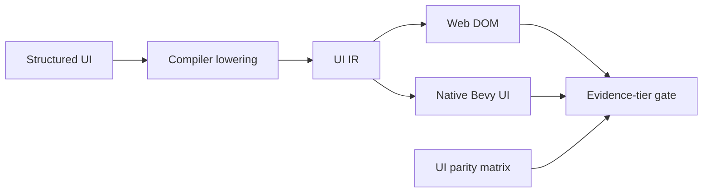

# PRD: UI, Text, Widget, and Accessibility Proof Closure

Complexity: 8 -> HIGH mode

Date: 2026-07-14
Status: DONE
Owner: UI IR, compiler lowering, web/native UI runtimes, and proof tooling

## 1. Context

**Problem:** No new UI bug is confirmed, but web DOM and native Bevy UI remain
separate implementations and several native rows are promoted only as metadata
or traces, leaving layout, widget, focus, text, and accessibility drift exposed.

**Complexity score:** +3 for more than 10 eventual files, +2 for complex UI
state/input/focus behavior, +2 for multi-package/runtime scope, and +1 for
manual visual/accessibility verification = 8 (HIGH).

**Files analyzed:** `docs/status/capabilities/ui.md`, the UI row in
`docs/bevy-feature-parity.md`, compiler UI lowering tests,
`packages/runtime-web-three/src/ui/**`, web render/UI tests,
`runtime-bevy/crates/threenative_runtime/src/ui.rs`, native UI tests, and the
`verify:feature-parity-ui-native`/`verify:input-ui-polish` proof surfaces.

### Current behavior

- Structured responsive rules now survive compiler lowering and web viewport
  reconciliation after a prior Android failure.
- Base menu pixels and bounded text-input value/caret editing have paired
  proof.
- Web renders gradients, shadows, context menus, nested/axis scroll, safe-area
  behavior, and DOM accessibility; several native counterparts are metadata or
  deterministic traces only.
- Spatial fallback navigation and focus narration are partial; actual platform
  screen-reader output is not promoted.
- Native DPI scaling, IME composition, virtual keyboards, world-attached
  rendered placement, and some runtime state updates remain explicit gaps.

## 2. Scope

This PRD closes proof for the high-value retained-UI interaction family:
responsive layout, text/button/slider/text-input widgets, disabled/value state,
sequential and explicit focus, nested/axis scroll, accessible role/name/state
mapping, and viewport/DPI reporting. It does not silently promote gradients,
shadows, world attachment, screen readers, IME, or virtual keyboards without
their required rendered/platform evidence.

## 3. Integration Points

**How reached:** structured UI source is compiler-lowered to UI IR, mapped by
the web and Bevy runtime adapters, updated by viewport/input/script services,
and exercised through focused proof gates.

**User-facing:** Yes. Players see layout/text and use keyboard, pointer, touch,
or accessibility tooling to operate widgets.

**Full flow:** author UI -> validate/lower IR -> runtime maps nodes/styles ->
viewport and bindings reconcile -> user focuses/activates/edits/scrolls ->
script observes action -> proof captures pixels, behavior, and accessibility
state at the required evidence tier.

## 4. Solution

- Define a registry-backed UI parity matrix whose rows name contract state,
  required evidence tier, web/native support, and unsupported diagnostics.
- Reuse current UI IR and runtime implementations; do not introduce a second
  widget vocabulary for proof.
- Add paired behavioral fixtures for widget/action/focus/scroll state and
  screenshot regions for claims that require rendered layout.
- Export normalized accessibility snapshots (role, name, value, disabled,
  focusable, focused, relationships) from both adapters; label them metadata
  until actual assistive-technology proof exists.
- Fail the gate when a promoted row has trace-only evidence or when a new UI
  kind lacks an explicit matrix disposition.

**Data changes:** Prefer registry/evidence metadata only. Change UI IR only if
a behavior cannot be represented without adapter-private inference.

## 5. Execution Phases

### Phase 1: Evidence-tier registry - Claims and required proof have one owner

**Files (max 5):**

- existing UI feature/parity registry owner, or `tools/verify/src/uiParityRegistry.ts`
- `tools/verify/src/uiNative.ts` - derive current native UI gate checks from registry
- registry tests - completeness and invalid-promotion cases
- `docs/status/capabilities/ui.md` - link rows to registry IDs
- `docs/bevy-feature-parity.md` - align truth grading

**Implementation:** define `rendered`, `behavioral`,
`accessibility-metadata`, `platform-assistive`, and `unsupported` evidence
tiers. Require every widget/layout/accessibility row to declare one.

**Verification:** registry drift tests reject missing rows, duplicate IDs, and
promotion with insufficient evidence.

**Required tests:** `should reject a UI parity row without an evidence tier`
and `should reject rendered promotion backed only by trace metadata`.

### Phase 2: Widget and responsive behavior - Common controls match under resize and state changes

**Files (max 5 per slice):**

- shared UI conformance fixture source
- `packages/runtime-web-three/src/ui` focused implementation/test
- `runtime-bevy/crates/threenative_runtime/src/ui.rs` focused implementation
- native UI focused test
- UI parity gate assertions

**Implementation:** exercise text, button, slider, and text-input across two
viewport sizes; update disabled/value state at runtime; assert action payload,
caret/value behavior, focus order, and stable layout regions. Keep each widget
family as a separate <=5-file slice if implementation changes are needed.

**Verification:** compiler UI lowering tests, web UI tests, native UI tests,
and `pnpm verify:focused verify:feature-parity-ui-native`.

**Required tests:** `should preserve responsive overrides at both viewports`,
`should match button and slider actions`, `should match text value and caret
edits`, and `should reconcile runtime disabled state`.

### Phase 3: Navigation, scroll, and accessibility snapshots - Behavioral state is adapter-matched

**Files (max 5 per slice):**

- web focus/scroll/accessibility module and tests
- native focus/scroll/accessibility module and tests
- shared input/UI polish fixture
- normalized snapshot comparator
- focused gate test

**Implementation:** prove disabled nodes are skipped, explicit navigation is
stable, nested horizontal/vertical scroll clamps correctly, and normalized
role/name/value/disabled/focus state agrees. Spatial fallback and narration
remain partial unless their behavior/platform evidence is added in this phase.

**Verification:** `pnpm verify:focused verify:input-ui-polish` and paired
adapter tests.

**Required tests:** `should skip disabled nodes in focus order`, `should clamp
nested axis scroll`, and `should match normalized accessible role name value
and state`.

### Phase 4: Rendered and platform evidence - Only evidenced rows are promoted

**Files (max 5):**

- focused UI gate - screenshot/accessibility artifact enrollment
- UI capability doc - exact promoted and partial rows
- Bevy parity doc - exact evidence links
- systems quality status - link/rescore after proof
- artifact manifest/descriptor owner - register retained evidence

**Implementation:** retain screenshots at declared viewports and accessibility
snapshots. If claiming actual screen-reader behavior, run one supported platform
screen reader and retain the action/output transcript; otherwise keep the row
metadata-only. Do the same for IME/virtual keyboard/platform DPI claims.

**Verification:** focused UI gates plus `pnpm verify:conformance`. Manual
checkpoint: inspect web/native screenshots at both viewport sizes and, only for
new platform claims, run the named assistive technology/input method.

**Required tests:** `should reject missing viewport screenshots`, `should
reject missing accessibility snapshots`, and `should keep IME and virtual
keyboard claims platform-diagnostic without platform evidence`.

## 6. Acceptance Criteria

- [x] One registry owns UI parity rows and evidence tiers.
- [x] Text, button, slider, and text-input behavior is paired and negative-tested.
- [x] Responsive rules survive source -> compiler -> runtime at two viewports.
- [x] Runtime disabled/value updates, focus order, and nested/axis scroll are
      proved on both adapters or explicitly remain partial.
- [x] Accessibility snapshots compare role/name/value/state consistently.
- [x] Trace/metadata is never presented as rendered or screen-reader proof.
- [x] Unsupported DPI, IME, virtual-keyboard, world-attachment, or style rows
      retain actionable diagnostics until their own evidence exists.
- [x] Automated and required manual checkpoints pass.

## 7. Verification Evidence (complete during implementation)

The node-kind-derived registry covers all 14 UI kinds plus layout, state,
focus, scroll, accessibility, and platform rows. Promoted rows require paired
same-tier artifacts; fake PNG, empty behavior, and stale-manifest negative
controls pass. The current run is bound by run ID and SHA-256 in
`tools/verify/artifacts/feature-parity-ui-native/verification-report.json`.

Paired evidence is retained under
`tools/verify/artifacts/feature-parity-ui-native/`: desktop 1280x720 and mobile
390x844 web/native PNGs, exact contact sheets, pixel diffs, viewport/region
observations, widget behavior reports, normalized accessibility snapshots, and
source-bound platform diagnostics. The gate passes with no diagnostics.

Manual checkpoint: both contact sheets show the same ordered text input,
image, slider, item buttons, validation text, bar, confirm, Jump, Scout, and
Energy Cell nodes, with the mobile root changing from 420x620 to 340x700.
Styling and whitespace differ substantially (desktop differing-pixel ratio
0.492575; mobile 0.80165), so promotion is bounded to node presence and
responsive regions. Native gradient/shadow/style pixel parity remains partial.

Behavior promotion is bounded to real button/slider/text-input/touch actions,
native ECS plus AccessKit-backed disabled/value updates, deterministic caret
editing, and sequential/explicit focus. Accessibility promotion is metadata
only. Nested/horizontal scroll, spatial fallback, focus narration, platform
screen readers, DPI scaling, IME, virtual keyboard, rendered world attachment,
and native style effects remain partial or unsupported. No assistive-technology
transcript was produced or claimed.

Automated verification completed:

- `pnpm --dir packages/ir test`: 382/382 passed.
- `pnpm --filter @threenative/runtime-web-three test`: 465/465 passed.
- focused registry/gate negative controls: 13/13 passed.
- native loader/UI proof: loader 17/17, UI library 3/3, UI integration
  17/17, UI debug 1/1, capture viewport 1/1, and native behavior/accessibility
  producer 3/3 passed.
- structured responsive compiler lowering: 1/1 focused test passed.
- feature-parity producer/gate: PASS with 16 current-run artifacts and zero
  gate diagnostics.
- `pnpm verify:conformance`, `pnpm verify:cookbook`, `pnpm check:docs`, and
  `git diff --check` passed.
