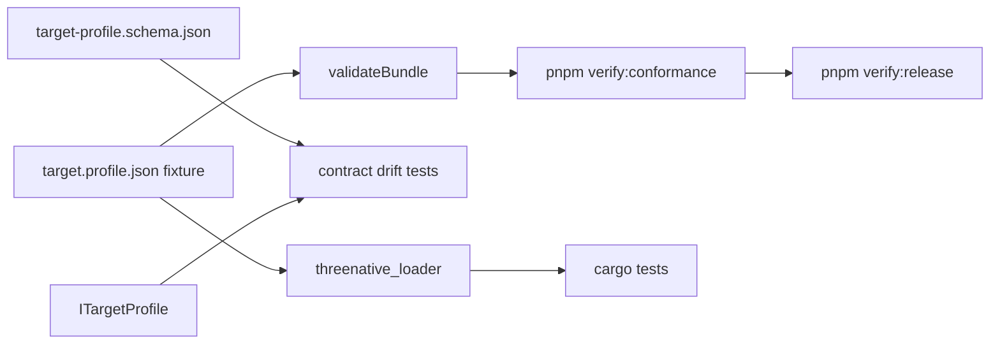
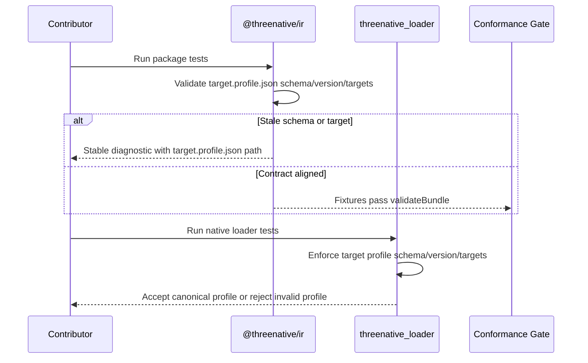

# PRD: Target Profile Contract Hardening

Complexity: 7 -> HIGH mode

## 1. Context

**Problem:** `target.profile.json` has drifted across schema, TypeScript types,
manual validation, conformance fixtures, and the Bevy loader, so promoted
fixtures can pass while using target values or schema literals outside the
published contract.

**Files Analyzed:**

- `docs/PRDs/done/other/ir-contract-drift-hardening.md`
- `docs/PRDs/done/v7/V7-08-packaging-target-profiles-and-platform-diagnostics.md`
- `docs/PRDs/done/v10/V10-04-production-platform-audio-assets-and-release.md`
- `docs/PRDs/README.md`
- `docs/STATUS.md`
- `docs/bevy-feature-parity.md`
- `packages/ir/schemas/target-profile.schema.json`
- `packages/ir/src/types.ts`
- `packages/ir/src/validate.ts`
- `packages/ir/src/conformance.test.ts`
- `packages/ir/src/contractDrift.test.ts`
- `packages/ir/fixtures/conformance/*/game.bundle/target.profile.json`
- `runtime-bevy/crates/threenative_loader/src/bundle.rs`

**Current Behavior:**

- JSON Schema defines target profile documents with
  `schema: "threenative.target-profile"`, `version: "0.1.0"`, and targets
  limited to `web` or `desktop`.
- TypeScript `ITargetProfile` also limits targets to `web | desktop`.
- Several promoted conformance fixtures use `targets: ["web", "bevy"]`.
- Several promoted conformance fixtures use the stale schema literal
  `threenative.targetProfile`.
- `validateBundle` checks that `targets` is non-empty and validates budgets and
  performance, but does not reject the stale schema literal or unsupported
  target enum values.
- The Bevy loader's shared `ensure_supported(schema, version)` accepts any
  schema when the major version is `0`, so target-profile schema identity is not
  enforced at the native boundary.

## Pre-Planning Findings

No `.env` or runtime configuration files are required for this PRD.

**How will this feature be reached?**

- [x] Entry point identified:
  - `validateBundle(bundlePath)`
  - `pnpm --filter @threenative/ir test`
  - `pnpm verify:conformance`
  - `pnpm verify:release`
  - Bevy native bundle loading through `runtime-bevy/crates/threenative_loader`
- [x] Caller file identified:
  - `packages/ir/src/conformance.test.ts`
  - `packages/ir/src/validate.ts`
  - `runtime-bevy/crates/threenative_loader/src/bundle.rs`
  - focused conformance and release verification scripts
- [x] Registration/wiring needed:
  - Add target-profile structural validation to `validateBundle`.
  - Add fixture-level regression coverage proving stale fixture values fail
    before fixture normalization.
  - Add Bevy loader rejection coverage for stale target profile schemas or
    unsupported native target values.
  - Update docs/status only when the contract is actually enforced.

**Is this user-facing?**

- [ ] YES.
- [x] NO. This is contract/release hardening. Users see clearer build and
  runtime diagnostics when a bundle declares invalid target-profile metadata.

**Full user flow:**

1. Contributor edits a target profile fixture, schema, type, compiler emitter,
   or native loader DTO.
2. Contributor runs package tests or conformance verification.
3. `validateBundle` rejects target-profile schema or target enum drift with a
   stable diagnostic path under `target.profile.json`.
4. Bevy loader tests reject the same invalid document before runtime consumes
   it.
5. Release/conformance verification can only pass with target-profile fixtures
   that match the canonical contract.

## 2. Solution

**Approach:**

- Choose one canonical native target spelling for serialized IR. The default
  decision should be `desktop`, because current schema and TypeScript types
  already publish `web | desktop`, and existing CLI/package commands use
  desktop target language.
- Normalize promoted conformance fixtures away from stale
  `threenative.targetProfile` and `bevy` target values.
- Extend IR validation so target profile documents are checked for schema
  literal, version, supported target enum values, and stable diagnostic paths.
- Extend contract drift tests to make target-profile schema/type/fixture drift
  visible before release gates.
- Tighten the Bevy loader path so schema identity is not ignored just because a
  document version starts with `0`.

**Key Decisions:**

- [x] JSON Schema remains the structural source of truth for
  `target.profile.json`.
- [x] Manual IR validation must enforce high-value structural constants when
  conformance fixtures are loaded.
- [x] Bevy-specific implementation details remain adapter-private; serialized
  target-profile target names should describe the portable target profile, not
  the runtime implementation crate.
- [x] Invalid target-profile documents should fail explicitly rather than being
  silently accepted by web or Bevy.

**Data Changes:** No database or save-data changes. This may require updating
checked-in conformance fixture JSON to match the canonical IR contract.

## 3. Sequence Flow

## 4. Execution Phases

#### Phase 1: Canonical Target Decision and Fixture Audit - The repo has a single serialized target-profile vocabulary.

**Files (max 5):**

- `docs/PRDs/other/target-profile-contract-hardening.md` - keep checklist
  current.
- `packages/ir/fixtures/conformance/*/game.bundle/target.profile.json` -
  normalize stale fixture values.
- `packages/ir/src/conformance.test.ts` - add an explicit fixture audit for
  target-profile schema and target values.
- `docs/STATUS.md` - note the active hardening only after tests exist.
- `docs/bevy-feature-parity.md` - update target-profile evidence only after
  validation is enforced.

**Implementation:**

- [x] Confirm canonical native target spelling is `desktop`; if not, update
  schema, TypeScript types, docs, fixtures, and CLI references consistently.
- [x] Replace stale fixture schema literal `threenative.targetProfile` with
  `threenative.target-profile`.
- [x] Replace fixture target `bevy` with the canonical native target value.
- [x] Add a conformance fixture audit that reads every
  `game.bundle/target.profile.json` and fails with fixture name, path, and
  offending value.
- [x] Keep docs updates factual: do not expand target-profile capability claims.

**Tests Required:**

| Test File | Test Name | Assertion |
|-----------|-----------|-----------|
| `packages/ir/src/conformance.test.ts` | `should keep conformance target profiles canonical` | Every fixture uses `schema: "threenative.target-profile"` and targets from the canonical enum. |
| `packages/ir/src/conformance.test.ts` | `should validate every conformance fixture` | Existing fixture validation still passes after fixture normalization. |

**User Verification:**

- Action: Run `pnpm --filter @threenative/ir test -- --run conformance`.
- Expected: Target-profile fixture audit passes and no conformance fixture
  relies on stale `bevy` or `threenative.targetProfile` values.

#### Phase 2: IR Validator Enforcement - Invalid target profiles fail before runtime.

**Files (max 5):**

- `packages/ir/src/validate.ts` - enforce schema, version, and target enum.
- `packages/ir/src/validate.test.ts` - accepted/rejected target-profile cases.
- `packages/ir/src/types.ts` - update only if Phase 1 changes canonical target
  names.
- `packages/ir/schemas/target-profile.schema.json` - update only if Phase 1
  changes canonical target names.
- `packages/ir/src/contractDrift.test.ts` - add target-profile enum/literal
  drift coverage if not already covered by validator tests.

**Implementation:**

- [x] Add stable diagnostics for invalid target-profile schema literal.
- [x] Add stable diagnostics for unsupported target-profile version.
- [x] Add stable diagnostics for unsupported target values, including the old
  `bevy` spelling if `desktop` remains canonical.
- [x] Preserve existing budget and performance validation behavior.
- [x] Ensure diagnostics include code, message, and path such as
  `target.profile.json/schema`, `target.profile.json/version`, and
  `target.profile.json/targets/1`.

**Tests Required:**

| Test File | Test Name | Assertion |
|-----------|-----------|-----------|
| `packages/ir/src/validate.test.ts` | `should reject stale target profile schema literal` | `threenative.targetProfile` returns a stable diagnostic. |
| `packages/ir/src/validate.test.ts` | `should reject unsupported target profile target` | `targets: ["web", "bevy"]` returns a stable diagnostic at the target index. |
| `packages/ir/src/validate.test.ts` | `should accept canonical web desktop target profile` | `targets: ["web", "desktop"]` has no target-profile diagnostics. |
| `packages/ir/src/contractDrift.test.ts` | `should keep target profile target enum aligned` | Schema enum and TypeScript `ITargetProfile.targets` literals remain aligned. |

**User Verification:**

- Action: Run `pnpm --filter @threenative/ir test -- --run "target profile"`.
- Expected: Accepted and rejected target-profile cases are covered with stable
  diagnostics.

#### Phase 3: Bevy Loader Boundary - Native loading rejects target-profile drift.

**Files (max 5):**

- `runtime-bevy/crates/threenative_loader/src/bundle.rs` - enforce supported
  schema/version semantics for target profile documents.
- `runtime-bevy/crates/threenative_loader/src/types.rs` - update target enum
  representation if needed.
- `runtime-bevy/crates/threenative_loader/tests/*` or existing loader/runtime
  tests - add invalid target-profile fixture tests.
- `runtime-bevy/crates/threenative_runtime/tests/conformance.rs` - update only
  if current conformance test owns loader acceptance assertions.
- `packages/ir/fixtures/conformance/*/game.bundle/target.profile.json` - no
  further changes expected after Phase 1.

**Implementation:**

- [x] Make target-profile load reject wrong schema literal even when version is
  `0.x`.
- [x] Make target-profile load reject unsupported target values if Rust DTOs do
  not already do so.
- [x] Keep generic schema/version behavior compatible for documents that do not
  yet have document-specific enforcement, unless tests prove broader tightening
  is safe.
- [x] Add invalid fixture or temp-bundle tests for stale schema and stale
  `bevy` target values.

**Tests Required:**

| Test File | Test Name | Assertion |
|-----------|-----------|-----------|
| `runtime-bevy/crates/threenative_loader/tests/*` | `should reject stale target profile schema` | Loader returns an unsupported schema/version or parse diagnostic before runtime use. |
| `runtime-bevy/crates/threenative_loader/tests/*` | `should reject unsupported target profile target` | Loader rejects `bevy` if `desktop` is canonical. |
| `runtime-bevy/crates/threenative_runtime/tests/conformance.rs` | existing conformance test | Normalized promoted fixtures still load. |

**User Verification:**

- Action: Run `cargo test --manifest-path runtime-bevy/Cargo.toml target_profile`
  or the narrowest matching loader/runtime test.
- Expected: Native loader accepts canonical fixtures and rejects stale target
  profile documents.

#### Phase 4: Gate and Docs Consistency - Release evidence cannot hide target-profile drift.

**Files (max 5):**

- `docs/STATUS.md` - record the enforced target-profile contract.
- `docs/bevy-feature-parity.md` - update evidence anchors without adding
  unsupported target claims.
- `docs/PRDs/README.md` - move this PRD to done when completed.
- `tools/verify/src/*` or scripts - update only if conformance/release reports
  need target-profile diagnostic surfacing.
- `packages/ir/artifacts/conformance/*` or generated reports - update only via
  verification commands if produced.

**Implementation:**

- [x] Ensure `pnpm verify:conformance` exercises the normalized fixtures.
- [x] Ensure `pnpm verify:release` cannot pass with stale target-profile
  fixture values.
- [x] Update status and parity docs in the same change if capability/release
  gate behavior changes.
- [x] Move this PRD to `docs/PRDs/done` only after implementation and
  verification are complete.

**Tests Required:**

| Test File | Test Name | Assertion |
|-----------|-----------|-----------|
| Existing conformance gate | `pnpm verify:conformance` | Fixture target profiles are validated as part of conformance. |
| Existing release gate | `pnpm verify:release` | Release report includes the conformance result after target-profile enforcement. |

**User Verification:**

- Action: Run `pnpm verify:conformance`.
- Expected: Report passes only with canonical target-profile fixtures.
- Action: Run `pnpm verify:release` when ready for release-level proof.
- Expected: Release report remains green and includes the hardened
  target-profile/conformance evidence.

## 5. Checkpoint Protocol

After each implementation phase:

- [x] Run the narrow automated tests listed in that phase.
- [x] Review the diff for accidental fixture churn outside target profiles.
- [x] Confirm diagnostics are stable and actionable.
- [x] Do not proceed to the next phase while conformance fixtures rely on stale
  target-profile values.

For this repo, the automated review checkpoint can be performed by a reviewer
agent or maintainer review against this PRD. Required release-level commands are
listed in Phase 4.

## 6. Verification Strategy

1. **Unit Tests**
   - `pnpm --filter @threenative/ir test -- --run "target profile"`
   - Rust loader/runtime target-profile tests.

2. **Contract Tests**
   - `pnpm --filter @threenative/ir test -- --run contractDrift`
   - `pnpm --filter @threenative/ir test -- --run conformance`

3. **Focused Gate**
   - `pnpm verify:conformance`

4. **Release Gate**
   - `pnpm verify:release` after narrow tests are green.

## Risks and Mitigations

| Risk | Impact | Mitigation |
|------|--------|------------|
| Choosing `desktop` breaks fixtures that meant "Bevy runtime" rather than "desktop target" | Medium | Treat Bevy as adapter-private; update fixture descriptions/docs if needed. |
| Tightening generic `ensure_supported` breaks unrelated legacy fixtures | Medium | Start with target-profile-specific enforcement and add broader checks only with tests. |
| Fixture normalization masks runtime DTO gaps | Medium | Add Bevy loader negative tests, not just fixture rewrites. |
| Docs overclaim target-profile support | Low | Update `docs/STATUS.md` and `docs/bevy-feature-parity.md` only for enforced behavior. |

## Acceptance Criteria

- [x] The repo has one canonical serialized target-profile schema literal.
- [x] The repo has one canonical serialized native target spelling.
- [x] `validateBundle` rejects stale schema literals and unsupported target
  values with stable diagnostics.
- [x] All promoted conformance fixtures use canonical target-profile values.
- [x] Contract drift tests cover target-profile schema/type enum alignment.
- [x] Bevy loader tests reject stale target-profile documents before runtime
  consumption.
- [x] `pnpm --filter @threenative/ir test`, `pnpm verify:conformance`, and the
  narrow Bevy loader/runtime tests pass.
- [x] `docs/STATUS.md` and `docs/bevy-feature-parity.md` are updated if the
  gate or capability evidence changes.
