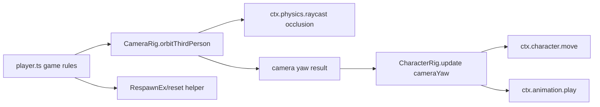
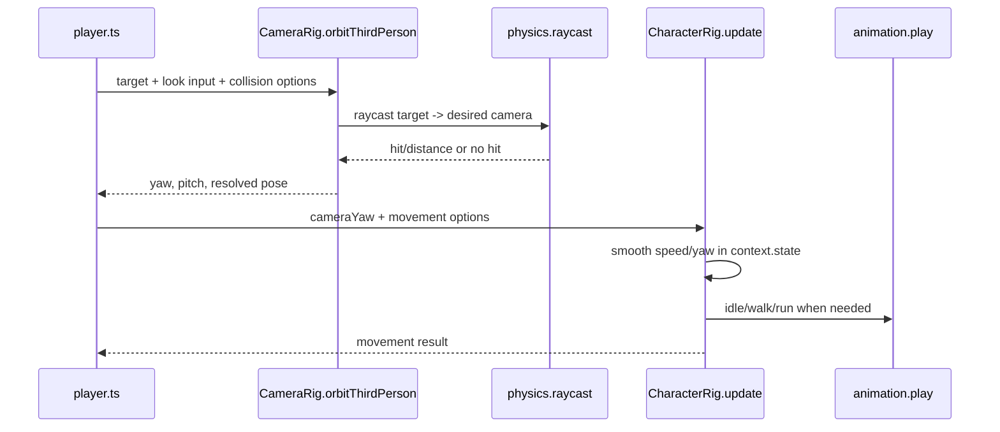

# PRD: Third-Person Orbit Movement Rig Residuals

`Planning Mode: Principal Architect`
`Complexity: 8 -> HIGH mode`

Score basis: +2 expands existing `@threenative/script-stdlib` rig API, +2
touches multi-package behavior across stdlib, compiler examples, playtests, and
docs, +2 complex state logic for camera input/pitch/collision and movement
coordination, +1 public authoring API, +1 release/parity evidence updates.

## 1. Context

**Problem:** `examples/humanoid-physics-course/src/scripts/player.ts` still
hand-rolls third-person locomotion and camera orbit plumbing even though the
repo now has baseline `CharacterRig.update` and `CameraRig.thirdPerson`
helpers.

**Relationship to existing work:**

- `docs/PRDs/done/authoring-abstractions-and-polished-defaults.md` already
  introduced `CharacterRig.update`, `CameraRig.thirdPerson`, `TriggerEx`,
  `KinematicMoverEx`, and `RespawnEx`.
- `docs/PRDs/done/other/script-stdlib-common-gameplay-helpers.md` already
  covers pure helpers such as `InputEx`, `MotionEx`, `CameraMath`, and
  `TimerEx`.
- `docs/PRDs/proof-first-engine-loop-2026-07-05/PRD-008-actor-archetypes-and-typed-scripting.md` plans typed
  behavior/archetype stamping on top of existing rigs.
- This PRD does not duplicate those. It closes the remaining gap exposed by
  `humanoid-physics-course`: a polished third-person orbit controller that
  owns look input, pitch clamp, camera occlusion, camera-to-movement yaw
  coupling, reset state, and example migration proof.

**Files Analyzed:**

- `examples/humanoid-physics-course/src/scripts/player.ts`
- `examples/humanoid-physics-course/content/systems/arena.systems.json`
- `packages/script-stdlib/src/rigs.ts`
- `packages/script-stdlib/src/index.ts`
- `packages/script-stdlib/src/bundle-source.ts`
- `packages/script-stdlib/src/index.test.ts`
- `packages/script-stdlib/src/rigs.test.ts`
- `packages/script-stdlib/README.md`
- `docs/PRDs/done/authoring-abstractions-and-polished-defaults.md`
- `docs/PRDs/done/other/script-stdlib-common-gameplay-helpers.md`
- `docs/STATUS.md`
- `docs/bevy-feature-parity.md`
- `runtime-bevy/crates/threenative_runtime/src/systems_host.rs`
- `runtime-bevy/crates/threenative_runtime/src/systems_effects.rs`
- `runtime-bevy/crates/threenative_runtime/src/physics.rs`
- `runtime-bevy/crates/threenative_runtime/tests/systems_host.rs`
- `runtime-bevy/crates/threenative_runtime/tests/physics.rs`

**Current Behavior:**

- `CharacterRig.update` covers camera-relative movement axes, accel/decel,
  turn rate, `context.character.move`, bounds, forward-axis yaw correction, and
  optional idle/walk/run animation playback.
- `CameraRig.thirdPerson` covers a smoothed follow camera with yaw following,
  shoulder offset, look-ahead, and sprint pullback.
- `humanoid-physics-course` needs a different camera mode:
  player-controlled orbit yaw/pitch, fixed look height, pitch limits, mouse or
  stick look sensitivity, per-frame look step clamping, raycast occlusion
  shortening, and deterministic position/rotation rounding.
- The example also keeps movement/camera state under
  `tn.thirdPerson.player`, manually couples camera yaw into movement, manually
  plays clips, and manually resets the same state on retry.
- Course-specific trigger/checkpoint logic is separate and should remain game
  script code unless a broader gameplay-flow PRD promotes it.
- Related native runtime work is already in flight: Rust changes in the
  worktree track script-authored `Transform` patches through
  `NativeSystemsHostRun.transform_patches` and
  `NativeGameLoopState.script_posed_entities`, then thread those ids into
  physics so kinematic bodies posed by script skip one velocity integration
  step. This PRD must treat that native behavior as part of the movement-rig
  dependency surface, not as unrelated cleanup.

## Pre-Planning Findings

No `.env` or secret configuration is relevant.

**How will this feature be reached?**

- [x] Entry point identified: authored scripts import rig helpers from
  `@threenative/script-stdlib`.
- [x] Caller file identified:
  `examples/humanoid-physics-course/src/scripts/player.ts` will migrate from
  local movement/camera plumbing to stdlib calls.
- [x] Registration/wiring needed: stdlib typed exports, bundled helper source,
  package tests, example system access metadata, README/docs/status/parity
  evidence, native Rust service parity tests, and a focused playtest proof.

**Is this user-facing?**

- [x] YES. This is a public script-authoring API and generated-game quality
  improvement.
- [ ] NO.

**Full user flow:**

1. User authors a third-person humanoid script.
2. Script calls a stdlib orbit camera helper and feeds its returned yaw into
   `CharacterRig.update`.
3. Script optionally calls a reset helper for retry/fail state.
4. `tn authoring validate --json`, `pnpm build`, and `tn playtest` prove the
   same script bundle executes through the supported helper import path.
5. User keeps only game-specific checkpoint, hazard, scoring, and fail/retry
   logic in `src/scripts/player.ts`.

## 2. Solution

**Approach:**

- Add an orbit-camera mode to the existing `CameraRig` namespace rather than a
  new package or unrelated abstraction.
- Add small movement/camera coordination helpers only where they remove real
  boilerplate from authored scripts; keep game rules outside the rig.
- Preserve current `CharacterRig.update` and `CameraRig.thirdPerson` APIs for
  compatibility.
- Retrofit `humanoid-physics-course` as the acceptance fixture: same controls,
  readable collision-aware camera, same idle/walk/run behavior, and a
  materially smaller `player.ts`.



**Key Decisions:**

- [x] Use `CameraRig.orbitThirdPerson(context, options)` as the main new API;
  `thirdPerson` remains the yaw-follow camera.
- [x] State stays in `context.state(...)`, not in game-visible resources.
- [x] Occlusion uses the existing portable `context.physics.raycast` service
  with explicit `ignore`, `mask`, `padding`, and minimum-distance options.
- [x] Rounding is optional and deterministic, matching the example's
  screenshot-stability need without forcing precision loss on all users.
- [x] Animation remains in `CharacterRig.update`; the orbit camera only returns
  yaw/pitch/pose data.
- [x] Course progress, checkpoint messages, and hazard scoring stay in the
  example script.
- [x] Native Rust coverage is required for every host service the rigs use:
  `context.state`, `context.input.axis`, `entity.transform().setPose`,
  `context.character.move`, `context.animation.play`, and
  `context.physics.raycast`.

**Data Changes:** None expected. This is a script-stdlib API and example
retrofit. If system service declarations need finer-grained validation for
`physics.raycast`, update only systems metadata and docs, not IR schemas.

## Rust / Bevy Gap Coverage

The stdlib rig implementation is TypeScript plus injected JavaScript, but the
behavior is only product-complete when the Bevy/QuickJS host can execute the
same script with equivalent services. This PRD therefore owns the native gap
audit for the new orbit/movement flow.

### Native Dependencies

The orbit and movement helpers require these Rust-hosted contracts:

| Contract | Why it matters | Required Rust proof |
|----------|----------------|---------------------|
| `context.input.axis("LookX"|"LookY")` | Orbit yaw/pitch must respond to the same input bindings as web. | `systems_host` test runs a bundled orbit script with look axes and observes camera `Transform` change. |
| `context.state(key, defaults)` | Camera yaw/pitch and character speed/yaw smoothing must persist across frames. | Native frame loop test proves state advances over two frames, not reinitialized each call. |
| `entity.transform().setPose(...)` / `entity.patch("Transform", ...)` | Camera and player pose writes are emitted as native effects. | `systems_effects` test reports transform patch ids and mutates the loaded bundle. |
| Script-posed kinematic authority | `CharacterRig.update` writes player pose after `character.move`; physics must not apply stale velocity again. | `physics` / `systems_host` tests prove script-posed kinematic ids skip one velocity integration step and resume normally next tick. |
| `context.character.move(... { direction, speed })` | Movement rig depends on direct speed/direction overrides, not legacy axis/fixed-delta scaling. | Native `character.move` service test covers `direction` plus `speed` and resolved displacement. |
| `context.physics.raycast(...)` | Orbit occlusion shortens the camera boom against world/pushable geometry. | Native service test covers origin/direction/maxDistance/mask/ignore and returns stable hit distance. |
| `context.animation.play(...)` | `CharacterRig.update` owns idle/walk/run clip switching and source clip mapping. | Native service/effect test verifies clip, `sourceClip`, loop, and speed payload are preserved. |

### Related Native Changes To Account For

Current Rust worktree changes appear to add the first half of the native
movement dependency:

- `apply_system_effects_with_report(...)` returns transform patch ids.
- `NativeSystemsHostRun` and `NativeGameLoopState` carry script-posed entity
  ids across frame boundaries.
- `step_bundle_physics_with_script_poses(...)` skips velocity application for
  kinematic bodies whose transform was script-authored for that physics step.
- Rust tests cover script-posed kinematic velocity skipping and host carry-over
  of script-posed ids.

This PRD must not overwrite or rework those changes blindly. Implementation
should build on them if they land first; if they are reverted or reshaped, the
same native behavior must still be proved before the orbit/movement retrofit
is marked complete.

### Native Parity Exit Criteria

- Rust tests prove every host service listed above for the exact payload shapes
  emitted by `CharacterRig.update` and `CameraRig.orbitThirdPerson`.
- `docs/bevy-feature-parity.md` records closed rows for orbit camera scripting,
  direct-speed character movement, raycast camera occlusion, animation clip
  playback payloads, and script-posed kinematic authority, or explicitly names
  any remaining Bevy-only gap.
- Native proof uses durable bundle/source inputs; do not prove behavior only by
  unit-testing private Rust helpers.
- Web and Bevy effect logs for the example movement/camera scenario agree on
  service names, transform patch ids, animation payloads, and hit/no-hit camera
  collision state within documented numeric tolerances.

## 3. Target API

### Camera Orbit

```ts
const camera = CameraRig.orbitThirdPerson(context, {
  cameraId: "camera.main",
  target: "player",
  lookHeight: 1.45,
  distance: 5.2,
  minDistance: 1.35,
  collision: {
    ignore: ["player"],
    mask: ["world", "pushable"],
    padding: 0.28,
  },
  input: {
    lookX: "LookX",
    lookY: "LookY",
    yawSensitivity: 0.002,
    pitchSensitivity: 0.0012,
    maxYawStep: 0.07,
    maxPitchStep: 0.045,
  },
  pitch: {
    default: 0.28,
    min: 0.12,
    max: 0.62,
  },
  rounding: {
    positionDigits: 5,
    rotationDigits: 5,
  },
});

CharacterRig.update(context, "player", {
  cameraYaw: camera.yaw,
  forwardAxis: "-z",
  walkSpeed: 2.0,
  sprintSpeed: 3.8,
  acceleration: 12,
  deceleration: 18,
  maxTurnSpeed: 10,
  sprintAction: "sprint",
  bounds: { min: [-4.8, Number.NEGATIVE_INFINITY, -6.5], max: [4.8, Number.POSITIVE_INFINITY, 6.4] },
  clips: {
    idle: { clip: "idle", sourceClip: "Idle" },
    walk: { clip: "walk", sourceClip: "Walk", referenceSpeed: 2.0 },
    run: { clip: "run", sourceClip: "Run", referenceSpeed: 3.8 },
  },
});
```

### Result Contract

```ts
interface IOrbitCameraRigResult {
  readonly yaw: number;
  readonly pitch: number;
  readonly target: [number, number, number];
  readonly position: [number, number, number];
  readonly collided: boolean;
  readonly distance: number;
}
```

### Optional Reset Helper

If the example still needs custom reset glue after `RespawnEx.reset`, extend
`RespawnEx.reset` with optional `stateKeys?: string[]` or add
`RigStateEx.clear(context, keys)` so retry can clear character/camera rig state
without writing through game resources.

Rules:

- Reset helpers may clear only named `context.state(...)` keys.
- They must not clear all script state by prefix unless the caller passes an
  explicit exact prefix option and tests prove deterministic behavior.
- They must not mutate visible gameplay resources unless requested through
  existing `RespawnEx.reset({ resources })`.

## 4. Sequence Flow



## 5. Execution Phases

#### Phase 1: Orbit Camera Rig - Authored scripts can use look input and camera collision without local math.

**Files (max 5):**

- `packages/script-stdlib/src/rigs.ts` - add
  `CameraRig.orbitThirdPerson` and `IOrbitCameraRigOptions/Result`.
- `packages/script-stdlib/src/bundle-source.ts` - mirror bundled JS logic.
- `packages/script-stdlib/src/index.ts` - export new types if needed.
- `packages/script-stdlib/src/rigs.test.ts` - unit tests for yaw/pitch input,
  pitch clamp, and raycast collision shortening.
- `packages/script-stdlib/src/index.test.ts` - typed/bundled parity sample.

**Implementation:**

- [x] Read `LookX`/`LookY` axes with configurable names.
- [x] Clamp look axis magnitude and per-frame yaw/pitch step.
- [x] Store yaw/pitch under a stable `tn.cameraOrbitRig.<cameraId>` key.
- [x] Build the desired orbit pose with existing `CameraMath.orbitPose`.
- [x] Raycast from look target to desired camera position and shorten distance
      with padding/min-distance rules.
- [x] Set camera pose with `CameraMath.lookAtPose`.
- [x] Return yaw, pitch, target, resolved position, collided, and distance.

**Tests Required:**

| Test File | Test Name | Assertion |
|-----------|-----------|-----------|
| `packages/script-stdlib/src/rigs.test.ts` | `should update orbit yaw and pitch from look axes` | returned yaw/pitch match sensitivity and step limits |
| `packages/script-stdlib/src/rigs.test.ts` | `should clamp orbit pitch` | pitch stays between configured min/max |
| `packages/script-stdlib/src/rigs.test.ts` | `should shorten orbit camera when raycast hits` | distance equals hit distance minus padding, bounded by min distance |
| `packages/script-stdlib/src/index.test.ts` | `should keep bundled orbit rig behavior in parity` | typed and bundled sample results match |

**Verification Plan:** `pnpm --filter @threenative/script-stdlib test`.

#### Phase 2: Character Coordination And Reset - Movement/camera state can be used together cleanly.

**Files (max 5):**

- `packages/script-stdlib/src/rigs.ts` - add any missing reset/state helper or
  `CharacterRig` option needed by the example.
- `packages/script-stdlib/src/bundle-source.ts` - bundle parity.
- `packages/script-stdlib/src/rigs.test.ts` - coordination/reset tests.
- `packages/script-stdlib/src/index.test.ts` - sample expression update.
- `packages/script-stdlib/README.md` - document orbit + character wiring.

**Implementation:**

- [x] Confirm `CharacterRig.update(..., { cameraYaw })` matches the orbit yaw
      convention for `forwardAxis: "-z"`.
- [x] Add a reset path only if current `RespawnEx.reset` cannot restore
      movement and orbit state deterministically.
- [x] Preserve animation clip source mapping and reference-speed playback.
- [x] Document the recommended order: camera orbit first, then character
      update with returned `camera.yaw`.

**Tests Required:**

| Test File | Test Name | Assertion |
|-----------|-----------|-----------|
| `packages/script-stdlib/src/rigs.test.ts` | `should move forward relative to orbit camera yaw` | forward input follows returned camera yaw |
| `packages/script-stdlib/src/rigs.test.ts` | `should reset character and orbit rig state when requested` | retry state returns to defaults |
| `packages/script-stdlib/src/rigs.test.ts` | `should preserve clip source mapping` | `animation.play` receives clip/sourceClip/speed |

**Verification Plan:** `pnpm --filter @threenative/script-stdlib test`.

#### Phase 3: Native Runtime Parity - Bevy can execute the same orbit/movement helper bundle.

**Files (max 5):**

- `runtime-bevy/crates/threenative_runtime/src/systems_host.rs` - ensure frame
  execution preserves script state and carries script-posed transform ids into
  the next physics step.
- `runtime-bevy/crates/threenative_runtime/src/systems_effects.rs` - expose
  transform patch reporting for `Transform` patches and set/add component
  commands.
- `runtime-bevy/crates/threenative_runtime/src/physics.rs` - consume
  script-posed kinematic ids without losing authored velocity for later ticks.
- `runtime-bevy/crates/threenative_runtime/tests/systems_host.rs` - bundled
  script proof for orbit look input, raycast service use, transform patches,
  direct-speed character movement, and animation playback payloads.
- `runtime-bevy/crates/threenative_runtime/tests/physics.rs` - focused
  script-posed kinematic authority regression if not already covered by the
  related native changes.

**Implementation:**

- [x] Audit native `character.move` for direct `{ direction, speed }` parity
      with the web runtime path used by `CharacterRig.update`.
- [x] Audit native `physics.raycast` for `ignore`, `mask`, origin, direction,
      and `maxDistance` payload parity with the orbit-camera collision call.
- [x] Preserve script-authored camera and player `Transform` writes in native
      effect logs so playtest/conformance can compare web and Bevy behavior.
- [x] Ensure script-posed kinematic ids are consumed for exactly the relevant
      physics step and do not permanently suppress velocity integration.
- [x] Keep existing in-flight Rust changes if they already implement this
      behavior; extend tests rather than replacing the mechanism.

**Tests Required:**

| Test File | Test Name | Assertion |
|-----------|-----------|-----------|
| `runtime-bevy/crates/threenative_runtime/tests/systems_host.rs` | `should run orbit camera script with native look input and raycast` | camera `Transform` changes and service log includes `physics.raycast` |
| `runtime-bevy/crates/threenative_runtime/tests/systems_host.rs` | `should move character with direct speed and direction on native host` | resolved player displacement matches `speed * fixedDelta` within tolerance |
| `runtime-bevy/crates/threenative_runtime/tests/systems_host.rs` | `should preserve animation play payload from CharacterRig` | log includes clip/sourceClip/loop/speed |
| `runtime-bevy/crates/threenative_runtime/tests/physics.rs` | `should skip script posed kinematic velocity once` | first physics step does not double-integrate; following step resumes velocity |

**Verification Plan:**

```bash
pnpm verify:conformance
cargo test -p threenative_runtime systems_host
cargo test -p threenative_runtime physics
```

If the Rust crate is not invoked through `cargo test -p threenative_runtime` in
this repo layout, use the existing runtime-bevy test command and record the
actual command in the PRD evidence section.

#### Phase 4: Humanoid Course Retrofit - The example script keeps only game rules.

**Files (max 5):**

- `examples/humanoid-physics-course/src/scripts/player.ts` - replace local
  movement/camera plumbing with `CharacterRig`, `CameraRig.orbitThirdPerson`,
  `TriggerEx`, and reset helper calls.
- `examples/humanoid-physics-course/content/systems/arena.systems.json` -
  keep service/resource declarations accurate for the new helper usage.
- `examples/humanoid-physics-course/playtests/*.playtest.json` or package
  scripts - add/update a focused movement/camera proof if absent.
- `docs/STATUS.md` - record promoted behavior and example evidence.
- `docs/bevy-feature-parity.md` - record whether orbit rig uses only shared
  scripting/raycast services or has native parity gaps.

**Implementation:**

- [x] Reduce generic movement/camera code in `player.ts` by at least 50
      percent while preserving checkpoint/hazard/finish behavior.
- [x] Keep the same authored values for speed, acceleration, bounds,
      animation source clips, camera distance, pitch, look height, and
      occlusion masks.
- [x] Do not tune adapter colors/materials/lights as part of this PRD.
- [x] Keep durable behavior in `src/scripts/player.ts`; do not edit generated
      bundle output.

**Tests Required:**

| Test File | Test Name | Assertion |
|-----------|-----------|-----------|
| Example playtest | `humanoid course forward movement` | pressing forward moves the player along the camera-relative axis |
| Example playtest | `humanoid course camera look` | look input changes camera yaw/pitch and camera remains posed |
| Existing validation | `authoring validation` | system access metadata still matches helper usage |

**Verification Plan:**

```bash
pnpm --filter @threenative/script-stdlib test
pnpm --filter humanoid-physics-course run validate
tn playtest --project examples/humanoid-physics-course --stable-artifacts --json
```

If the example package lacks a `validate` or playtest script with these exact
names, use the narrowest equivalent command and record the actual command in
the PRD evidence section.

#### Phase 5: Recipe/Archetype Discovery - New projects can choose orbit camera defaults explicitly.

**Files (max 5):**

- `packages/authoring/src/recipes.ts` - expose an orbit-camera option for the
  `third-person-controller` recipe if the recipe currently stamps only follow
  camera defaults.
- `packages/authoring/src/recipes.test.ts` - recipe plan/output coverage.
- `docs/workflows/developer-workflow.md` - document command shape if changed.
- `docs/PRDs/proof-first-engine-loop-2026-07-05/PRD-008-actor-archetypes-and-typed-scripting.md` - add a note that
  the future `character` archetype can choose follow or orbit camera rig.
- `templates/structured-source-starter/AGENTS.md` or template docs - mention
  orbit rig only if the starter actually uses it.

**Implementation:**

- [x] Keep recipe defaults backward-compatible.
- [x] Add `cameraMode: "follow" | "orbit"` only if it can be represented in
      source documents without hidden runtime handles.
- [x] Leave dry-run JSON unchanged because no orbit recipe mode is added until
      structured operations can represent the required source wiring.

Recipe audit outcome: orbit mode is intentionally not added yet. The current
`third-person-controller` operation can stamp follow-camera source, but cannot
represent helper imports, pointer-delta `LookX`/`LookY` axes, declared
`physics.raycast`, and rig state resources without hidden runtime handles.
`docs/workflows/developer-workflow.md` and
`docs/PRDs/proof-first-engine-loop-2026-07-05/PRD-008-actor-archetypes-and-typed-scripting.md` now document the
explicit authoring path and future archetype requirement instead.

**Tests Required:**

| Test File | Test Name | Assertion |
|-----------|-----------|-----------|
| `packages/authoring/src/recipes.test.ts` | `should plan third-person orbit controller` | dry-run plan includes orbit camera script wiring |
| `packages/authoring/src/recipes.test.ts` | `should keep existing follow controller default` | existing callers get unchanged plan |

**Verification Plan:** `pnpm --filter @threenative/authoring test` plus the
Phase 3 example proof if recipe output is applied to a scratch project.

## 6. Acceptance Criteria

- [x] `CameraRig.orbitThirdPerson` is exported from
  `@threenative/script-stdlib` and mirrored in `SCRIPT_STDLIB_BUNDLE_SOURCE`.
- [x] Package tests prove yaw/pitch input, pitch clamp, raycast occlusion,
  rounding, and typed/bundled parity.
- [x] `humanoid-physics-course/src/scripts/player.ts` no longer contains local
  copies of orbit vector math, camera collision math, movement smoothing, turn
  smoothing, or animation clip switching.
- [x] The example still passes focused movement/camera playtest evidence.
- [x] `docs/STATUS.md` and `docs/bevy-feature-parity.md` reflect the promoted
  capability and any target-specific gaps.
- [x] Existing `CharacterRig.update` and `CameraRig.thirdPerson` behavior stays
  backward-compatible.

## 7. Evidence

- `pnpm --filter @threenative/script-stdlib test`
- `pnpm tn -- authoring validate --project examples/humanoid-physics-course --json`
- `pnpm tn -- playtest --project examples/humanoid-physics-course --scenario playtests/humanoid-course-forward-movement.playtest.json --stable-artifacts --json`
- `pnpm tn -- playtest --project examples/humanoid-physics-course --scenario playtests/humanoid-course-camera-orbit.playtest.json --stable-artifacts --json`
- `cargo test --manifest-path runtime-bevy/Cargo.toml -p threenative_runtime systems_host`
- `cargo test --manifest-path runtime-bevy/Cargo.toml -p threenative_runtime physics`

## 8. Non-Goals

- No new raw Three.js, Bevy, DOM, filesystem, worker, timer, or native runtime
  handles in scripts.
- No course/checkpoint/hazard scoring abstraction in this PRD.
- No visual-material, lighting, or art-direction changes.
- No arbitrary npm imports in portable scripts.
- No replacement for the future typed-archetype work; this PRD supplies a
  better rig surface that archetypes can later stamp.

## 9. Open Questions

- Should orbit camera input read pointer delta and gamepad stick through the
  same `LookX`/`LookY` axes, or should script context expose a separate
  bounded pointer-delta service first?
- Should camera collision masking default to `["world"]` or require callers to
  pass a mask whenever occlusion is enabled?
- Should reset support live on `RespawnEx`, `CharacterRig`, or a tiny
  `RigStateEx` namespace? Choose the smallest API that removes the example's
  retry boilerplate without adding broad state-clearing power.
