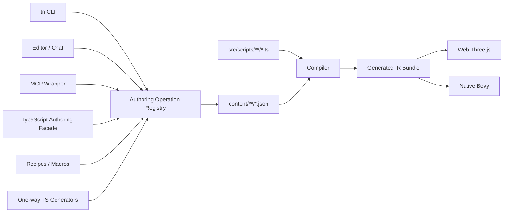
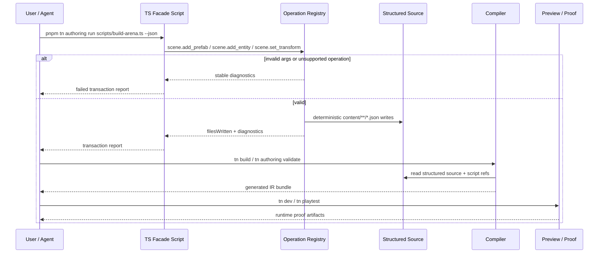

# PRD: TypeScript Authoring Facade and Script Ergonomics

Complexity: 12 -> HIGH mode

Score basis: +3 touches 10+ future files, +2 adds new public authoring facade
module, +2 spans authoring/CLI/editor/MCP/compiler/templates/docs, +2 complex
source-of-truth and generator provenance rules, +1 user-facing workflow, +1
verification gates, +1 script ergonomics/runtime parity.

## 1. Context

**Problem:** ThreeNative's durable game data is intentionally CLI/editor-owned
structured ECS source, but creating larger games still lacks the compositional
comfort of TypeScript/Three.js-style authoring.

**Goal:** Add TypeScript ergonomics without making arbitrary TypeScript scene
graphs the source of truth: TypeScript may be used for gameplay scripts,
one-way generators, and a typed facade over the shared authoring operation
registry that writes `content/**/*.json`.

**Goal Fit:** The end state should let a user move as quickly as a vanilla
Three.js prototype for common creation/editing tasks while preserving
ThreeNative's durable source contract. If an improvement makes authoring feel
nice but cannot round-trip through CLI/editor structured ECS source, it fails
this PRD.

**Non-goals:**

- Do not replace `content/**/*.json` structured source as the editable truth for
  editor-owned scene/entity/prefab/material/input/UI/audio data.
- Do not require the editor to reverse-patch arbitrary TypeScript scene code.
- Do not expose raw Three.js, Bevy, renderer, filesystem, DOM, worker, timer, or
  runtime handles through public authoring.
- Do not make `dist/**`, emitted IR JSON, or `scripts.bundle.js` durable source.
- Do not allow arbitrary npm dependencies in portable gameplay scripts.
- Do not create a second operation model that drifts from
  `AUTHORING_OPERATION_REGISTRY`.

**Files Analyzed:**

- `AGENTS.md`
- `packages/AGENTS.md`
- `docs/PRDs/README.md`
- `docs/PRDs/other/complete-structured-authoring-parity.md`
- `docs/PRDs/done/other/editor-ready-modular-authoring-and-scripting-architecture.md`
- `docs/PRDs/other/editor-script-body-code-mode.md`
- `docs/PRDs/done/other/game-authoring-loop-hardening.md`
- `docs/PRDs/other/portable-scripting-ergonomics-stdlib-and-lifecycle.md`
- `docs/STATUS.md`
- `docs/bevy-feature-parity.md`
- `packages/authoring/src/operationRegistry.ts`
- `packages/authoring/src/operations.ts`
- `packages/editor/src/server/operationApi.ts`
- `packages/editor/src/workbench/operations.ts`
- `packages/cli/src/commands/dev.ts`
- `packages/cli/src/commands/playtest.ts`
- `packages/script-stdlib/src/index.ts`
- `templates/structured-source-starter/README.md`
- `templates/racing-kit-rally-starter/README.md`

**Current Behavior:**

- The shared authoring registry already covers many durable source mutations for
  assets, audio, environment, generators, input, materials, meshes, prefabs,
  project/runtime/target metadata, resources, schemas, scenes, systems, and UI.
- CLI, editor, MCP, and chat planning are converging on registry-backed
  operations instead of hand-editing generated IR.
- Gameplay behavior already lives in `src/scripts/**/*.ts`, with script module
  references stored in structured source.
- `packages/script-stdlib` / `@threenative/script-stdlib` is actively being
  created to extract repeated portable math and transform helpers. This PRD
  should build on that package instead of creating a second helper surface.
- Higher-level script context ergonomics are still planned above the pure stdlib
  helper layer.
- Editor script body code mode remains planned: script references can be edited,
  but script files are still edited outside the editor.
- `tn playtest` provides web gameplay proof; native/Bevy playtest injection is
  still pending.

## Pre-Planning Findings

No secret configuration or environment variables are required.

**How will this feature be reached?**

- [x] Entry points identified:
  - `@threenative/authoring-client` TypeScript facade.
  - `tn authoring run <script.ts> --json` or equivalent facade runner.
  - Existing `dispatchAuthoringOperation` in `@threenative/authoring`.
  - Existing CLI/editor/MCP operation registry flows.
  - `src/scripts/**/*.ts` gameplay modules.
  - `tn generator record` and future `tn generator run`.
- [x] Caller files identified:
  - `packages/authoring/src/operationRegistry.ts`
  - `packages/authoring/src/operations.ts`
  - new `packages/authoring-client/src/*`
  - `packages/cli/src/index.ts`
  - `packages/cli/src/commands/authoring.ts`
  - `packages/editor/src/server/operationApi.ts`
  - `packages/editor/src/server/projectApi.ts`
  - `packages/compiler/src/scripts/*`
  - `packages/script-stdlib/src/index.ts`
  - templates under `templates/**`
- [x] Registration/wiring needed:
  - Add package workspace entry and exports.
  - Add CLI command/help registration for running typed operation scripts or
    generators.
  - Reuse `AUTHORING_OPERATION_REGISTRY` descriptors as the facade's source of
    truth.
  - Add editor code-mode routes/panels in the separate script-body phase.
  - Update templates and docs to show the intended split.

**Is this user-facing?**

- [x] YES. Users, agents, and future editor workflows will call the facade,
  generators, and script ergonomics directly.
- [ ] NO.

**Full user flow:**

1. User creates a structured-source project.
2. User chooses one of three authoring modes:
   - CLI/editor/MCP operations for direct structured source edits.
   - TypeScript facade scripts for batched/composed source edits.
   - `src/scripts/**/*.ts` modules for runtime gameplay behavior.
3. The TypeScript facade dispatches the same registry-backed operations as CLI
   and editor, writing deterministic `content/**/*.json`.
4. Optional generators write structured source and record provenance.
5. The compiler builds the same IR bundle from structured source plus script
   module references.
6. User validates with `tn authoring validate`, previews with `tn dev`, and
   proves behavior with `tn playtest` / conformance gates.

## 2. Solution

**Approach:**

- Keep structured ECS source documents as the durable truth for editor-owned
  game data.
- Add a TypeScript authoring facade that is only a typed client over
  registry-backed operations; it never becomes a second scene source model.
- Make the facade transactional and inspectable so users can see the exact
  operation plan and files written, keeping the CLI mental model intact.
- Add explicit one-way generator workflows for procedural content, with
  provenance and overwrite policy.
- Improve gameplay script ergonomics through context helpers, the in-progress
  `@threenative/script-stdlib`, lifecycle aliases, and editor code mode.
- Add recipes/macros for common game objects and workflows, implemented as
  composed registry operations.

**Key Decisions:**

- [x] TypeScript scene/data authoring must lower to structured source
  operations, not replace them.
- [x] Arbitrary TypeScript graph capture remains unsuitable for editor
  round-tripping.
- [x] The operation registry remains the single mutation contract for CLI,
  editor, MCP, chat, recipes, generators, and the TS facade.
- [x] Gameplay scripts remain TypeScript modules referenced by structured
  system/scene documents.
- [x] Generators are one-way by default; editor patches generated outputs as
  structured source and does not reverse-patch generator code.
- [x] Unsupported APIs fail with stable diagnostics before runtime.

**Data Changes:**

- Add optional facade transaction reports that list operation names, files
  written, diagnostics, and project revision.
- Add recipe/generator operation traces using the same report shape so CLI,
  editor, MCP, AI chat, and TS facade results are comparable.
- Extend generator provenance documents only if needed for `lastRun`, input
  hashes, output hashes, and generated operation traces.
- No database changes.

**Definition of Done for the Goal:**

- A user can create and edit a small playable scene through CLI/editor or a
  TypeScript facade without hand-editing generated IR.
- Every TypeScript facade/generator/recipe operation can be displayed as a
  registry-backed operation trace.
- The editor can reopen the project and keep editing the same data without
  parsing or reverse-patching arbitrary TypeScript scene code.
- Gameplay behavior scripts are shorter and mostly gameplay-focused because
  common math/transform/context plumbing lives in supported helper APIs.
- Starter projects demonstrate the split clearly: `content/**/*.json` for data,
  `src/scripts/**/*.ts` for behavior, optional facade/generator scripts for
  source mutations, and `dist/**` as generated output.

## 3. Sequence Flow

## 4. Execution Phases

#### Phase 1: Operation Facade Contract - TypeScript can batch source edits through the same registry as CLI/editor.

Status: Complete in this PRD slice. `@threenative/authoring-client` exposes
`openProject(projectPath)`, queued transaction operations, stop-on-error
behavior, aggregate diagnostics/files, and per-operation traces backed by
`dispatchAuthoringOperation`.

**Files (max 5):**

- `packages/authoring-client/package.json` - new public facade package.
- `packages/authoring-client/src/index.ts` - project/session/transaction API.
- `packages/authoring-client/src/index.test.ts` - facade dispatch tests.
- `package.json` - workspace/package script registration if required.
- `pnpm-workspace.yaml` - include the package if not automatically covered.

**Implementation:**

- [x] Create `@threenative/authoring-client` with `openProject(projectPath)`.
- [x] Implement a transaction object that queues named authoring operations.
- [x] Dispatch through `dispatchAuthoringOperation`, not duplicated mutation
  code.
- [x] Return a stable transaction result with `ok`, `changed`, `diagnostics`,
  `filesWritten`, and ordered operation results.
- [x] Reject unknown operations with the existing registry diagnostic shape.

**Tests Required:**

| Test File | Test Name | Assertion |
|-----------|-----------|-----------|
| `packages/authoring-client/src/index.test.ts` | `should dispatch queued operations through the shared registry` | Source scene file is written and result lists operation names/files |
| `packages/authoring-client/src/index.test.ts` | `should stop or report failed operations deterministically` | Invalid entity/component args return stable diagnostics |

**User Verification:**

- Action: run a small facade script that adds an entity and transform to the
  structured starter.
- Expected: `content/scenes/*.scene.json` changes, `tn authoring validate
  --json` passes, and no generated bundle file is edited.

#### Phase 2: Fluent Scene Builder Over Operations - Common scene edits feel TypeScript-native while preserving structured source.

Status: Complete in this PRD slice. `project.scene(sceneId)` exposes fluent
helpers for common scene operations, `commit()` dispatches registry-backed
mutations, and `dryRun()` validates registered operation shapes while returning
the operation trace without writing source.

**Files (max 5):**

- `packages/authoring-client/src/scene.ts` - fluent scene API.
- `packages/authoring-client/src/scene.test.ts` - scene facade tests.
- `packages/authoring-client/src/index.ts` - export scene helpers.
- `docs/contracts/authoring-source-documents.md` - document facade/source
  boundary.
- `docs/workflows/ai-workflows.md` - add facade examples for agents.

**Implementation:**

- [x] Add `project.scene(sceneId)` with methods for common registry operations:
  `addEntity`, `addPrefab`, `transform`, `camera`, `light`, `meshRenderer`,
  `rigidBody`, `collider`, `characterController`, `script`, `resource`, and
  `uiBinding`.
- [x] Keep method names stable and close to domain concepts, but map every call
  to a named registry operation.
- [x] Provide `commit()` and `dryRun()`; `dryRun()` validates operation shapes
  without writing when possible.
- [x] Include operation trace output so users can see the equivalent CLI-level
  mutations.
- [x] Avoid implicit generated IDs unless the caller opts into a deterministic
  prefix allocator.

**Tests Required:**

| Test File | Test Name | Assertion |
|-----------|-----------|-----------|
| `packages/authoring-client/src/scene.test.ts` | `should create a primitive scene object through fluent calls` | Emits prefab/entity/transform source and validates |
| `packages/authoring-client/src/scene.test.ts` | `should expose operation trace for fluent scene calls` | Trace contains `scene.add_prefab`, `scene.add_entity`, `scene.set_transform` |

**User Verification:**

- Action: create a cube/player object through the fluent facade and inspect the
  scene with `tn scene inspect <scene> --json`.
- Expected: object appears in source inspection and the operation trace explains
  what was written.

#### Phase 3: Generator Runner and Provenance - Procedural TypeScript writes structured source as a one-way operation.

Status: Complete in this PRD slice. `tn generator run <generator-id> --json`
loads `content/generators/*.generator.json`, executes project-local
`src/generators/**` TypeScript/JavaScript modules, passes the
`@threenative/authoring-client` project facade into the generator, records
`lastRun` provenance with operation trace, files, input/output hashes, timing,
and diagnostics, and rejects manual output conflicts before rerunning.

**Files (max 5 planned, actual command stayed in the existing source-doc CLI surface):**

- `packages/cli/src/commands/sourceDocuments.ts` - existing `generator`
  `record`/`run` command surface.
- `packages/cli/src/index.ts` - command registration.
- `packages/authoring/src/operations.ts` - generator provenance extensions if
  needed.
- `packages/authoring/src/operationRegistry.ts` - registry updates if needed.
- `packages/cli/src/commands/generator.test.ts` - generator CLI tests.

**Implementation:**

- [x] Add `tn generator run <generator-id> --json`.
- [x] Load generator metadata from `content/generators/*.generator.json`.
- [x] Execute only project-local generator modules under an allowed path such as
  `src/generators/**`.
- [x] Provide the generator with the same facade API, not raw file write access.
- [x] Record output files, input/output hashes, run time, and operation trace.
- [x] If generated outputs were manually edited, respect overwrite policy and
  report a conflict diagnostic instead of overwriting silently.

**Tests Required:**

| Test File | Test Name | Assertion |
|-----------|-----------|-----------|
| `packages/cli/src/commands/generator.test.ts` | `should run a project-local generator through the facade` | Structured scene output is written and provenance updated |
| `packages/cli/src/commands/generator.test.ts` | `should reject generated output overwrite conflicts` | Diagnostic includes generator id and output path |

**User Verification:**

- Action: run `tn generator run arena-layout --json`.
- Expected: source docs are created/updated, provenance records operation trace,
  and validation/build consume the structured output.

Notes:

- This phase is source-authoring only. It does not require
  `systems_host`, `systems_host_bridge`, or QuickJS updates.
- The later Phase 5 script context ergonomics work is the phase that must keep
  SDK typings, web `createSystemContext`, Bevy `systems_host_bridge.js`, and
  native `systems_host` tests moving together.

#### Phase 4: Recipes and Task-Level Commands - Common game objects require one command or one facade call.

Status: Complete in this PRD slice. `@threenative/authoring` exposes a recipe
registry that returns deterministic registry-backed operation plans for
`third-person-controller`, `collectible`, `trigger-zone`,
`kinematic-character`, and `health-bar`. `tn recipe ... --dry-run --json`
returns the plan without writing, `tn recipe ... --json` applies the same
operations, and `@threenative/authoring-client` exposes `planRecipe()` and
`recipe()` helpers that queue the same operations into a facade transaction.

**Files (max 5):**

- `packages/authoring/src/recipes.ts` - composed operation recipes.
- `packages/authoring/src/recipes.test.ts` - recipe unit tests.
- `packages/cli/src/commands/recipe.ts` - CLI recipe command.
- `packages/cli/src/index.ts` - command registration.
- `docs/workflows/developer-workflow.md` - recipe documentation.

**Implementation:**

- [x] Add a small recipe registry with composed operation plans.
- [x] Start with high-leverage recipes:
  - `third-person-controller`
  - `collectible`
  - `trigger-zone`
  - `kinematic-character`
  - `health-bar`
- [x] Return a plan before write when `--dry-run` is passed.
- [x] Keep recipes data-driven and source-persistable; no raw runtime handles.
- [x] Expose the same recipes through the TypeScript facade.

**Tests Required:**

| Test File | Test Name | Assertion |
|-----------|-----------|-----------|
| `packages/authoring/src/recipes.test.ts` | `should produce deterministic operations for third-person-controller` | Operation list is stable and only uses registry names |
| `packages/cli/src/commands/recipe.test.ts` | `should apply collectible recipe to structured source` | Entity, collider, trigger script ref, and UI/resource refs validate |

**User Verification:**

- Action: run `tn recipe third-person-controller --scene arena --entity player
  --camera camera.main --json`.
- Expected: source files change, validation passes, and preview/playtest can
  prove the controller wiring.

#### Phase 5: Script Context Ergonomics - Gameplay TypeScript reads like gameplay instead of plumbing.

Status: Complete in this PRD slice. The canonical `@threenative/script-stdlib`
bundle now has host-free deterministic parity coverage, SDK context types expose
the helper facade, web and Bevy/QuickJS hosts execute the same helper-driven
resource and Transform effects, and compiler diagnostics reject `ctx.state(...)`
helper writes without matching `resourceWrites`.

**Files (max 5):**

- `packages/script-stdlib/src/index.ts` - extend the active pure helper surface
  only when helpers are deterministic and host-free.
- `packages/sdk/src/ecs/system.ts` - context helper type declarations.
- `packages/runtime-web-three/src/systems/*` - web context helper
  implementation.
- `runtime-bevy/crates/threenative_runtime/src/systems_*` - Bevy/QuickJS helper
  implementation.
- `packages/compiler/src/scripts/diagnostics.test.ts` - helper API validation.

**Implementation:**

- [x] Treat `packages/script-stdlib` as the canonical pure helper package for
  math, vector, quaternion, and transform utilities.
- [x] Add helper facades over existing portable primitives:
  `ctx.entity(id)`, `ctx.entities.byId(map)`, `ctx.state(key, defaults)`,
  `ctx.time.fixedDelta(bounds)`, `ctx.input.axis1(...)`, and entity transform
  helpers.
- [x] Validate that helper writes still require declared resource/component write
  access.
- [x] Preserve deterministic web/Bevy behavior.
- [x] Keep helpers as convenience composition, not new runtime authority.
- [x] Add diagnostics for helper calls that imply undeclared access.

**Tests Required:**

| Test File | Test Name | Assertion |
|-----------|-----------|-----------|
| `packages/script-stdlib/src/index.test.ts` | `should keep stdlib helpers deterministic and host-free` | Helpers produce stable results without context/runtime APIs |
| `packages/compiler/src/scripts/diagnostics.test.ts` | `should reject helper resource writes without declared access` | Stable diagnostic points at the script/source ref |
| `packages/runtime-web-three/src/systems/context.test.ts` and `runtime-bevy/crates/threenative_runtime/tests/systems_host.rs` | context helper facade tests | Matching helper-driven resource writes and Transform patch behavior |

**User Verification:**

- Action: rewrite one starter script to use helpers and run web/native scripting
  conformance.
- Expected: script is smaller, emitted effects match prior behavior, and
  validation catches undeclared access.

#### Phase 6: Script Body Code Mode - The editor can create/edit project-local gameplay scripts.

Status: Complete in this PRD slice. The editor exposes a guarded script-source
API plus a code-mode panel/store path for `src/scripts/**/*.ts`; generated
script bundles, traversal, and non-TypeScript paths are rejected, scaffolded
exports can be attached through the existing script-reference operation, and
saves rerun authoring validation.

**Files (max 5):**

- `packages/editor/src/server/scriptSourceApi.ts` - guarded script file routes.
- `packages/editor/src/components/panels/ScriptPanel.tsx` - code-mode panel.
- `packages/editor/src/state/editorStore.ts` - script editor state/actions.
- `packages/editor/src/server/scriptSourceApi.test.ts` - path guard tests.
- `packages/editor/src/EditorApp.test.tsx` - integration coverage.

**Implementation:**

- [x] List/read/write only project-local `src/scripts/**/*.ts`.
- [x] Reject traversal, `dist/**`, generated `scripts.bundle.js`, and
  non-TypeScript files.
- [x] Scaffold missing module/export from a system or scene script reference.
- [x] On save, run authoring validation and script diagnostics.
- [x] Keep script body editing separate from structured script-reference
  editing.

**Tests Required:**

| Test File | Test Name | Assertion |
|-----------|-----------|-----------|
| `packages/editor/src/server/scriptSourceApi.test.ts` | `should reject generated script bundle reads` | `dist/**/scripts.bundle.js` returns a stable diagnostic |
| `packages/editor/src/EditorApp.test.tsx` | `should scaffold and attach a script from the editor` | Source file exists and system reference validates |

**User Verification:**

- Action: open editor, scaffold a missing script from a system row, save, and
  build.
- Expected: `src/scripts/*.ts` is written, generated bundle updates through
  build, and no generated file is edited directly.

#### Phase 7: Template and Proof Updates - New projects demonstrate the intended split.

Status: Complete in this PRD slice. The structured-source starter documents
the source split, includes validate/build/playtest and recipe dry-run scripts,
declares `@threenative/script-stdlib`, and uses context/stdlib helpers in its
behavior script while keeping `Transform` write access explicit in structured
system source.

**Files (max 5):**

- `templates/structured-source-starter/README.md` - authoring modes.
- `templates/structured-source-starter/package.json` - facade/generator/recipe
  scripts if useful.
- `templates/structured-source-starter/src/scripts/player.ts` - helper-based
  gameplay script.
- `templates/racing-kit-rally-starter/README.md` - generator/recipe/script
  guidance.
- `docs/workflows/developer-workflow.md` - final workflow update.

**Implementation:**

- [x] Update starters to clearly say: `content/**/*.json` is game data,
  `src/scripts/**/*.ts` is behavior, facade/generators are source mutation
  clients.
- [x] Include one small facade example or recipe command.
- [x] Refactor starter script to use script stdlib/context helpers where
  implemented.
- [x] Add package scripts for validate/build/playtest that prove the workflow.
- [x] Avoid adding generated outputs to source templates.

**Tests Required:**

| Test File | Test Name | Assertion |
|-----------|-----------|-----------|
| `packages/cli/src/commands/create.test.ts` | `should create starter with facade guidance and source split` | Generated project contains docs/scripts and validates |
| template verification gate | `should validate, build, and playtest structured starter` | Starter source builds and playtest passes where applicable |

**User Verification:**

- Action: run `tn create my-game --template structured-source-starter`, then run
  validate/build/playtest commands from the README.
- Expected: project demonstrates the intended CLI/editor/facade/script split and
  passes proof commands.

## 5. Checkpoint Protocol

Because this is HIGH complexity, each phase requires:

- Automated checkpoint using the PRD work reviewer against this PRD.
- Focused package tests for the phase.
- `pnpm typecheck` for public TypeScript API phases.
- `pnpm verify:conformance` when runtime scripting or shared contracts change.
- Manual verification for editor UI and template workflow phases.

Do not proceed from one phase to the next if the implementation diverges from
the source-of-truth rules in this PRD.

## 6. Verification Strategy

**Narrow checks:**

- `pnpm --filter @threenative/authoring test`
- `pnpm --filter @threenative/authoring-client test`
- `pnpm --filter @threenative/cli test`
- `pnpm --filter @threenative/editor test`
- `pnpm --filter @threenative/script-stdlib test`

**Shared contract checks:**

- `pnpm build`
- `pnpm typecheck`
- `pnpm verify:conformance`

**Workflow proof:**

- `tn authoring validate --project templates/structured-source-starter --json`
- `tn playtest --project examples/racing-kit-rally --entity player.car --press
  KeyW --frames 60 --expect-moved --json`
- Editor E2E gate for script code mode once implemented.

## 7. Open Questions

- Should the TypeScript facade live in `@threenative/authoring-client`, or
  should it be exported from `@threenative/authoring` under a stable subpath?
- Should facade transactions be all-or-nothing, or should they write successful
  operations and report partial failure? The initial recommendation is
  all-or-nothing once a deterministic rollback/snapshot strategy exists; before
  that, use ordered operation results and stop-on-error.
- Should `tn authoring run` execute arbitrary facade scripts, or should the
  first public runner be generator-only? The safer first slice is
  generator-only plus direct library usage.
- Which recipes should be promoted into stable public surface versus template
  examples?
- How much of script context ergonomics should be SDK type-only versus runtime
  host helpers exposed to bundled scripts?

## 8. Success Criteria

- Users can compose common scene/source edits in TypeScript without making
  TypeScript scene files the durable source of truth.
- Users can choose CLI, editor, MCP, AI chat, or TS facade for the same source
  mutation and get equivalent operation traces and diagnostics.
- CLI, editor, MCP, chat, TS facade, recipes, and generators all dispatch the
  same registry-backed operations.
- The editor never needs to reverse-patch arbitrary TypeScript scene graphs.
- Gameplay scripts become smaller and easier to read through supported helper
  APIs, including the active `@threenative/script-stdlib` package.
- Starters clearly demonstrate the split between structured data, gameplay
  scripts, generators, and generated bundle artifacts.
- Validation and proof commands catch unsupported APIs and runtime-dead wiring
  before users debug stale previews manually.
- The workflow preserves ThreeNative's source-of-truth rule while offering a
  Three.js-like fast path for common object creation, procedural layout, and
  gameplay iteration.
