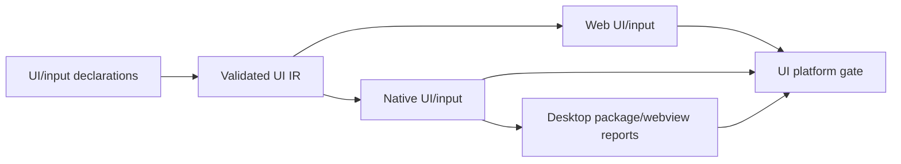
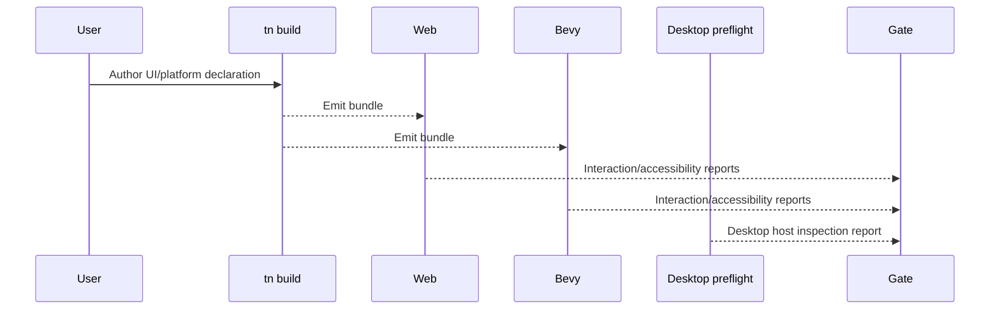

# PRD: UI Platform and Desktop Residuals

Complexity: 10 -> HIGH mode

Score basis: +3 touches 10+ future files, +2 spans UI/input/platform runtime
surfaces, +2 requires web/native interaction evidence, +2 affects SDK/IR/
compiler/web/Bevy/verify/docs, +1 includes manual desktop inspection evidence.

## 1. Context

**Problem:** The UI and platform checklist is mostly promoted, but several
interaction and desktop polish gaps still need focused, user-visible proof.

**Files Analyzed:**

- `docs/bevy-feature-parity.md`
- `docs/STATUS.md`
- `docs/PRDs/done/other/post-v10-input-ui-platform-polish.md`
- `/home/joao/.claude/skills/prd-creator/SKILL.md`

**Current Behavior:**

- Retained UI, layout basics, scrolling, widgets, rich text, images, UI
  mutation, focus narration, spatial navigation, device diagnostics, settings
  polish, and debug overlays are already promoted.
- Richer gestures, virtual keyboard behavior, UI transforms,
  render-to-texture/world UI, native italic text, advanced grid placement,
  broad gamepad/touch UI coverage, and desktop webview host promotion remain
  diagnostic-only unless matching runtime evidence is added. Desktop webview
  packaging now emits `webview.inspection.json` for package/manual host checks.

## Pre-Planning Findings

No secret configuration is required. Desktop webview inspection may require
host availability and must record explicit unavailable states.

**How will this feature be reached?**

- [x] Entry point identified: SDK UI/input declarations, `tn build`, web and
  native previews, package preflight, focused UI/platform gates, and manual
  desktop inspection artifacts.
- [x] Caller file identified: SDK UI helpers, IR validators, compiler UI emit,
  web DOM/UI adapter, Bevy UI adapter, input adapters, desktop packaging tools,
  and verify tooling.
- [x] Registration/wiring needed: UI schemas, gesture reports, keyboard
  capability states, desktop webview artifact checks, docs, and release gate
  promotion.

**Is this user-facing?**

- [x] YES. Players and authors interact with these UI and platform behaviors.
- [ ] NO.

**Full user flow:**

1. User authors UI that needs richer gestures, keyboard input, transformed
   panels, world UI, italic text, advanced grid, or desktop webview behavior.
2. Build validation accepts portable declarations and rejects host-specific
   assumptions.
3. Web and Bevy previews emit interaction, accessibility, and visual reports.
4. Desktop package inspection records supported/unavailable host states.

## 2. Solution

**Approach:**

- Promote virtual keyboard, advanced gesture, italic text, and advanced grid
  placement first because they have clear author-visible outcomes.
- Treat render-to-texture/world UI and desktop webview packaging as
  capability-gated features with explicit host support reports.
- Expand gamepad/touch UI coverage through scenario fixtures instead of vague
  blanket support claims.
- Require manual desktop inspection artifacts only where automated gates cannot
  observe the host shell behavior.

**Key Decisions:**

- [x] Library/framework choices: reuse retained UI IR, web DOM overlay, Bevy UI
  adapter, input snapshot reports, and package preflight tooling.
- [x] Error-handling strategy: host-dependent behavior reports `supported`,
  `unavailable`, or `unsupported` with stable diagnostic codes.
- [x] Reused utilities: UI conformance fixtures, accessibility reports, input
  traces, desktop packaging evidence, and docs checks.

**Data Changes:** Extend UI, input, keyboard, and desktop capability report
schemas. No database migrations.

## 3. Sequence Flow

## 4. Execution Phases

#### Phase 1: Input and Keyboard Platform Behavior - Touch, gamepad, and text entry are observable.

**Files (max 5):**

- `packages/sdk/src/*` - UI/input declaration helpers
- `packages/ir/src/*` - input and keyboard schemas
- `packages/runtime-web-three/src/*` - web input/UI behavior
- `runtime-bevy/src/*` - native input/UI behavior
- `tools/verify/src/*` - focused UI platform checks

**Implementation:**

- [x] Lock richer touch/gamepad gesture declarations beyond tap, swipe, and
  pinch behind stable IR diagnostics until bounded recognition reports exist.
- [x] Report virtual keyboard requests with stable host diagnostics and keep
  native keyboard behavior diagnostic-only until platform promotion evidence
  exists.
- [x] Expand broad gamepad/touch UI coverage through fixtures for focus,
  activation, scrolling, and menu navigation.

**Tests Required:**

| Test File | Test Name | Assertion |
| --- | --- | --- |
| `packages/ir/src/ui-platform.test.ts` | `should reject unsupported gesture recognizer options` | Diagnostic names the unsupported option. |
| `packages/ir/src/input.test.ts` | `should reject unsupported richer touch and gamepad gesture declarations` | Diagnostic paths identify recognizer and binding-level gesture options. |
| `packages/runtime-web-three/src/ui-platform.test.ts` | `should report virtual keyboard state for focused text input` | Web report includes capability state. |
| `runtime-bevy/tests/ui_platform.rs` | `should report gamepad UI activation sequence` | Native report matches fixture. |

**Verification Plan:**

1. Unit tests for gesture and keyboard validation.
2. Web/Bevy runtime interaction reports.
3. Focused UI platform gate.
4. `pnpm verify:conformance`.

**User Verification:**

- Action: run the UI platform fixture with touch/gamepad scenarios.
- Expected: reports show recognized gestures, focus movement, activation, and
  keyboard capability states.

#### Phase 2: Visual UI Depth and Desktop Webview - Advanced UI rendering is capability-gated.

**Files (max 5):**

- `packages/ir/src/*` - UI transform/grid/world UI schemas
- `packages/compiler/src/*` - UI emit and diagnostics
- `packages/runtime-web-three/src/*` - web UI rendering
- `runtime-bevy/src/*` - native UI rendering and desktop host reports
- `tools/verify/src/*` - desktop inspection checks

**Implementation:**

- [x] Keep native italic rich text diagnostic-only while preserving span
  metadata for future font capability reporting.
- [x] Lock letter spacing, generic/system font fallback, and OpenType font
  variation/stretch requests behind stable IR diagnostics until portable text
  rendering evidence exists.
- [x] Lock arbitrary grid placement, named areas, and dense packing behind
  stable IR diagnostics while the promoted grid subset remains repeat-count
  rows/columns plus row/column auto-flow.
- [x] Keep arbitrary grid placement, named areas, and dense packing
  diagnostic-only until both runtimes can report equivalent layout.
- [x] Keep UI transforms and render-to-texture/world UI capability-gated as
  explicit diagnostics until rendering evidence exists.
- [x] Add manually inspected desktop webview packaging artifacts where host
  behavior cannot be fully automated.

**Tests Required:**

| Test File | Test Name | Assertion |
| --- | --- | --- |
| `packages/ir/src/ui-layout-depth.test.ts` | `should reject dense grid placement with overlapping named areas` | Diagnostic includes node id. |
| `packages/ir/src/ui.test.ts` | `ui should reject unsupported typography policy fields` | Diagnostic names unsupported typography and font-family policy fields. |
| `packages/ir/src/ui.test.ts` | `ui should reject advanced grid placement and dense packing` | Diagnostic paths identify dense and named-placement grid requests. |
| `packages/cli/src/commands/package.test.ts` | `package should create desktop-web runtime package artifacts` | Package report, archive, installer, and installed layout include `webview.inspection.json`. |
| `runtime-bevy/tests/ui_layout_depth.rs` | `should report italic text capability state` | Native report is explicit. |

**Verification Plan:**

1. Layout and text validation tests.
2. Web/Bevy visual UI reports.
3. Desktop package/manual inspection artifact check.
4. `pnpm check:docs` before parity rows are updated.

**User Verification:**

- Action: package the desktop UI fixture and inspect the webview report.
- Expected: desktop host support is recorded and unsupported features fail
  with actionable diagnostics.

## 5. Acceptance Criteria

- [x] UI platform rows either have automated evidence or are locked as
  diagnostic/deferred boundaries.
- [x] Host-dependent behavior reports explicit capability states.
- [x] Interaction fixtures cover touch, gamepad, keyboard, and desktop shell
  paths.
- [x] Parity and status docs match the promoted surface.
