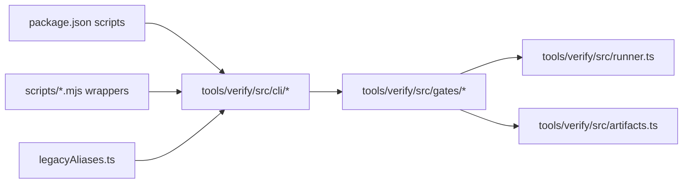
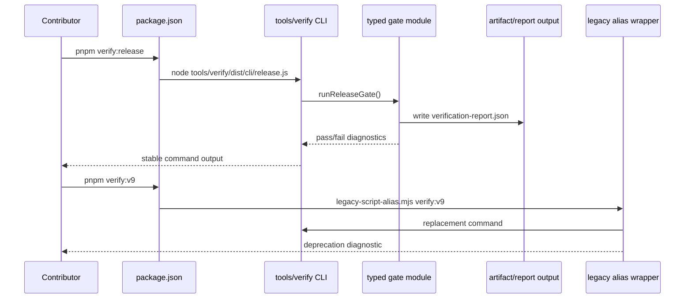

# Verification Gates and Package Scripts Reorg

Complexity: 6 -> MEDIUM mode

## 1. Context

**Problem:** Verification logic is split across a large flat `scripts/`
directory, a partially migrated `tools/verify` package, and an overloaded root
`package.json` script table, making it unclear where new gates belong and which
commands are stable contributor entry points.

**Files Analyzed:**

- `AGENTS.md`
- `package.json`
- `pnpm-workspace.yaml`
- `docs/PRDs/README.md`
- `docs/workflows/developer-workflow.md`
- `docs/PRDs/archive/cleanup-versioned-debt.md`
- `docs/PRDs/other/artifact-fixture-layout-reorg.md`
- `scripts/legacy-script-alias.mjs`
- `scripts/artifact-paths.mjs`
- `scripts/verify-conformance.mjs`
- `scripts/visual-calibration/analyze.test.mjs`
- `tools/verify/package.json`
- `tools/verify/src/index.ts`
- `tools/verify/src/runner.ts`
- `tools/verify/src/runTests.ts`
- `tools/verify/src/release.ts`
- `tools/verify/src/legacyAliases.ts`
- `tools/verify/src/cli/check-docs.ts`
- `tools/verify/src/cli/release.ts`

**Current Behavior:**

- `scripts/` contains 137 files across milestone gates, focused feature gates,
  docs checks, release scripts, shared helpers, and tests.
- Root `pnpm test` runs package tests and `node --test scripts/*.test.mjs`,
  which only covers root-level script tests and misses nested script tests such
  as `scripts/visual-calibration/analyze.test.mjs`.
- `tools/verify` already exists as a workspace package with typed source,
  package tests, CLI entry points, report helpers, artifact path helpers, and
  legacy alias support.
- The migration is incomplete: `tools/verify/src/release.ts` still imports
  `scripts/verify-v9.mjs`, while root `package.json` still exposes many direct
  `node scripts/verify-*.mjs` commands.
- `package.json` mixes stable contributor commands, release commands, legacy
  milestone aliases, focused capability gates, package-build plumbing, and
  one-off test shortcuts in one long script table.

## Pre-Planning Findings

**How will this reorg be reached?**

- [x] Entry point identified: root `pnpm` scripts such as `pnpm verify`,
  `pnpm verify:release`, `pnpm verify:conformance`, `pnpm check:docs`, focused
  `pnpm verify:<capability>` commands, and deprecated milestone aliases.
- [x] Caller file identified: `package.json` is the public command surface;
  `tools/verify/src/cli/*` should become the canonical implementation entry
  point; `scripts/*.mjs` should remain only as temporary compatibility wrappers.
- [x] Registration/wiring needed: new `tools/verify` CLI commands, root package
  script cleanup, legacy alias mappings, docs and `AGENTS.md` guidance, and test
  discovery updates.

**Is this user-facing?**

- [x] YES. Contributors and CI use the root `pnpm` script names. The
  implementation path is internal, but command stability and deprecation
  messages are user-visible.
- [ ] NO.

**Full user flow:**

1. Contributor runs `pnpm verify:release`, `pnpm verify:conformance`, or a
   focused capability gate.
2. Root `package.json` invokes a stable `tools/verify` CLI entry point.
3. The verify tool runs typed gate logic from `tools/verify/src/gates/*`.
4. The gate writes structured reports and artifact metadata to the canonical
   artifact owner path.
5. Legacy commands such as `pnpm verify:v9` still work through alias wrappers
   while printing deprecation diagnostics.

## 2. Solution

**Approach:**

- Make `tools/verify` the implementation home for all new verification gates,
  docs checks, artifact helpers, release aggregation, conformance orchestration,
  and verify-tool tests.
- Treat root `scripts/` as a compatibility layer only. New files under
  `scripts/` should be wrappers, repo maintenance shims, or temporary migration
  files with a planned deletion path.
- Reduce `package.json` to stable command groups:
  contributor commands, release commands, current capability gates, and legacy
  aliases. Move long command bodies into `tools/verify` CLIs.
- Preserve public command compatibility during the migration. Existing
  `pnpm verify:v*`, `pnpm check:docs:v*`, and focused `verify:v8:*`,
  `verify:v9:*`, `verify:v10:*` names should either keep working or emit clear
  deprecation diagnostics that point to the replacement.
- Fix root test discovery so verifier tests are run by the owning package, not
  by ad hoc globs over `scripts/*.test.mjs`.
- Add repo guidance in `AGENTS.md` and workflow docs so future agents and
  contributors know where to add gates.

**Key Decisions:**

- [x] `tools/verify` is the canonical gate implementation package.
- [x] `scripts/` remains temporarily, but new verification behavior should not
  be implemented there.
- [x] Root script names are a public interface. Clean up implementation paths
  without breaking common contributor commands.
- [x] Legacy milestone names are compatibility aliases, not the product front
  door.
- [x] Tests for verify tooling live with `tools/verify` and run through that
  package's test command.

**Data Changes:** None.

## 3. Sequence Flow

## 4. Execution Phases

#### Phase 1: Policy and Command Inventory - Contributors can see the target before files move.

**Files (max 5):**

- `AGENTS.md` - add the rule that new gates belong under `tools/verify`.
- `docs/workflows/developer-workflow.md` - document stable commands,
  compatibility aliases, and where gate implementations live.
- `docs/PRDs/README.md` - index this PRD as a current cleanup initiative.
- `package.json` - add temporary grouping comments only if JSON is not changed;
  otherwise no changes in this phase.
- `tools/verify/src/legacyAliases.ts` - inventory aliases that must remain
  compatible.

**Implementation:**

- [ ] Document `tools/verify/src/gates/*` as the target implementation path for
  new gates.
- [ ] Document `scripts/` as wrapper-only for verification behavior.
- [ ] Identify which root scripts are stable, deprecated, or internal plumbing.
- [ ] Define the compatibility window for legacy milestone aliases.

**Tests Required:**

| Test File | Test Name | Assertion |
| --- | --- | --- |
| `tools/verify/src/legacyAliases.test.ts` | `should list deprecated milestone commands with replacements` | Every legacy milestone alias has a canonical replacement and diagnostic text. |
| `tools/verify/src/docs.test.ts` | `should document canonical verify tool paths` | Workflow docs mention `tools/verify` as the gate implementation home and reject new-gate guidance pointing to `scripts/`. |

**User Verification:**

- Action: Read `AGENTS.md` and `docs/workflows/developer-workflow.md`.
- Expected: A contributor can determine whether to add a new gate under
  `tools/verify` or a temporary wrapper under `scripts/`.

#### Phase 2: Test Ownership - Verify-tool tests run from their owning package.

**Files (max 5):**

- `tools/verify/src/runTests.ts` - ensure recursive test discovery remains the
  single package-test path.
- `tools/verify/package.json` - include all verify-tool tests through package
  test discovery rather than manually named dist files.
- `package.json` - remove or narrow `node --test scripts/*.test.mjs` after
  migrated tests are owned by packages.
- `scripts/visual-calibration/analyze.test.mjs` - migrate to
  `tools/verify/src/visual-calibration/analyze.test.ts`.
- `scripts/visual-calibration/analyze.mjs` - migrate implementation or wrap the
  typed module.

**Implementation:**

- [ ] Move nested script tests that belong to verification tooling into
  `tools/verify/src`.
- [ ] Replace root-level script test glob with package-owned test commands.
- [ ] Keep root-level compatibility wrapper tests only while wrappers exist.
- [ ] Confirm `pnpm test` exercises nested verify-tool tests.

**Tests Required:**

| Test File | Test Name | Assertion |
| --- | --- | --- |
| `tools/verify/src/runTests.test.ts` | `should discover nested compiled test files` | Recursive discovery includes nested `*.test.js` files under `dist`. |
| `tools/verify/src/visual-calibration/analyze.test.ts` | existing visual calibration analyze tests | Migrated tests preserve current behavior. |

**User Verification:**

- Action: Run `pnpm --filter @threenative/verify-tools test` and `pnpm test`.
- Expected: Both commands include nested verify-tool tests and fail if one is
  broken.

#### Phase 3: Current Gate Migration - Active gates run from typed verify modules.

**Files (max 5 per vertical slice):**

- `tools/verify/src/gates/release.ts` - own release aggregation without
  importing `scripts/verify-v9.mjs`.
- `tools/verify/src/gates/conformance.ts` - own conformance orchestration or
  wrap a typed module.
- `tools/verify/src/cli/release.ts` - call typed release gate.
- `tools/verify/src/cli/conformance.ts` - add typed conformance CLI.
- `package.json` - route `verify:release` and `verify:conformance` through
  `tools/verify` CLIs.

**Implementation:**

- [ ] Move release gate behavior out of `scripts/verify-v9.mjs` and into typed
  `tools/verify` modules.
- [ ] Move conformance orchestration out of `scripts/verify-conformance.mjs` or
  make that file a thin wrapper over typed logic.
- [ ] Keep `pnpm verify:release` and `pnpm verify:conformance` stable.
- [ ] Ensure reports still write to existing canonical artifact paths.

**Tests Required:**

| Test File | Test Name | Assertion |
| --- | --- | --- |
| `tools/verify/src/release.test.ts` | `should run release gate without importing scripts implementation` | The release module depends on typed verify-tool modules, not `scripts/verify-v9.mjs`. |
| `tools/verify/src/conformance.test.ts` | existing conformance tests | Conformance fixture catalog and aggregate gate behavior are preserved. |

**User Verification:**

- Action: Run `pnpm verify:release -- --json` and `pnpm verify:conformance` on a
  machine with the required toolchains.
- Expected: Commands preserve exit codes, diagnostics, and report paths.

#### Phase 4: Package Script Cleanup - The root script table is readable and stable.

**Files (max 5):**

- `package.json` - collapse long inline command bodies into verify-tool CLIs and
  group retained commands by purpose.
- `tools/verify/src/cli/run.ts` - optional generic CLI dispatcher for focused
  gates if repeated root scripts remain noisy.
- `tools/verify/src/legacyAliases.ts` - route deprecated commands to canonical
  replacements.
- `docs/STATUS.md` - update contributor gate names if the public names change.
- `docs/bevy-feature-parity.md` - update evidence anchors if public names
  change.

**Implementation:**

- [ ] Keep stable top-level commands: `build`, `typecheck`, `lint`, `test`,
  `verify`, `verify:all`, `check:names`, `check:docs`, `verify:release`, and
  `verify:conformance`.
- [ ] Route focused capability gates through `tools/verify` instead of long
  inline shell chains where practical.
- [ ] Move command composition into typed CLIs so root `package.json` expresses
  names, not implementation detail.
- [ ] Keep legacy milestone scripts as aliases until docs and CI no longer
  depend on them.

**Tests Required:**

| Test File | Test Name | Assertion |
| --- | --- | --- |
| `tools/verify/src/legacyAliases.test.ts` | `should preserve public legacy package scripts` | Deprecated `verify:v*` and `check:docs:v*` scripts route to a canonical command or wrapper. |
| `tools/verify/src/docs.test.ts` | `should require stable contributor gates` | Docs mention the current stable gate names and avoid promoting milestone aliases as the front door. |

**User Verification:**

- Action: Run `pnpm run` and inspect the root scripts.
- Expected: The stable commands are obvious, deprecated commands remain
  available, and long implementation chains are not duplicated in many script
  entries.

#### Phase 5: Wrapper Retirement - `scripts/` no longer owns active gate logic.

**Files (max 5 per slice):**

- `scripts/*.mjs` - convert migrated gates to thin wrappers or delete after
  compatibility expires.
- `tools/verify/src/legacyAliases.ts` - remove aliases once no longer
  supported.
- `docs/PRDs/archive/cleanup-versioned-debt.md` - mark retired milestone alias
  work complete.
- `docs/workflows/developer-workflow.md` - remove temporary migration notes.
- `AGENTS.md` - keep only the durable new-gate path guidance.

**Implementation:**

- [ ] For each migrated gate, leave either a wrapper with a deprecation
  diagnostic or remove the script after documented compatibility expires.
- [ ] Add a docs or names check that rejects new active gate implementation files
  under `scripts/`.
- [ ] Remove stale root package scripts that no longer have documented users.

**Tests Required:**

| Test File | Test Name | Assertion |
| --- | --- | --- |
| `tools/verify/src/docs.test.ts` | `should reject new active verify implementations under scripts` | New-gate guidance and checks prevent adding verifier logic to `scripts/`. |
| `tools/verify/src/legacyAliases.test.ts` | `should only list supported aliases` | Removed aliases are absent and supported aliases still route correctly. |

**User Verification:**

- Action: Try one current gate and one supported legacy alias.
- Expected: Current gate runs through `tools/verify`; supported legacy alias
  prints a deprecation diagnostic and exits with the same status as its target.

## 5. Checkpoint Protocol

Each phase must be reviewed before the next one starts:

- Run the narrow tests listed in the phase.
- Run `pnpm --filter @threenative/verify-tools test` for changes under
  `tools/verify`.
- Run `pnpm check:docs` when docs, `AGENTS.md`, or public command names change.
- Run `pnpm test` after changing root test discovery or package script routing.
- Run `pnpm verify:release` only after migrating release aggregation or root
  release command wiring.

## 6. Verification Strategy

- Unit tests cover alias resolution, CLI dispatch, recursive test discovery,
  report shape, and docs checks.
- Integration tests cover root command routing for `check:docs`,
  `verify:release`, and `verify:conformance`.
- Compatibility checks prove deprecated milestone aliases preserve exit status
  and print actionable replacement diagnostics.
- Report validation confirms migrated gates keep writing the same canonical
  artifact paths unless this PRD explicitly changes the path.

## 7. Acceptance Criteria

- [ ] `AGENTS.md` and workflow docs state that new gates belong under
  `tools/verify`, not `scripts/`.
- [ ] Root `package.json` clearly separates stable contributor commands from
  compatibility aliases and no longer contains repeated long command bodies for
  migrated gates.
- [ ] `pnpm test` runs verify-tool tests through package ownership and does not
  silently skip nested verify tests.
- [ ] `pnpm verify:release`, `pnpm verify:conformance`, and current focused
  capability gates keep working.
- [ ] Legacy milestone aliases either work with deprecation diagnostics or are
  removed only after docs and CI references are updated.
- [ ] Active verification logic lives under `tools/verify/src`; `scripts/`
  contains only wrappers, compatibility shims, or non-verification maintenance
  scripts with explicit ownership.
