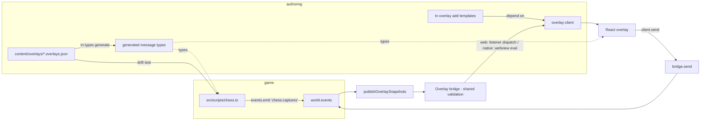
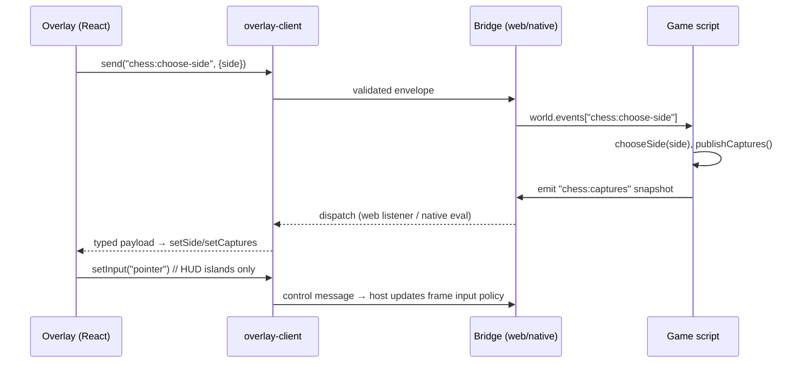

# PRD: React Overlay System Improvements

- **Date:** 2026-07-12 (v2 — updated for the `tn overlay add` scaffold landing)
- **Status:** Complete
- **Complexity:** 9 → HIGH mode (10+ files, multi-package, new client library, web + native runtimes)
- **Origin:** Inspection of `examples/chess/overlay` and the overlay stack it exercises
  (V8-05 follow-up; see `docs/PRDs/done/v8/V8-05-optional-react-webview-overlay.md`)
- **Related:** `docs/PRDs/other/tailwind-default-react-webview-overlay-scaffold.md`
  (implemented in the working tree; this PRD builds on it)

---

## 1. Context

**Problem:** The chess overlay works on web, but only via hacks that reveal missing
engine capabilities: a 100 ms poll of a diagnostics-only global, hand-rolled pointer
and keyboard relays into `window.parent`, an undocumented `:` ↔ `.` event-name
translation, and a desktop bridge that cannot deliver game state to overlays at all.
The new `tn overlay add` scaffold multiplies the blast radius: every scaffolded
overlay now starts from a template that shares these gaps.

**Files analyzed:**

- `examples/chess/overlay/chess-side-select/src/App.tsx`, `bridge.ts`, `main.tsx`
- `examples/chess/content/overlays/chess.overlays.json`
- `examples/chess/src/scripts/chess.ts` (lines 32–34, 203–335)
- `packages/runtime-web-three/src/overlay/host.ts`, `overlay/bridge.ts`
- `packages/runtime-web-three/src/render.ts:383-409`
- `packages/runtime-web-three/src/browser/main.ts:56-68` (`__THREENATIVE_RUNTIME__`)
- `packages/ir/src/overlays.ts`, `packages/sdk/src/overlay.ts`,
  `packages/compiler/src/overlay/emit.ts`, `packages/compiler/src/emit/capabilities.ts`
- `packages/cli/src/commands/overlayAdd.ts`, `packages/cli/src/overlays/scaffoldRegistry.ts`,
  `packages/cli/src/overlays/templates/{shared,tailwind,vanilla}`
- `tools/verify/src/overlayScaffoldGate.ts`
- `docs/cookbook/react-webview-overlay.md`, `docs/contracts/ui.md`
- `runtime-bevy/crates/threenative_runtime/src/overlay.rs`, `overlay_host.rs`

**Current behavior (data flow):**

- Game script emits `chess.captures` → `render.ts:402` renames dots→colons →
  `bridge.publish` (schema-validated, 64-entry snapshot queue) → `host.publish`
  dispatches to iframe `subscribe` listeners.
- Overlay calls `threenativeOverlayBridge.send("chess:choose-side", …)` →
  `render.ts:392` renames colons→dots → appended to `world.events["chess.choose-side"]`.
- Overlay declaration lives in `content/overlays/chess.overlays.json`; compiler emits
  `overlays.ir.json`, copies `overlay/<name>/dist/**`, and now fails fast on missing
  or stale compiled entries; capabilities derived in `capabilities.ts:165-180`
  (claims `overlay:target.desktop`).
- Desktop: WRY webview per overlay; injected bridge has **`send` only** —
  `overlay_host.rs:246-285` never injects `subscribe`.
- New: `tn overlay add <name> [--style tailwind|vanilla]` scaffolds
  `overlay/<name>/` from `OVERLAY_SCAFFOLD_REGISTRY`, registers a
  `build:overlay:<name>` script, and updates the overlay manifest; the
  `overlay-scaffold` verify gate builds both styles end to end.

## 1a. Developments since v1 (2026-07-12 working tree)

Landed (uncommitted) work that changes this PRD's baseline:

- **Scaffold system:** `tn overlay add` with a registry-derived descriptor
  (`scaffoldRegistry.ts`), Tailwind-default and vanilla presets, transactional
  file staging, per-overlay build scripts, and the `overlayScaffoldGate` verify
  gate. This satisfies the "registry owns the truth" repo rule for scaffolding.
- **Build hygiene fixed:** `emitStructuredOverlays` now throws
  `TN_OVERLAY_BUILD_ENTRY_MISSING` / `TN_OVERLAY_BUILD_ENTRY_STALE` when
  `overlay/<name>/dist` is absent or older than its source — the stale-dist
  footgun is closed without this PRD.
- **Docs:** `docs/contracts/ui.md` now states the retained-UI vs overlay
  decision rule and source-ownership split; `docs/cookbook/react-webview-overlay.md`
  documents the scaffold → install → build → prove loop.
- **Chess overlay rewritten:** moved to `overlay/chess-side-select/`, Tailwind
  styling, `React.StrictMode`, and a `bridge.ts` wrapper module.
- **Better host tests:** `host.test.ts` now covers bridge-ready dispatch and
  overlay→game schema rejection against a built React entry.

What did **not** change: `render.ts`, `overlay/host.ts`, the web bridge, and both
native Rust files are untouched, so every engine-level finding below still stands,
and the chess rewrite carried its hacks (poller, relays, dead Settings) forward
into the new files.

---

## 2. Findings

### Bugs (updated line references)

| # | Status | Finding |
| --- | --- | --- |
| B1 | Open | **Desktop HUD is dead.** Native bridge injects only `send`; game→overlay snapshots never reach the overlay (`overlay_host.rs:246-285`). Chess HUD captures/side never update on `--target desktop`, yet the manifest claims `targetProfiles: ["web","desktop"]` and the compiler emits `overlay:target.desktop` (`capabilities.ts:165-180`). |
| B2 | Open | **Overlay polls a diagnostics global as a data channel.** `App.tsx:108-119` reads `window.parent.__THREENATIVE_RUNTIME__.resourceSnapshot("ChessGame")` every 100 ms. That global is the CLI proof/playtest hook (`browser/main.ts:56`), not a game API; it does not exist in the desktop webview; it races with the bridge path (two writers to the same React state) and violates the source boundary. |
| B3 | Open | **Hand-rolled input relay.** `relayPointer` (`App.tsx:10-16`) and the keyboard forwarder (`App.tsx:50-57`) synthesize events onto `window.parent`. Incomplete (no `pointercancel`, `wheel`, `movementX/Y`, modifier keys) and a silent no-op on desktop. Root cause: `input: "modal"` makes the iframe swallow all input forever (`host.ts:56-58`) with no pass-through or runtime input-mode change. |
| B4 | Open | **"Keyboard: W for White · B for Black" hint is broken while the overlay has focus.** `SideChooser` (`App.tsx:80-92`) forwards no keyboard events (only `GameHud` does), and modal input captures iframe focus, so `context.input.getButtonDown("choose-white")` in `chess.ts:324` never fires. |
| B5 | Open | **Hidden `:` ↔ `.` name translation with no drift guard.** Scripts declare `eventWrites: ["chess.captures"]` while the manifest declares `chess:captures`; the only link is `replaceAll` in `render.ts:392,402`. Nothing validates the pair — a typo in either file fails silently. Violates the repo rule that paired surfaces need derivation or a drift test. |
| B6 | Open | **Settings modal is dead UI.** Sound/highlight toggles mutate local React state and send nothing to the game (`App.tsx:30-45`); no `overlayToGame` message exists for them. |
| B7 | Open | **`dismiss` is a magic payload flag.** `host.ts:99` hides the frame when any accepted message carries `dismiss === true`; the schema therefore requires `dismiss` in `chess:choose-side` even though chess always sends `false` and the game script ignores it (`chess.ts:320-323`). Visibility is a bridge concern smuggled into every message contract. |
| B8 | Open | **Web/native validation parity drift.** Web enforces a 16 KB limit on overlay→game only (`bridge.ts:26,62`); the native bridge (`overlay.rs:59-164`) reimplements validation with no visible size limit, and game→overlay payloads are unbounded on both. Two hand-maintained validators for one schema. |
| B9 | Open | **No ack / stale-side edge.** Overlay sets `side` optimistically on `send` success (`App.tsx:120`); success means "queued", not "applied". `R` (restart) keeps `playerColor`, so overlay and game can never return to the side chooser — perhaps intentional, but unstated. |
| B10 | Open | **`newAudioEvents` reused as the overlay snapshot cursor helper** (`render.ts:400`) — misleading name, audio-flavored SRP leak into overlay publishing. |
| B11 | Fixed | ~~Stale/missing `dist` silently bundled.~~ Closed by `TN_OVERLAY_BUILD_ENTRY_MISSING` / `TN_OVERLAY_BUILD_ENTRY_STALE` in `compiler/src/overlay/emit.ts`. |

### New findings from the scaffold landing

| # | Finding |
| --- | --- |
| N1 | **The shared scaffold bridge template is send-only.** `packages/cli/src/overlays/templates/shared/src/bridge.ts` types `threenativeOverlayBridge` without `subscribe`, so every scaffolded overlay can send but cannot receive game snapshots until the author hand-extends the template — the most common overlay need (HUD reflecting game state) is unscaffolded. |
| N2 | **Template/consumer divergence already happened.** Chess's `bridge.ts` added `subscribe` + the bridge-ready reconnect dance, diverging from the shared template on day one. Two hand-maintained copies of the bridge wrapper is exactly the "second adapter list" smell the repo rules forbid — the wrapper should be a real package both the scaffold and chess depend on. |
| N3 | **Dead null-check after dereference.** `App.tsx:110-113` reads `snapshot?.playerSideText` and then checks `if (snapshot === undefined) return;` two lines later — unreachable; leftover from the rewrite. |
| N4 | **Scaffold registry pins its own React/Vite versions** (`scaffoldRegistry.ts:23-29`) while `examples/chess/package.json` was hand-edited to match (vite `^7.3.5`, tailwind `^4.1.14`). No test asserts the chess example stays in lockstep with the registry it is supposed to exemplify. |

### Design smells (KISS / DRY / SRP)

- **S1 — Boilerplate every overlay must copy** (partially improved): the scaffold
  now owns `main.tsx`/`bridge.ts`, but the bridge-ready listener + resubscribe
  dance (`App.tsx:97-107`) and untyped `Record<string, unknown>` payload guards
  (`App.tsx:99-103`) still live in app code. None of this is game-specific.
- **S2 — Untyped contract:** `chess.overlays.json` declares message schemas, but
  neither the game script nor the overlay gets generated types; both sides
  re-validate by hand. `tn types generate` already exists as the codegen home.
- **S3 — Snapshot semantics are implicit:** `subscribe` replays up to 64 retained
  envelopes (`host.ts:104`) then live-dispatches; combined with B2's poller the
  same state has three delivery paths.
- **S4 — Overlay layout hardcoded in the host:** non-modal frames are pinned to a
  242×207 top-right rect in `host.ts:76-83` (duplicated in the `overlay_host.rs`
  init script) instead of being declared per overlay.

---

## 3. Solution

**Approach:**

- Ship a tiny typed overlay client (`@threenative/overlay-client`) so overlay
  authors never touch the raw bridge, window globals, or bridge-ready events —
  and make the **scaffold templates depend on it**, eliminating the template/
  consumer divergence (N1/N2) at the root.
- Make the message contract single-sourced: one canonical name per message,
  types generated from `*.overlays.json` for both game scripts and overlay code,
  plus a drift test between script `eventReads/Writes` and overlay manifests.
- Bring desktop to parity: implement `subscribe` delivery over the WRY IPC/eval
  channel; delete the chess poller.
- Replace input hacks with engine capabilities: runtime input-mode switching and
  a first-class show/hide API replacing the `dismiss` payload flag.
- Keep the chess overlay as the reference implementation (remove poller, relays,
  dead Settings UI or wire it up) and keep it in lockstep with the scaffold
  registry via a consistency test (N4).

**Architecture:**

**Key decisions:**

- [x] New `@threenative/overlay-client` package — no deps, wraps bridge-ready
      wait, subscribe replay dedupe, typed send/subscribe. The scaffold's shared
      `bridge.ts`/`main.tsx` templates and chess both consume it.
- [x] Canonical message names: keep the colon form (`chess:captures`)
      everywhere, including `context.events.emit`/`read`; delete the
      `replaceAll` translation after a deprecation shim that still routes dotted
      names and logs a diagnostic.
- [x] One schema validator: extract payload validation into `packages/ir`
      (already owns `IOverlayMessageSchema`) with shared JSON test vectors run
      by both `pnpm test` and cargo tests to keep the Rust port honest.
- [x] Visibility: add `setVisible(overlayId, visible)` on the host plus an
      `overlay:visibility` control message; drop the `dismiss` payload
      convention (shim + deprecation diagnostic).
- [x] Input: runtime `client.setInput(mode)` control message (host adjusts
      `pointerEvents`/focus, native adjusts input policy). Pointer pass-through
      by hit-testing stays deferred (YAGNI — chess only needs
      modal → pointer-islands after side selection).

**Data changes:** `threenative.overlays` schema version bump `0.1.0 → 0.2.0`
(optional `layout` rect for non-modal overlays fixing S4; `dismiss` no longer
special). Backward compatible: 0.1.0 files still load; dismiss shim logs a
deprecation diagnostic.

---

## 4. Sequence flow (target state, side selection)

The overlay stops assuming its `send` succeeded; it renders the HUD when the
first `chess:captures` snapshot confirms the side (removes B9's optimistic path —
snapshot replay makes this instant on reconnect).

---

## 5. Integration points checklist

**How is this reached?**

- Entry point: existing overlay mount path (`render.ts:383` web,
  `mount_native_overlay_webviews` desktop) and the `tn overlay add` scaffold
  path for new overlays. No new entry points.
- Callers: `render.ts` (host + event pump), `chess.ts` (game script),
  `App.tsx` (overlay UI), `scaffoldRegistry.ts` templates,
  `tn types generate` (codegen).
- Wiring: overlay-client published, added to `examples/chess/package.json` and
  to `OVERLAY_SCAFFOLD_REGISTRY` dependencies; drift test registered in the
  conformance suite; scaffold changes covered by the existing
  `overlayScaffoldGate`.

**User-facing?** YES — the chess overlay UI itself (side chooser, HUD, settings)
is the visible surface, plus the scaffold output every future overlay author
starts from; engine changes are proven through both on web and desktop.

**Full user flow:** player launches chess (web or desktop) → side chooser
overlay → click/keyboard choice → HUD shows live captures on **both** targets →
settings toggles actually affect the game (or are removed) → `R` restart keeps
HUD coherent. Author flow: `tn overlay add hud` → generated code already
subscribes to typed snapshots with zero bridge boilerplate.

---

## 6. Execution phases

### Phase 1: Shared schema validation + parity conformance — desktop and web reject/accept identical payloads

**Files (≤5):**

- `packages/ir/src/overlays.ts` — export `validateOverlayPayload` (move from bridge)
- `packages/runtime-web-three/src/overlay/bridge.ts` — consume shared validator; apply size limit to both directions
- `runtime-bevy/crates/threenative_runtime/src/overlay.rs` — add size limit; align diagnostics
- `packages/conformance/…` (fixtures) — shared JSON accept/reject vectors
- `packages/runtime-web-three/src/overlay/host.test.ts` — update

**Tests:**

| Test file | Name | Assertion |
| --- | --- | --- |
| `packages/ir/src/overlays.test.ts` | `should reject payload over 16KB when direction is gameToOverlay` | `valid === false`, diagnostic code |
| conformance fixture runner | `should produce identical verdicts when web and native validate shared vectors` | verdict parity |

**Verification plan:** `pnpm test`, `cargo test -p threenative_runtime`,
`pnpm verify:conformance`. Checkpoint: prd-work-reviewer.

### Phase 2: Canonical names + drift test — a manifest/script mismatch fails CI instead of failing silently

**Files (≤5):**

- `packages/runtime-web-three/src/render.ts` — emit/read colon names natively; dotted-name shim + `TN_OVERLAY_NAME_DEPRECATED` diagnostic; stop reusing `newAudioEvents` for overlay cursoring (B10)
- `packages/compiler/src/…` (drift check) — validate script `eventReads/Writes` against overlay manifests at build
- `examples/chess/src/scripts/chess.ts` — switch to `chess:captures` / `chess:choose-side`
- `docs/status/capabilities/…` (owning capability file) — document naming rule
- test file for the drift check

**Tests:** `should fail build when script writes an event declared by no overlay
message`; `should route dotted legacy names with deprecation diagnostic`.

**Verification plan:** `pnpm build && pnpm verify:conformance`; chess:
`pnpm iterate` clean. Checkpoint: prd-work-reviewer.

### Phase 3: `@threenative/overlay-client` — chess overlay uses a typed client, poller deleted (web)

**Files (≤5):**

- `packages/overlay-client/src/index.ts` (+ package scaffolding) — `createOverlayClient<GtoO, OtoG>()`: bridge-ready wait, replay dedupe by sequence, `send`, `subscribe(type, handler)`
- `packages/cli/src/…/types` — `tn types generate` emits message payload types from `*.overlays.json`
- `examples/chess/overlay/chess-side-select/src/App.tsx` — migrate; **delete** the `__THREENATIVE_RUNTIME__` poller (B2), the optimistic `setSide` (B9), and the dead `snapshot === undefined` check (N3)
- `examples/chess/overlay/chess-side-select/src/bridge.ts` — delete (replaced by the client)
- `packages/overlay-client/src/index.test.ts`

**Tests:** `should deliver retained snapshot exactly once when bridge becomes
ready after subscribe`; `should type-error when sending undeclared message`
(typecheck fixture).

**User verification (manual, UI):** `pnpm dev:web` in `examples/chess` — choose
side, capture a piece, HUD updates; reload mid-game, HUD restores from replay.
Checkpoint: prd-work-reviewer + manual.

### Phase 4: Scaffold integration — `tn overlay add` output subscribes with zero boilerplate

**Files (≤5):**

- `packages/cli/src/overlays/templates/shared/src/bridge.ts` → replace with an
  overlay-client-based `client.ts` template (fixes N1/N2)
- `packages/cli/src/overlays/scaffoldRegistry.ts` — add `@threenative/overlay-client`
  to scaffold dependencies; version-lockstep constant
- `packages/cli/src/commands/overlayAdd.test.ts` — update expectations
- `docs/cookbook/react-webview-overlay.md` — show typed subscribe in the recipe
- new consistency test asserting `examples/chess` dependency versions match
  `OVERLAY_SCAFFOLD_REGISTRY` (N4)

**Tests:** scaffold snapshot test showing generated `App.tsx` receives a typed
snapshot; registry/chess lockstep test.

**Verification plan:** `pnpm verify:smoke` (or the `overlay-scaffold` gate
directly) — both styles scaffold, install, build. Checkpoint: prd-work-reviewer.

### Phase 5: Desktop subscribe parity — captures HUD works on `--target desktop`

**Files (≤5):**

- `runtime-bevy/crates/threenative_runtime/src/overlay_host.rs` — inject `subscribe` in the init script; deliver snapshots via `webview.evaluate_script`; replay retained queue on load
- `runtime-bevy/crates/threenative_runtime/src/overlay.rs` — expose drain-for-delivery
- `packages/compiler/src/emit/capabilities.ts` — gate `overlay:target.desktop` on actual support if parity can't land whole; otherwise no change
- Rust test file

**Tests:** `should enqueue evaluate_script for each published snapshot when
overlay targets desktop`; replay-on-load test.

**User verification (manual):** `pnpm playtest:native` scenario extended to
assert HUD text; run the desktop build, verify captures update.
Checkpoint: prd-work-reviewer + manual.

### Phase 6: Input + visibility API — chess drops all `window.parent` hacks

**Files (≤5):**

- `packages/runtime-web-three/src/overlay/host.ts` — `setVisible`; handle `overlay:set-input` control message (swap `pointerEvents`, blur iframe on pointer loss); remove `dismiss` magic (shim + diagnostic)
- `runtime-bevy/crates/threenative_runtime/src/overlay_host.rs` — same control messages on input policy
- `packages/overlay-client/src/index.ts` — `setInput`, `setVisible`
- `examples/chess/overlay/chess-side-select/src/App.tsx` — after side confirmed: `setInput("pointer")` + CSS pointer islands; delete `relayPointer` and the keyboard forwarder (B3); forward W/B via `send` from `SideChooser` keydown (B4); wire Settings toggles to a `chess:settings` message or delete the modal (B6)
- `examples/chess/content/overlays/chess.overlays.json` — schema 0.2.0, drop `dismiss`, add `chess:settings` if kept

**Tests:** host unit tests for input-mode transitions and visibility;
overlay-client contract test.

**User verification (manual):** web + desktop — during HUD, board is fully
clickable/drag-droppable with **zero** synthesized events; keyboard W/B works on
the chooser; settings toggles observably change game behavior or the modal is
gone. Checkpoint: prd-work-reviewer + manual.

---

## 7. Acceptance criteria

- [x] All six phases complete; all listed tests pass.
- [x] `pnpm check:docs && pnpm build && pnpm typecheck && pnpm test && pnpm verify:conformance && pnpm verify:smoke` pass at repo root.
- [x] `examples/chess`: `pnpm iterate` clean; `pnpm playtest` and `pnpm playtest:native` scenarios pass, native scenario asserting HUD captures text.
- [x] `examples/chess/overlay/chess-side-select/src/**` contains no reference to `window.parent`, `__THREENATIVE_RUNTIME__`, or synthesized `PointerEvent`/`KeyboardEvent`.
- [x] `tn overlay add` output (both styles) receives a typed game snapshot with no hand-written bridge code; the `overlay-scaffold` gate passes.
- [x] A deliberate mismatch between script event names and the overlay manifest fails `pnpm verify:conformance` (drift guard for B5).
- [x] Web and native validate the shared conformance vectors identically (B8).
- [x] Chess example dependency versions match `OVERLAY_SCAFFOLD_REGISTRY` and a test enforces it (N4).
- [x] Capability docs updated: the owning `docs/status/capabilities/*.md` file + `docs/STATUS.md` index line; `docs/bevy-feature-parity.md` updated for desktop overlay snapshot parity (B1).
- [x] On completion, move this PRD to `docs/PRDs/done/`.

## 8. Out of scope (YAGNI)

- Pointer hit-test pass-through (simultaneous overlay+game pointer in one region).
- Mobile overlay targets.
- Overlay hot-reload during `tn dev`.
- Multi-overlay z-order/focus arbitration beyond current sort.
- Additional scaffold styles beyond tailwind/vanilla.
