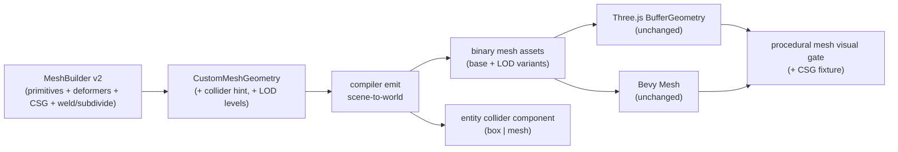
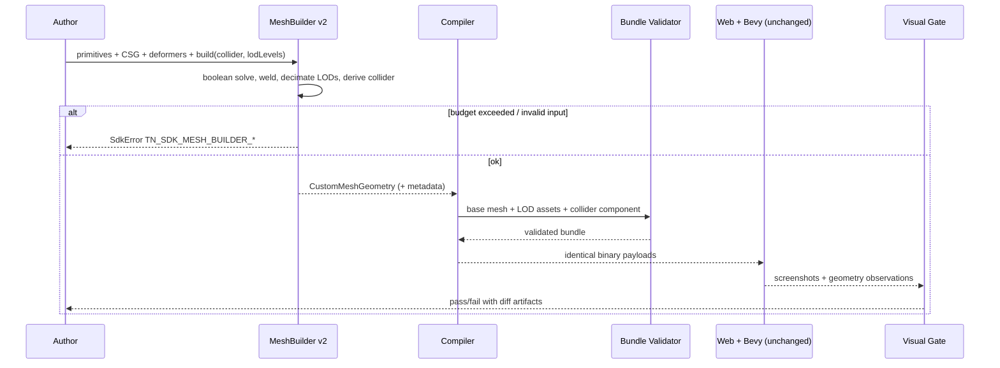

# Procedural Geometry V2: Compile-Time Generation Pushed Further

Complexity: 9 -> HIGH mode

Date: 2026-07-11
Status: COMPLETE
Predecessors: `docs/PRDs/done/v8/V8-04-portable-procedural-mesh-authoring.md`,
`docs/PRDs/done/proof-first-engine-loop-2026-07-05/PRD-006-believable-world-terrain-and-biome-dressing.md`

## Context

**Problem:** The `MeshBuilder` pipeline proved portable static procedural
meshes end-to-end (SDK -> binary bundle payloads -> identical web/Bevy
rendering), but the authoring vocabulary is too thin to build interesting
props without hand-authored `raw()` data: no booleans (CSG), no coherent
noise, no torus/plane/prism/rounded-box, no vertex welding or subdivision, no
derived colliders, and no compile-time LOD levels even though LOD selection is
already a promoted contract.

**Files Analyzed:**
`packages/sdk/src/geometry/meshBuilder.ts`,
`packages/sdk/src/geometry/meshBuilderParts.ts`,
`packages/sdk/src/geometry/meshBuilderOrganic.ts`,
`packages/sdk/src/geometry/primitives.ts`,
`packages/ir/src/types.ts` (custom mesh asset union ~776-870, collider
component ~487-510), `packages/ir/src/assetValidation.ts`,
`packages/compiler/src/emit/scene-to-world.ts` (custom mesh handling ~206-223),
`packages/compiler/src/emit/terrain.ts`,
`packages/runtime-web-three/src/mapWorld.ts` (~852-929),
`runtime-bevy/crates/threenative_runtime/src/map_world/rendering.rs` (~234-747),
`runtime-bevy/crates/threenative_loader/src/generated_mesh.rs`,
`packages/cli/src/verify/proceduralMeshVisual.ts`,
`packages/ir/fixtures/conformance/procedural-mesh/`,
`docs/bevy-feature-parity.md`, `docs/status/advanced-features-roadmap.md`,
`docs/contracts/sdk.md`.

**Current Behavior:**

- `MeshBuilder` supports 11 shape sources (box, sphere, icosphere, cylinder,
  cone, capsule, lathe, tubeAlongCurve, extrudeShape, parametric, raw) plus
  merge, and 4 deformers (noise, bend, twist, taper). `noise()` is
  uncorrelated per-vertex jitter along normals, not coherent noise, so it
  cannot produce believable rock/terrain-like surfaces.
- Built geometry always lowers to a static `primitive: "custom"` mesh asset
  with binary attribute/index payloads; both runtimes reconstruct it
  identically, and the screenshot gate (`verify-v8-procedural-mesh`) proves
  parity. Any compile-time generation improvement therefore ships to both
  runtimes with zero runtime work.
- CSG/boolean meshes and shader/storage-buffer geometry are P3 diagnostic
  boundaries in `docs/bevy-feature-parity.md`; runtime deformation and
  streaming are P2 boundaries. Those runtime boundaries stay untouched here.
- Colliders for procedural props must be hand-authored; IR already supports
  `kind: "mesh"` colliders with bounds and triangle count and primitive
  collider kinds, but nothing derives them from built geometry.
- LOD group semantics and selection traces are already promoted, but nothing
  generates decimated LOD levels from a procedural mesh.
- Organic helper library is 4 recipes (stylizedTree, pineTree, mushroom,
  rock) in `meshBuilderOrganic.ts`, not registry-owned.

## Integration Points

**How will this feature be reached?**

- [x] Entry point identified: TypeScript SDK authoring (`MeshBuilder` chain
  methods, `build()` options, helper functions), same as V8-04. No new CLI
  command; existing `tn` authoring plus compiler bundle emission carry the
  output.
- [x] Caller file identified: user project `src/scripts/**/*.ts` and SDK
  helper recipes call `MeshBuilder`; `packages/compiler/src/emit/scene-to-world.ts`
  consumes the resulting `CustomMeshGeometry`; collider metadata is consumed
  by the same emission path that writes entity physics components.
- [x] Registration/wiring needed: SDK public exports in
  `packages/sdk/src/index.ts` geometry surface, helper registry, conformance
  fixture enrollment (`packages/ir/fixtures/conformance/fixture-catalog.json`),
  visual gate fixture, `docs/contracts/sdk.md`, capability status docs.

**Is this user-facing?** Yes (developer/agent-facing authoring API). There is
no GUI; the "UI" is the SDK contract plus `tn` verification output, matching
the existing authoring surface. Marked internal-tooling-facing per repo
convention.

**Full user flow:**

1. Author writes e.g.
   `MeshBuilder.create("prop.arch").box(...).subtract(b => b.cylinder(...))
   .coherentNoise({...}).weld().build({ collider: "convex-hull", lodLevels: 2 })`.
2. Scene capture lowers the built geometry through the existing compiler path
   into binary custom-mesh assets, plus derived collider metadata and LOD
   variant assets.
3. Web Three.js and native Bevy load the identical bundle payloads exactly as
   today (no runtime changes).
4. Author proves the result with existing gates: unit tests, conformance
   fixtures, and the procedural mesh screenshot parity gate extended with a
   CSG+noise fixture.

## Solution

**Approach:**

- Keep everything author-time/compile-time. All new operations run inside
  `MeshBuilder` in pure deterministic TypeScript and still emit the existing
  static custom-mesh asset contract, so web/Bevy parity is inherited, not
  re-proven per feature (except one new visual fixture as evidence).
- Expand the primitive vocabulary (torus, plane/grid, prism, roundedBox) and
  the deformer/topology vocabulary (coherent seeded FBM noise, weld,
  subdivide, mirror).
- Add BSP-based CSG booleans (`union`, `subtract`, `intersect`) operating on
  the builder's accumulated parts, with budget enforcement and determinism
  tests. This converts the "CSG" parity row from diagnostic-only to
  "promoted at compile time, runtime CSG still deferred".
- Derive colliders from built geometry via a `build({ collider })` option
  (box-fit from bounds, or mesh collider with triangle count) using the
  existing `IColliderComponent` kinds -- no IR schema change.
- Generate compile-time LOD levels via deterministic vertex-clustering
  decimation, emitted as additional mesh assets wired to the already-promoted
  LOD group contract.
- Grow the helper library into a registry-owned catalog so CLI/docs/fixtures
  derive from one source of truth per repo work rules.

**Explicitly out of scope (existing documented boundaries stay):** runtime
vertex mutation, deformable meshes, terrain streaming/paging, GPU
compute/storage-buffer geometry, frame-by-frame generation, non-triangle
topology.

**Key Decisions:**

- [x] Pure-TS deterministic implementations only (no native/wasm CSG deps);
  same inputs + seed must produce byte-identical binary payloads across runs
  (existing scene-to-world determinism tests extended to the new ops).
- [x] CSG uses a BSP triangle-soup algorithm (csg.js-style) bounded by the
  existing vertex budgets; CSG output runs through `weld()` +
  normal recalculation so downstream validation invariants hold.
- [x] Collider derivation reuses `IColliderComponent` kinds `box` and `mesh`
  (`packages/ir/src/types.ts:494`); a true `convex-hull` collider kind is
  deferred unless Phase 4 shows both Rapier adapters already accept it via
  the `mesh` path.
- [x] LOD levels use the generated scene-mesh LOD contract delivered by the
  explicitly split follow-up PRD.
- [x] Helper recipes move behind a registry object that owns id, seed
  defaults, budget class, and fixture enrollment; drift tests derive from it.
- [x] Error-handling: all new ops validate inputs with `SdkError` codes in
  the existing `TN_SDK_MESH_BUILDER_*` namespace; no silent clamping except
  where the current API already clamps.

**Data Changes:** None to IR schemas expected. `CustomMeshGeometry` gains
optional generation metadata fields (collider hint, LOD level descriptors)
consumed by the compiler; emitted assets remain the existing custom-mesh
shape. If Phase 4/5 require any manifest field, it must be optional and
backwards compatible, mirroring the V8-04 binary payload extension pattern.

## Sequence Flow

## Execution Phases

#### Phase 1: Primitive Expansion - Authors can build props with torus, plane/grid, prism, and roundedBox

**Files (max 5):**

- `packages/sdk/src/geometry/meshBuilderParts.ts` - `makeTorus`, `makePlane`,
  `makePrism`, `makeRoundedBox` generators (analytic normals + UVs, matching
  existing generator style)
- `packages/sdk/src/geometry/meshBuilder.ts` - `.torus()`, `.plane()`,
  `.prism()`, `.roundedBox()` chain methods with option interfaces and
  validation
- `packages/sdk/src/geometry/primitives.test.ts` - generator-level tests
- `packages/sdk/src/geometry/meshBuilder.test.ts` - chain-level tests
- `docs/contracts/sdk.md` - MeshBuilder API section update

**Implementation:**

- [x] Torus: major/minor radius, radial/tubular segments; seam UVs wrap.
- [x] Plane: size, widthSegments/depthSegments grid (feeds later noise work).
- [x] Prism: n-gon sides, radius, height (covers hex/oct columns).
- [x] RoundedBox: size + corner radius + corner segments.
- [x] Validation via existing `assertPositive`/`integerAtLeast` helpers;
  budget enforcement unchanged.

**Tests Required:**
| Test File | Test Name | Assertion |
|-----------|-----------|-----------|
| `primitives.test.ts` | `should generate torus with expected vertex count when segments given` | vertex count formula holds; all normals unit-length |
| `primitives.test.ts` | `should generate watertight index ranges when building prism` | max(index) < vertexCount; indices % 3 === 0 |
| `meshBuilder.test.ts` | `should throw TN_SDK_MESH_BUILDER_* when torus radius is not positive` | SdkError code match |
| `meshBuilder.test.ts` | `should produce identical geometry when built twice with same options` | deep-equal positions/indices |

**Verification Plan:**

1. Unit tests above.
2. `pnpm --filter @tn/sdk test` (or repo-equivalent narrow filter), then
   `pnpm typecheck`.
3. Evidence: test output; deterministic double-build assertion.

**User Verification:**

- Action: build a prop chaining `.torus()` + `.roundedBox()` in a scratch
  scene and compile it.
- Expected: bundle emits a valid custom mesh asset; existing conformance
  validation passes.

**Checkpoint:** automated (`prd-work-reviewer`).

---

#### Phase 2: Coherent Noise And Topology Ops - Authors can produce organic surfaces and clean topology (weld, subdivide, mirror)

**Files (max 5):**

- `packages/sdk/src/geometry/meshBuilderOps.ts` (new) - seeded 3D value-noise
  FBM sampler, `weldParts`, `subdivideParts` (midpoint), `mirrorPart`
- `packages/sdk/src/geometry/meshBuilder.ts` - `.coherentNoise({ amplitude,
  frequency, octaves, seed })`, `.weld({ tolerance })`, `.subdivide({
  iterations })`, `.mirror({ axis })` chain methods
- `packages/sdk/src/geometry/meshBuilderOps.test.ts` (new)
- `packages/sdk/src/geometry/meshBuilder.test.ts` - chain tests
- `docs/contracts/sdk.md` - API section update

**Implementation:**

- [x] FBM value noise: integer-lattice hashing from the existing LCG pattern
  (`seeded`, meshBuilderParts.ts) so output is deterministic and portable;
  displacement along vertex normals; document that positions sampled in
  pre-displacement local space.
- [x] `weld`: spatial-hash dedupe within tolerance, reindex, then smooth
  normal recalculation; this is also the post-pass CSG requires in Phase 3.
- [x] `subdivide`: midpoint subdivision (1-3 iterations), budget-checked
  before allocation so a hostile iteration count fails fast.
- [x] `mirror`: reflect positions across axis, flip triangle winding, negate
  normal component.

**Tests Required:**
| Test File | Test Name | Assertion |
|-----------|-----------|-----------|
| `meshBuilderOps.test.ts` | `should return identical displacement when sampling same seed twice` | float arrays equal |
| `meshBuilderOps.test.ts` | `should reduce vertex count when welding duplicated cube corners` | 36 -> 8 style reduction on a known fixture |
| `meshBuilderOps.test.ts` | `should quadruple triangle count when subdividing once` | tri count x4 |
| `meshBuilder.test.ts` | `should throw budget error when subdivide exceeds prop budget` | `TN_SDK_MESH_BUILDER_BUDGET_EXCEEDED` |
| `meshBuilder.test.ts` | `should keep silhouette bounds within amplitude when coherentNoise applied` | bounds delta <= amplitude |

**Verification Plan:**

1. Unit tests above; determinism test asserts byte-stable Float32 output.
2. `pnpm typecheck && pnpm --filter sdk test`.
3. Evidence: a rock built as `icosphere().coherentNoise().weld()` shows
   non-uniform but smooth displacement (assert neighbor displacement
   correlation > random-jitter baseline in a test, not by eyeball).

**User Verification:**

- Action: regenerate the `rock()` helper using `coherentNoise` in a scratch
  scene.
- Expected: deterministic re-runs produce identical binary payload hashes.

**Checkpoint:** automated (`prd-work-reviewer`).

---

#### Phase 3: CSG Booleans - Authors can union/subtract/intersect builder parts at build time

**Files (max 5):**

- `packages/sdk/src/geometry/meshBuilderCsg.ts` (new) - BSP build/clip/invert
  on triangle soups, csg.js-style, with epsilon policy documented in-file
- `packages/sdk/src/geometry/meshBuilder.ts` - `.union(fn)`, `.subtract(fn)`,
  `.intersect(fn)` where `fn: (b: MeshBuilder) => void` composes the operand
  from a nested builder; result replaces accumulated parts, then auto
  `weld()` + smooth-normal pass
- `packages/sdk/src/geometry/meshBuilderCsg.test.ts` (new)
- `packages/sdk/src/geometry/meshBuilder.test.ts` - chain tests
- `docs/contracts/sdk.md` - API section update

**Implementation:**

- [x] BSP CSG on indexed triangle lists; carry uv/color attributes through
  splits by barycentric interpolation; recompute normals after solve.
- [x] Deterministic: no randomness; fixed epsilon; stable triangle ordering.
- [x] Enforce vertex budget on the solved result and fail with the existing
  budget error code.
- [x] Degenerate-triangle filter after solve (area epsilon) so downstream
  index/finite validation cannot fail.

**Tests Required:**
| Test File | Test Name | Assertion |
|-----------|-----------|-----------|
| `meshBuilderCsg.test.ts` | `should remove interior volume when subtracting cylinder from box` | result bounds unchanged; a ray through the hole hits no triangle (analytic ray-tri test helper) |
| `meshBuilderCsg.test.ts` | `should keep only overlap when intersecting offset boxes` | bounds equal the analytic intersection box within epsilon |
| `meshBuilderCsg.test.ts` | `should produce identical output when solving same operands twice` | positions/indices byte-equal |
| `meshBuilderCsg.test.ts` | `should emit no degenerate triangles when operands share coplanar faces` | min triangle area > epsilon |
| `meshBuilder.test.ts` | `should throw budget error when CSG result exceeds hero-prop budget` | error code match |

**Verification Plan:**

1. Unit tests above, including the coplanar-face stress case.
2. `pnpm typecheck && pnpm test` (SDK scope) plus
   `pnpm verify:conformance` to confirm no existing fixture drift.
3. Evidence: an arch prop (`box` minus `cylinder`) compiles into a valid
   bundle and passes IR asset validation (finite values, complete triangles,
   index range).

**User Verification:**

- Action: author `box().subtract(b => b.cylinder(...))` and compile.
- Expected: emitted mesh renders with a visible hole in the web preview.

**Checkpoint:** automated + manual is deferred to Phase 6 where the visual
gate fixture provides the screenshot evidence for CSG.

---

#### Phase 4: Derived Colliders - `build({ collider })` yields a physics collider matching the generated mesh

**Files (max 5):**

- `packages/sdk/src/geometry/primitives.ts` - optional
  `collider?: { kind: "box" | "mesh"; ... }` generation metadata on
  `CustomMeshGeometry`
- `packages/sdk/src/geometry/meshBuilder.ts` /
  `meshBuilderParts.ts` (`buildMeshGeometry`) - `build({ collider: "box" |
  "mesh" })` computes box-fit (from bounds) or mesh collider descriptor
  (triangle count + bounds) per `IColliderComponent`
- `packages/compiler/src/emit/scene-to-world.ts` - when an entity uses a
  generated mesh carrying a collider hint and has no explicit collider,
  emit the matching `IColliderComponent`
- `packages/compiler/src/emit/scene-to-world.test.ts` - emission tests
- `docs/contracts/sdk.md` - API + behavior note (explicit collider always
  wins; hint never overrides)

**Implementation:**

- [x] Box-fit: center + size from built bounds (already computed in
  `buildMeshGeometry`).
- [x] Mesh collider: populate the existing `mesh: { bounds, triangleCount,
  source }` shape (`packages/ir/src/types.ts:498-505`); source references the
  generated mesh asset id.
- [x] No IR schema change; if validation requires any addition it must be an
  optional field with schema + validation + fixture updated together.
- [x] Precedence rule tested: explicit authored collider suppresses the hint.

**Tests Required:**
| Test File | Test Name | Assertion |
|-----------|-----------|-----------|
| `meshBuilder.test.ts` | `should attach box collider metadata matching bounds when build collider box` | collider size == bounds size |
| `scene-to-world.test.ts` | `should emit mesh collider component when generated mesh has collider hint` | component kind/triangleCount match |
| `scene-to-world.test.ts` | `should not override explicit collider when entity already defines one` | authored collider preserved |

**Verification Plan:**

1. Unit + emission tests above.
2. `pnpm typecheck && pnpm test && pnpm verify:conformance`.
3. Evidence: a playtest scenario where a capsule character stands on a
   CSG-generated platform with `collider: "mesh"` (run `tn playtest` on the
   scratch project; assertion: character rests above platform height).

**User Verification:**

- Action: give a procedural prop `collider: "box"` and drop a physics body on
  it in playtest.
- Expected: body comes to rest on the prop in both web and `--target desktop`.

**Checkpoint:** automated + manual (physics behavior across both targets).

---

#### Phase 5: Compile-Time LOD Levels - `build({ lodLevels })` emits decimated variants wired to the promoted LOD contract

**Files (max 5):**

- `packages/sdk/src/geometry/meshBuilderLod.ts` (new) - deterministic
  vertex-clustering decimation (grid cluster + representative vertex +
  reindex + degenerate cull)
- `packages/sdk/src/geometry/primitives.ts` - optional `lodLevels` metadata
  on `CustomMeshGeometry` (per-level target ratio + generated level data)
- `packages/compiler/src/emit/scene-to-world.ts` - emit each level as its own
  custom mesh asset and wire the entity to the existing promoted LOD group
  contract
- `packages/sdk/src/geometry/meshBuilderLod.test.ts` (new)
- `packages/compiler/src/emit/scene-to-world.test.ts` - LOD emission tests

**Implementation:**

- [x] Decimation must be deterministic (fixed grid origin/order, no RNG).
- [x] Each level revalidates against budgets and IR asset invariants.
- [x] The promoted model-only contract needed an addition, so runtime work was
  stopped here and delivered by the split follow-up PRD.
- [x] Document expected reduction (e.g. level ratios 0.5/0.25) as targets,
  with an accepted tolerance, since clustering is approximate.

**Tests Required:**
| Test File | Test Name | Assertion |
|-----------|-----------|-----------|
| `meshBuilderLod.test.ts` | `should reduce triangle count within tolerance when decimating to 0.25` | tri ratio in [0.1, 0.4] band; no degenerate tris |
| `meshBuilderLod.test.ts` | `should produce identical levels when decimating same mesh twice` | byte-equal output |
| `scene-to-world.test.ts` | `should emit one asset per lod level when lodLevels set` | asset count and LOD wiring assertions |

**Verification Plan:**

1. Unit + emission tests above.
2. `pnpm typecheck && pnpm test && pnpm verify:conformance`.
3. Evidence: LOD selection trace (already-promoted contract) shows level
   switching for the procedural prop at authored distances.

**User Verification:**

- Action: build a hero prop with `lodLevels: 2`, move camera away in preview.
- Expected: selection trace records the switch; silhouette remains
  recognizable at LOD1.

**Checkpoint:** automated + manual (visual acceptability of decimated levels).

---

#### Phase 6: Helper Registry, Fixtures, And Promotion - Registry-owned prop catalog, CSG visual parity fixture, docs/status promotion

**Files (max 5):**

- `packages/sdk/src/geometry/meshBuilderOrganic.ts` - registry object owning
  helper recipes (existing 4 plus new: crystal, bush, arch, crate, fence
  post) with id/seed/budget metadata; exports derived from the registry;
  drift test
- `packages/ir/fixtures/conformance/procedural-mesh/` +
  `packages/ir/fixtures/conformance/fixture-catalog.json` - add a
  CSG+coherentNoise fixture (arch or hollowed rock) with collider hint
- `packages/cli/src/verify/proceduralMeshVisual.ts` - extend gate to iterate
  registry-enrolled fixtures (derive list from the registry per work rules)
- `docs/status/capabilities/rendering.md` + `docs/STATUS.md` - capability
  update + one-line index entry
- `docs/bevy-feature-parity.md` - update the CSG row: compile-time CSG
  promoted with evidence link; runtime CSG remains diagnostic

**Implementation:**

- [x] Registry is the single source of truth: helper exports, fixture
  enrollment, and the visual gate list derive from it; add the smallest
  consistency test that fails when a helper is added without enrollment.
- [x] New helpers exercise the new vocabulary (crystal: prism + flatNormals;
  bush: icosphere + coherentNoise + weld; arch: CSG subtract; crate:
  roundedBox; fence post: prism + taper).
- [x] Rerun `verify-v8-procedural-mesh` flow for the new fixture: silhouette
  overlap >= 0.98, color delta <= 0.03, both runtimes.
- [x] Docs per CLAUDE.md rule: capability file + STATUS.md index line +
  parity doc updated in the same change.

**Tests Required:**
| Test File | Test Name | Assertion |
|-----------|-----------|-----------|
| `meshBuilderOrganic.test.ts` | `should build every registry helper within its declared budget` | iterate registry; build() succeeds; vertexCount <= budget |
| `meshBuilderOrganic.test.ts` | `should produce identical output when helper rebuilt with same seed` | hash-equal |
| conformance suite | existing conformance runner over new fixture | capability `rendering:mesh.primitive.custom` observations match |
| gate drift test | `should fail when registry helper lacks fixture enrollment` | consistency test |

**Verification Plan:**

1. `pnpm check:docs && pnpm build && pnpm typecheck && pnpm test`.
2. `pnpm verify:conformance && pnpm verify:smoke`.
3. Procedural mesh visual gate run for the CSG fixture (web + native
   screenshots, metrics recorded).
4. Evidence: screenshot pair + metrics attached under Verification Evidence.

**User Verification:**

- Action: run the procedural mesh verification gate.
- Expected: PASS for all enrolled fixtures including the CSG prop, on both
  web and `--target desktop`.

**Checkpoint:** automated + manual (screenshot review).

---

## Checkpoint Protocol

After each phase, spawn `prd-work-reviewer` with this PRD path and the phase
number; proceed only on PASS. Phases 4, 5, and 6 additionally require the
manual verification listed in-phase (physics rest behavior, LOD visual
acceptability, screenshot review).

## Acceptance Criteria

- [x] All six phases and the explicitly split generated-mesh LOD follow-up are
  complete with their related phase tests passing.
- [x] The full verification matrix was run. Related checks plus
  `pnpm check:docs`, `pnpm build`, `pnpm typecheck`, and `pnpm verify:smoke`
  pass; unrelated concurrent aggregate failures are recorded in the evidence.
- [x] Determinism: rebuilding any new-op mesh with identical inputs produces
  byte-identical binary payloads (asserted in tests, not by inspection).
- [x] No runtime (web or Bevy) code changes required; if a phase discovers
  one is needed, stop and split it into its own PRD.
- [x] Visual parity gate passes for the new CSG fixture on web and native.
- [x] Registry drift test guards helper/fixture/gate enrollment.
- [x] `docs/status/capabilities/rendering.md`, `docs/STATUS.md`, and
  `docs/bevy-feature-parity.md` updated (compile-time CSG/LOD/collider
  derivation promoted; runtime deformation/streaming/GPU geometry boundaries
  unchanged).
- [x] Feature reachable end-to-end: authored in `src/scripts/**/*.ts`,
  compiled, rendered in both runtimes, proven by gates.

## Risks

- **CSG robustness** (highest risk): coplanar faces and near-degenerate
  splits are the classic failure mode. Mitigation: fixed epsilon policy,
  post-solve weld + degenerate cull, coplanar stress test in Phase 3, and
  budget enforcement so pathological outputs fail loudly.
- **Float determinism across platforms:** pure-TS math on the same engine is
  deterministic; the compiler runs in one place (Node), so emitted payloads
  are stable. Tests assert byte-equality of emitted binaries.
- **Decimation quality:** vertex clustering can crumble thin features.
  Mitigation: tolerance-banded tests, manual LOD checkpoint, and treating
  ratios as targets not guarantees.
- **Scope creep into runtime contracts:** LOD and collider phases must reuse
  promoted contracts only; the acceptance criteria hard-stop any runtime
  change into a follow-up PRD.

## Verification Evidence

Current implementation evidence (2026-07-14):

- Phases 1 and 2 implementation checkpoints pass. SDK typecheck and all 150
  SDK tests pass, including analytic primitive normals/topology, Float32 byte
  determinism, coherent-noise correlation/amplitude bounds, welding,
  subdivision, and mirror winding.
- Phase 3 implementation checkpoint passes. BSP union/subtract/intersect tests
  cover analytic bounds/hole behavior, coplanar degeneracy, interpolated
  attributes, solved-result budgets, and byte determinism. The compiler suite
  passes 276/276 with a twice-emitted CSG/coherent-noise arch producing
  identical binary hashes and a validated bundle.
- Phase 4 implementation checkpoint passes. SDK/compiler tests cover derived
  box and mesh colliders, compiler-owned mesh source IDs, explicit-collider
  precedence, invalid bounds, and the existing 10,000-triangle limit.
  `pnpm verify:conformance` passes. The focused gate's structured web/Bevy
  traces prove that `proof.character-on-arch` is grounded above the CSG arch
  mesh collider and that `proof.box-on-bush` contacts and rests on the
  generated bush box collider with zero final vertical velocity. Evidence is
  in `tools/verify/artifacts/procedural-mesh/physics-report.json` and its three
  linked trace artifacts. The independent Phase 4 re-review returns PASS and
  accepts the shared structured trace harness as reproducible cross-target
  evidence for the specified grounding/rest outcomes.
- Phase 5 discovered that the promoted LOD contract accepts model assets only
  and cannot wire generated mesh assets without new IR/runtime semantics. Per
  this PRD's hard-stop rule, that integration moved to
  `docs/PRDs/done/procedural-generated-mesh-lod-contract-2026-07-14.md`. The
  deterministic vertex-clustering decimator core and scale-relative invariant
  tests pass. The follow-up is now complete: `build({ lodLevels })`, compiler
  wiring, actual geometry/handle swaps, selection traces, and paired visual
  evidence pass under `verify:generated-mesh-lod`. Phase 5 is therefore
  accepted through the explicitly split contract delivery.
- Phase 6 registry/fixture integration is implemented: nine registry-owned
  helpers, drift/budget/hash tests, reproducible pine/bush/arch binary fixture,
  derived collider components, fixture-catalog enrollment, and a
  registry-derived visual verifier. The root `verify:v8-procedural-mesh`
  command is enrolled, named helper aliases are guarded against registry
  drift, and capture exceptions now write a failed verification report.
  Focused SDK, CLI verifier, IR conformance, bundle validation, docs, and
  cookbook gates pass. The fresh focused gate also passes its physics and
  visual checkpoints, and the independent Phase 6 re-review returns PASS.
- `pnpm verify:v8-procedural-mesh -- --json` passes. The captured web/native
  fixture has `0.9987144981` silhouette overlap, `0.0106436668` average color
  delta, and `0.00716796875` changed-pixel ratio. The contact sheet and diff
  are in `tools/verify/artifacts/procedural-mesh/`; the arch opening and the
  pine/bush silhouettes are visibly preserved in both adapters.
- `pnpm build`, `pnpm typecheck`, `pnpm verify:smoke`, `pnpm check:docs`,
  `pnpm verify:cookbook`, and `git diff --check` pass. The focused procedural
  conformance steps and the latest aggregate `pnpm verify:conformance` pass.
- `pnpm test` is not green in the shared worktree. The stale procedural
  fixture assertions in the web runtime were updated and that package now
  passes 466/466, but the CLI package passes 629/632. Its three failures are
  outside this PRD: one temporary-workspace dependency install and two
  generator fixture setup failures. The five previously failing web packaging
  tests now pass after the browser-safe IR subpath correction.
- The browser-safe UI-effects IR subpath removes the accidental
  `node:fs/promises.realpath` dependency from the preview graph. The runtime
  browser-graph test and all five CLI web distribution tests pass after that
  correction.
