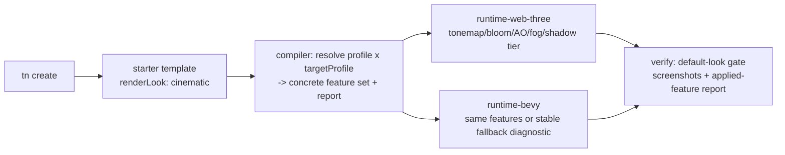

# PRD: Cinematic Default Look — UE5-Grade Visuals With Zero Config

`Planning Mode: Principal Architect`
`Complexity: 8 → HIGH mode`

Score basis: +3 touches 10+ files, +2 multi-package (ir, compiler,
runtime-web-three, runtime-bevy, cli, authoring, templates, tools/verify),
+2 cross-runtime visual contract changes, +1 release-gate evidence.

## 1. Context

**Problem:** A freshly generated ThreeNative project renders like debug
geometry, while the goal is "a new project looks like a UE5 starter map by
default." Every polished example re-derives the same atmosphere/tonemapping/
shadow/IBL stack by hand.

**Relationship to existing PRDs (read first, do not duplicate):**

- `docs/PRDs/proof-first-engine-loop-2026-07-05/PRD-015-portable-photoreal-rendering-and-postprocessing.md` builds
  the portable *capability plumbing* (AO, HDRI/IBL, DOF, SSR, motion blur
  fields + diagnostics). This PRD consumes those capabilities; it does not
  re-specify them.
- `docs/PRDs/authoring-abstractions-and-polished-defaults.md` (in flight,
  Phases 1–5 done) ships `tn environment preset <name>` and upgrades the
  starter template to a `balanced` daylight stack. This PRD raises the ceiling
  from `balanced` to a promoted `cinematic` profile and makes it the default.

**Files Analyzed:**

- `packages/ir/src/rendering.ts` (`RENDER_LOOK_PROFILE_PRESETS`: only
  `parity` and `balanced` are promoted; `cinematic`/`stylized` are reserved —
  see `docs/bevy-feature-parity.md` lines ~421–427).
- `packages/runtime-web-three/src/rendering/applyRenderLookProfile.ts`,
  `packages/runtime-web-three/src/render.ts` (EffectComposer bloom/MSAA/
  color grading already real on web).
- `runtime-bevy/crates/threenative_runtime/src/rendering.rs` (bloom/MSAA/
  tonemapping via camera config).
- `packages/cli/src/commands/create.ts`, `templates/structured-source-starter`.
- `tools/verify/src` visual gates; `packages/authoring/src/gameWorkflow.ts`
  (`createGameQualityReport` visuals phase).

**Current Behavior:**

- `cinematic` and `stylized` render-look profiles exist as names but are
  explicitly reserved pending screenshot proof; requesting them falls back.
- New projects default to `balanced` at best; tone curve, shadow ladder, IBL
  intensity, and fog are conservative and flat.
- There is no per-target-profile quality ladder: web desktop, webview/mobile,
  and native Bevy all get the same defaults.
- The `tn game score` visuals phase cannot tell "cinematic baseline applied"
  from "hand-tuned once"; nothing gates regressions of the default look.

## 2. Solution

**Approach:**

- Promote `cinematic` (filmic realism) and `stylized` (saturated/toon-leaning)
  as real render-look profiles: each is a *named bundle of already-portable
  features* — tonemapping curve + exposure, bloom, color grading, shadow
  quality tier, environment-lighting intensity, fog defaults, and (once the
  photoreal PRD promotes them) AO and DOF hints.
- Define a **quality ladder** keyed by target profile: `cinematic` resolves to
  concrete settings per `targetProfile` (desktop-web, mobile-web, native), so
  the same authored intent degrades gracefully instead of breaking budgets.
- Make `tn create` projects default to `renderLook.profile: "cinematic"` plus
  the existing `daylight` environment preset — zero config, immediately
  "expensive-looking."
- Add a **default-look visual gate**: fixture project + committed reference
  screenshots (web + Bevy) + machine-readable applied-feature report, wired
  into `pnpm verify` so the default look cannot silently regress.
- Everything stays IR-level and engine-neutral; profile resolution happens in
  the compiler/runtime report layer with stable diagnostics
  (`TN-RENDER-FEATURE-FALLBACK` family from the photoreal PRD).

**Architecture:**

**Key Decisions:**

- [ ] Profiles are *data* (preset tables in `packages/ir/src/rendering.ts`),
      never runtime branching on engine names; runtimes consume the resolved
      feature set.
- [ ] `cinematic` must be promoted on BOTH runtimes or ship with explicit
      per-feature fallback diagnostics recorded in
      `docs/bevy-feature-parity.md` — no silent web-only beauty.
- [ ] Authored `renderLook.overrides` always win over profile values
      (preserve authored IR; repo visual-parity rule).
- [ ] Heavy features (AO, DOF) enter the profile only after the photoreal PRD
      promotes them; until then the profile ships without them and the preset
      table is extended additively.

**Data Changes:** extend `RENDER_LOOK_PROFILE_PRESETS` with `cinematic` and
`stylized` rows; add `qualityTier` resolution table keyed by target profile;
add applied-profile block to runtime capability reports. All additive; IR
version bumped per convention.

## 3. Integration Points

- Entry points: `tn create` (new default), `tn runtime set-rendering
  --render-look cinematic --json`, editor inspector render-look dropdown
  (promoted values only).
- Callers: `packages/compiler` profile resolution; both runtime adapters;
  `packages/cli/src/commands/sourceDocuments.ts` (runtime set-rendering);
  `tools/verify/src` new gate.
- Wiring: template `content/runtime/default.runtime.json` gains the profile;
  `tn game plan` output recommends `cinematic` for realistic goals and
  `stylized` for toon/arcade goals.

**User flow:** `tn create my-game` → `tn dev --target web` → first screenshot
already shows filmic tonemapping, sky, fog depth, soft shadows, bloom on
emissives. `tn game score --json` visuals phase reports
`renderLook: cinematic (applied)` on both runtimes.

## 4. Execution Phases

#### Phase 1: Promote `cinematic`/`stylized` preset data + resolution contract

**Files (max 5):**

- `packages/ir/src/rendering.ts` — preset rows: tonemapping (`aces` or `agx`
  if both runtimes support it; decide in-phase with evidence), exposure,
  bloom, grading, shadow tier, environment intensity, fog defaults; plus
  `resolveRenderLook(profile, targetProfile)` returning the concrete set.
- `packages/ir/src/runtimeConfig.ts` — accept the new profile names; validate
  overrides against resolved fields.
- `packages/ir/src/` validation tests — accepted/rejected fixtures.
- `packages/compiler/src/` — emit resolved feature set + requested/applied
  report scaffold into the bundle.
- `docs/bevy-feature-parity.md` — flip reserved rows to "in progress".

**Tests Required:**
| Test File | Test Name | Assertion |
|-----------|-----------|-----------|
| ir tests | `should resolve cinematic profile per target profile` | mobile tier < desktop tier, deterministic values |
| ir tests | `should reject unknown render look profile` | stable diagnostic code |
| compiler tests | `should preserve authored overrides over profile values` | override wins in emitted config |

**Verification Plan:** `pnpm --filter @threenative/ir test`,
`pnpm --filter @threenative/compiler test`.

#### Phase 2: Web implementation of the resolved cinematic set

**Files (max 5):**

- `packages/runtime-web-three/src/rendering/applyRenderLookProfile.ts` —
  apply resolved tonemapping/exposure/bloom/grading/fog/shadow tier; report
  applied vs fallback per feature.
- `packages/runtime-web-three/src/render.ts` — shadow-map size/type ladder
  per quality tier; fog wiring.
- `packages/runtime-web-three/src/mapWorld.ts` — default environment
  intensity application when the scene has an environment map.
- Tests in the package's existing test home.

**User Verification:** side-by-side screenshots of the starter scene under
`parity` vs `balanced` vs `cinematic` — cinematic must be visibly richer
(tone curve, bloom, fog depth, softer shadows), not just brighter.

#### Phase 3: Bevy implementation or explicit fallback

**Files (max 5):**

- `runtime-bevy/crates/threenative_runtime/src/rendering.rs` — map resolved
  set to Bevy tonemapping/bloom/shadow/fog (Bevy 0.14 `DistanceFog`,
  `ShadowFilteringMethod`, cascade config); per-feature applied/fallback
  report entries.
- `runtime-bevy/crates/threenative_loader/src/` — parse the resolved block.
- `docs/bevy-feature-parity.md` + `docs/STATUS.md` — capability rows
  (repo rule for capability changes).

**Tests Required:** Rust unit tests for config mapping; conformance fixture
asserting both runtimes report the same requested feature set and each
feature is `applied` or has a stable fallback diagnostic — never absent.

**Verification Plan:** `pnpm verify:conformance`; native screenshot of the
fixture (manual checkpoint — visual).

#### Phase 4: Defaults — template, create, and plan guidance

**Files (max 5):**

- `templates/structured-source-starter/content/runtime/default.runtime.json`
  — `renderLook.profile: "cinematic"`.
- `templates/racing-kit-rally-starter/content/runtime/*.runtime.json` — same.
- `packages/cli/src/commands/game.ts` — `tn game plan` recommends
  cinematic/stylized by goal keywords.
- `packages/authoring/src/gameWorkflow.ts` — visuals phase of
  `createGameQualityReport` reads the applied-profile report; flags projects
  still on `parity` with no override as a quality note.
- Template `AGENTS.md`/`CLAUDE.md` — document the default and how to opt down
  (`tn runtime set-rendering --render-look balanced`).

**User Verification:** `tn create scratch && cd scratch && tn dev --target
web` — first frame looks lit/graded with zero edits.

#### Phase 5: Default-look regression gate + docs closure

**Files (max 5):**

- `tools/verify/src/` — `verify:default-look` gate: build the starter
  template, capture web (and Bevy when available) screenshots, compare
  against committed references with bounded-region tolerance, and assert the
  applied-feature report matches the resolved profile.
- `packages/ir/fixtures/` — resolved-profile fixture shared by conformance.
- `package.json` — wire the gate into `pnpm verify` (NOT pre-commit; repo
  rule against visual gates in pre-commit hooks).
- `docs/STATUS.md`, `docs/PRDs/README.md` — status + index updates; move this
  PRD to `done/` on completion.

**Tests Required:**
| Test File | Test Name | Assertion |
|-----------|-----------|-----------|
| verify gate | `default look screenshot within tolerance` | bounded diff vs reference |
| verify gate | `applied-feature report matches resolved cinematic set` | no silent fallback on promoted features |

## 5. Checkpoint Protocol

After every phase, spawn `prd-work-reviewer` on this PRD path. Manual visual
checkpoints additionally required for Phases 2, 3, and 4 (screenshot review).

## 6. Acceptance Criteria

- [ ] `cinematic` and `stylized` are promoted profiles on web; Bevy either
      applies each feature or emits a stable per-feature fallback diagnostic
      recorded in `docs/bevy-feature-parity.md`.
- [ ] A fresh `tn create` project renders with the cinematic stack and zero
      config; `tn game score` reports it.
- [ ] Quality ladder resolves differently for desktop-web vs mobile-web vs
      native, deterministically.
- [ ] Authored overrides always beat profile values (test-proven).
- [ ] `verify:default-look` gate is green and wired into `pnpm verify`.
- [ ] `docs/STATUS.md` + parity doc updated.

## 7. Success Metrics

| Metric | Before | Target |
| --- | --- | --- |
| Commands to reach a filmic, lit, fogged first frame | ~1 preset + hand overrides | 0 (default) |
| Promoted render-look profiles | 2 (`parity`, `balanced`) | 4 |
| Default-look regressions caught by CI | none | gate fails on drift |

## 8. Open Questions

- ACES vs AgX as the cinematic tone curve — pick whichever both runtimes can
  apply consistently; record the evidence in Phase 1.
- Should `stylized` ship in the same release or trail one release behind
  `cinematic`? Default: same schema phase, later visual promotion if proof
  lags.
