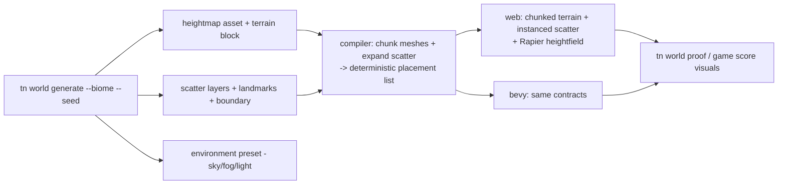

# PRD: Believable Worlds By Default — Heightfield Terrain And Biome Dressing

`Planning Mode: Principal Architect`
`Complexity: 9 → HIGH mode`

Score basis: +3 touches 10+ files, +2 new IR asset/component contracts on
both runtimes, +2 multi-package (ir, compiler, authoring, cli,
runtime-web-three, runtime-bevy), +2 procedural generation with cross-runtime
determinism and physics coupling.

## 1. Context

**Problem:** The single biggest visual gap between a generated ThreeNative
game and a UE5 starter level is the world itself: games sit on a flat plane
with an empty horizon. The repo's own quality rules demand "track edges,
terrain, landmarks, sky/background treatment" and flag "empty horizons,
bland floors" as blockers — but there is no terrain contract and no
one-command way to dress a believable play space. `tn asset source search`
covers hero/prop assets; nothing covers the ground they stand on.

**Relationship to existing work (do not duplicate):**

- `docs/status/advanced-features-roadmap.md` Tier 2 names heightfield
  terrain, instancing/vegetation, and atmosphere as the target ladder — this
  PRD is the concrete Tier-2 slice. Update that doc as tiers land.
- `dressed-environment-kit` recipe and `tn environment preset` (abstractions
  PRD) cover props/atmosphere presets; this PRD adds the terrain layer and a
  biome-level generator that composes them.
- `IEnvironmentSceneIr` already models terrain/walkability/scatter/LOD
  metadata (`packages/ir/src/environment.ts`) — extend it; do not invent a
  parallel document.
- Renderer-level instancing and LOD swapping are already promoted
  (parity doc ~lines 500, 709–716); scatter placement rides on them. GPU
  culling/indirect draw stays out of scope (diagnostic-only, per parity doc).

**Files Analyzed:**

- `packages/ir/src/environment.ts` (`IEnvironmentSceneIr`: terrain, skybox,
  paths, walkability, scatter, LOD fields — currently thin/policy-level).
- `packages/runtime-web-three/src/mapWorld.ts`, physics collider mapping
  (`physics.ts` — heightfield collider support status in Rapier is available
  on both `@dimforge/rapier3d-compat` and `rapier3d` 0.33).
- `runtime-bevy/crates/threenative_runtime/src/{rendering,physics}.rs`.
- `packages/cli/src/commands/sourceDocuments.ts`
  (`environment set-terrain|set-walkability|...`), `asset.ts`.
- `docs/workflows/open-source-3d-asset-kits.md`,
  `packages/cli/data/asset-sources.sqlite` (texture/vegetation sources).

**Catalog evidence (queried live against the shipped SQLite catalog, not
assumed):** `tn asset source search` already returns usable per-biome
candidates today, confirming the biome tables in Phase 5 are sourceable
without new scraping work:

- Splat/ground textures (ambientCG CC0 PBR ZIPs, `nature-terrain` /
  `--format zip` results, ids stable across re-runs):
  grass — `ambientcg-grass001-1k-jpg`, `ambientcg-grass004-1k-jpg`,
  `ambientcg-grass006-1k-jpg`, `ambientcg-grass008-1k-jpg`; ground/dirt —
  `ambientcg-ground012-1k-jpg`, `ambientcg-ground018-1k-jpg`,
  `ambientcg-ground036-1k-jpg`, `ambientcg-ground043-1k-jpg`; sand/desert —
  `ambientcg-ground044-1k-jpg`, `ambientcg-gravel014-1k-jpg`; rock/cliff —
  `ambientcg-rock045-1k-jpg`, `ambientcg-rock050-1k-jpg`,
  `ambientcg-rock058-1k-jpg`, `ambientcg-rock060-1k-jpg`; snow/arctic —
  `ambientcg-snow007c-1k-jpg`, `ambientcg-snow008b-1k-jpg`,
  `ambientcg-snow009a-1k-jpg`, `ambientcg-snow011-1k-jpg`; moss/forest floor —
  `ambientcg-moss001-1k-jpg` through `ambientcg-moss004-1k-jpg`,
  `ambientcg-ground078-1k-jpg`, `ambientcg-scatteredleaves008-1k-jpg`,
  `ambientcg-bark001-1k-jpg`; gravel/path — `ambientcg-gravel031-1k-jpg`,
  `ambientcg-gravel034-1k-jpg`, `ambientcg-gravel035-1k-jpg`,
  `ambientcg-gravel043-1k-jpg`. All CC0, `engineFit: web-and-native`,
  `licensePosture: cc0`, redistribution allowed — no attribution-tracking
  burden.
- Scatter props (direct-download GLBs, `--format glb --direct-only`):
  rocks — `os3a-pm-transit-transit-008-rock-01`,
  `os3a-pm-momuspark-momuspark-035-rock-01-art` through `-039-rock-05-art`,
  `os3a-pm-lunar-year-lunar-year-040-rock01`/`-041-rock02`,
  `os3a-pm-ca-world-ca-world-044-rock-01`/`-045-rock-02`; vegetation/props
  under `--game-category nature-terrain` (no dedicated `vegetation` category
  exists yet — confirmed empty; use `nature-terrain` + keyword queries):
  Kenney `Starter Kit 3D Platformer` grass/platform-grass props, Kenney
  `Basic Scene` tree, `abm` Sakura/HoloTree/HoloBush/Petals/BranchFlowers
  stylized foliage set (a cohesive stylized pack — good `stylized` biome
  fit), `ca-world` Pot/Rock/Streetlight set dressing.
- Gap to record, not solve here: there is no dedicated `vegetation`
  `--game-category` filter value (returns 0 results) even though vegetation
  assets exist under `nature-terrain`/keyword search — Phase 5 biome tables
  must query by keyword + `nature-terrain`, and this PRD should file a
  one-line follow-up against the catalog builder
  (`scripts/build-asset-source-catalog.mjs`) to add a `vegetation` category
  facet rather than special-casing it here.

**Visual spot-check (color-map previews fetched and inspected, not just
metadata):** downloaded the `Color` preview JPGs for four representative
candidates via each record's `previewUrl` and viewed them directly —
`ambientcg-grass004-1k-jpg` (dense, naturally-variegated green lawn/wild
grass — no visible tiling seam, good `meadow`/`forest` ground layer),
`ambientcg-rock050-1k-jpg` (weathered gray stone with lichen speckling —
strong `canyon`/cliff-face candidate for slope-range splat layers),
`ambientcg-ground043-1k-jpg` (dry cracked dirt with sparse grass wisps —
good transition/path layer between grass and rock), and
`ambientcg-snow008b-1k-jpg` (subtle wind-scoured snow with drift streaks,
low-contrast — good `arctic` base layer, may need a contrast/roughness
bump at normal scale to avoid reading flat at a distance). All four read as
genuine photogrammetry-derived PBR surfaces, not obviously-tiling or
stock-photo-flat — confirms the ambientCG splat-layer sourcing plan in
Phase 5 is visually sound, not just metadata-plausible. Full material sets
(normal/roughness/displacement/AO) are bundled in the same source ZIP per
record and were not separately inspected; Phase 1 implementation should
still spot-check the normal map convention (`ambientcgMapEncodings:
JPG|PNG`, DirectX-style normals per `previewUrl` query params) before
committing an importer.

**Current Behavior:**

- `environment set-terrain` exists but the terrain contract is not a
  renderable+collidable heightfield on either runtime; games ship flat
  planes.
- Scatter/LOD fields are metadata without a placement generator; vegetation
  means hand-placing prefab instances.
- No biome-level command exists; "build a believable play space" costs an
  agent dozens of operations and asset decisions per game.

## 2. Solution

**Approach:**

1. **Heightfield terrain contract** — a bundle-local heightmap asset
   (16-bit PNG or raw grid; decided in Phase 1 with loader evidence) + a
   `terrain` block in `IEnvironmentSceneIr`: grid size, cell size, height
   scale, up-to-4-layer splat texturing (reuse material texture slots),
   skirt/edge policy. Both runtimes render it (chunked static meshes
   generated from the grid — no streaming in v1) and collide with it
   (Rapier heightfield collider on both). Walkability derives from slope.
2. **Deterministic scatter placement** — extend the `scatter` block:
   layers of `{ prefab | meshAsset, density, seed, slopeRange, heightRange,
   avoidPaths, avoidEntitiesRadius, scaleJitter, yawJitter }`. The compiler
   (not the runtime) expands layers into an instanced placement list at
   build time — deterministic, diffable, and runtime-neutral; runtimes
   consume instanced draws they already support.
3. **Biome generator command** — `tn world generate --biome
   <meadow|forest|desert|canyon|arctic> --size <s> --seed <n> --json`:
   one command emits heightmap asset (seeded noise, plateau'd play area),
   terrain block with biome splat textures (sourced via the asset catalog,
   provenance preserved), scatter layers (biome vegetation/rocks from
   catalog packs), boundary treatment (perimeter cliffs/rocks/fog wall),
   2–3 landmark placements, and the matching environment preset
   (sky/fog/lighting). Re-running with the same seed is idempotent;
   `--regenerate` re-rolls. A `--flatten-radius` keeps the gameplay area
   authorable.
4. **Proof** — `tn world proof --json` captures horizon/ground/scale
   screenshots and reports terrain+scatter counts; wired into `tn game
   score` visuals phase so "flat plane, empty horizon" scores as the floor
   it is.

**Architecture:**

**Key Decisions:**

- [ ] Placement expansion happens in the **compiler**, emitting explicit
      instance transforms into IR — both runtimes stay dumb consumers and
      conformance is a data diff, not a behavior diff.
- [ ] No terrain streaming/paging in v1 (Tier 3); bound grid size per target
      profile with `TN_TERRAIN_BUDGET_EXCEEDED` diagnostics.
- [ ] Biome asset selections come from the shipped SQLite catalog first
      (repo sourcing rule), with catalog IDs + provenance recorded in the
      generated documents; fallback order follows `CLAUDE.md` sourcing
      policy.
- [ ] Seeded noise algorithm is specified in the IR package (shared spec +
      test vectors) so `--regenerate` and CI produce identical heightmaps on
      any machine; the CLI generates the heightmap, never the runtimes.
- [ ] Physics heightfield is a shared runtime contract → conformance
      coverage + parity/STATUS updates (repo rule).

**Data Changes:** `IEnvironmentSceneIr.terrain` extended (heightmap asset
ref, cellSize, heightScale, splat layers); `scatter` extended with layer
schema + compiler-expanded `placements`; new asset kind `heightmap`. All
versioned, accepted/rejected fixtures.

## 3. Integration Points

- Entry points: `tn world generate --json`, `tn world proof --json`,
  extended `tn environment set-terrain --heightmap <asset> ... --json`,
  `tn game plan` (world/environment surface now recommends a biome).
- Callers: new `packages/cli/src/commands/world.ts` registered in
  `index.ts`; `packages/authoring/src/operationRegistry.ts` gains
  `environment.set_terrain` (extended) + `environment.add_scatter_layer` +
  `world.generate`; compiler terrain/scatter expansion stage; both runtime
  adapters.
- Wiring: starter template stays minimal (flat) but `AGENT_GAME_PLAN.md` and
  `tn game plan` output name `tn world generate` as the default
  world/environment action for outdoor games.

**User flow (agent):** plan says "canyon courier game" → `tn world generate
--biome canyon --size 200 --seed 7 --flatten-radius 30` → `tn dev` shows a
sculpted canyon with rock scatter, boundary cliffs, fog horizon, and correct
walk/collision — one command, catalog-sourced textures, provenance recorded
→ agent places gameplay on top with archetypes/recipes.

## 4. Execution Phases

#### Phase 1: Terrain IR contract + heightmap asset kind

**Files (max 5):**

- `packages/ir/src/environment.ts` + validation — terrain block schema,
  budgets per target profile, splat layer rules.
- `packages/ir/src/types.ts` / asset schema — `heightmap` asset kind
  (format decision recorded here with evidence).
- `packages/compiler/src/` — terrain chunking: heightmap → chunk mesh data
  + heightfield collider descriptor emitted into the bundle.
- `packages/ir/fixtures/` — accepted/rejected terrain fixtures + a small
  reference heightmap with expected chunk/collider snapshot.
- Compiler tests.

**Tests Required:**
| Test File | Test Name | Assertion |
|-----------|-----------|-----------|
| ir tests | `should accept 4-layer splat terrain and reject 5th layer` | schema behavior |
| compiler tests | `should emit deterministic chunk meshes for reference heightmap` | snapshot match |
| ir tests | `should error when grid exceeds target profile budget` | `TN_TERRAIN_BUDGET_EXCEEDED` |

#### Phase 2: Web terrain rendering + heightfield physics

**Files (max 5):**

- `packages/runtime-web-three/src/mapWorld.ts` (or terrain module) — chunk
  mesh construction + splat material application.
- `packages/runtime-web-three/src/physics.ts` — Rapier heightfield collider
  from the descriptor; character controller walks slopes per existing slope
  rules.
- Web runtime tests — raycast down at sample points matches heightmap
  values; walkability slope derivation.
- `docs/STATUS.md` — capability row (in-progress).

**User Verification:** `tn dev` on the fixture — walkable sculpted ground,
correct collisions on slopes, splat texture blending visible.

#### Phase 3: Bevy terrain + conformance

**Files (max 5):**

- `runtime-bevy/crates/threenative_runtime/src/rendering.rs` — chunk meshes
  + splat (Bevy 0.14 `StandardMaterial` layered approach or a bounded custom
  material — record the choice; coordinate with
  `proof-first-engine-loop-2026-07-05/PRD-014-portable-shader-material-parity.md` if a custom shader is needed).
- `runtime-bevy/crates/threenative_runtime/src/physics.rs` — Rapier
  heightfield collider.
- `packages/ir/fixtures/` — terrain conformance fixture (height samples +
  collider raycasts identical web/Bevy).
- `docs/bevy-feature-parity.md`, `docs/STATUS.md`.

**Verification Plan:** `pnpm verify:conformance`; native screenshot of the
fixture (manual visual checkpoint).

#### Phase 4: Scatter layers + compiler placement expansion

**Files (max 5):**

- `packages/ir/src/environment.ts` — scatter layer schema + expanded
  `placements` shape.
- `packages/compiler/src/` — seeded placement expansion (slope/height/path
  filters, jitter, density → instance transforms); shared PRNG spec + test
  vectors in the IR package.
- `packages/authoring/src/` + `packages/cli/src/commands/sourceDocuments.ts`
  — `environment add-scatter-layer --json` operation.
- Compiler tests — deterministic placement snapshot for the reference
  terrain + seed; filter correctness (nothing on >slopeMax, nothing on
  paths).

**Tests Required:**
| Test File | Test Name | Assertion |
|-----------|-----------|-----------|
| compiler tests | `should place identical instances for identical seed` | snapshot byte-stable |
| compiler tests | `should exclude placements on steep slopes and paths` | zero violations |

#### Phase 5: `tn world generate` biome command + proof + docs

**Files (max 5):**

- `packages/cli/src/commands/world.ts` (new) + `index.ts` — `generate`
  (seeded noise heightmap, biome tables, catalog asset selection with
  provenance, boundary + landmarks, preset invocation, idempotent re-run)
  and `proof` (horizon/ground/scale screenshots + counts report).
- `packages/authoring/src/biomes.ts` (new) — the 5 biome tables (splat
  texture catalog queries, scatter species, boundary style, preset name).
- `packages/authoring/src/gameWorkflow.ts` — visuals phase consumes world
  proof (flat-plane/empty-horizon detection becomes a scored note).
- `docs/STATUS.md`, `docs/bevy-feature-parity.md`,
  `docs/status/advanced-features-roadmap.md` (Tier 2 rows), template
  `AGENT_GAME_PLAN.md` guidance, `docs/PRDs/README.md`.
- CLI tests — generate → `tn authoring validate --json` clean → re-run
  idempotent.

**Tests Required:**
| Test File | Test Name | Assertion |
|-----------|-----------|-----------|
| cli tests | `should generate valid biome world when meadow requested` | validate clean, terrain + scatter + preset docs exist |
| cli tests | `should be idempotent when re-run with same seed` | no document churn |
| cli tests | `should record catalog provenance for selected textures` | catalog IDs present |

**User Verification:** one command per biome in a scratch project; screenshot
review of all five biomes (manual checkpoint) — no empty horizons, coherent
palette, believable scale against a character-height reference.

## 5. Checkpoint Protocol

Spawn `prd-work-reviewer` after every phase. Manual visual checkpoints for
Phases 2, 3, and 5 (screenshots; scale sanity per `tn game scale`).

## 6. Acceptance Criteria

- [ ] Heightfield terrain renders and collides identically (conformance
      fixtures) on web and Bevy, within budgets, or carries explicit
      parity-doc gap entries.
- [ ] Scatter placement is compiler-expanded, seeded, deterministic, and
      filter-correct.
- [ ] `tn world generate --biome <x> --seed <n>` yields a validated,
      provenance-recorded, walkable dressed world in one command; idempotent
      re-runs.
- [ ] `tn game score` visuals phase detects and penalizes flat-plane/empty-
      horizon worlds.
- [ ] `docs/STATUS.md`, parity doc, and advanced-features-roadmap Tier 2 rows
      updated.

## 7. Success Metrics

| Metric | Before | Target |
| --- | --- | --- |
| Commands to a believable outdoor play space | dozens (hand-placed props, flat plane) | 1 |
| Terrain contract | none (flat planes) | rendered + collidable heightfield, both runtimes |
| Vegetation/rocks | hand-placed prefab instances | seeded scatter layers |
| Empty-horizon generated games | common | flagged by score gate |

## 8. Open Questions

- Heightmap asset format: 16-bit PNG (tooling-friendly) vs raw grid JSON
  (structured-parsing rule). Decide in Phase 1; if PNG, treat it like other
  binary assets with `tn asset inspect` support.
- Do biome splat textures need the shader-parity PRD first on Bevy, or can
  4-layer splat ride on `StandardMaterial` extensions? Spike at Phase 3
  start; if blocked, ship 1-texture terrain on Bevy with a recorded gap.
