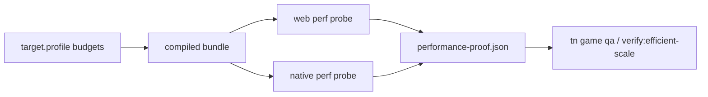
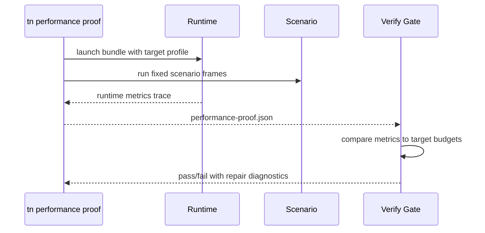

# PRD: Runtime-Proven Efficient Scale

`Planning Mode: Principal Architect`
`Complexity: 9 -> HIGH mode`

Score basis: +3 touches 10+ files across IR, compiler, runtimes, CLI, and
verify-tools; +2 multi-package runtime behavior; +2 performance measurement
state and budget enforcement; +2 dense-world benchmark/gate work.

## 1. Context

**Problem:** ThreeNative has metadata and reports for LOD, instancing, and
budgets, but the roadmap's Phase 4 requires dense-world affordability to be
runtime-proven with enforced budgets on web and native.

**Files Analyzed:**

- `docs/status/ROADMAP.md`
- `docs/status/advanced-features-roadmap.md`
- `docs/bevy-feature-parity.md`
- `packages/ir/src/environment.ts`
- `packages/ir/fixtures/conformance/performance-budgets`
- `packages/compiler/src/emit/capabilities.ts`
- `packages/runtime-web-three/src/mapWorld.ts`
- `runtime-bevy/crates/threenative_runtime/tests/environment.rs`
- `tools/verify/src/gameProductionGateProofs.ts`
- `package.json`

**Current Behavior:**

- Target profiles can declare bundle/asset/frame/draw/entity budgets.
- Environment source assets can declare LOD metadata and impostor metadata.
- Existing gates validate budget sidecars and asset budgets, but dense-scene
  runtime proof is not a first-class scenario gate.
- Terrain chunk streaming and native compressed texture evidence remain
  deferred.

## Pre-Planning Findings

**How will this feature be reached?**

- [x] Entry point identified: `tn game qa --run-proof`, a new
  `tn performance proof --json`, and `pnpm verify:efficient-scale`.
- [x] Caller file identified: `packages/cli/src/commands/gameQaProof.ts` and
  `tools/verify/src/cli/run.ts`.
- [x] Registration/wiring needed: CLI command registration, verify-tools gate,
  shared benchmark fixture, runtime performance reports.

**Is this user-facing?**

- [x] YES. Game authors see budget diagnostics and repair hints.
- [ ] NO.

**Full user flow:**

1. User authors or generates a dense scene.
2. `tn game qa --run-proof` runs playtest plus performance proof.
3. The runtime emits frame, draw, visible instance, active LOD, and memory
   measurements.
4. QA fails if the target profile budget is exceeded, with repair hints for
   LOD, instancing, texture variants, or target-profile tuning.

## 2. Solution

**Approach:**

- Promote a runtime performance proof sidecar that records actual measured
  frame timing, draw groups, visible instances, active LOD bands, culled
  counts, entity counts, loaded texture bytes, and package bytes.
- Add a dense-world benchmark fixture: scatter + LOD + animated actors +
  lights + UI overlay, run under both runtimes once native proof harness exists.
- Enforce target-profile budgets in QA and release gates using the measured
  sidecar, not only static metadata.
- Add native compressed texture support only after source variants and
  fallback diagnostics prove target support.

**Key Decisions:**

- [x] Budget proof measures runtime behavior over a scenario window, not a
      single static report.
- [x] Runtime reports use shared JSON schemas so web and Bevy can be compared.
- [x] Terrain streaming is gated behind the terrain PRD; this PRD adds the
      budget harness and then uses it for streaming.
- [x] Visual screenshot gates remain separate from performance gates.

**Data Changes:** Add a versioned `threenative.performance-proof` sidecar
schema under docs/contracts or verify-tools types. No game IR schema changes
unless target-profile budget fields need additive measurement ids.

## 3. Sequence Flow

## 4. Execution Phases

#### Phase 1: Performance Proof Contract - Runtime metrics have one shared sidecar shape.

**Files (max 5):**

- `docs/contracts/performance-proof.md` - schema and metric definitions.
- `tools/verify/src/performanceProof.ts` - parser and validator.
- `tools/verify/src/performanceProof.test.ts` - accepted/rejected sidecars.
- `packages/ir/src/types.ts` - additive budget measurement ids if needed.
- `docs/bevy-feature-parity.md` - record report-only state.

**Implementation:**

- [ ] Define required metrics: frame ms percentiles, draw calls/groups,
      visible instances, active LOD bands, loaded texture bytes, entity count.
- [ ] Define target-profile budget matching and stable diagnostic codes.
- [ ] Preserve existing asset-budget sidecar semantics.

**Tests Required:**

| Test File | Test Name | Assertion |
|-----------|-----------|-----------|
| `tools/verify/src/performanceProof.test.ts` | `should accept complete performance proof sidecar` | parsed metrics match schema |
| `tools/verify/src/performanceProof.test.ts` | `should reject over-budget frame percentile` | diagnostic includes metric and limit |

**User Verification:**

- Action: validate a sample sidecar with `pnpm build:verify-tools`.
- Expected: accepted/rejected fixtures produce stable diagnostics.

#### Phase 2: Web Runtime Measurement - QA records actual dense-scene metrics.

**Files (max 5):**

- `packages/runtime-web-three/src/` - metrics collector for frame time, draw
  info, loaded texture bytes, LOD/instance observations.
- `packages/cli/src/commands/performanceProof.ts` - run web target and write
  sidecar.
- `packages/cli/src/commands/performanceProof.test.ts` - CLI JSON/report
  coverage.
- `packages/cli/src/index.ts` - command registration.
- `docs/STATUS.md` - record web proof state.

**Implementation:**

- [ ] Collect metrics over a fixed frame window after readiness.
- [ ] Include source hash and target profile in the sidecar.
- [ ] Fail with `TN_PERFORMANCE_PROOF_UNAVAILABLE` if runtime metrics cannot
      be collected.

**Tests Required:**

| Test File | Test Name | Assertion |
|-----------|-----------|-----------|
| `packages/cli/src/commands/performanceProof.test.ts` | `should write web performance proof sidecar` | sidecar path and metrics exist |

**User Verification:**

- Action: `tn performance proof --project examples/humanoid-physics-course --target web --json`.
- Expected: `artifacts/performance-proof/web/summary.json` reports measured
  metrics and budget status.

#### Phase 3: Dense-World Benchmark Fixture - Instancing and LOD budgets are proven under load.

**Files (max 5):**

- `examples/dense-world-benchmark/` - structured source fixture with scatter,
  LOD, animated actors, lights, and UI overlay.
- `examples/dense-world-benchmark/playtests/performance-smoke.playtest.json`
  - scenario window.
- `tools/verify/src/efficientScaleGate.ts` - benchmark runner.
- `tools/verify/src/cli/run.ts` - register `verify:efficient-scale`.
- `package.json` - add script.

**Implementation:**

- [ ] Keep benchmark assets source-backed and reproducible.
- [ ] Record authored budgets in target profile.
- [ ] Ensure the benchmark has a gameplay scenario, not only a screenshot.

**Tests Required:**

| Test File | Test Name | Assertion |
|-----------|-----------|-----------|
| `tools/verify/src/efficientScaleGate.test.ts` | `should fail dense benchmark when draw budget is exceeded` | diagnostic names draw metric |
| `tools/verify/src/efficientScaleGate.test.ts` | `should pass dense benchmark with fresh performance proof` | report status pass |

**User Verification:**

- Action: `pnpm verify:efficient-scale`.
- Expected: benchmark sidecar exists and budgets are evaluated.

#### Phase 4: Native Runtime Measurement - Bevy emits the same budget metrics.

**Files (max 5):**

- `runtime-bevy/crates/threenative_runtime/src/` - native metrics collection.
- `runtime-bevy/crates/threenative_runtime/tests/` - metric sidecar tests.
- `packages/cli/src/commands/performanceProof.ts` - `--target desktop` path
  after native proof harness lands.
- `docs/bevy-feature-parity.md` - update native budget proof rows.
- `docs/STATUS.md` - evidence commands.

**Implementation:**

- [ ] Reuse native proof harness launch and readiness files.
- [ ] Emit the same metric names as web, with target-specific unavailable
      diagnostics where Bevy 0.14 cannot expose an exact counter.
- [ ] Keep unsupported counters fail-closed for promoted budget gates.

**Tests Required:**

| Test File | Test Name | Assertion |
|-----------|-----------|-----------|
| Rust runtime tests | `should emit native performance proof metrics` | sidecar includes frame/entity/LOD metrics |

**User Verification:**

- Action: `tn performance proof --project examples/dense-world-benchmark --target desktop --json`.
- Expected: native sidecar uses the same schema as web.

#### Phase 5: Texture Compression And Streaming Budget Ratchet - Heavy content has enforced delivery budgets.

**Files (max 5):**

- `packages/ir/src/assetValidation.ts` - target-profile compressed texture
  variant diagnostics.
- `runtime-bevy/crates/threenative_loader/src/` - KTX2/Basis support or
  explicit unsupported diagnostics.
- `packages/runtime-web-three/src/assets/` - variant selection report.
- `tools/verify/src/efficientScaleGate.ts` - package/load budget checks.
- `docs/status/advanced-features-roadmap.md` - tier status update.

**Implementation:**

- [ ] Separate source acceptance from per-target support.
- [ ] Require baseline fallback for every compressed variant.
- [ ] Record selected variant, fallback reason, loaded bytes, and budget
      status in performance proof.

**Tests Required:**

| Test File | Test Name | Assertion |
|-----------|-----------|-----------|
| IR asset tests | `should reject compressed texture variant without baseline fallback` | stable diagnostic |
| verify tests | `should fail package budget when selected variants exceed target` | budget diagnostic |

**User Verification:**

- Action: run efficient-scale gate on a fixture with compressed and fallback
  variants.
- Expected: correct variant selected or stable fallback diagnostic emitted.

## 5. Verification Strategy

- `pnpm --filter @threenative/ir test`
- `pnpm --filter @threenative/cli test -- --run performance`
- `pnpm --filter @threenative/verify-tools test -- --run efficientScale`
- `cargo test --manifest-path runtime-bevy/Cargo.toml -p threenative_runtime performance`
- `pnpm verify:efficient-scale`
- `pnpm verify:conformance`

## 6. Acceptance Criteria

- [ ] A versioned performance-proof sidecar exists and is validated.
- [ ] Web and native can emit the same required budget metrics or stable
      unsupported diagnostics for non-promoted counters.
- [ ] A dense-world benchmark gate enforces frame/draw/entity/LOD budgets.
- [ ] `tn game qa --run-proof` includes performance proof for generated games
      with target budgets.
- [ ] Texture variant selection is measured and budgeted, not only validated
      statically.
