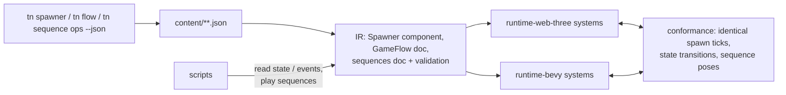

# PRD: Declarative Gameplay Flow — Spawners, Game-Flow State Machines, Sequencer

`Planning Mode: Principal Architect`
`Complexity: 9 → HIGH mode`

Score basis: +3 touches 10+ files, +2 new IR components/documents on both
runtimes, +2 multi-package (ir, compiler, authoring, cli, runtime-web-three,
runtime-bevy), +2 state-machine/timeline runtime logic with cross-runtime
determinism requirements.

## 1. Context

**Problem:** Beyond movement (covered by rigs and the `KinematicMover`
component), the recurring gameplay structures every game re-implements in
script are: spawning waves/streams of entities, the game's macro state
machine (menu → playing → paused → win/lose → retry), and scripted sequences
(intro camera flyover, cutscene beats, timed events). UE5 expresses these as
Blueprints and Sequencer; ThreeNative has only imperative
`commands.spawn`/`instantiate`, hand-rolled state flags inside a `GameState`
resource, and no timeline at all. For agent authoring, logic-as-data is the
cheapest and most verifiable form: bounded CLI operations in, deterministic
IR out, zero script for the common 80%.

**Relationship to existing work (do not duplicate):**

- Scene lifecycle (`done/other/scene-lifecycle-and-flow-contract.md`) covers
  scene-stack transitions; this PRD's `GameFlow` governs *in-scene* game
  states and can trigger scene operations, not replace them.
- `KinematicMover` (abstractions PRD Phase 4) is the precedent for
  "declarative component driven by both runtimes with conformance proof" —
  follow its pattern exactly.
- The constrained `animationGraph` is the precedent for bounded state
  machines; `GameFlow` reuses its validation philosophy (explicit states,
  explicit transitions, no arbitrary code in data).
- Delayed command scheduling
  (`proof-first-engine-loop-2026-07-05/PRD-011-portable-scripting-delayed-commands-scheduling.md`) is script-side;
  sequencer tracks are data-side. Coordinate tick semantics with it.
- Scaffold-first planning (`docs/PRDs/done/other/agent-token-efficiency-scaffold-first.md`)
  now applies playable starter structure before agent patching. This PRD must
  extend that path with reusable `Spawner`, `GameFlow`, and `Sequence`
  abstractions rather than teaching agents to hand-roll timers, wave state, or
  cutscene scripts in generated source.

**Files Analyzed:**

- `packages/ir/src/{types,systems,documents}.ts` (20-document bundle;
  component registry), `packages/ir/src/scriptingHost.ts`.
- `packages/sdk/src/prefab.ts`, `commands.instantiate` runtime paths in
  `packages/runtime-web-three/src/systems/effects.ts` and
  `runtime-bevy/crates/threenative_runtime/src/systems_effects.rs`.
- `packages/authoring/src/{operationRegistry,operations,schemas}.ts`;
  `packages/cli/src/commands/{scene,sourceDocuments}.ts`.
- `packages/ir/src/animation.ts` (`animationGraph` constrained
  states/transitions/parameters — the state-machine precedent).

**Current Behavior:**

- Spawning waves = script loop with hand-managed timers, counts, and pool
  bookkeeping; no declarative surface.
- Every example encodes match state as ad-hoc fields (`finished`, `hudLine`,
  cooldowns) in a user resource, mutated from multiple scripts.
- Intro/win/lose camera moves and timed beats are hand-keyed per game or
  skipped, which hurts the "finished game" bar (feedback moments are a
  required plan surface per repo rules).

## 2. Solution

**Approach — three declarative primitives, each an IR contract on both
runtimes:**

1. **`Spawner` component** (entity-level): `{ prefab, mode:
   "interval" | "wave" | "once", interval?, waveSize?, maxAlive?,
   maxTotal?, area?: { shape: "point" | "box" | "circle", size? },
   jitterSeed?, enabled, despawnPolicy?: { beyondDistance?, afterSeconds? } }`.
   Deterministic given seed + tick; emits `spawner.spawned` /
   `spawner.depleted` events scripts can read. Runtime owns pooling and
   alive-count tracking.
2. **`GameFlow` resource + document**: named states, explicit transitions
   with bounded trigger kinds (`event`, `timer`, `resourceEquals`,
   `allCollected`-style counter predicates), and bounded entry/exit actions
   (`setResource`, `emitEvent`, `activateUiScreen`, `playSequence`,
   `sceneChange`, `setTimeScale`, `spawnerEnable`). One `GameFlow` per scene;
   current state readable by scripts (`context` resource read) and bindable
   by UI (`{flow.state}` via the format bindings from the abstractions PRD).
   Anything beyond the bounded action set stays script territory —
   fail-closed validation, no escape hatches.
3. **`Sequence` document** (`content/sequences/*.sequence.json`, new IR
   document `sequences`): a timeline with typed tracks —
   `cameraPose` (keyframed pose/look-at with easing), `transform`
   (entity keyframes), `event` (emit at time t), `ui` (show/hide screen),
   `audio` (play cue), `timeScale`. Playback via `GameFlow` action or a new
   `sequences.play/stop/query` script service. Deterministic on the fixed
   tick; skippable (`skippable: true` + input action).

**Architecture:**

**Key Decisions:**

- [ ] Determinism is the contract: spawner jitter uses a seeded PRNG stepped
      on the fixed tick; sequences evaluate on fixed tick; conformance
      fixtures assert identical web/Bevy traces (follow the `KinematicMover`
      conformance pattern).
- [ ] `GameFlow` triggers/actions are closed enums validated fail-closed —
      unknown kinds are `TN_GAMEFLOW_ACTION_UNSUPPORTED` errors, never
      passthrough.
- [ ] Sequencer is NOT a general animation system: no skeletal tracks, no
      material tracks in v1 (those belong to `animations` IR); keep track
      kinds to the six listed.
- [ ] All authoring flows through new registry operations (`scene.set_spawner`,
      `flow.*`, `sequence.*`) so CLI, MCP, and editor share one pathway.
- [ ] Public names follow familiar game-engine vocabulary where semantics
      match. Use Unity-like names for concepts with direct analogs (`state`,
      `transition`, `trigger`, `timeline`, `play`, `stop`, `timeScale`) and
      keep ThreeNative-specific names only where the contract is materially
      different.
- [ ] Runtime services additions (`sequences.*`) extend the 37-service matrix
      in `packages/ir/src/scriptingHost.ts` with both hosts implemented or
      explicitly diagnosed — repo parity rule.

**Data Changes:** new `Spawner` component schema; new `gameFlow` section (own
document family `content/flow/*.flow.json`, emitted into a new `gameFlow` IR
document or folded into `scenes` — decide in Phase 2 with compiler evidence;
prefer a new document for SRP); new `sequences` document + manifest entry.
All versioned per IR conventions with accepted/rejected fixtures.

## 3. Integration Points

- Entry points: `tn scene set-spawner <entity> --prefab <id> --mode wave ...
  --json`; `tn flow create|add-state|add-transition|set-action --json`;
  `tn sequence create|add-track|add-key --json`; `sequences.play` service
  from scripts; `GameFlow` state in UI bindings.
- Callers: `packages/cli/src/index.ts` (+ new `flow.ts`, `sequence.ts`
  command files), `packages/authoring/src/operationRegistry.ts`, both runtime
  system schedulers, compiler emit + manifest.
- Wiring: `tn game plan` and `tn game plan --apply --json` map
  "progression / fail-retry / feedback moments" plan surfaces to `GameFlow` +
  `Sequence` recommendations; starter template ships a minimal `GameFlow`
  (ready → playing → win) as the reference shape, and API cards summarize the
  compact commands agents should copy.

**User flow (agent):** plan says "waves of drones, win at 10 collected, lose
on 0 hp, intro flyover" → agent runs ~6 bounded CLI commands (spawner on the
drone prefab, flow states/transitions with counter predicates, one intro
sequence with 3 camera keys) → zero scripts for macro flow; scripts only add
game-specific juice. `tn scene proof` + conformance show identical behavior
on web and native.

## 4. Execution Phases

#### Phase 1: `Spawner` component — IR + web runtime

**Files (max 5):**

- `packages/ir/src/types.ts` + validation — `Spawner` schema,
  accepted/rejected fixtures (negative interval, missing prefab, bad seed).
- `packages/runtime-web-three/src/systems/` — spawner system on the fixed
  tick: seeded jitter, pooling, `maxAlive`/`maxTotal`, events.
- `packages/authoring/src/operations.ts` + `operationRegistry.ts` —
  `scene.set_spawner`.
- `packages/cli/src/commands/scene.ts` — `tn scene set-spawner` (+ usage,
  `--json`, exit codes).
- Web runtime tests — deterministic spawn-trace test with fixed seed.

**Tests Required:**
| Test File | Test Name | Assertion |
|-----------|-----------|-----------|
| ir tests | `should accept wave spawner and reject unknown mode` | schema behavior |
| web runtime tests | `should spawn deterministic trace when seed fixed` | tick/id trace snapshot |
| web runtime tests | `should cap alive entities when maxAlive reached` | count never exceeds cap |
| cli tests | `should persist spawner component when set-spawner runs` | JSON updated, exit 0 |

**Verification Plan:** package tests; scratch project with a cube-fountain
spawner visible in `tn dev`.

#### Phase 2: `Spawner` on Bevy + conformance

**Files (max 5):**

- `runtime-bevy/crates/threenative_runtime/src/` — spawner system (same
  seeded PRNG algorithm, shared constant spec in the IR package docs).
- `runtime-bevy/crates/threenative_loader/src/` — parse component.
- `packages/ir/fixtures/` — spawner conformance fixture.
- `docs/bevy-feature-parity.md`, `docs/STATUS.md` — capability rows.

**Tests Required:** conformance test asserting identical spawn tick/count
traces web vs Bevy for the fixture seed.

**Verification Plan:** `pnpm verify:conformance`.

#### Phase 3: `GameFlow` — document, validation, both runtimes

**Files (max 5):**

- `packages/ir/src/gameFlow.ts` (new) + `documents.ts` + validation —
  states, transitions, closed trigger/action enums, single-initial-state and
  reachability checks (`TN_GAMEFLOW_STATE_UNREACHABLE` warning).
- `packages/runtime-web-three/src/systems/` — flow evaluator on fixed tick;
  exposes current state as a reserved resource (`tn.flow`).
- `runtime-bevy/crates/threenative_runtime/src/` — same evaluator semantics.
- `packages/authoring/src/` + `packages/cli/src/commands/flow.ts` — `tn flow
  create|add-state|add-transition|set-action --json` operations.
- `packages/ir/fixtures/` — flow conformance fixture (timer + event + counter
  transitions).

**Tests Required:**
| Test File | Test Name | Assertion |
|-----------|-----------|-----------|
| ir tests | `should reject transition to undeclared state` | stable diagnostic |
| conformance | `should produce identical state timeline web and bevy` | per-tick state trace match |
| web runtime tests | `should run entry actions exactly once when state entered` | action effect count == 1 |

**User Verification:** starter-shaped project where win/lose/retry works with
zero scripted state flags; HUD binds `{flow.state}`.

#### Phase 4: `Sequence` document + playback service

**Files (max 5):**

- `packages/ir/src/sequences.ts` (new) + `documents.ts` + validation — six
  track kinds, easing enum, monotonic key times, `skippable`.
- `packages/runtime-web-three/src/systems/` + services — evaluator +
  `sequences.play/stop/query`; camera track takes camera authority while
  active (restores prior mode on end).
- `runtime-bevy/crates/threenative_runtime/src/` — same + service host
  entries (`systems_services.rs`).
- `packages/ir/src/scriptingHost.ts` — service matrix rows (both hosts).
- `packages/ir/fixtures/` — sequence conformance fixture (camera + event
  tracks; assert pose at sampled ticks + event tick).

**Tests Required:**
| Test File | Test Name | Assertion |
|-----------|-----------|-----------|
| ir tests | `should reject non-monotonic key times` | diagnostic |
| conformance | `should sample identical camera pose at tick N web and bevy` | pose within 1e-5 |
| web runtime tests | `should restore camera mode when sequence ends or skipped` | prior mode active |

#### Phase 5: CLI sequence ops, plan integration, template + docs closure

**Files (max 5):**

- `packages/cli/src/commands/sequence.ts` (new) + registry — `tn sequence
  create|add-track|add-key|proof --json` (proof renders the sequence
  headless and captures a short recording via the existing `tn record`
  plumbing).
- `packages/cli/src/commands/game.ts` — plan surfaces → flow/sequence/spawner
  recommendations and scaffold-first apply output.
- `templates/structured-source-starter/` — minimal `GameFlow` + intro
  sequence; `AGENTS.md`/`CLAUDE.md` rule: "macro game state, waves, and
  cutscenes are data-first — reach for flow/spawner/sequence ops before
  scripts."
- `templates/*/docs/API-CARD.md` — concise command examples for flow,
  spawner, and sequence authoring.
- `docs/STATUS.md`, `docs/bevy-feature-parity.md`, `docs/PRDs/README.md`,
  `docs/contracts/` page for the three contracts.

**Verification Plan:** `pnpm build && pnpm verify && pnpm verify:conformance`;
`pnpm check:docs`; one example retrofitted to `GameFlow` + spawner as
evidence (record before/after script LOC for state management — target 0
state-flag plumbing).

## 5. Checkpoint Protocol

Spawn `prd-work-reviewer` after every phase. Manual checkpoints additionally
for Phase 4 and 5 (watch the intro sequence recording; play win/lose/retry).

## 6. Acceptance Criteria

- [ ] `Spawner`, `GameFlow`, and `Sequence` are versioned IR contracts with
      accepted/rejected validation tests and web/Bevy conformance fixtures
      proving identical traces (or explicit parity-doc gap entries).
- [ ] All three are authorable exclusively through bounded `--json` CLI
      operations registered in the shared operation registry.
- [ ] A wave-survival slice (spawner + flow + intro sequence + retry) is
      buildable with zero gameplay-state scripting.
- [ ] Trigger/action enums are closed and fail-closed with stable
      diagnostics.
- [ ] Service matrix updated with `sequences.*` implemented on both hosts.
- [ ] `docs/STATUS.md` + parity doc updated; template teaches the data-first
      path.

## 7. Success Metrics

| Metric | Before | Target |
| --- | --- | --- |
| Script LOC for macro state (menu/play/win/lose/retry) | ~40–80 per game | 0 |
| Wave spawning | hand-rolled timers/pools in script | 1 CLI command |
| Intro/win cinematics in generated games | rare (hand-keyed) | default plan recommendation, data-only |
| Cross-runtime behavior proof for flow/spawn/sequence | none | conformance fixtures |

## 8. Open Questions

- Should `GameFlow` be one-per-scene or allow named sub-flows (e.g., boss
  phases)? v1: one per scene + counter predicates; sub-flows only if the
  retrofit example proves the need.
- Does `Sequence` camera authority interact with `CameraRig` scripts? Define
  the precedence rule in Phase 4 (sequence wins while playing) and document
  it in the contract page.
