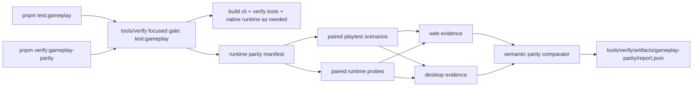

# PRD-022 Runtime Parity Test Harness - Lock Web/Bevy Runtime Regressions

`Planning Mode: Principal Architect`
`Complexity: 9 -> HIGH mode`

Score basis: +3 touches 10+ files across CLI, verify tools, examples, docs,
and package scripts; +2 adds a new focused gate module; +2 spans multiple
packages; +2 compares runtime state/artifacts across adapters.

## 1. Context

**Problem:** ThreeNative has target-specific playtests, conformance fixtures,
and visual parity gates, but no first-class fast parity harness that runs the
same scene/scenario/probe through Three.js and Bevy and fails on explicit
pass/fail assertions for gameplay, asset loading, material/texture, or
runtime-observation drift before regressions ship.

**Files Analyzed:**

- `packages/cli/src/commands/playtest.ts`
- `packages/cli/src/commands/playtestScenario.ts`
- `packages/cli/src/commands/playtestAssertions.ts`
- `packages/cli/src/commands/playtestTargets.ts`
- `packages/cli/src/verify/baselineVisualParity.ts`
- `packages/cli/src/verify/gltfFidelity.ts`
- `packages/cli/src/verify/materialParityVisual.ts`
- `packages/runtime-web-three/src/bundleHydration.ts`
- `packages/runtime-web-three/src/worldMapping/textureLoading.ts`
- `runtime-bevy/crates/threenative_runtime/src/assets.rs`
- `runtime-bevy/crates/threenative_runtime/src/map_world.rs`
- `tools/verify/src/cli/run.ts`
- `tools/verify/src/index.ts`
- `scripts/verify-parity-smoke.mjs`
- `scripts/verify-baseline-visual-parity.mjs`
- `docs/workflows/playtest-proof.md`
- `docs/visual-parity-policy.md`
- `docs/status/capabilities/native-parity.md`
- `docs/status/capabilities/physics.md`
- `examples/humanoid-physics-course/playtests/*.playtest.json`
- `examples/humanoid-physics-course/threenative.config.json`
- `examples/humanoid-physics-course/DIAGNOSIS.md`
- `examples/humanoid-physics-course/NATIVE-FPS-DIAGNOSIS.md`

**Current Behavior:**

- `tn playtest` can execute committed scenarios against `web`, `desktop`, or
  `bevy` targets by scenario target or `--target` override.
- Playtest assertions already cover movement, camera, resources, HUD,
  diagnostics, visibility, contacts, and animation evidence.
- Native playtest artifacts use the same broad summary/manifest/observation
  shape as web playtests, but no command compares both runs as one contract.
- GLB, texture, material, and runtime loading evidence exists in focused gates
  and adapter code paths, but it is not exposed as a fast paired web/Bevy
  scenario/probe matrix that a developer can run before changing runtime code.
- Baseline visual parity includes humanoid screenshots with calibrated
  tolerance, but that gate does not compare gameplay state or effect evidence.
- Humanoid course scenarios are high-signal parity seeds, but today they are
  independent web/desktop proofs rather than paired regression contracts.
- No gate currently audits scene coverage and reports which entities, assets,
  textures, materials, cameras, lights, resources, UI nodes, scripts, colliders,
  triggers, and interaction surfaces have assertions versus which are explicitly
  report-only or unsupported.

## 2. Solution

**Approach:**

- Add a thin runtime parity harness on top of `tn playtest` and existing verify
  utilities; do not create a second testing framework or new scenario language.
- Add a developer-facing root script named `pnpm test:gameplay` that routes
  through the existing verify-tools focused gate registry and stays fast enough
  for local use. Despite the command name, the harness should support gameplay
  actions and non-action runtime probes.
- Add `pnpm verify:gameplay-parity` as the explicit CI/release-oriented alias
  for the same gate, so the command is discoverable both as a test and a
  verification phase.
- Run paired target executions from one scenario/probe, collect the existing
  playtest and runtime artifacts, then compare semantic observations with
  declared tolerances.
- Seed the enforced gate with humanoid physics course scenarios because they
  exercise character movement, camera orbit, contacts, animation service
  evidence, pushable bodies, hazards, resource/HUD state, material/render
  drift, and native performance.
- Add non-action parity probes for GLB loading, texture loading, material
  controls, animation metadata, and asset diagnostics so runtime adapter
  regressions are caught even when no gameplay input is involved.
- Add a scene coverage contract: every enrolled scene surface must be covered
  by at least one pass/fail assertion or explicitly listed as unsupported,
  deferred, or report-only with a stable reason.

**Architecture Diagram:**



**Key Decisions:**

- [ ] Reuse `tn playtest` for gameplay execution, input injection, screenshot
      capture, effect logs, and artifact bundles.
- [ ] Reuse existing verify/image/material/asset utilities for non-action
      probes instead of hand-rolling GLB or texture inspection.
- [ ] Add only a small parity layer: target matrix, report loader, semantic
      comparator, aggregate artifact writer.
- [ ] Wire through `tools/verify/src/cli/run.ts` as focused gates instead of a
      standalone script that release/pre-push tooling cannot discover.
- [ ] Keep `pnpm test:gameplay` bounded: one enforced smoke scenario, stable
      cached build inputs where possible, compact stdout, no native screenshot
      sequence unless requested, and no report-only matrix by default.
- [ ] Put heavier coverage behind `pnpm verify:gameplay-parity` and optional
      `--profile full`, so local feedback remains quick while CI can run the
      broader ratchet.
- [ ] Keep visual comparison optional and tolerance-based; this gate is
      behavioral/runtime parity, not pixel-perfect rendering parity.
- [ ] Use stable diagnostics with codes such as
      `TN_GAMEPLAY_PARITY_TARGET_FAILED`, `TN_GAMEPLAY_PARITY_MOVEMENT_DRIFT`,
      `TN_GAMEPLAY_PARITY_RESOURCE_DRIFT`, and
      `TN_GAMEPLAY_PARITY_CONTACT_DRIFT`.
- [ ] Native parity freeze still applies to new capability promotion. This PRD
      creates a regression harness for already-proved or explicitly
      report-only slices; docs must not claim new native support merely because
      a scenario was added.
- [ ] Assertions are first-class results. The final report must not hide
      uncovered scene surfaces behind an overall pass; uncovered required
      surfaces fail with `TN_RUNTIME_PARITY_COVERAGE_GAP`.

**Data Changes:** Extend playtest scenario schema with optional `parity`, and
add a runtime parity manifest for scene coverage and non-action probes. No IR
schema or game bundle changes.

Example scenario extension:

```json
{
  "parity": {
    "targets": ["web", "desktop"],
    "compare": {
      "movementDistance": { "maxDelta": 0.15 },
      "axisDelta": { "z": 0.15, "y": 0.08 },
      "resources": ["GameState.checkpoint", "GameState.hits"],
      "contacts": { "minSharedCount": 1 },
      "animation": [{ "entity": "player", "clip": "walk", "requiredOn": ["web", "desktop"] }]
    }
  }
}
```

Example scene-wide coverage manifest entry:

```json
{
  "id": "humanoid-course-scene-coverage",
  "project": "examples/humanoid-physics-course",
  "scene": "arena",
  "kind": "sceneCoverage",
  "targets": ["web", "desktop"],
  "requiredSurfaces": {
    "entities": ["player", "camera.main", "ramp.main", "ball.push.01"],
    "assets": ["model.soldier"],
    "textures": ["tex.surface.ue-grid"],
    "materials": ["mat.floor.ue-grid"],
    "resources": ["GameState"],
    "ui": ["hud.status", "hud.checkpoints"]
  },
  "assertions": [
    { "kind": "entityVisible", "entity": "player", "minProjectedPixels": 1200 },
    { "kind": "assetLoaded", "asset": "model.soldier" },
    { "kind": "textureBound", "material": "mat.floor.ue-grid", "texture": "tex.surface.ue-grid" },
    { "kind": "resourcePath", "resource": "GameState", "path": "checkpointTotal", "equals": 2 }
  ],
  "coverage": {
    "reportOnly": [],
    "unsupported": []
  }
}
```

Example non-action runtime parity manifest entry:

```json
{
  "id": "humanoid-soldier-glb-loading",
  "project": "examples/humanoid-physics-course",
  "kind": "assetProbe",
  "targets": ["web", "desktop"],
  "assert": {
    "assets": [
      {
        "id": "model.soldier",
        "type": "gltf",
        "loaded": true,
        "animations": ["Idle", "Walk", "Run"],
        "maxBoundsDelta": 0.1
      }
    ],
    "textures": [
      {
        "id": "tex.surface.ue-grid",
        "loaded": true,
        "repeat": [24, 24],
        "role": "baseColor"
      }
    ],
    "materials": [
      {
        "id": "mat.floor.ue-grid",
        "baseColorTexture": "tex.surface.ue-grid",
        "maxAverageBrightnessDelta": 0.08
      }
    ]
  }
}
```

## 3. Integration Points

**How will this feature be reached?**

- [ ] Entry point identified: root package scripts `test:gameplay` and
      `verify:gameplay-parity`; optional direct CLI entry
      `tn parity playtest`.
- [ ] Caller file identified: `tools/verify/src/cli/run.ts` invokes the
      focused gameplay parity gate; `package.json` routes scripts into that
      registry.
- [ ] Registration/wiring needed: add focused gate entries, package scripts,
      docs workflow entry, and status/capability references when the gate is
      promoted.

**Is this user-facing?**

- [ ] YES, as a developer/CI command. No in-game UI is required.

**Full user flow:**

1. Developer runs `pnpm test:gameplay`.
2. Root script builds verify tooling and calls
   `node tools/verify/dist/cli/run.js test:gameplay`.
3. Focused gate builds the required CLI/runtime pieces, runs paired playtests
   for enrolled scenarios, and compares reports.
4. Developer sees compact pass/fail output and opens
   `tools/verify/artifacts/gameplay-parity/verification-report.json` for
   per-target summaries, assertion results, coverage gaps, runtime probe
   observations, comparator diagnostics, and artifact links.

**Required root scripts:**

```json
{
  "scripts": {
    "test:gameplay": "pnpm build:verify-tools && node tools/verify/dist/cli/run.js test:gameplay",
    "verify:gameplay-parity": "pnpm build:verify-tools && node tools/verify/dist/cli/run.js verify:gameplay-parity"
  }
}
```

**Required focused gate registry entries:**

- `test:gameplay`: developer-friendly smoke profile. Runs the smallest
  enforced humanoid parity matrix plus one or two cheap non-action runtime
  probes and emits compact diagnostics. Target runtime: under 60 seconds on a
  warm local checkout after packages are built.
- `verify:gameplay-parity`: CI/release profile. Runs the same comparator,
  plus selected report-only scenarios declared in the gameplay parity manifest.
  Heavier scenarios must be opt-in by profile and must record duration in the
  aggregate report.

**Performance Budget:**

- `pnpm test:gameplay` warm run budget: <= 60 seconds.
- `pnpm test:gameplay` cold run budget, excluding first Rust dependency build:
  <= 180 seconds.
- Default smoke matrix: one enforced paired gameplay scenario, one cheap asset
  loading probe, short frame count, no native recording, screenshots only if
  required to debug a failure.
- Full matrix: explicit `pnpm verify:gameplay-parity -- --profile full`.
- Report must include per-scenario/per-probe and per-target duration so slow
  cases are visible and can be moved out of the smoke profile.
- Coverage auditing must run before expensive full-profile checks so missing
  assertion coverage fails fast.

## 4. Execution Phases

#### Phase 1: Focused Gate Skeleton - `pnpm test:gameplay` reaches a real gate

**Files (max 5):**

- `package.json` - add `test:gameplay` and `verify:gameplay-parity` scripts.
- `tools/verify/src/cli/run.ts` - register focused gates.
- `tools/verify/src/gameplayParity.ts` - new aggregate gate skeleton.
- `tools/verify/src/gameplayParity.test.ts` - unit tests for gate command
  planning and report shape.
- `tools/verify/src/gameplayParityManifest.ts` - manifest types for scenario
  and probe enrollment.
- `tools/verify/src/gameplayParityCoverage.ts` - scene surface coverage audit.

**Implementation:**

- [ ] Add `test:gameplay` and `verify:gameplay-parity` root scripts.
- [ ] Add focused gate entries with metadata owner, profile, reason, and
      protects fields.
- [ ] Implement a skeleton gate that writes
      `tools/verify/artifacts/gameplay-parity/verification-report.json`.
- [ ] Add duration accounting to the report schema from the first phase so
      later scenario/probe enrollments cannot hide slowdowns.
- [ ] Define manifest entries for `playtestScenario`, `assetProbe`,
      `textureProbe`, `materialProbe`, and `sceneCoverage`.
- [ ] Define a common assertion result shape:
      `{ id, kind, target, surface, pass, expected, observed, diagnostic? }`.
- [ ] Coverage audit fails when a required surface is neither asserted nor
      explicitly listed as unsupported/report-only.
- [ ] Gate initially runs no expensive playtests in unit tests; inject a fake
      runner to prove aggregation and diagnostics.

**Tests Required:**

| Test File | Test Name | Assertion |
|-----------|-----------|-----------|
| `tools/verify/src/gameplayParity.test.ts` | `should write a passing gameplay parity report when all enrolled cases pass` | report status is `pass` and artifact paths exist |
| `tools/verify/src/gameplayParity.test.ts` | `should include duration budget fields in the gameplay parity report` | report contains total and per-case durations |
| `tools/verify/src/gameplayParity.test.ts` | `should support non-action probe enrollment` | manifest accepts asset, texture, and material probes |
| `tools/verify/src/gameplayParity.test.ts` | `should fail when a required scene surface has no assertion` | emits `TN_RUNTIME_PARITY_COVERAGE_GAP` |
| `tools/verify/src/cli/run.test.ts` | `should register gameplay parity focused gates` | `test:gameplay` and `verify:gameplay-parity` are available with metadata |

**User Verification:**

- Action: `pnpm test:gameplay -- --list` or the focused-gate equivalent if the
  registry supports listing; otherwise run the gate with a fake fixture in
  tests.
- Expected: command is discoverable through the same harness as other
  `verify:*` gates and writes a compact report.

#### Phase 2: Paired Playtest Runner - One scenario runs on web and desktop

**Files (max 5):**

- `packages/cli/src/commands/parityPlaytest.ts` - optional direct CLI command
  or shared helper for paired target execution.
- `packages/cli/src/commands/parityPlaytest.test.ts` - runner tests with
  mocked playtest calls.
- `packages/cli/src/index.ts` - register `tn parity playtest` if direct CLI
  command is chosen.
- `tools/verify/src/gameplayParity.ts` - call paired runner from gate.
- `docs/workflows/playtest-proof.md` - document paired parity execution.

**Implementation:**

- [ ] Add a helper that accepts project path, scenario path, targets, output
      directory, stable artifact mode, and JSON mode.
- [ ] For each target, invoke the existing playtest path with target override.
- [ ] Persist per-target summaries under the gameplay parity artifact
      directory without changing the original playtest artifact bundle shape.
- [ ] Aggregate pass/fail before semantic comparison: if either target fails,
      emit `TN_GAMEPLAY_PARITY_TARGET_FAILED`.
- [ ] Reuse one build per project/scenario matrix where practical. Do not
      rebuild the same project separately for web and desktop if the existing
      bundle is fresh.
- [ ] Default smoke runner disables native recording and any high-cost
      artifact collection unless a failure requires diagnostics.

**Tests Required:**

| Test File | Test Name | Assertion |
|-----------|-----------|-----------|
| `packages/cli/src/commands/parityPlaytest.test.ts` | `should run the same scenario for web and desktop targets` | runner receives two target-overridden calls |
| `packages/cli/src/commands/parityPlaytest.test.ts` | `should fail when one target playtest fails` | aggregate diagnostic names failing target |
| `packages/cli/src/commands/parityPlaytest.test.ts` | `should not request native recording in smoke mode` | target run options omit native recording |

**User Verification:**

- Action:
  `pnpm tn -- parity playtest --project examples/humanoid-physics-course --scenario playtests/humanoid-course-forward-movement.playtest.json --targets web,desktop --stable-artifacts --json`
- Expected: both target playtests run and one aggregate report links their
  summaries.

#### Phase 3: Semantic Comparator - Gameplay drift fails with actionable diagnostics

**Files (max 5):**

- `packages/cli/src/commands/playtestScenario.ts` - add optional `parity`
  schema types and validation.
- `packages/cli/src/commands/playtestSchema.ts` - include parity block in
  generated schema/help output.
- `packages/cli/src/commands/parityPlaytestCompare.ts` - compare reports.
- `packages/cli/src/commands/parityPlaytestCompare.test.ts` - comparator unit
  tests.
- `tools/verify/src/gameplayParity.ts` - include comparator diagnostics in the
  aggregate report.

**Implementation:**

- [ ] Compare movement distance and signed axis deltas within tolerance.
- [ ] Compare resource/HUD values by dot path when requested.
- [ ] Compare contact/trigger evidence by entity/target token and minimum
      shared count.
- [ ] Compare animation evidence by entity/clip and required target list.
- [ ] Compare runtime diagnostics: target-specific runtime errors always fail
      unless the scenario marks the comparison report-only.
- [ ] Keep comparator deterministic and artifact-backed; no ad hoc parsing of
      source files.

**Tests Required:**

| Test File | Test Name | Assertion |
|-----------|-----------|-----------|
| `packages/cli/src/commands/parityPlaytestCompare.test.ts` | `should pass movement parity within tolerance` | no diagnostics |
| `packages/cli/src/commands/parityPlaytestCompare.test.ts` | `should fail movement parity outside tolerance` | emits `TN_GAMEPLAY_PARITY_MOVEMENT_DRIFT` |
| `packages/cli/src/commands/parityPlaytestCompare.test.ts` | `should fail resource parity when requested path differs` | emits `TN_GAMEPLAY_PARITY_RESOURCE_DRIFT` |
| `packages/cli/src/commands/parityPlaytestCompare.test.ts` | `should fail contact parity when shared evidence is missing` | emits `TN_GAMEPLAY_PARITY_CONTACT_DRIFT` |

**User Verification:**

- Action: run `pnpm test:gameplay` after deliberately lowering a humanoid
  tolerance in a local branch.
- Expected: gate fails with a diagnostic naming the metric, threshold,
  observed web value, observed desktop value, and artifact paths.

#### Phase 4: Runtime Asset/Material Probes - Non-action runtime regressions are caught fast

**Files (max 5):**

- `tools/verify/src/gameplayParityProbes.ts` - execute and normalize asset,
  texture, and material observations.
- `tools/verify/src/gameplayParityProbes.test.ts` - probe normalization tests.
- `tools/verify/src/gameplayParity.ts` - include probe results in aggregate
  comparison.
- `tools/verify/src/gameplayParityCoverage.ts` - map probe assertions to scene
  surfaces.
- Runtime observation surfaces - expose missing asset/texture/material
  observation fields through the existing web/native conformance or readiness
  diagnostics paths if they are not already available.

**Implementation:**

- [ ] Add `assetProbe` support for GLB/model load status, named animation
      clips, primitive/model bounds, mesh/material count, and asset diagnostics.
- [ ] Add `textureProbe` support for loaded status, dimensions where
      available, wrap/repeat/filter role, color-space role, mipmap/anisotropy
      support, and missing-file diagnostics.
- [ ] Add `materialProbe` support for material id, texture bindings, emissive,
      roughness/metalness, alpha mode, and bounded screenshot-derived metrics
      only when an existing image utility can provide them cheaply.
- [ ] Keep probes cheap: prefer existing runtime/conformance observations over
      extra screenshots; only capture a screenshot for a probe when a material
      metric explicitly requires one.
- [ ] Emit `TN_RUNTIME_PARITY_ASSET_DRIFT`,
      `TN_RUNTIME_PARITY_TEXTURE_DRIFT`, and
      `TN_RUNTIME_PARITY_MATERIAL_DRIFT` diagnostics with target values and
      artifact paths.
- [ ] Every probe produces assertion results, not only observations. A loaded
      GLB, missing texture, texture repeat mismatch, material binding mismatch,
      and asset diagnostic are all pass/fail rows in the aggregate report.

**Tests Required:**

| Test File | Test Name | Assertion |
|-----------|-----------|-----------|
| `tools/verify/src/gameplayParityProbes.test.ts` | `should pass matching GLB load observations` | no diagnostics |
| `tools/verify/src/gameplayParityProbes.test.ts` | `should fail when a named animation clip is missing on one target` | emits `TN_RUNTIME_PARITY_ASSET_DRIFT` |
| `tools/verify/src/gameplayParityProbes.test.ts` | `should fail when texture repeat differs across targets` | emits `TN_RUNTIME_PARITY_TEXTURE_DRIFT` |
| `tools/verify/src/gameplayParityProbes.test.ts` | `should fail when material texture binding differs across targets` | emits `TN_RUNTIME_PARITY_MATERIAL_DRIFT` |
| `tools/verify/src/gameplayParityProbes.test.ts` | `should return assertion rows for every requested probe surface` | assertion count matches requested surfaces |

**User Verification:**

- Action: `pnpm test:gameplay`
- Expected: the smoke report includes at least one non-action runtime probe
  alongside the gameplay scenario, without exceeding the warm-run budget.

#### Phase 5: Scene Coverage Assertions - Every enrolled scene surface is testable

**Files (max 5):**

- `tools/verify/src/gameplayParityCoverage.ts` - implement required surface
  inventory and assertion coverage checks.
- `tools/verify/src/gameplayParityCoverage.test.ts` - coverage pass/fail tests.
- `tools/verify/src/gameplayParityManifest.ts` - add scene coverage manifest
  support.
- `packages/cli/src/commands/playtestAssertions.ts` - reuse assertion result
  shape or expose compatible types.
- `docs/workflows/playtest-proof.md` - document coverage requirements.

**Implementation:**

- [ ] Build or load a scene surface inventory from emitted bundle/source:
      entities, cameras, lights, assets, textures, materials, resources, UI
      nodes, scripts/systems, physics colliders, triggers/sensors, and
      animation clips.
- [ ] Require every manifest-listed required surface to have at least one
      assertion row.
- [ ] Fail uncovered required surfaces with
      `TN_RUNTIME_PARITY_COVERAGE_GAP`.
- [ ] Permit `reportOnly` and `unsupported` entries only when they include a
      stable reason and do not contribute to pass claims.
- [ ] Add summary counts:
      `requiredSurfaces`, `assertedSurfaces`, `reportOnlySurfaces`,
      `unsupportedSurfaces`, `coveragePercent`, and `coverageStatus`.

**Tests Required:**

| Test File | Test Name | Assertion |
|-----------|-----------|-----------|
| `tools/verify/src/gameplayParityCoverage.test.ts` | `should pass when every required scene surface has an assertion` | coverage status is `pass` |
| `tools/verify/src/gameplayParityCoverage.test.ts` | `should fail when an entity lacks any assertion` | emits `TN_RUNTIME_PARITY_COVERAGE_GAP` |
| `tools/verify/src/gameplayParityCoverage.test.ts` | `should keep report-only surfaces visible without passing them` | report-only count increments and pass claim excludes them |
| `tools/verify/src/gameplayParityCoverage.test.ts` | `should reject unsupported surfaces without reasons` | emits manifest diagnostic |

**User Verification:**

- Action: remove one required humanoid surface assertion and run
  `pnpm test:gameplay`.
- Expected: gate fails before claiming parity and names the uncovered surface.

#### Phase 6: Humanoid Course Enrollment - High-signal parity scenarios and probes protect the regressions we care about

**Files (max 5):**

- `examples/humanoid-physics-course/playtests/*.playtest.json` - add parity
  blocks or report-only enrollment for the selected humanoid scenarios.
- `tools/verify/src/gameplayParity.ts` - default enrollment manifest for
  humanoid scenarios and probes.
- `tools/verify/src/gameplayParityManifest.ts` - humanoid scene coverage entry.

**Implementation:**

- [ ] Enforce `forward-movement` first.
- [ ] Add `ramp-traverse`, `stairs`, `hazard-hit`, and `ball-push` as
      full-profile/report-only cases if current native behavior is not reliable
      or fast enough to fail CI.
- [ ] Each report-only case must still run both targets and record why it is
      not enforcing yet.
- [ ] Keep the default `test:gameplay` manifest to one short enforced
      scenario plus one cheap GLB/texture probe until timing evidence proves
      additional cases fit the budget.
- [ ] Enroll `Soldier.glb` loading, named animation clips, floor texture repeat,
      and floor material texture binding as the first non-action probes.
- [ ] Add a humanoid scene coverage manifest that names the required surfaces
      in the course and maps each to assertions or explicit report-only
      reasons.
- [ ] Require all high-value surfaces in `threenative.config.json` production
      metadata to be represented in coverage.
- [ ] No status/native capability claim changes until a scenario is enforced
      and linked from the focused gate evidence.

**Tests Required:**

| Test File | Test Name | Assertion |
|-----------|-----------|-----------|
| `tools/verify/src/gameplayParity.test.ts` | `should include humanoid forward movement in enforced smoke set` | manifest marks it enforced |
| `tools/verify/src/gameplayParity.test.ts` | `should preserve report-only scenarios without failing the gate` | report-only failures become warnings with artifact links |
| `tools/verify/src/gameplayParity.test.ts` | `should keep slow scenarios out of smoke profile` | full-profile cases are not run by `test:gameplay` |
| `tools/verify/src/gameplayParity.test.ts` | `should include cheap asset probe in smoke profile` | smoke profile includes Soldier GLB probe |
| `tools/verify/src/gameplayParityCoverage.test.ts` | `should require high-value humanoid surfaces to be asserted` | missing player/GLB/texture/resource/UI coverage fails |

**User Verification:**

- Action: `pnpm test:gameplay`
- Expected: humanoid forward movement, scene coverage, and one cheap runtime
  probe are enforced; report-only humanoid scenarios/probes write target
  artifacts and warnings without claiming parity.

#### Phase 7: CI Ratchet And Docs - Runtime parity becomes part of the normal harness

**Files (max 5):**

- `scripts/verify-pre-push.mjs` - include `test:gameplay` or
  `verify:gameplay-parity` depending on runtime cost.
- `scripts/verify-pre-push.test.mjs` - assert the phase is linked in reports.
- `docs/PRDs/proof-first-engine-loop-2026-07-05/README.md` - list this PRD.
- `docs/status/capabilities/tooling-proof.md` - document the new gate after
  implementation.
- `docs/status/capabilities/native-parity.md` - document the gate boundary
  without over-claiming native support.

**Implementation:**

- [ ] Add `test:gameplay` to the quick developer harness if runtime is small
      enough; otherwise leave it as an explicit command and add
      `verify:gameplay-parity` to pre-push/release.
- [ ] Gate promotion requires timing evidence that the default smoke profile
      meets the warm-run budget. If it does not, keep the gate explicit and
      record the blocker in tooling-proof status.
- [ ] Ensure aggregate reports link target summaries and comparator
      diagnostics for gameplay scenarios and runtime probes.
- [ ] Update docs to state that behavioral parity is asserted only for
      enforced enrolled scenarios/probes with explicit assertion rows.
- [ ] Document that every enrolled scene must provide coverage or explicit
      non-passing exclusions.
- [ ] Keep visual parity docs separate and continue using calibrated screenshot
      gates for rendering drift.

**Tests Required:**

| Test File | Test Name | Assertion |
|-----------|-----------|-----------|
| `scripts/verify-pre-push.test.mjs` | `should include gameplay parity when parity phase is enabled` | linked report path is present |
| docs gate | `check docs` | links resolve and status wording is bounded |

**User Verification:**

- Action: `pnpm verify:gameplay-parity -- --json`
- Expected: CI-friendly JSON report lists enforced, report-only, passed,
  failed, and skipped scenarios with artifact paths.

## 5. Checkpoint Protocol

After each phase:

1. Run the phase-specific package tests.
2. Run the narrowest relevant focused command:
   - Phase 1: `pnpm build:verify-tools && node --test tools/verify/dist/gameplayParity.test.js`
   - Phase 2-3:
     `pnpm --filter @threenative/cli test -- --run gameplay parity`
   - Phase 4: `pnpm test:gameplay`
   - Phase 5: `pnpm test:gameplay`
   - Phase 6: `pnpm test:gameplay`
   - Phase 7: `pnpm verify:gameplay-parity -- --json`
3. Run `pnpm check:docs` after docs/status changes.
4. Use the PRD work reviewer checkpoint process if implementation is being
   executed under the PRD workflow.

## 6. Verification Strategy

**Unit Tests:**

- Comparator tolerance behavior.
- Scenario parity schema validation.
- Focused gate manifest/enrollment behavior.
- Command registration and metadata.
- Runtime budget accounting and profile selection.
- Asset, texture, and material probe normalization.
- Scene surface coverage auditing.

**Integration Tests:**

- Paired runner invokes existing playtest target dispatch.
- Aggregate report includes artifact links for both targets.
- Report-only failures do not pass silently; they are visible warnings.
- Smoke profile avoids heavy artifacts and excludes full-profile scenarios.
- Runtime probes use existing observation/verification utilities and do not
  require gameplay input.
- Every required scene surface produces a pass/fail assertion row or a
  non-passing exclusion.

**Real Command Proof:**

```bash
pnpm test:gameplay
pnpm verify:gameplay-parity -- --json
pnpm tn -- parity playtest \
  --project examples/humanoid-physics-course \
  --scenario playtests/humanoid-course-forward-movement.playtest.json \
  --targets web,desktop \
  --stable-artifacts \
  --json
```

**Evidence Required:**

- `tools/verify/artifacts/gameplay-parity/verification-report.json`
- Per-target playtest summaries for every enrolled scenario.
- Per-target runtime probe observations for every enrolled probe.
- Scene coverage report with required/asserted/report-only/unsupported counts.
- Comparator diagnostics include metric, threshold, observed values, and
  artifact paths.
- Assertion results for every required surface.
- Per-target and total duration measurements, with smoke/full profile labels.
- Enforced scenario failures exit nonzero.
- Report-only scenario failures are visible but do not promote capability
  claims.

## 7. Acceptance Criteria

- [ ] `pnpm test:gameplay` exists and routes through
      `tools/verify/dist/cli/run.js`.
- [ ] `pnpm test:gameplay` is intentionally small and has timing evidence
      showing it meets the local smoke budget, or it remains explicit and is
      not inserted into broader quick gates.
- [ ] `pnpm verify:gameplay-parity` exists and is suitable for CI/release use.
- [ ] Focused gate registry includes gameplay parity metadata.
- [ ] One committed humanoid scenario runs against both web and desktop from a
      single scenario file.
- [ ] At least one non-action runtime probe, such as GLB loading or texture
      binding parity, runs in the default smoke profile.
- [ ] Semantic comparator fails on movement/resource/contact/animation drift
      outside scenario tolerances.
- [ ] Runtime probe comparator fails on GLB/texture/material loading drift
      outside probe tolerances.
- [ ] Every required scene surface has an assertion pass/fail row or an
      explicit non-passing exclusion with a reason.
- [ ] Missing assertion coverage fails with `TN_RUNTIME_PARITY_COVERAGE_GAP`.
- [ ] Aggregate report links both target playtest artifacts.
- [ ] At least one humanoid scenario is enforced; additional unstable native
      scenarios are report-only with explicit reasons.
- [ ] Docs distinguish behavioral gameplay parity from visual/pixel parity.
- [ ] No new native capability claim is made without enforced gate evidence
      and the required status/parity doc updates.

## 8. Non-Goals

- Pixel-perfect Three.js/Bevy rendering parity.
- A general-purpose testing framework separate from `tn playtest`.
- Replacing conformance fixtures or visual parity gates.
- Promoting new Bevy/native capability surface while the native parity freeze
  still applies.
- Duplicating scenario files per target when a target override can run the
  same scenario.
